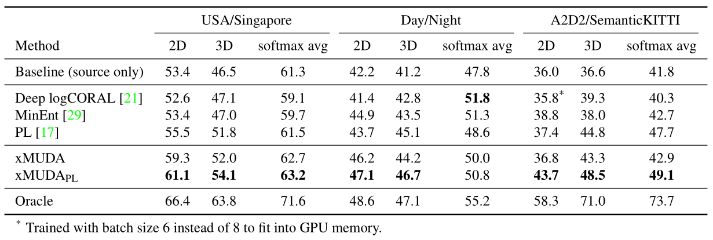

# xMUDA

CVPR2020：

Cross-Modal Unsupervised Domain Adaptation for 3D Semantic Segmentation

## Pre

### 无监督领域自适应

Unsupervised Domain Adaptation

为了解决传统监督学习需要大量人工标注的问题。顾名思义，就是将某个领域或者任务**学习好的知识或模式**，应用到到新的**不同但相关**的领域中，达到可观的效果。比如我们最常见的fine-tuning 。

根据目前已有的研究显示，1）深度神经网络可以很好地学习到数据间的可迁移特征，或者叫做域不变（domain invariant）特征； 2）但由于层数的增加，特征由general到task-specific，越来越不适合迁移，但同时也要保证特征足够。

领域自适应（Domain Adaptation）：迁移学习的一种。域适应是一种针对解决源域集和目标域分布偏移（domain shift）的机器学习算法。各式各样的域适应方法旨在通过学习源域和目标域的域不变（domain invariant）特征，从而在目标域没有或少量标签的情况下，将从源域学到的分类器应用于目标域。

域适应方法：

1. find a mapping from representations of the source domain to those of the target；
2. find domain-invariant representations that are shared between the two domains；

---

## Abstract

无监督域适应 (UDA) 对于解决新域中缺少注释的问题至关重要。 有许多多模态数据集，但大多数 UDA 方法都是单模态的。 在这项工作中，我们探索如何从多模态中学习并提出跨模态 UDA (xMUDA)，其中我们假设 2D 图像和 3D 点云的存在用于 3D 语义分割。这是具有挑战性的，因为两个输入空间是异构的，并且会受到域偏移 domain shift 的不同影响。 

在 xMUDA 中，模态通过相互模仿  mutual mimicking 互相学习，与分割目标分离，以防止较强的模态采用较弱的模态的错误预测。 

我们利用最近的自动驾驶数据集评估新的 UDA 场景，包括 day-to-night、country-to-country 和dataset-to-dataset。xMUDA 在所有测试场景中都比单模 UDA 带来了很大的改进，并且是对最先进的 UDA 技术的补充。

---

## 1. Introduction

**Fig 1:**  cross-modal UDA (xMUDA) 在存在域间隙（白天到黑夜）的情况下的优势。 在此3D语义分割示例中，由于2D摄像机图像的UDA Baseline [17]预测由于昼/夜域偏移而未检测到右侧的汽车。 使用 xMUDA，2D 通过与 3D LiDAR 点云的信息交换学习汽车在黑暗中的外观，3D 学习减少错误预测。

许多应用都需要三维场景理解，特别是机器人、自动驾驶和虚拟现实。在所关注的不同任务中，随着新数据集的发布，3D 语义分割越来越受到关注 [1, 5, 7]。与其他感知任务一样，3D 语义分割会遇到监督训练和测试时间之间的 **domain shift** 问题，例如 day and night, different countries or datasets 之间。领域适应旨在解决这一差距，但现有工作主要涉及 2D 语义分割 [12、17、29、36]，很少涉及 3D [34]。我们还观察到，以前的域适应工作侧重于单模态，而 3D 数据集通常是多模态的，由 3D 点云和 2D 图像组成。虽然人类标注者和学习到的模型已经利用这两种模式之间的互补性来定位 3D 场景中的对象 [19, 22]，但我们从一个新的角度考虑它，提出一个问题：如果 3D 和 2D 数据在源域和目标域，我们能否利用多模态来解决无监督域适应 (UDA)？

我们创造了我们的方法 cross-modal UDA，简称“xMUDA”，并考虑了 3 个具有 different lighting conditions（day-to-night）、环境（country-to-country）和传感器配置 sensor setup（dataset-to-dataset）的真实适应场景到数据集。由于各种原因，这是一项具有挑战性的任务。 异构 heterogeneous 输入空间（2D 和 3D）使管道变得复杂，因为它意味着要使用异构网络架构和 2D-3D 投影。在融合中，如果两个传感器在同一场景下，则两者之间有共享信息，但每个传感器也有私有（或专有）信息。多亏了后者，在某种情况下，一种模态可能比另一种方式更强，但根据类别，上下文，分辨率 class, context, resolution 等，它可以是另一种方式。这使得根据以前的情况选择“最佳”传感器知识不可行。 此外，每种模态都会受到域转移的不同影响。 例如，相机受昼夜域变化的影响很大，而激光雷达则相对稳健，如**Fig. 1**。

为了应对这些挑战，我们提出了一个 cross-modal UDA（‘xMUDA’）框架，其中信息可以在 2D 和 3D 之间交换，以便相互学习 UDA（see right side of **Fig.1**）。我们使用解开的 2-stream 架构来单独解决每种模式中的 domain gap（differences between datasets）。 我们的学习方案允许跨模式和分割目标的稳健平衡。 

此外，xMUDA 可以与现有的单模态 UDA 技术相结合。 在这项工作中，我们展示了与伪标签自训练的互补性。最后，在有多种模式可用时，在监督学习中通常会使用特征融合（例如，早期或晚期融合）[9，19，28]：我们的框架可以扩展到融合，同时保持不交叉的交叉模态目标。

Our contributions can be summarized as follows:

- 我们定义了新的 UDA 方案，并针对最近发布的 2D-3D 数据集提出了相应的建议。
- 我们设计了一种架构，通过在 2D 和 3D 中**分离私有和共享信息**来实现**跨模态学习**。
- 我们提出了一种新的 UDA 学习方案，其中模态可以在与主要目标相**平衡**的情况下相互学习。 它可以应用于最先进的自训练技术之上，以提高性能。
- 我们展示了如何将我们的框架扩展到后期融合并产生卓越的结果。

在不同的建议基准上，我们明显优于单模态最先进的 UDA 技术。 因此，我们表明对 UDA 的多模态开发是一种强大的工具，可以使广泛的多传感器应用受益。

---

## 2. Related Work

在本节中，我们不是通读文献，而是回顾每个焦点的代表性作品。

### Unsupervised Domain Adaptation

过去几年，人们对用于复杂感知任务（如对象检测和语义分割）的无监督域适应技术越来越感兴趣。在这些方法的引擎盖下是学习领域不变表示(**domain-invariant representations**) 的相同精神，即来自不同领域的特征应该引入微不足道的差异。一些工作促进对抗性训练，以最大限度地减少**源-目标分布偏移**(**source-target distribution shift**)，无论是在像素[12]、特征[13] 还是输出空间[27、29] 上。 从半监督学习[15] 重新审视，使用伪标签的自我训练最近也被证明对 UDA 有效[17, 36]。

尽管大多数现有作品都在 2D 世界中考虑了 UDA，但很少有作品可以处理 3D 对应物。 吴[34]为来自 LiDAR 点云的 3D 分割中的 UDA 采用了激活相关性比对[21]。 在这项工作中，我们研究了相同的任务，但不同的是：我们的系统对多模态输入数据进行操作，即 RGB + LiDAR。

据我们所知，在多模态场景的 2D/3D 语义分割方面，之前没有 UDA 工作。 只有一些人考虑额外的方式，例如    深度，仅在源域的训练时可用，并利用此类特权信息来提高适应性能[16, 30]。 否则，我们在这里假定在源域和目标域上的所有模式都可以在训练和测试时使用。

### Multi-Modality Learning

在受监督的环境中，可以通过融合来自多个不同源的特征自然地提高性能。 几何上最简单的情况是 RGB-Depth 融合，具有用于 2D 分割的密集像素到像素对应 [9, 28]。 将 3D 点云与 2D 图像融合更难，因为它们位于不同的度量空间（metric spaces）中。 一种解决方案是将 2D 和 3D 特征投影到“鸟瞰图”[18、19] 或“LiDAR 前视图”[20] 中，以完成目标检测任务。 另一种可能性是将 2D 特征从多视图图像提升到 3D 点云，以实现 3D 语义分割的联合 2D-3D 处理 [3, 14, 25]。 我们更接近最后一个系列的作品：我们共享 3D 语义分割的相同目标。 然而，我们专注于如何利用 UDA 的多模态而不是监督学习，并且只使用单视图图像及其相应的点云。

### 3D networks for semantic segmentation. 

用于语义分割的 3D 网络。虽然图像是密集张量，但 3D 点云可以以多种方式表示，这导致了并行发展的竞争网络系列。体素与像素非常相似，但由于它们中的大部分都是空的，因此内存非常密集。Graham[8] 和类似的实现 [4] 解决了这个问题使用哈希表仅在活动体素上进行卷积的问题。 这允许非常高的分辨率，通常每个体素只有一个点。基于点的网络在连续的 3D 空间中执行计算，因此可以直接接受点云作为输入。PointNet++ [23] 使用逐点卷积、最大池化来计算全局特征和局部邻域聚合，用于类似于 CNN 的分层学习。 在这个方向上已经提出了许多改进，例如连续卷积 [31] 和可变形内核 [26]。 基于图的网络在点云的边缘上进行卷积 [32]。 在这项工作中，我们选择 SparseConvNet [8] 作为 3D 网络，它是 ScanNet 基准 [5] 上的最新技术。

---

## 3. xMUDA

**Fig 2:**  Overview of our xMUDA framework for 3D semantic segmentation.  概述：该架构包括一个以图像为输入并使用 U-Net 风格的 2D ConvNet [24] 的 2D 流，以及一个以点云为输入并使用 U-Net-Style 3D SparseConvNet [8] 的 3D 流 . 两个流的特征输出具有相同的长度 $N$，, equal to the number of 3D points。为了实现这一点，我们将 3D 点投影到图像中，并在相应的像素位置对 2D 特征进行**采样**。4 个分割输出由主要预测 $P_2D, P_3D$ 和 mimicry 预测 $ P_{2 \mathrm{D} \rightarrow 3 \mathrm{D}}, P_{3 \mathrm{D} \rightarrow 2 \mathrm{D}} $ 组成。我们使用 KL 散度 $ D_{\mathrm{KL}}\left(P_{3 \mathrm{D}} \| P_{2 \mathrm{D} \rightarrow 3 \mathrm{D}}\right) $  跨模态传输知识，其中 2D mimicry head 的目标是估计主要 3D 输出，反之亦然，$ D_{\mathrm{KL}}\left(P_{2 \mathrm{D}} \| P_{3 \mathrm{D} \rightarrow 2 \mathrm{D}}\right) $。

cross-modal UDA (xMUDA) 的目标是通过启用模态之间的受控信息交换来开发多模态，以便它们可以相互学习。这是通过让他们**相互模仿对方的输出**来实现的，这样他们都可以从对方的优势中受益。

具体来说，我们在3D语义分割任务上使用点云（3D模态）和图像（2D模态）研究xMUDA。 概述如 **Fig. 2** 所示。我们首先在 **Sec 3.1** 中描述架构，在 **Sec 3.2** 中描述我们的学习方案，然后展示其对融合特殊情况的扩展。

在下面，我们考虑一个源数据集 $ \mathcal{S} $，其中每个样本由 2D 图像 $ \boldsymbol{x}_{s}^{2 \mathrm{D}} $、3D 点云 $ \boldsymbol{x}_{s}^{3 \mathrm{D}} $ 和 3D 分割标签 $ \boldsymbol{y}_{s}^{3 \mathrm{D}} $ 以及缺少注释的目标数据集 $ \mathcal{T} $ 组成，其中每个样本只有由图像 $ \boldsymbol{x}_{t}^{2 \mathrm{D}} $ 和点云 $ \boldsymbol{x}_{t}^{3 \mathrm{D}} $ 组成。 图像 $ \boldsymbol{x}^{2 \mathrm{D}} $ 的空间大小为 $(H,W,3)$，点云 $ \boldsymbol{x}^{3 \mathrm{D}} $ 的空间大小为 $(N,3)$，其中 $N$ 是相机视场中 3D 点的数量。

---

### 3.1. Architecture

为了允许跨模态学习，提取特定于每种模态的特征至关重要。与将 2D 特征提升为 3D [19] 的 2D-3D 架构相反，我们使用具有独立 2D 和 3D 分支且不共享特征的 2-stream 架构（**Fig. 2**）。

我们将 SparseConvNet[8] 用于 3D，并将 U-Net[24]的修改版本与 ResNet34[10] 用于2D。 即使每个流都有特定的网络架构，重要的是**输出大小相同**以允许**跨模态**学习。**Sec 4.2** 提供了实现细节。

#### Dual Segmentation Head.

我们将分割头 segmentation head 称为网络中的最后一个线性层，它将输出特征转换为 logits，然后通过 softmax 函数来产生类别概率。对于 xMUDA，我们在 2D 和 3D 之间建立了联系，通过输出概率的 ‘mimicry’ loss，即每个模态应该预测另一个模态的输出。这使我们能够明确控制跨模态学习。

在一种简单的方法中，每个模态都有一个单独的分割头，跨模态优化目标对齐两种模态的输出。不幸的是，这导致只使用两种模式之间共享的信息，而丢弃每个传感器独有的私有信息（更多细节在 **Sec 5.1** 的消融研究中）。 这是一个重要的限制，因为我们想同时利用私有信息和共享信息，以获得最佳性能。

为了在受益于共享信息的同时保留私有信息，我们引入了一个额外的分割头来将模仿目标与主要分割目标分开。 这意味着 2D 和 3D 流都有两个分割头：一个用于最佳预测的主头，一个用于估计其他模态输出的 mimicry 头。

4 个分割头的输出（ **Fig. 2** ）的大小为  $(N,C)$，其中 $C$ 等于类的数量，这样我们就可以获得每个 3D 点的类别概率向量。两个主要头分别为每个 stream 产生最好的预测，$P_{2D}$ 和 $P_{3D}$。 两个模拟头估计另一个模态的输出：2D 估计 3D $ \left(P_{2 \mathrm{D} \rightarrow 3 \mathrm{D}}\right) $ 和 3D 估计 2D $ \left(P_{3 \mathrm{D} \rightarrow 2 \mathrm{D}}\right) $。

**Fig 2:**  Overview of our xMUDA framework for 3D semantic segmentation. 

---

### 3.2. Learning Scheme

我们的跨模态学习方案的目标是以受控方式在模态之间交换信息，以教它们互相了解。 这个辅助目标可以有效地提高每个模态的性能，并且不需要任何注释，使其能够用于目标数据集 $\mathcal{T}$ 上的 UDA。在下文中，我们定义了基本的监督学习设置、我们的交叉模态损失 $ \mathcal{L}_{\mathrm{xM}} $ 和额外的伪标签学习方法。损失流如 **Fig. 3a** 所示。

**Fig 3(a):** Proposed UDA training setup。xMUDA 从源域（plain lines）的监督和目标域（dashed lines）的自监督中学习，同时受益于 2D/3D(红色/蓝色) 的交叉模式预测。

#### Supervised Learning

 3D 分割的主要目标是通过交叉熵以经典的监督方式在源数据上学习的。我们可以将每个网络流（2D和3D）的分割损失 $ \mathcal{L}_{\mathrm{seg}} $ 写为：
$$
\begin{equation}
 \mathcal{L}_{\mathrm{seg}}\left(\boldsymbol{x}_{s}, \boldsymbol{y}_{s}^{3 \mathrm{D}}\right)=-\frac{1}{N} \sum_{n=1}^{N} \sum_{c=1}^{C} \boldsymbol{y}_{s}^{(n, c)} \log \boldsymbol{P}_{\boldsymbol{x}_{s}}^{(n, c)} 
\end{equation}
$$
其中 $x_s$ 是 $ \boldsymbol{x}_{s}^{2 \mathrm{D}} $ 或 $ \boldsymbol{x}_{s}^{3\mathrm{D}} $。

#### Cross-Modal Learning

跨模态无监督学习的目标是双重的。首先，我们希望在目标数据集上将知识从一种模态转移到另一种模态。例如，让一种模态对域转移更敏感，但让另一个模态对域转移更健壮，那么对域转移更健壮的模态应该教对域转移更敏感的模态（在目标域中没有可用标签的正确类）。其次，我们要在源和目标上设计一个辅助目标，任务是估计其他模态的预测。不仅仅通过模仿最大概率的类，还模仿整个分布，交换更多信息，从而产生更软的标签。

我们为跨模态损失 $ \mathcal{L}_{\mathrm{xM}} $ 选择 **KL** 散度并将其定义如下：
$$
\begin{equation}
 \begin{aligned} \mathcal{L}_{\mathrm{xM}}(\boldsymbol{x}) &=\boldsymbol{D}_{\mathrm{KL}}\left(\boldsymbol{P}_{\boldsymbol{x}}^{(n, c)} \| \boldsymbol{Q}_{\boldsymbol{x}}^{(n, c)}\right) \\ &=-\frac{1}{N} \sum_{n=1}^{N} \sum_{c=1}^{C} \boldsymbol{P}_{\boldsymbol{x}}^{(n, c)} \log \frac{\boldsymbol{P}_{\boldsymbol{x}}^{(n, c)}}{\boldsymbol{Q}_{\mathfrak{x}}^{(n, c)}} \end{aligned} 
\end{equation}
$$
其中 $(\boldsymbol{P}, \boldsymbol{Q}) \in\left\{\left(\boldsymbol{P}_{2 \mathrm{D}}, P_{3 \mathrm{D} \rightarrow 2 \mathrm{D}}\right),\left(\boldsymbol{P}_{3 \mathrm{D}}, P_{2 \mathrm{D} \rightarrow 3 \mathrm{D}}\right)\right\} $，其中 $P$ 是主要预测的目标分布，它是由mimicking 预测 $Q$ 估计的。这个损失应用于源域和目标域，因为它不需要G.T，这是我们提出的域适应框架的关键。对于源，$ \mathcal{L}_{\mathrm{xM}} $ 可以看作是除主要分割损失 $ \mathcal{L}_{\mathrm{seg}} $ 之外的辅助 mimicry 损失

每个网络流（2D 和 3D）的完整目标是源上的分割损失 $ \mathcal{L}_{\mathrm{seg}} $ 及源和目标上的跨模态损失 $ \mathcal{L}_{\mathrm{xM}} $ 的组合：
$$
\begin{equation}
 \begin{aligned} \min _{\theta}\left[\frac{1}{|\mathcal{S}|} \sum_{\boldsymbol{x}_{s} \in \mathcal{S}}\left(\mathcal{L}_{\mathrm{seg}}\left(\boldsymbol{x}_{s},\right.\right.\right.&\left. \left.\boldsymbol{y}_{s}^{3 \mathrm{D}}\right)+\lambda_{s} \mathcal{L}_{\mathrm{xM}}\left(\boldsymbol{x}_{s}\right)\right) \\+& \left.\frac{1}{|\mathcal{T}|} \sum_{\boldsymbol{x}_{i} \in \mathcal{T}} \lambda_{t} \mathcal{L}_{\mathrm{xM}}\left(\boldsymbol{x}_{t}\right)\right] \end{aligned} 
\end{equation}\tag4
$$
其中 $ \lambda_{s} $，$ \lambda_{t} $是分别在源和目标上加权 $ \mathcal{L}_{\mathrm{xM}} $ 的超参数，$θ$ 是 2D 或 3D 流的网络权重。

跨模态学习和模型蒸馏（model distillation）之间存在相似之处，模型蒸馏也采用 KL 散度作为模仿损失（mimicry loss），但模型蒸馏目标是在监督环境中将知识从大型网络转移到较小的网络[11]。 最近张[35] 引入了深度相互学习，其中联合训练了一组单模态网络，以相互**协作学习**。尽管在某种程度上，我们的跨模态学习与这些策略具有相似的性质，但我们解决了不同的蒸馏角度，即跨模态（2D/3D）而不是在监督中，而是在 UDA 设置中。

#### Additional self-training with Pseudo-Labels

用伪标签进行额外的自训练。

跨模态学习是对最初用于半监督学习和最近在 UDA [17, 36] 中使用的伪标记 [15] 的补充。详细地说，一旦用 [Eq. 4](#eq4)  优化了模型，我们离线提取伪标签，根据预测的类别概率选择高置信的标签。 然后，我们使用生成的伪标签从头开始再次训练，以在目标训练集上进行额外的分割损失：
$$
\begin{equation}
 \min _{\theta}\left[\frac{1}{|\mathcal{S}|} \sum_{\boldsymbol{x}_{s}}\left(\mathcal{L}_{\mathrm{seg}}\left(\boldsymbol{x}_{s}, \boldsymbol{y}_{s}^{3 \mathrm{D}}\right)+\lambda_{s} \mathcal{L}_{\mathrm{xM}}\left(\boldsymbol{x}_{s}\right)\right)\right. \\ \left.\quad+\frac{1}{|\mathcal{T}|} \sum_{\boldsymbol{x}_{t}}\left(\lambda_{\mathrm{PL}} \mathcal{L}_{\mathrm{seg}}\left(\boldsymbol{x}_{t}, \hat{\boldsymbol{y}}^{3 \mathrm{D}}\right)+\lambda_{t} \mathcal{L}_{\mathrm{xM}}\left(\boldsymbol{x}_{t}\right)\right)\right] 
\end{equation}\tag5
$$
其中 $\lambda_{\mathrm{PL}}$ 对伪标签分割损失进行加权，且 $\hat{\boldsymbol{y}}^{3 \mathrm{D}}$ 是伪标签。 为清楚起见，我们将使用带有伪标签的额外自训练的 $\text{xMUDA}$ 变体称为 $\text{xMUDA_{PL}}$ 。

---

### 3.3. Discussion

我们工作的一个核心贡献是在多模态场景中通过 KL 散度最小化来制定跨模态学习，这不仅有助于我们从多个传感器中受益，而且还可以减轻域转移 domain shift。

事实上，由于计算 2D 和 3D 预测之间的 KL 散度不需要真实值，我们的学习方案允许对目标集进行额外的正则化——带来适应效果。 **Fig. 3b** 可视化了我们任务中考虑的4个数据子集，并显示了不同的UDA技术在哪个维度上进行操作。 与之前仅作用于单一模态的 UDA 方法相反，xMUDA 引入了一种新的跨模态自训练方式，因此与现有的自适应技术正交和互补。

**Fig 3(b):** UDA on multi-modal data. 我们考虑四个数据子集：Source 2D、Target 2D、Source 3D 和 Target 3D。 与现有技术相比，xMUDA 为 UDA 引入了一种跨模态自训练机制

----

## 4. Experiments

### 4.1. Datasets

为了评估 xMUDA，我们确定了 3 个 real-to-real 的适应场景。在 **day-to-night** 的情况下，LiDAR 的域差距很小，因为它是一个有源传感器，它发出的激光束几乎不受光照条件的影响。相比之下，相机具有较大的域差距，因为其被动感知缺乏光源，导致物体外观发生剧烈变化。 第二种情况是**country-to-country** 之间的适应，其中，LiDAR或相机的域差距可能更大：对于某些类别，3D形状的变化可能大于视觉外观，反之亦然。 第三个场景，**dataset-to-dataset**，包括传感器设置的变化，例如相机光学，但最重要的是目标上更高的 LiDAR 分辨率。3D 网络对变化的点云密度很敏感，图像可以帮助指导和稳定适应。

我们利用最近发布的自动驾驶数据集 nuScenes[2]、A2D2[7] 和 SemanticKITTI[1]，其中 LiDAR 和相机同步和校准，**允许计算 3D 点与其对应的 2D 图像像素之间的投影**。所选的数据集包含3D注释。为简单起见和跨数据集的一致性，我们仅使用前置摄像头图像和投射到其中的 LiDAR 点。

对于nuScenes，注释是3D bounding boxes，如果点位于3D框内，则通过分配相应的类别标签来获得3D语义分隔的逐点标签；否则该点被标记为背景。 我们使用元数据为两个 UDA 场景生成拆分：Day/Night 和 USA/Singapore。   

A2D2 和 SemanticKITTI 提供分割标签。对于 UDA，我们在两个数据集之间定义了 10 个共享类。  LiDAR 设置是主要区别：在 A2D2 中，有 3 个具有 16 层的 LiDAR 生成相当**稀疏**的点云，而在 SemanticKITTI 中，有一个具有 64 层的**高分辨率** LiDAR。

我们在 [Appendix A](#appendix1) 中提供了数据拆分的详细信息。

---

### 4.2. Implementation Details

#### 2D Network

我们使用带有 ResNet34[10] 编码器的 U-Net[24] 的修改版本，我们在第 3 层和第 4 层之后添加 dropout，并使用 PyTorch 提供的 ImageNet 预训练权重进行初始化。在解码器中，每一层都由一个转置卷积、与相同分辨率的编码器特征（残差连接）和另一个用于混合特征的卷积组成。网络将图像 $x^{2D}$ 作为输入并生成具有相等空间维度  $(H,W,F_{2D})$ 的输出特征图，其中 $F_{2D}$ 是特征通道的数量。为了将 2D 特征提升到 3D，我们在 3D 点投影到特征图中的稀疏像素位置对它们进行采样，并获得最终的二维特征矩阵 $(N,F_{2D})$。

---

#### 3D Network

对于 SparseConvNet [8]，我们利用官方 PyTorch 实现和具有 6 倍下采样的 U-Net 架构。 我们使用 5cm 的体素大小，它足够小，每个体素只有一个 3D 点。

---

#### Training

对于数据增强，我们在 2D 中采用**水平翻转和色彩抖动**，在 3D 中采用 x 轴**翻转，缩放和旋转**。 由于 SemanticKITTI 中的广角图像，我们在水平图像轴上随机裁剪了一个固定大小的矩形，以减少训练过程中的内存。 在所有实验中都使用对数平滑类权重来解决类不平衡问题。 对于 PyTorch 中跨模态损失的 **KL** 散度，我们将目标变量分离为仅在 2D 或 3D 网络中进行反向传播。 我们使用 batch size of 8、$β_1 = 0.9$、$β_2 = 0.999$ 的 Adam 优化器，以及基于迭代的学习计划，其中 0.001 的学习率在 80k 和 90k 次迭代时除以 10； 训练以 100k 结束。我们联合训练 2D 和 3D 流，并在每次迭代时，累积在源批次和目标批次上计算出的梯度。所有训练都适合具有 11GB RAM 的单个 GPU。

对于 xMUDA，我们使用 Eq.4 进行训练，其中我们在源和目标上使用真实标签和跨模态损失应用分割损失。对于 xMUDA PL，我们使用先前训练的 xMUDA 模型在 [17] 中离线生成伪标签，然后从头开始再次训练，现在使用伪标签对目标进行额外的分割损失 ([Eq .5](#eq5))。 请注意，我们不会在验证集上选择最佳权重，而是使用最后一个检查点来生成伪标签，以防止任何监督学习信号。2D 和 3D 网络在每次迭代时联合训练并在源和目标上进行优化。

---

### 4.3. Main Experiments

**Table 1:** 不同跨模态 UDA 场景中 3D 语义分割的各个目标集上的 mIoU。我们报告每个网络流（2D 和 3D）的结果以及集成结果（‘softmax avg’）。

我们在 3 种提出的跨模态 UDA 场景中评估我们的方法，并与单模式 UDA 方法进行比较：Deep logCORAL [21]、熵最小化 (MinEnt) [29] 和伪标签 (PL) [17]。 关于 PL，我们应用 [17] 如下：我们在没有 UDA 的情况下通过第一次训练离线生成伪标签，并通过分类阈值丢弃不可靠的标签。 然后，我们从头开始进行第二次训练，在目标上添加 PL 损失。 由于其不稳定性、高训练复杂性和与 LiDAR 数据不兼容，image-2-image  translation部分被排除在外，从而限制了可重复性。关于另外两种单模态技术，我们根据我们的设置调整了已发布的实现。 总之，我们搜索了各自最好的超参数。

我们在 [Tab .1](#tab1) 中报告了针对 3 个 UDA 场景的目标测试集的 3D 分割的平均交集 (mIoU，mean Intersection over Union) 结果。我们使用在验证集上获得最佳分数的检查点对测试集进行评估。 除了 2D 和 3D 模型的分数之外，我们还展示了通过在 softmax 之后取预测的 2D 和 3D 概率的平均值获得的集成结果（‘softmax avg’）。 baseline 仅在源上训练，oracle 仅在目标上训练，除了 Day/Night oracle，我们使用 50%/50% Day/Night 的批次来防止过度拟合。单模态 UDA 基线 [17, 21, 29] 分别应用于每种模态。

与 “Baseline (source only)” 相比，xMUDA——使用交叉模态损失不带 PL——对所有 3 个 UDA 场景都带来了显着的适应效果，并且通常优于单模态 UDA 基线。我们观察到，xMUDA 持续改进了两种模式（2D 和 3D），即   **即使是强模态也可以向较弱的模态学习，从而收益**。xMUDA PL 到处都是最好的分数，唯一的例外是 Day/Night softmax avg。 此外，跨模态学习和使用伪标签 (PL) 的自我训练是互补的，因为它们在 xMUDA PL 中的组合始终如一比每个单独的技术产生更高的分数。

定性结果显示在 **Fig. 6** 中，并显示了xMUDA在所有建议的UDA方案中的多功能性。 我们在 **Fig. 7** 中提供了额外的定性结果，并在 http://tiny.cc/xmuda 提供了 A2D2 到 SemanticKITTI 场景的视频。

**Fig 6:**   Qualitative results on the 3 proposed splits. 我们展示了在  UDA Baseline (PL) 和 xMUDA PL 上对 2D 和 3D 的 softmax 输出进行平均获得的集成结果。

**A2D2/SemanticKITT**：当传感器发生变化时（3x16 层 LiDAR 与 64 层 LiDAR 不同角度），xMUDA PL 有助于稳定和改进分割性能。

**USA/Singapore**：后置储物箱的送货摩托车在新加坡很常见，但在美国不常见。3D 形状可能类似于车辆。然而，在 xMUDA PL 中利用 2D 外观信息来提高识别率。

**Day/Night**：汽车在夜间打开大灯时的视觉外观与白天大不相同。 单模态 UDA 基线无法学习这种新外观。但是，如果在 xMUDA PL 中交换摄像头和夜间鲁棒 LiDAR 之间的信息，则可以在夜间正确检测汽车。

**Fig 7:** Qualitative results on two UDA scenarios. 对于 UDA Baseline (PL) 和 xMUDA PL，我们分别展示了 2D 和 3D 网络流的预测。

**A2D2/SemanticKITTI**：对于单模态 UDA Baseline (PL)，2D 预测在道路上缺乏一致性，3D 无法正确识别左侧的 bike 和 building。在 xMUDA PL 中，两种模式可以相互稳定并在自行车、道路、人行道和建筑物上获得更好的性能。

**Day/Night**：对于 UDA Baseline，2D 只能部分识别三辆车中的一辆车，而 3D 预测几乎正确，左侧有一辆误报汽车。使用 xMUDA PL ，2D 和 3D 预测都是正确的。

---

### 4.4. Extension to Fusion

**Fig 4：** Architectures for fusion. 

(a)  在 Vanilla Fusion 中，将 2D 和 3D 特征连接起来，输入带有 ReLU 的线性层以混合特征，然后是另一个线性层和 softmax 以获得融合预测 $ P_{\text {fuse }} $. 

(b) 在 xMUDA Fusion 中，我们添加了两个单模态输出 $ P_{2 \mathrm{D} \rightarrow \mathrm{fuse}} $ 和 $ P_{3 \mathrm{D} \rightarrow \text { fuse }} $，用于模拟融合输出 $ P_{\text {fuse }} $.

**Fig 5:**  Single vs. Dual segmentation head. (a) 主预测和拟态预测并没有像 Fig. 2(b) 的xMUDA那样解耦. (b) 关于 single- vs. dual-head 架构的 $λ_t$-mIoU 曲线 。USA/Singapore scenario.

在 **Sec 4.3** 节中，我们介绍了如何使用xMUDA改进每个2D和3D模式。 然而，我们能否通过融合获得更好的结果？

一种常见的融合架构是后期融合，其中来自不同来源的特征被连接在一起（ **Fig. 4a** ）。 然而，当将主要的 2D/3D 分支合并成一个独特的融合头部时，我们不能再应用跨模态学习（ **Fig. 5a** ）。 为了解决这个问题，我们提出了“xMUDA Fusion”，我们在融合层之前向 2D 和 3D 网络流添加了一个额外的分割头，目的是模仿中央融合头（ **Fig. 4b** ）。 请注意，这个想法也可以应用于其他融合架构之上。

在 **Tab. 2**  中，我们展示了不同融合方法的结果，其中我们指定了使用哪种架构（ **Fig. 4a** 中的 Vanilla 后期融合或  **Fig. 4b** 中的 xMUDA Fusion）。虽然“xMUDA PL Fusion”优于所有其他单模基线，但“xMUDA Fusion”已经取得了比“Deep logCORAL”和“MinEnt”更好的性能。

**Table 2:** mIoU for fusion methods, USA/Singapore scenario. 在“蒸馏”中，我们使用 **Table. 1** 中报告的主要实验的 xMUDA PL 模型从 softmax 平均值生成伪标签，并使用这些来训练 Vanilla Fusion 网络。

---

## 5. Ablation Studies

### 5.1. Segmentation Heads

**Fig 5:**  Single vs. Dual segmentation head. (a) 主预测和拟态预测并没有像 Fig. 2(b) 的xMUDA那样解耦. (b) 关于 single- vs. dual-head 架构的 $λ_t$-mIoU 曲线 。USA/Singapore scenario.

在下文中，我们证明每个模态流的两个分割头的设计选择是合理的，而不是单个一个的 naive（ **Fig. 5a** ）方法。在单头架构中，模仿目标直接应用于 2 个主要预测之间。2D / 3D之间存在共享信息，但每个模式中也存在私有信息。减少交叉模态损耗 $ \mathcal{L}_{\mathrm{xM}} $ 的不希望有的解决方案是网络丢弃私有信息，因此它们都只使用共享信息，从而更容易对齐其输出。 但是，我们推测如果还使用私有信息，则可以实现最佳性能。通过使用双分割头将模拟主体与模拟预测分开，我们可以有效地将两个优化目标分离开来：主轴输出最可能的预测，以优化分割损失，而模拟头则可以与其他模态对齐。

为了对单分割头架构与双分割头架构进行基准测试，我们仅应用跨模态损失 $ \mathcal{L}_{\mathrm{xM}} $，不包括 PL，因为它不依赖于双头方法。我们将源上的 $ \mathcal{L}_{\mathrm{xM}} $ 损失权重固定为 $ \lambda_{s}=1.0 $ 并改变目标 $λ_t$ 。超参数  $λ_t$ 是本分析的重点，因为它控制目标集的模态对齐，这是 UDA 的主要驱动因素。在 **Fig. 5b** 中，我们表明 xMUDA 的双头架构实现了最佳性能，而单头架构的性能在 $λ_t$ 较高时急剧下降。 我们假设双 head 更健壮，因为它将分割与模仿目标分开。

---

### 5.2. Cross-Modal Learning on Source

在 [Eq. 4](#eq4) 中，cross-modal loss $ \mathcal{L}_{\mathrm{xM}} $ 是应用在源和目标域上，尽管我们已经在源上有监督分割损失 $ \mathcal{L}_{\mathrm{seg}} $。 当在源域上添加 $ \mathcal{L}_{\mathrm{xM}} $ 而不是仅将其应用于目标域时，我们观察到 2D 上的 mIoU 增益为 4.8 ，3D 上的 mIoU 增益为 4.4。 这表明在源头上训练模仿头很重要，稳定预测，这可以在目标适应期间加以利用。

---

### 5.3. Cross-Modal Learning for Oracle Training

我们已经表明，跨模式学习对于 UDA 非常有效。但是，它也可以用于纯监督环境中。当使用跨模态损失 $ \mathcal{L}_{\mathrm{xM}} $  训练 oracle 时，我们可以改进基线，见**Table. 3**。 我们推测 $ \mathcal{L}_{\mathrm{xM}} $ 是一个有益的辅助损失，可以帮助规范训练和防止过度拟合。

**Table 3:** Cross-modal loss in supervised setting for oracle training. mIoU on USA/Singapore.

---

## 6. Conclusion

我们提出 xMUDA，即跨模态无监督域适应，其中模态相互学习以提高目标域的性能。 对于跨模态学习，我们引入了模态之间的相互模仿，通过 KL 散度实现。我们设计了一个具有独立主头和模仿头的架构，**以将分割与跨模态学习目标分开**。使用 2D/3D 数据集对新 UDA 场景进行 3D 语义分割的实验表明，xMUDA 在很大程度上优于单模态 UDA，并且是伪标签策略的补充。融合时观察到模拟性能提升。

我们认为跨模态学习可用于各种设置和任务，不仅限于 UDA。特别是，它应该有利于监督学习和其他模式而不仅限于图像和点云。

---

## A. Dataset Splits

**A.1. nuScenes**

nuScenes 数据集包含 1000 个驾驶场景，每个场景 20 秒，对应于 2Hz 拍摄的 40k 个带注释的关键帧。场景分为训练（28,130 个关键帧）、验证（6,019 个关键帧）和隐藏测试集。逐点 3D 语义标签是从 [33] 中的 3D  boxes 获得的。 我们提出了以下针对各自 source/target domains 进行域适应的拆分：Day/Night 和 Boston/Singapore。

因此，我们使用官方的 validation split 作为测试集，将训练集划分为 train/val 作为目标集（每个split的帧数量见下表4）。由于目标分割中的对象实例数量可能非常少（例如夜间），我们将对象合并为 5 类：车辆（汽车、卡车、公共汽车、拖车、工程车辆）、行人、自行车（摩托车、自行车）  ，交通边界（交通锥，障碍）和背景。

**Table 4:**  Number of frames for the 3 splits. 对于每个划分中的帧数量

---

**A.2. A2D2 and SemanticKITTI**

A2D2 数据集 [7] 具有 20 个 drives，对应于 28,637 帧。点云来自三个 16 层前置雷达（左、中、右），其中左右前置雷达是倾斜的。 语义标记在 2D 图像中分成了 38个类别，并且我们通过**将点云投影到标记的图像中来计算3D标签**。我们保留场景 20180807_145028 作为测试集，其余用于训练。

SemanticKITTI 数据集为 Kitti 的 Odometry 数据集提供 3D 点云标签，该数据集具有大角度前置摄像头和 64 层 LiDAR。28 个类的标注已经直接在 3D 中进行了。我们使用场景 {0,1,2,3,4,5,6,9,10} 作为训练集，7 作为验证，8 作为测试集。

我们通过合并或忽略它们在 2 个数据集之间选择 10 个共享类（见下表 5）。最后的 10 个类是汽车、卡车、自行车、人、道路、停车场、人行道、建筑、自然、其他物体。

**Table 5:** Class mapping for A2D2 - SemanticKITTI UDA scenario.

