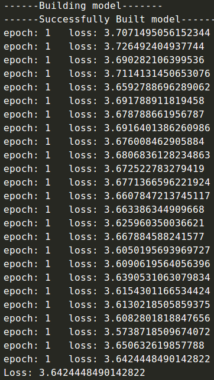
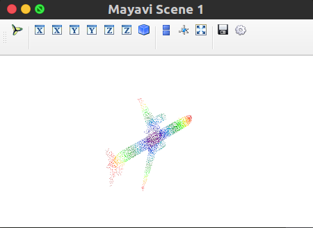

# PointCNN复现


## 








## 参考资料

深度学习在几何空间中的应用（一）：三维可视化

https://www.dazhuanlan.com/2019/12/16/5df6f8d0ca96b/?__cf_chl_jschl_tk__=f6d9963843a503edc4a0159d755b2d441ae8599a-1601360929-0-AfNIA_X3I5szE75ugdMZZQ850ebU8uURPFkvU2rUtbEyMwCm_lp1BKJFQJQxqVnvQkzA-JhMV-PknvjH33kaQczbIVGuKb4hLzhRA9C8k6EaKONxlG9_ndkB-tUB59VP_i90F8tU2UKP0-P4kcx96J4fIhyGvsReRXM5Ki4ByRT4uErc1Tiz-jKvKRbc4o2jRyLnNaOjtCjRsdm5nhpu1aOgHiupaLyrkI7lttPf7eJEEQCyOMThbRI9iLGH8Y3-WHDY93oaCTzlLffhvMhBHT2hBtOCbQEoxgn_13cn_MS1QLW7VHQGbsaOF7XMEMUo1A


h5py快速入门指南 https://segmentfault.com/a/1190000016670881

3D点云深度学习PointNet源码解析——数据预处理 http://www.manongjc.com/article/27424.html

用modelnet40_ply_hdf5_2048数据集制作txt点云数据集（抽取特定类别）https://blog.csdn.net/qq_38139159/article/details/89482857

## 问题及解决方案

1. No module named 'h5py'

```
pip3.6 install h5py
```


2. 要以不安全的方式连接至 shapenet.cs.stanford.edu，使用“--no-check-certificate”

```
https://shapenet.cs.stanford.edu/media/modelnet40_ply_hdf5_2048.zip
```


3. H5pyDeprecationWarning: The default file mode will change to 'r' (read-only) in h5py 3.0. To suppress this warning, pass the mode you need to h5py.File(), or set the global default h5.get_config().default_file_mode, or set the environment variable H5PY_DEFAULT_READONLY=1. Available modes are: 'r', 'r+', 'w', 'w-'/'x', 'a'. See the docs for details.
     f = h5py.File(h5_filename)

```
f = h5py.File(h5_filename)
改为
f = h5py.File(h5_filename,'r')
```


4. invalid index of a 0-dim tensor. Use `tensor.item()` in Python or `tensor.item<T>()` in C++ to convert a 0-dim tensor to a number

```
报错原因分析:
train_loss += loss.data[0] 是pytorch0.3.1版本代码,在0.4-0.5版本的pytorch会出现警告,不会报错,但是0.5版本以上的pytorch就会报错,总的来说是版本更新问题.

解决方法:

#将原语句：
train_loss+=loss.data[0]

#修改为：
train_loss+=loss.item()
```


5. mayavi

```
sudo apt-get install mayavi2
pip3.6 install mayav
```


6. Could not import backend for traitsui.  Make sure youhave a suitable UI toolkit like PyQt/PySide or wxPython installed.

```
sudo apt-get install python3-pyqt5  
sudo apt-get install vtk7			#似乎没有效果
sudo apt-get install python3-traits
pip3.6 install mayavi

解决方案：
pip3.6 install PyQt5
sudo apt-get install libxcb-xinerama0
```

