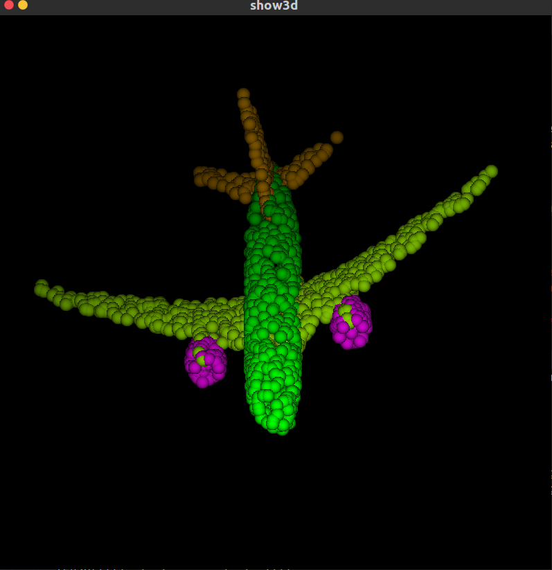

# PointNet Pytorch版复现

## 预备

### Batch

​	深度学习的优化算法，说白了就是梯度下降。每次的参数更新有两种方式。

​	第一种，遍历全部数据集算一次损失函数，然后算函数对各个参数的梯度，更新梯度。这种方法每更新一次参数都要把数据集里的所有样本都看一遍，计算量开销大，计算速度慢，不支持在线学习，这称为Batch gradient descent，批梯度下降。

​	另一种，每看一个数据就算一下损失函数，然后求梯度更新参数，这个称为随机梯度下降，stochastic gradient descent。这个方法速度比较快，但是收敛性能不太好，可能在最优点附近晃来晃去，hit不到最优点。两次参数的更新也有可能互相抵消掉，造成目标函数震荡的比较剧烈。

​	为了克服两种方法的缺点，现在一般采用的是一种折中手段，mini-batch gradient decent，小批的梯度下降，这种方法把数据分为若干个批，按批来更新参数，这样，一个批中的一组数据共同决定了本次梯度的方向，下降起来就不容易跑偏，减少了随机性。另一方面因为批的样本数与整个数据集相比小了很多，计算量也不是很大。

​	基本上现在的梯度下降都是基于mini-batch的，所以深度学习框架的函数中经常会出现batch_size，就是指这个。 关于如何将训练样本转换从batch_size的格式可以参考训练样本的batch_size数据的准备。

## Iterations

​	iterations（迭代）：每一次迭代都是一次权重更新，每一次权重更新需要batch_size个数据进行Forward运算得到损失函数，再BP算法更新参数。1个iteration等于使用batchsize个样本训练一次。

## Epochs

​	epochs被定义为向前和向后传播中所有批次的单次训练迭代。这意味着1个周期是整个输入数据的单次向前和向后传递。简单说，epochs指的就是训练过程中数据将被“轮”多少次，就这样。

**举个例子**

​	训练集有1000个样本，batchsize=10，那么训练完整个样本集需要： 100次iteration，1次epoch。

​	具体的计算公式为： one **epoch** = numbers of **iterations** = N = 训练样本的数量/**batch_size**

**注：**在LSTM中我们还会遇到一个seq_length,其实 batch_size = num_steps * seq_length


---

## 代码解析


## 分类操作

在项目主文件夹下执行

```bash
sudo python utils/train_classification.py --dataset 'shapenetcore_partanno_segmentation_benchmark_v0/' --nepoch='5' --dataset_type 'shapenet'
```


在util文件夹下执行训练分类的代码

```bash
sudo python train_classification.py --dataset '../shapenetcore_partanno_segmentation_benchmark_v0/' --nepoch='5' --dataset_type 'shapenet'
```


---

## 分割操作

​    在主文件夹下执行

```bash
sudo python utils/train_segmentation.py --dataset 'shapenetcore_partanno_segmentation_benchmark_v0/' --nepoch='5' --batchSize='8'
```


## 可视化

###    show3d_balls

在主文件夹下执行

```bash
sudo python utils/show3d_balls.py
需要把show3d_balls.py 22行路径修改
```


### show_cls   

 在主文件夹下执行

```	bash
sudo python utils/show_cls.py --model cls/cls_model_0.pth
需要把show_cls.py 16行model默认路径修改
```


### show_seg

在主文件夹下执行

```	bash
sudo python utils/show_seg.py --dataset './shapenetcore_partanno_segmentation_benchmark_v0/' --model seg/seg_model_Chair_3.pth --class_choice Airplane

Airplane	02691156
Bag	02773838
Cap	02954340
Car	02958343
Chair	03001627
Earphone	03261776
Guitar	03467517
Knife	03624134
Lamp	03636649
Laptop	03642806
Motorbike	03790512
Mug	03797390
Pistol	03948459
Rocket	04099429
Skateboard	04225987
Table	04379243
```




## MODELNET40数据集

```
ModelNet40 中加入自己的数据集
https://blog.csdn.net/SGL_LGS/article/details/101382997

ModelNet40格式的理解(PointNet实现第2步)
https://blog.csdn.net/qq_41895003/article/details/105431335

ModelNet 三维点云数据集
https://hyper.ai/datasets/5222

modelnet40数据集怎么下载？
https://www.zhihu.com/question/385649543
```


## 参考资料

主资料https://blog.csdn.net/DJames23/article/details/103642071#t3


## 问题及解决方案

1. 安装whl文件

```
https://download.pytorch.org/whl/torch_stable.html
pip install torch-0.4.1-cp37-cp37m-win_amd64.whl

https://download.pytorch.org/whl/cu101/torch-1.5.1%2Bcu101-cp36-cp36m-linux_x86_64.whl
https://download.pytorch.org/whl/cu101/torchvision-0.6.1%2Bcu101-cp36-cp36m-linux_x86_64.whl
```


2. pip install -e .报错Traceback (most recent call last):

```
执行sudo pip install -e .
```


3. 切换python版本

```
查看替代列表
sudo update-alternatives --list python

切换
sudo update-alternatives --config python

https://www.cnblogs.com/jasonlixuetao/p/9729753.html


配置只输入python3时就默认使用3.6版本：
也可使用上面链接里说明的方法
1、update-alternatives --install /usr/bin/python3 python3 /usr/bin/python3.5 1
2、update-alternatives --install /usr/bin/python3 python3 /usr/bin/python3.6 2
3、update-alternatives --config python3
4、python3 -V

设置pip:
1、apt-get install python3-pip　　　　# Python3
2、apt-get install python-pip　　　　  # Python2

https://www.cnblogs.com/eczhou/p/10245331.html

https://blog.csdn.net/yldmkx/article/details/107217904
```


4. numpy.core.multiarray failed to import

```
执行sudo python
```


5. GUP driver is too old

```
https://www.zhihu.com/question/309583980

https://pytorch.org/get-started/locally/

```


6. 安装matplotlib

```
sudo pip install matplotlib
```

7. ImportError: No module named '_tkinter', please install the python3-tk package

```
sudo apt-get install python3-tk
```


8. import torchvision报错

   resolve_type_from_object(): incompatible function arguments. The following a

```
https://blog.csdn.net/qq_38876313/article/details/106970943
```

