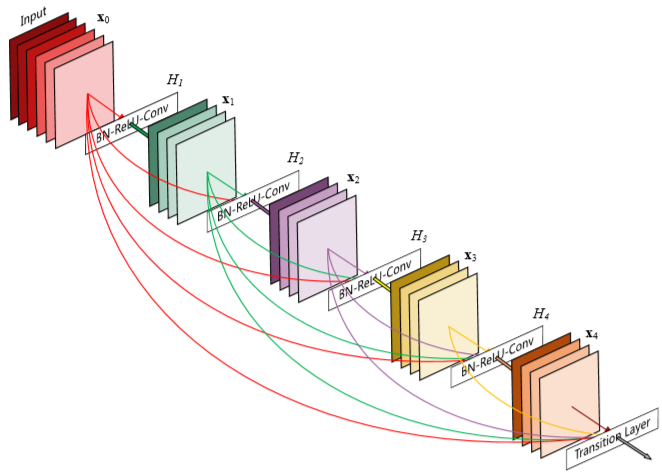

# DenseNet

CVPR2017 best paper Densely Connected Convolutional Networks

## Abstract

​	Recent work has shown that convolutional networks can besubstantiallydeeper,moreaccurate,andefficienttotrain if they contain shorter connections between layers close to the input and those close to the output. 

​	In this paper, we embrace this observation and introduce the Dense Convolutional Network (DenseNet), which connects each layer to every other layer in a feed-forward fashion. Whereas traditional convolutional networks with L layers have L connections—one between each layer and its subsequent layer—our network has $\frac{L(L+1)}{2}$ direct connections. For each layer, the feature-maps of all preceding layers are used as inputs, and its own feature-maps are used as inputs into all subsequent layers. 

​	DenseNets have several compelling advantages: they alleviate the vanishing-gradient problem, strengthen feature propagation, encourage feature reuse, and substantially reduce the number of parameters. 

​	最近的工作表明，如果卷积网络**在靠近输入的层和靠近输出的层之间包含较短的连接**，则它们可以实质上更深，更准确且效率更高。 

​	在本文中，我们接受了这一观察，并介绍了密集卷积网络（DenseNet），该网络以前馈方式将每一层连接到其他每一层。传统的具有 $L$ 层的卷积网络具有 $L$ 个连接（每一层与其后续层之间有一个连接），而我们的网络具有 $\frac{L(L+1)}{2}$ 个直接连接。对于每一层，所有先前层的特征图都用作输入，而其自身的特征图则用作所有后续层的输入。

​	DenseNets具有几个引人注目的优势：它们减轻了梯度消失的问题，增强了特征传播，鼓励了特征重用，并大大减少了参数数量。 

---

## 1. Introduction

​	Convolutional neural networks (CNNs) have become the dominant machine learning approach for visual object recognition. Although they were originally introduced over 20yearsago[18],improvements in computer hardware and network structure have enabled the training of truly deep CNNs only recently. The original LeNet5 [19] consisted of 5layers,VGGfeatured19[29],andonlylastyearHighway Networks [34] and Residual Networks (ResNets) [11] have surpassed the 100-layer barrier.  卷积神经网络（CNN）已成为视觉对象识别的主要机器学习方法。 尽管它们最初是在20多年前推出的[18]，但计算机硬件和网络结构的改进才使真正的深度CNN训练成为可能。最初的LeNet5 [19]由5层组成，VGG具有特征19 [29]，仅去年的高速公路网络[34]和残差网络（ResNets）[11]超过了100层。

**问题：**As CNNs become increasingly deep, a new research problem emerges: **as information about the input or gradient passes through many layers, it can vanish and “wash out” by the time it reaches the end (or beginning) of the network**. 随着CNN的日益深入，出现了一个新的研究问题：随着有关输入或渐变的信息穿过许多层，当到达网络的末尾（或起点）时，它可能消失并“洗掉”。 最近的许多出版物都解决了这一问题或相关问题。

**解决：**Many recent publications address this or related problems. **ResNets** [11] and **Highway Networks** [34] bypass signal from one layer to the next via **identity connections**. **Stochastic depth** [13] shortens ResNets by **randomly dropping layers** during training to allow better information and gradient flow. **FractalNets**[17]repeatedlycombineseveral parallel layer sequences with different number of convolutional blocks to obtain a large nominal depth, while maintaining many short paths in the network. Although these different approaches vary in network topology and training procedure, they all share a key characteristic: **they create short paths from early layers to later layers.** 它们创建了从早期层到后续层的短路径。

​	ResNets [11]和Highway Networks [34]通过**恒等连接**将信号从一层旁路到另一层。Stochastic depth[13]通过在训练过程中随机放置各层来缩短ResNets，以提供更好的信息和梯度流。FractalNets [17]重复地将多个并行层序列与不同数量的卷积块组合在一起，以获得较大的标称深度，同时保持网络中的许多短路径。 尽管这些不同的方法在网络拓扑和培训过程方面有所不同，但它们都具有一个关键特征：它们创建了从早期层到后续层的短路径。

**Fig. 1**A 5-layer dense block with a growth rate of k = 4. Each layer takes all preceding feature-maps as input每一层都将所有先前的特征图作为输入。

​	In this paper, we propose an architecture that distills this insight into a simple connectivity pattern: to ensure maximum information flow between layers in the network, we connect all layers (with matching feature-map sizes) directlywith eachother. Top reserve the feed-forward nature, each layer obtains additional inputs from all preceding layers and passes on its own feature-maps to all subsequent layers. Figure 1 illustrates this layout schematically. **Crucially, in contrast to ResNets, we never combine features through summation before they are passed into a layer; instead, we combine features by concatenating them.** Hence, the  the $\ell^{th}$ layer has  $\ell$  inputs, consisting of the feature-maps of all preceding convolutional blocks. Its own feature-maps are passed onto all $L-\ell$ subsequent layers. This introduces $\frac{L(L+1)}{2}$ connections in an L-layer network, instead of just L, as in traditional architectures. Because of its dense connectivitypattern,werefertoourapproachasDenseConvolutional Network (DenseNet). 

​	在本文中，我们提出了一种体系结构，将这种见解提炼为简单的连接模式：为了确保网络中各层之间的信息流最大化，我们将所有层（具有匹配的特征图大小）直接相互连接。最高保留前馈，每一层都从所有先前的层中获取其他输入，并将其自身的特征图传递给所有后续层。 图1示意性地说明了这种布局。至关重要的是，与ResNets相比，在将要素传递到图层之前，我们绝不会通过求和来组合要素。 相反，我们通过级联特征来组合它们。因此，第 $\ell^{th}$ 层具有 $\ell$ 个输入，由所有先前卷积块的特征图组成。其自己的特征映射将传递到所有 $L-\ell$ 个后续层。 这将在L层网络中引入 $\frac{L(L+1)}{2}$ 个连接，而不是像传统体系结构中那样仅引入 $L$ 个。 由于其密集的连通性模式，我们将其称为密集卷积网络（DenseNet）。

​	A possibly counter-intuitive effect of this dense connectivity pattern is that it requires fewer parameters than traditional convolutional networks, as there is no need to relearn redundant feature-maps. Traditional feed-forward architectures can be viewed as algorithms with a state, which is passed on from layer to layer. Each layer reads the state from its preceding layer and writes to the subsequent layer. It changes the state but also passes on information that needs to be preserved. 	与直觉相反的效果是，与传统的卷积网络相比，这种密集的连接模式需要的参数更少，因为不需要重新学习冗余的特征图。可以将传统的前馈体系结构视为具有状态的算法，该状态会逐层传递。每一层都从其上一层读取状态，然后写入下一层。 它不仅可以更改状态，还可以传递需要保留的信息。

​	ResNets[11] makethisinformationpreservation explicit through additive identity transformations. Recent variations of ResNets [13] show that many layers contribute very little and can in fact be randomly dropped during training. This makes the state of ResNets similar to (unrolled) recurrent neural networks [21], but the number of parameters of ResNets is substantially larger because each layer has its own weights. Our proposed DenseNet architecture explicitly differentiates between information that is added to the network and information that is preserved. DenseNet layers are very narrow (e.g., 12 filters per layer), adding only a small set of feature-maps to the “collective knowledge”ofthenetworkandkeeptheremainingfeaturemaps unchanged—and the final classifier makes a decision based on all feature-maps in the network. 

​	ResNets [11]通过附加恒等变换使此信息保留变得明确。  ResNets 的最新变体[13]表明，许多层的贡献很小，实际上在训练过程中可以随机丢弃。 这使得 ResNet 的状态类似于（展开的）递归神经网络[21]，但是ResNet的参数数量大得多，因为每一层都有其自己的权重。我们提出的 DenseNet 体系结构明确区分了添加到网络的信息和保留的信息。DenseNet层非常狭窄（例如，每层12个过滤器），仅向网络的“集体知识”添加了少量特征图，并保留了其中的主要特征图不变，最终分类器根据网络中的所有特征图做出了决定。

​	Besidesbetterparameterefficiency,onebigadvantageof DenseNets is their improved flow of information and gradients throughout the network, which makes them easy to train. Each layer has direct access to the gradients from the lossfunctionandtheoriginalinputsignal,leadingtoanimplicit deep supervision [20]. This helps training of deeper network architectures. Further, we also observe that dense connections have a regularizing effect, which reduces overfitting on tasks with smaller training set sizes. 

​	除了更好的参数效率外，DenseNets的一大优势是它们**改善了整个网络中的信息流和梯度**，这使它们**易于训练**。每个层都可以直接从损失函数和原始输入信号访问梯度，从而导致放大的深度监控[20]。这**有助于培训更深层次的网络体系结构**。此外，我们还观察到密集的连接具有正则化效果，从而减少了对训练量较小的任务的过度拟合。

---

## 2. Related Work

​	The exploration of network architectures has been a part of neural network research since their initial discovery. The recent resurgence in popularity of neural networks has also revived this research domain. The increasing number of layers in modern networks amplifies the differences between architectures and motivates the exploration of different connectivity patterns and the revisiting of old research ideas. 

​	自从最初发现以来，对网络体系结构的探索一直是神经网络研究的一部分。最近神经网络流行度的回升也使这一研究领域复活了。现代网络中越来越多的层扩大了体系结构之间的差异，并激发了对不同连通性模式的探索和对旧研究思想的重新审视。

A cascade structure similar to our proposed dense networklayouthasalreadybeenstudiedintheneuralnetworks literatureinthe1980s[3]. Theirpioneeringworkfocuseson fully connected multi-layer perceptrons trained in a layerby-layer fashion. More recently, fully connected cascade networks to be trained with batch gradient descent were proposed [40]. Although effective on small datasets, this approach only scales to networks with a few hundred parameters. In [9, 23, 31, 41], utilizing multi-level features in CNNs through skip-connnections has been found to be effective for various vision tasks. Parallel to our work, [1] derived a purely theoretical framework for networks with cross-layer connections similar to ours. 

​	类似于我们提出的密集网络布局的级联结构早在1980年代就已经开始被神经网络文献研究[3]。 他们的开拓性工作集中在以逐层方式训练的完全连接的多层感知器上。 最近，提出了使用间歇梯度下降训练的全连接级联网络[40]。 尽管此方法对小型数据集有效，但仅可扩展到具有数百个参数的网络。 在[9，23，31，41]中，发现通过跳过连接在CNN中使用多级功能对于各种视觉任务都是有效的。与我们的工作平行，[1]推导了具有与我们相似的跨层连接的网络的纯理论框架。

Highway Networks [34] were amongst the first architectures that provided a means to effectively train end-to-end networkswithmorethan100layers. Usingbypassingpaths along with gating units, Highway Networks with hundreds of layers can be optimized without difficulty. The bypassing paths are presumed to be the key factor that eases the training of these very deep networks. This point is further supportedbyResNets[11],inwhichpureidentitymappings are used as bypassing paths. ResNets have achieved impressive, record-breaking performance on many challenging image recognition, localization, and detection tasks, such as ImageNet and COCO object detection [11]. Recently, stochastic depth was proposed as a way to successfully train a 1202-layer ResNet [13]. Stochastic depth improves the training of deep residual networks by dropping layers randomly during training. This shows that not all layers may be needed and highlights that there is a great amount ofredundancy indeep(residual) networks. Our paper was partly inspired by that observation. ResNets with pre-activation also facilitate the training of state-of-the-art networks with > 1000 layers [12]. 

​	Highway Networks[34] 是第一个提供有效训练层数超过100层的端到端网络的方法之一。通过使用旁路和选通单元，可以毫无困难地优化具有数百层的公路网。 旁路路径被认为是简化这些非常深层网络训练的关键因素。  ResNets [11]进一步支持了这一点，其中纯身份映射被用作绕过路径。ResNets在许多具有挑战性的图像识别，定位和检测任务（例如ImageNet和COCO对象检测）中取得了令人印象深刻的创纪录性能[11]。 最近，提出了随机深度作为成功训练1202层ResNet的一种方法[13]。 随机深度可通过在训练过程中随机放置各层来改善对深层残差网络的训练。 这表明可能并不需要所有层，并强调了深层（残留）网络中存在大量冗余。 我们的论文部分地受到了这一观察的启发。 具有预激活功能的ResNets还可以训练具有> 1000层的最新网络[12]。

​	An orthogonal approach to making networks deeper (e.g., with the help of skip connections) is to increase the network width. The GoogLeNet [36, 37] uses an “Inception module” which concatenates feature-maps produced by filters of different sizes. In [38], a variant of ResNets with wide generalized residual blocks was proposed. In fact,simplyincreasingthenumberoffiltersineachlayerof ResNets can improve its performance provided the depth is sufficient [42]. FractalNets also achieve competitive results on several datasets using a wide network structure [17]. 

 使网络更深（例如借助跳过连接）的正交方法是增加网络宽度。GoogLeNet [36，37]使用一个“初始模块”，它将不同大小的过滤器产生的特征图连接起来。 在[38]中，提出了具有广泛广义残差块的ResNets的变体。 实际上，只要深度足够，只需增加ResNet的过滤层数就可以提高其性能[42]。  FractalNets还使用广泛的网络结构在多个数据集上取得了竞争性的结果[17]。

Instead of drawing representational power from extremely deep or wide architectures, DenseNets exploit the potentialofthenetworkthroughfeaturereuse,yieldingcondensed models that are easy to train and highly parameterefficient. Concatenating feature-maps learned by different layers increases variation in the input of subsequent layers andimprovesefficiency. Thisconstitutesamajordifference between DenseNets and ResNets. Compared to Inception networks[36,37],whichalsoconcatenatefeaturesfromdifferent layers, DenseNets are simpler and more efficient. 

DenseNets并未从极深或极广的架构中获得代表性的功能，而是通过**特征重用**，易于训练且参数高效的浓缩模型来挖掘网络的潜力。**连接不同层学习到的特征图会增加后续层输入的变化并提高效率。** 这构成了DenseNet和ResNet之间的主要区别。 相比于Inception网络[36,37]，它也可以将不同层次的特征连接起来，DenseNets更简单，更高效。

Thereareothernotablenetworkarchitectureinnovations which have yielded competitive results. The Network in Network (NIN) [22] structure includes micro multi-layer perceptrons into the filters of convolutional layers to extractmorecomplicatedfeatures. InDeeplySupervisedNetwork (DSN) [20], internal layers are directly supervised by auxiliary classifiers, which can strengthen the gradients received by earlier layers. Ladder Networks [27, 25] introduce lateral connections into autoencoders, producing impressive accuracies on semi-supervised learning tasks. In [39], Deeply-Fused Nets (DFNs) were proposed to improve information flow by combining intermediate layers of different base networks. The augmentation of networks withpathwaysthatminimizereconstructionlosseswasalso shown to improve image classification models [43]. 

还有一些值得注意的网络体系结构创新已产生了竞争性的结果。 网络中的网络（NIN）[22]结构将微多层感知器包含到卷积层过滤器中，以提取更多复杂的特征。 在DeeplySupervisedNetwork（DSN）[20]中，内部层由辅助分类器直接监督，这可以加强早期层接收到的梯度。  Ladder Networks [27，25]将横向连接引入自动编码器中，从而在半监督学习任务上产生了令人印象深刻的准确性。 在[39]中，提出了深度融合网络（DFN）来通过组合不同基础网络的中间层来改善信息流。 还显示了具有最小化重建损失的途径的网络扩展也可以改善图像分类模型[43]。

## 3. DenseNets

​	考虑通过卷积网络传递的单个图像 $\mathbf{x}_0$。 该网络包括 $L$ 个层，每个层执行一个非线性变换 $H_{\ell}(·)$，其中 $\ell$ 为该层索引。$H_{\ell}(·)$可以是诸如批归一化（BN），整流线性单位（ReLU），池化或卷积（Conv）之类的运算的复合函数。我们将第 $\ell^{th}$ 层的输出表示为 $\mathbf{x}_{\ell}$。

### ResNets

传统的卷积前馈网络将第 $\ell^{th}$ 层的输出作为输入连接到第 ${(\ell+1)}^{th}$ 层，这引起以下层转换: $\mathbf{x}_{\ell} = H_{\ell}(\mathbf{x}_{\ell-1})$.ResNets [11]添加了一个残差连接，该连接使用恒等函数绕过非线性变换：
$$
\mathbf{x}_{\ell}=H_{\ell}\left(\mathbf{x}_{\ell-1}\right)+\mathbf{x}_{\ell-1}\tag{1}
$$
​	ResNets的一个优点是梯度可以**直接通过恒等函数从后面的层流到前面的层**。但是，恒等函数和$H_{\ell}(·)$的输出通过求和相结合，这可能会阻碍网络中的信息流。

### Dense connectivity

为了进一步改善各层之间的信息流，我们提出了一种不同的连接模式：我们引入了从任何层到所有后续层的直接连接。 图1示意性地显示了所得DenseNet的布局。 因此，第 $\ell^{th}$ 层接收所有先前的层 $\left[\mathbf{x}_{0}, \mathbf{x}_{1}, \ldots, \mathbf{x}_{\ell-1}\right]$ 的特征图作为输入：
$$
\mathbf{x}_{\ell}=H_{\ell}\left(\left[\mathbf{x}_{0}, \mathbf{x}_{1}, \ldots, \mathbf{x}_{\ell-1}\right]\right) \tag{2}
$$
​	其中 $\left[\mathbf{x}_{0}, \mathbf{x}_{1}, \ldots, \mathbf{x}_{\ell-1}\right]$ 表示第 $0,\dots,\ell-1$ 层的生成特征图的连接。由于其紧密的连接性，我们将此网络体系结构称为密集卷积网络（DenseNet）。 为了易于实现，我们在式2中将$H_{\ell}(·)$的多个输入连接在一起成单个张量。

### Composite function复合函数

​	受[12]的启发，我们将$H_{\ell}(·)$定义为三个连续操作的复合函数：批归一化BN，然后是线性线性单位ReLU和3×3卷积Conv。

### Pooling layers

当特征图的大小更改时，等式2中使用的级联操作不可行。但是，卷积网络的重要组成部分是**下采样层**，这些层会更改特征图的大小。为了便于在我们的体系结构中进行下采样，我们将网络划分为多个密集连接的密集块； 参见图2。 我们将块之间的层称为**过渡层**，它们进行卷积和合并。 我们的实验中使用的过渡层包括批处理归一化层和1×1卷积层，然后是2×2平均池化层。

**Fig. 2 ** A deep DenseNet with three dense blocks. The layers between two adjacent blocks are referred to as transition layers and change feature-map sizes via convolution and pooling.两个相邻块之间的层称为过渡层，并通过卷积和池化来更改特征图的大小。

### Growth rate

如果每个函数 $H_{\ell}(·)$ 都生成 $k$ 个特征图，则第 $\ell^{th}$ 层具有 $k_0 + k×（\ell-1）$个输入特征图，其中 $k_0$ 是输入层中的通道数。DenseNet与现有网络体系结构之间的重要区别是DenseNet可以具有非常狭窄的层，例如 $k =12$ 。我们将超参数 $k$ 称为网络的增长率。我们在第4节中表明，**相对较小的增长率足以在我们测试的数据集上获得最新的结果**。对此的一种解释是，每个层都可以访问所有前面的特征图初始化块，因此可以访问网络的“集体知识”。 可以将特征图视为网络的**全局状态**。每层将自己的 $k$ 个特征图添加到此状态。 **增长率决定每一层为全局状态贡献多少新信息。** 写入后的全局状态可以从网络中的任何位置进行访问，并且与传统的网络体系结构不同，**无需逐层复制它**。

### Bottleneck layers

尽管每个图层仅产生 $k$ 个输出特征图，但通常会有更多的输入。在[37,11]中已经指出，可以在每个3×3卷积之前引入1×1卷积作为瓶颈层，以减少输入特征图的数量，从而提高计算效率。 我们发现此设计对DenseNet特别有效，并且我们将具有如此瓶颈的网络称为DenseNet-B，即BN-ReLU-Conv（1×1）-BN-ReLU-Conv（3×3）版本。在我们的实验中，我们让每个1×1卷积产生 $4k$ 功能图。

### Compression压缩

​	为了进一步提高模型的紧凑性，我们可以减少过渡层的特征图数量。如果密集块包含 $m$ 个特征图，则让下面的过渡层生成 $\lfloor\theta m\rfloor$ 输出特征图，其中 $0<\theta \leq 1$ 称为压缩因子。 当 $\theta=1$ 时，跨过渡层的特征图的数量保持不变。 我们将 $\theta<1$ 的DenseNet称为DenseNet-C，并在实验中将 $θ$ 设为0.5。 当同时使用瓶颈层和 $θ<1$ 的过渡层时，我们将模型称为DenseNet-BC。

### Implementation Details.

​	在除ImageNet之外的所有数据集上，我们实验中使用的DenseNet具有三个密集块，每个密集块具有相等的层数。 进入第一个密集块之前，对输入图像执行16倍（或DenseNet-BC增长率的两倍）输出通道的卷积。 对于内核尺寸为3×3的卷积层，输入端的每一侧都用一个像素零填充以保持特征图尺寸固定。我们使用1×1卷积，然后是2×2平均池，作为两个连续密集块之间的过渡层。 在最后一个密集块的末尾，执行全局平均池化，然后附加softmax分类器。 三个密集块中的特征图大小分别为32×32、16×16和8×8。 我们用配置{L = 40，k = 12}，{L = 100，k = 12}和{L = 100，k = 24}的基本DenseNet结构进行实验。 对于DenseNetBC，评估配置为{L = 100，k = 12}，{L = 250，k = 24}和{L = 190，k = 40}的网络。

​	在ImageNet的实验过程中我们使用DenseNet-BC结构，在224×224输入图像上具有4个密集块。 初始卷积层包括2k个大小为7×7的卷积，步幅为2； 其他所有图层中的要素贴图的数量也取决于设置k。 表1显示了我们在ImageNet上使用的确切网络配置。

