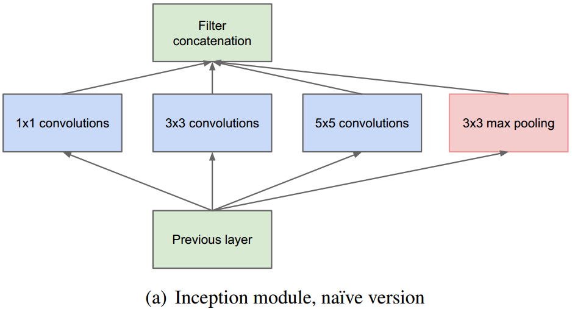

# Inception v1

Going deeper with convolutions

改进为

解释：

　　a）采用不同大小的卷积核意味着不同大小的感受野，最后拼接意味着不同尺度特征的融合； 

　　b）之所以卷积核大小采用1、3和5，主要是为了方便对齐；

　　c）文章说很多地方都表明pooling挺有效，所以Inception里面也嵌入了；

　　d）网络越到后面，特征越抽象，而且每个特征所涉及的感受野也更大了，因此随着层数的增加，3x3和5x5卷积的比例也要增加。

​	在inception结构中，大量采用了1x1的矩阵，主要是两点作用：1）对数据进行降维；2）引入更多的非线性，提高泛化能力，因为卷积后要经过ReLU激活函数。

**GoogLeNet**

​	GoogLeNet是由inception模块进行组成的,几点说明：

　　a）GoogLeNet采用了模块化的结构，方便增添和修改；

　　b）网络最后采用了average pooling来代替全连接层，想法来自NIN，事实证明可以将TOP1 accuracy提高0.6%。但是，实际在最后还是加了一个全连接层，主要是为了方便以后大家finetune（微调）;

　　c）虽然移除了全连接，但是网络中依然使用了Dropout；

　　d）为了避免梯度消失，网络额外增加了2个辅助的softmax用于向前传导梯度。文章中说这两个辅助的分类器的loss应该加一个衰减系数，但看源码中的model也没有加任何衰减。此外，实际测试的时候，这两个额外的softmax会被去掉。

# Inception v2

Batch Normalization: Accelerating Deep Network Training by Reducing Internal Covariate Shift

​	训练DNN网络的一个难点是，在训练时每层输入数据的分布会发生改变，所以需要较低的学习率和精心设置初始化参数。只要网络的前面几层发生微小的改变，那么后面几层就会被累积放大下去。一旦网络某一层的输入数据的分布发生改变，那么这一层网络就需要去适应学习这个新的数据分布，所以如果训练过程中，训练数据的分布一直在发生变化，那么将会影响网络的训练速度。作者把网络中间层在训练过程中，数据分布的改变称之为：“Internal Covariate Shift”。因此，作者提出对数据做归一化的想法。

对数据进行了BN算法后，具有以下的优点：

　　a）可以设置较大的初始学习率，并且减少对参数初始化的依赖，提高了训练速度；

　　b）这是个正则化模型，因此可以去除dropout和降低L2正则约束参数；

　　c）不需要局部响应归一化层；

　　d）能防止网络陷入饱和，即消除梯度消失。

# Inception v3

Rethinking the Inception Architecture for Computer Vision

引入了因子分解的思想。

复杂的inception结构，使得我们很难对网络进行修改。如果盲目的扩大网络，反而会增大计算量。所以，本论文首先给出了几条**通用的原则和优化**的思想：

- 避免特征表示瓶颈，尤其是在网络的前面。要避免严重压缩导致的瓶颈。特征表示尺寸应该温和地减少，从输入端到输出端。特征表示的维度只是一个粗浅的信息量表示，它丢掉了一些重要的因素如相关性结构。

- 高维信息更适合在网络的局部处理。在卷积网络中逐步增加非线性激活响应可以解耦合更多的特征，那么网络就会训练的更快。

- 空间聚合可以通过低维嵌入，不会导致网络表示能力的降低。例如在进行大尺寸的卷积（如3*3）之前，我们可以在空间聚合前**先**对输入信息进行**降维**处理，如果这些信号是容易压缩的，那么降维甚至可以加快学习速度。

- 平衡好网络的深度和宽度。通过平衡网络每层滤波器的个数和网络的层数可以是网络达到最佳性能。增加网络的宽度和深度都会提升网络的性能，但是两者并行增加获得的性能提升是最大的。所以计算资源应该被合理的分配到网络的宽度和深度。 

​	利用辅助决策分支，来加快收敛速度。在inception v1中，引入了辅助决策分支。但是本文证明了，底层的辅助决策分支并不能起到很好的作用。如果辅助决策分支进行归一化或者dropout，效果会更好。

​	利用平行的池化与卷积，来进行特征图尺寸缩小，不仅能较少计算量，又能防止特征瓶颈，如下图所示。

​	提出了Label Smoothing

# Inception v4