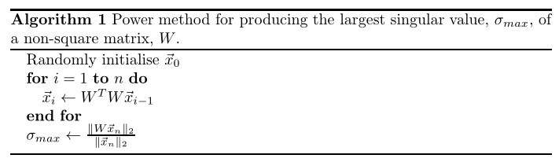
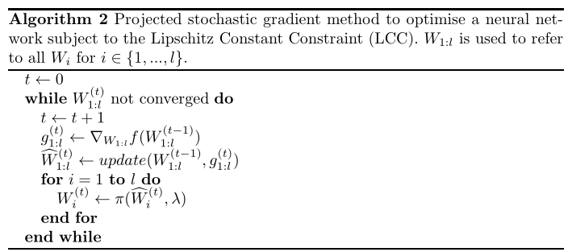

# Regularisation of Neural Networks by Enforcing Lipschitz Continuity

通过强制 Lipschitz 连续性对神经网络进行正则化

## Abstract

我们研究了明确强制执行神经网络关于其输入的 Lipschitz 连续性的效果。 为此，我们提供了一种简单的技术来计算由常用层类型组成的前馈神经网络的 Lipschitz 常数上限（对于多个 p 范数  p-norms）。然后，我们的技术用于制定训练具有有界 Lipschitz 常数的神经网络作为约束优化问题，可以使用投影随机梯度方法解决该问题。 我们的评估研究表明，生成的模型的性能超过了使用其他常见正则化器训练的模型的性能。 我们还提供了超参数可以直观调整的证据，演示了计算 Lipschitz 常数的范数选择如何影响结果模型，并表明我们的方法提供的性能提升在只有少量训练数据时特别明显 可用的。

## 1. Introduction

**监督学习主要关注在给出特定输入应该产生什么输出的示例的情况下逼近函数的问题。为了使近似值具有任何实际用途，它必须推广到看不见的数据点。因此，我们需要选择一个合适的函数空间，机器应该在其中搜索一个好的近似值，并选择一个算法来搜索这个空间。** 这通常是首先通过选择大量模型（例如支持向量机或决策树）并应用合适的搜索算法来完成的。至关重要的是，在执行搜索时，必须采用特定于所选模型族的**正则化技术**来对抗过度拟合。 例如，可以限制决策树的深度由学习算法考虑，或对可调模型参数施加概率先验。

神经网络模型的正则化是一个特别困难的挑战。目前最有效的方法（Srivastava，2014；Ioffe，2015 ）是启发式的，这可以使将这些技术应用于新问题的过程变得非常重要或不可靠。 相比之下，众所周知，改编自线性模型的正则化方法（例如将 $ℓ_2$ 惩罚项应用于模型参数）不如启发式方法有效（Srivastava，2014）。这为为神经网络开发有根据且有效的正则化方法提供了明确的动机。根据直觉，当**函数以较慢的速度变化时，函数被认为更简单，从而更好地泛化**，我们开发了一种方法，允许我们控制网络的 Lipschitz 常数——**函数可以表现出的最大变化的度量**。我们的实验表明，这是对神经网络模型施加的有用的归纳偏差。

围绕神经网络的理论工作中的主流主题之一是**权重的大小直接影响泛化差距**（Bartlett，1998；Bartlett，2017；Neyshabur，2017；Golowich，2018），具有更大的权重与新数据较差的相对表现相关。在最近的一些作品中（Bartlett，2017；Neyshabur，2017；Golowich，2018），这些边界中的一些主要项等于神经网络的 Lipschitz 常数的上限，因为我们在这篇论文中推导出来。虽然以前的工作只考虑了网络关于 $ℓ_2$ 范数的 Lipschitz 连续性，但我们特别强调了 $ℓ_1$ 和 $ℓ_∞$ 范数的工作，并构建了一个实用的算法来在训练期间约束网络的 Lipschitz 常数。该算法为每一层指定一个超参数，指定其最大允许的 Lipschitz 常数，这些参数共同确定了整个网络允许的 Lipschitz 常数的上限。我们在实验中跨多个层重用相同的参数值来加速超参数优化过程。

实验证明了这种正则化技术的几个有趣的特性。 我们表明，尽管**我们的算法在单独使用时没有竞争力，但与其他常用的正则化器结合使用时却非常有效**。此外，当只有少量训练数据可用时，相对于传统正则化方法的收益相对更明显。我们验证超参数的行为方式很直观：当设置为较小的值时，模型容量会降低，随着超参数值的增加，模型容量也会增加。至关重要的是，有一系列超参数设置的性能优于没有我们的正则化器训练的模型。

本文首先在第 2 节中概述了与神经网络的正则化和 Lipschitz 连续性相关的先前工作。然后在第 3 节中详细推导了一大类前馈神经网络的 Lipschitz 常数的上限 ，我们考虑了向量范数的多种选择。 第 4 节展示了如何使用此上限以有效的方式对神经网络进行正则化。第 5 节给出了展示这种正则化方法实用性的实验，第 6 节得出了结论。

---

## 2. Related Work

目前用于深度网络的最广泛应用的正则化技术之一是 dropout（Srivastava，2014）。 通过在训练期间以一定概率 $p$ 将每个隐藏单元的激活随机设置为零，该方法显着减少了对各种模型的过度拟合。已经提出了各种扩展，例如将权重随机设置为零而不是激活（Wan，2013）。 另一种修改是具体的 dropout（Gal，2017），它允许直接学习 dropout 率 $p$，从而更容易搜索一组好的超参数。 (Kingma，2015) 还表明，可以在优化过程中学习高斯 dropout 中的噪声水平。 (Srivastava，2014) 发现，单独约束每个单元的权重向量的 $ℓ_2$ 范数——他们称之为 maxnorm 的技术——可以提高用 dropout 训练的网络的性能。

最近关于深度学习优化的工作也有助于我们理解神经网络的泛化性能。 该领域的大多数工作旨在描述性，而不是规定性，因为重点是为现有启发式方法提供解释，而不是开发提高性能的新方法。 例如 (哈特，2016) 量化泛化误差和提前停止之间的关系。几篇论文表明，神经网络的泛化差距取决于权重的大小（Bartlett，2017；Neyshabur，2017；Bartlett，1998；Golowich，2018）。 早期的结果，例如 (Bartlett，1998)，提出了假设 sigmoidal 激活函数的边界，但仍然将泛化与网络中权重的绝对值之和联系起来。 最近的工作表明，由各种其他权重矩阵范数缩放的谱范数的乘积可用于构建泛化差距的界限。 巴特利特等人。  (2017) 通过与元素 $ℓ_1$ 范数相关的项来缩放谱范数乘积，而 (Neyshabur，2018) 使用 Frobenius 范数。 在这些边界中使用的关键数量是一类神经网络参数的 Lipschitz 常数，这些常数又用于覆盖数字参数，以限制模型在假设空间中的泛化性能。

(Neyshabur，2018) 推测，仅关于 $ℓ_2$ 范数的 Lipschitz 连续性不足以保证泛化。 然而，第 3 节中提出的上限出现在多个泛化边界中（Neyshabur，2017；Bartlett，2017；Golowich，2018），我们在本文中凭经验表明它是控制深度网络的性能泛化的有效助手。此外， (Xu，2012) 的工作证明了模型相对于其输入的 Lipschitz 常数与由此产生的泛化性能之间的关系。这是使用鲁棒性理论完成的，而不是在学习理论界限中更常用的工具，例如 Rademacher 复杂度和 VC 维度（Shalev-Shwartz，2014）。 有趣的是，  (Golowich，2018) 提出了深度网络的 Rademacher 复杂性的界限，该界限仅取决于每个权重矩阵的 $ℓ_∞$ 算子范数的乘积，这恰好对应于我们在本文中考虑的 $ℓ_∞$ Lipschitz 常数的上限。 这提供了更多的证据，证明约束网络的 $ℓ_∞$ Lipschitz 常数是提高泛化性能的一种有原则的方法。

Yoshida  (2017) 提出了一种新的正则化方案，该方案在损失函数中添加了一个项，该项惩罚权重矩阵的谱范数之和。 这与我们在本文中所做的相关但不同。 首先，我们研究除 $ℓ_2$ 之外的范数。 其次，Yoshida（2017）使用惩罚项，而我们对诱导权重矩阵范数使用硬约束，他们惩罚范数的总和。  Lipschitz 常数由算子范数的乘积决定。 最后，他们使用启发式方法对卷积层进行正则化。具体来说，他们计算展平权重张量的最大奇异值，而不是像我们在 3.2 节中所做的那样，推导出与卷积层执行的线性运算相对应的真实矩阵。 显式构建这个矩阵并计算其最大奇异值（甚至是近似值）的成本会高得令人望而却步。 我们提供了精确计算卷积层的 $ℓ_1$ 和 $ℓ_∞$ 范数的有效方法，并展示了如何通过避免显式构造表示卷积层执行的线性运算的矩阵来有效地近似谱范数。 巴兰   (2017) 提供了一种计算受限类神经网络（称为散射网络）的 Lipschitz 常数上限的方法。 尽管他们的方法计算的边界比本文中提出的网络更严格，但在实践中使用的大多数神经网络并不适合散射网络框架。

加强网络的 Lipschitz 连续性不仅对正则化很有趣。 宫户  (2018) 表明，将生成对抗网络中鉴别器的权重限制为具有特定的谱范数可以提高生成样本的质量。 他们使用与 Yoshida（2017）相同的技术来计算这些范数，因此可能会受益于本文提出的改进。

本研究同时开展了两项相关工作。塞吉 (2018) 提出了一种通过使用傅立叶分析来表征卷积层的所有奇异值的方法。 津久 (2018) 提出了一种类似的计算卷积层谱范数的方法，目的是对其进行正则化以提高结果模型的对抗性鲁棒性。

## 3. Computing the Lipschitz Constant

如果函数 $f : X → Y$ 满足 Lipschitz 连续条件：
$$
\begin{equation}
 D_{Y}\left(f\left(\vec{x}_{1}\right), f\left(\vec{x}_{2}\right)\right) \leq k D_{X}\left(\vec{x}_{1}, \vec{x}_{2}\right) \quad \forall \vec{x}_{1}, \vec{x}_{2} \in X 
\end{equation}
$$
对于某些实值 $k ≥ 0$，以及度量 $D_X$ 和 $D_Y$ 。$k$ 的值称为 Lipschitz 常数，该函数可称为 k-Lipschitz。通常，我们对最小的 Lipschitz 常数感兴趣，但并不总是可以找到它。在本节中，将展示如何计算关于输入特征的前馈神经网络的 Lipschitz 常数的上限。 这样的网络可以表示为一系列函数组合：
$$
\begin{equation}
 f(\vec{x})=\left(\phi_{l} \circ \phi_{l-1} \circ \ldots \circ \phi_{1}\right)(\vec{x}) 
\end{equation}\tag{2}
$$
其中每个 $φ_i$ 是一个激活函数、线性操作或池化操作。Lipschitz 函数的一个特别有用的特性是它们在组合时的行为方式：$k_1\text{-Lipschitz}$ 函数 $f_1$ 与 $k_2\text{-Lipschitz}$ 函数 $f_2$ 的组合是 $k_1k_2\text{-Lipschitz}$ 函数。将某些函数 $f$ 的 Lipschitz 常数表示为 $L(f)$，重复应用此组合属性会产生整个前馈网络的 Lipschitz 常数的以下上限： 
$$
\begin{equation}
 L(f) \leq \prod_{i=1}^{l} L\left(\phi_{i}\right) 
\end{equation}\tag{3}
$$
因此，我们可以单独计算每一层的 Lipschitz 常数，并以模块化方式将它们组合起来，以建立整个网络常数的上限。重要的是要注意 $k_1k_2$ 不一定是 $ \left(f_{2} \circ f_{1}\right) $ 的最小 Lipschitz 常数，即使  $k_1$ 和 $k_2$ 分别是 $f_1$ 和 $f_ 2$ 的最佳 Lipschitz 常数。 理论上可以通过将整个网络视为一个整体而不是孤立地考虑每一层来获得更严格的上限。 在本节的其余部分，当 $D_X$ 和 $D_Y$ 分别对应于 $ℓ_1$ 、$ℓ_2$ 或 $ℓ_∞$ 范数时，我们推导出常见层类型的 Lipschitz 常数的闭式表达式。正如我们将在第 4 节中看到的，关于这些范数的 Lipschitz 常数可以被有效地约束。

### 3.1. Fully Connected Layers

全连接层 $\phi^{f c}(\vec{x})$ 实现了由权重矩阵 $W$ 和偏置向量 $\vec{b}$ 参数化的仿射变换：
$$
\begin{equation}
 \phi^{f c}(\vec{x})=W \vec{x}+\vec{b} 
\end{equation}
$$
已有人确定，在 $ℓ_2$ 范数下，全连接层的 Lipschitz 常数由权重矩阵的谱范数给出（Miyato，2018；Neyshabur，2017）。我们提供了一个稍微更通用的公式，在考虑其他 p-范数 (p-norms) 时将证明它更有用。我们首先将全连接层的定义插入 Lipschitz 连续性的定义： 
$$
\begin{equation}
 \left\|\left(W \vec{x}_{1}+\vec{b}\right)-\left(W \vec{x}_{2}+\vec{b}\right)\right\|_{p} \leq k\left\|\vec{x}_{1}-\vec{x}_{2}\right\|_{p} 
\end{equation}
$$
通过设置 $ \vec{a}=\vec{x}_{1}-\vec{x}_{2} $ 并稍微简化表达式，我们得到
$$
\begin{equation}
 \|W \vec{a}\|_{p} \leq k\|\vec{a}\|_{p} 
\end{equation}
$$
其中，假设 $ \vec{x}_{1} \neq \vec{x}_{2} $，可以得到（**can be rearranged to**）
$$
\begin{equation}
 \frac{\|W \vec{a}\|_{p}}{\|\vec{a}\|_{p}} \leq k, \quad \vec{a} \neq 0 
\end{equation}
$$
因此最小的 Lipschitz 常数等于不等式左侧的上限值 
$$
\begin{equation}
 L\left(\phi^{f c}\right)=\sup _{\vec{a} \neq 0} \frac{\|W \vec{a}\|_{p}}{\|\vec{a}\|_{p}} 
\end{equation}
$$
其中 $W$ 是算子范数的定义。

对于我们在本文中考虑的 p-范数，存在用于在相对较大的矩阵上计算算子范数的有效算法。具体来说，对于 $p=1$，算子范数是最大绝对列总和范数；对于 $p=∞$，运算符范数是最大绝对行总和范数。 计算这两个范数所需的时间与权重矩阵中的元素数量线性相关。当 $p=2$ 时，算子范数由权重矩阵的最大奇异值（谱范数  spectral norm）给出，可以使用幂方法的少量迭代相对快速地近似。

---

### 3.2. Convolutional Layers

卷积层 $\phi^{\text {conv }}(X)$ 也执行仿射变换，但通常用离散卷积和逐点加法来表达计算更方便。对于卷积层，第 $i$ 个输出特征图由下式给出
$$
\begin{equation}
 \phi_{i}^{\text {conv }}(X)=\sum_{j=1}^{M_{l-1}} F_{i, j} * X_{j}+B_{i} 
\end{equation}\tag{9}
$$
其中每个 $F_{i,j}$ 是一个过滤器，每个 $X_j$ 是一个输入特征图，$B_i$ 是一个适当形状的偏置张量，在每个元素中表现出相同的值，并且前一层产生 $M_{l−1}$ 个特征图。

Eq. 9 中的卷积是线性运算，因此可以利用线性运算和适当大小的方阵之间的同构性来重用 Sec 3.1 中导出的矩阵范数。为了将单个卷积操作表示为矩阵-向量乘法（matrix–vector multiplication），将输入特征图**序列化为向量**，并使用滤波器系数构建**双块循环矩阵**（doubly block circulant matrices）。由于双块循环矩阵的结构，每个滤波器系数在该矩阵的每一列和每一行中只出现一次。因此， $ℓ_1$ 和 $ℓ_∞$ 算子范数相同，由 $ \left\|F_{i, j}\right\|_{1} $ 给出。$ \left\|F_{i, j}\right\|_{1} $ 是用于构造矩阵的滤波器系数的绝对值之和。

对与不同输入特征图和相同输出特征图相关联的几个不同卷积求和，如 Eq.9 中所做的那样，可以通过水平连接矩阵来完成。例如，假设 $V_{i,j}$ 是一个矩阵，它执行 $F_{i,j}$ 与序列化为向量的第 $j$ 个特征图的卷积。Eq.9 现在可以改写为矩阵形式
$$
\begin{equation}
 \phi_{i}^{\text {conv }}(\vec{x})=\left[\begin{array}{lll}V_{1,1} & V_{1,2} & \ldots & V_{1, M_{l-1}}\end{array}\right] \vec{x}+\vec{b}_{i} 
\end{equation}
$$
其中之前由 $X$ 和 $B_i$ 表示的输入和偏差已分别序列化为向量 $ \vec{x} $ 和 $ \vec{b_i} $。 由卷积层执行以生成 $M_l$ 输出特征图的完整线性变换 $W$ 可以通过向块矩阵添加额外行来构建：

$$
\begin{equation}
 W=\left[\begin{array}{ccc}V_{1,1} & \ldots & V_{1, M_{l-1}} \\ \vdots & \ddots & \\ V_{M_{l}, 1} & & V_{M_{l}, M_{l-1}}\end{array}\right] 
\end{equation}
$$
为了计算 $W$ 的 $ℓ_1$ 和 $ℓ_∞$ 算子范数，回想一下，对于 $p∈\{1,∞\}$，$V_{i,j}$ 的算子范数是 $ \left\|F_{i, j}\right\|_{1} $。可以从 $W$ 构造第二个矩阵 $W'$ ，其中每个块 $V_{i,j}$ 被替换为相应的算子范数 $ \left\|F_{i, j}\right\|_{1} $。 这些算子范数中的每一个都可以被认为是原始矩阵 $W$ 的部分行或列总和。现在，基于 Sec 3.1 中的讨论，$ℓ_1$ 算子范数由下式给出
$$
\begin{equation}
 \|W\|_{1}=\max _{j} \sum_{i=1}^{M_{l}}\left\|F_{i, j}\right\|_{1} 
\end{equation}
$$
并且 $ℓ_∞$ 算子范数由下式给出
$$
\begin{equation}
 \|W\|_{\infty}=\max _{i} \sum_{j=1}^{M_{l-1}}\left\|F_{i, j}\right\|_{1} 
\end{equation}
$$
我们现在考虑卷积层的谱范数 （spectral norm）。Yoshida（2017）及 Miyato  (2018) 都通过将卷积层的**权重张量**重新解释为**矩阵**来研究惩罚或约束卷积层的谱范数的效果，
$$
\begin{equation}
 U=\left[\begin{array}{ccc}\vec{u}_{1,1} & \ldots & \vec{u}_{1, M_{l-1}} \\ \vdots & \ddots & \\ \vec{u}_{M_{l}, 1} & & \vec{u}_{M_{l}, M_{l-1}}\end{array}\right] 
\end{equation}\tag{11}
$$
其中每个 $ \vec{u}_{i, j} $ 包含序列化为行向量的相应  $ F_{i, j} $ 的元素。 然后他们继续计算 $U$ 的谱范数，而不是计算 $W$ 的谱范数，如 Eq.11 所示。Cisse  (2017) 和 Tsuzuku  (2018) 显示，这仅计算真实谱范数的松散上限(loose upper)。

用于产生非方阵 $W$ 的最大奇异值 $σ_{max}$ 的幂方法。

显式构造 $W$ 并应用传统的奇异值分解来计算卷积层的谱范数是不可行的，但我们展示了如何调整幂方法以使用标准卷积网络原语（primitives）来有效地计算它。考虑使用 Algorithm 1 中提供的幂方法计算方阵的最大奇异值的通常过程。我们最感兴趣的表达式是在 for 循环内部，即
$$
\begin{equation}
 \vec{x}_{i}=W^{T} W \vec{x}_{i-1} 
\end{equation}
$$
由于矩阵乘法的结合性，可以将其分解为两个步骤：
$$
\begin{equation}
 \vec{x}_{i}^{\prime}=W \vec{x}_{i-1} 
\end{equation}\tag{16}
$$
和：
$$
\begin{equation}
 \vec{x}_{i}^{\prime}=W \vec{x}_{i-1} 
\end{equation}\tag{17}
$$
当 $W$ 是 Eq.11 中的矩阵时，Eq.16 和 Eq.17 中给出的表达式分别对应于通过卷积层的前向传播和后向传播。因此，如果我们分别用**卷积**和**转置卷积**操作替换这些矩阵乘法，就像在许多深度学习框架中实现的那样，可以有效地计算谱范数。

请注意，只有一个向量必须进行前向和后向传播操作，而不是一整批（entire batch）实例。 这意味着，在大多数情况下，使用此方法只会导致运行时间的小幅增加。它还自动考虑了卷积层使用的填充和步幅超参数。与 Yoshida （2017）以及 Miyato   (2018)使用的重塑方法相反，我们使用的方法能够准确地计算卷积层的谱范数，如果它运行直到收敛。

---

### 3.3. Pooling Layers and Activation Functions

计算池化层和激活函数的 Lipschitz 常数对于常用的池化操作和激活函数来说是微不足道的。对于所有 p-norms，最常见的激活函数和池化操作在最坏的情况下是 1-Lipschitz。 例如，ReLU 激活函数的最大绝对子梯度为 1，这意味着 ReLU 操作的 Lipschitz 常数为 1。类似的论点得出最大池化层的 Lipschitz 常数为 1；softmax 的 Lipschitz 常数为 1（Gao，2017）。

---

### 3.4. Residual Connections

最近开发的前馈架构通常包括非相邻层之间的残差连接（He，2016）。 这些最常用于构建称为残差块的结构：
$$
\begin{equation}
 \phi^{r e s}(\vec{x})=\vec{x}+\left(\phi_{j+n} \circ \ldots \circ \phi_{j+1}\right)(\vec{x}) 
\end{equation}\tag{18}
$$
其中函数组合可能包含许多不同的线性变换和激活函数。在大多数情况下，该组合由两个卷积层组成，每个卷积层前面都有一个批量归一化层和一个 ReLU 函数。虽然使用残差块的网络仍然符合前馈网络的要求，但它们不再符合我们在 [Eq. 2](#eq2) 中形式化的函数组合的线性链。 幸运的是，具有残差连接的网络通常是通过 Eq.18 组合给定形式的残差块的线性链来构建的。因此，残差网络的 Lipschitz 常数将是每个残差块的 Lipschitz 常数的**乘积**。每个块是两个函数的总和（见 Eq.18）。因此，对于 $ k_{1} $-Lipschitz 函数 $f_1$ 和 $ k_{2} $-Lipschitz 函数 $f_2$ ，我们对它们的 Lipschitz 常数和感兴趣：

$$
\begin{equation}
 \left\|\left(f_{1}\left(\vec{x}_{1}\right)+f_{2}\left(\vec{x}_{1}\right)\right)-\left(f_{1}\left(\vec{x}_{2}\right)+f_{2}\left(\vec{x}_{2}\right)\right)\right\|_{p} 
\end{equation}
$$
可以重新排列为 (which can be rearranged to)

$$
\begin{equation}
 \left\|\left(f_{1}\left(\vec{x}_{1}\right)-f_{1}\left(\vec{x}_{2}\right)\right)+\left(f_{2}\left(\vec{x}_{1}\right)-f_{2}\left(\vec{x}_{2}\right)\right)\right\|_{p} 
\end{equation}\tag{20}
$$
然后可以使用范数的次可加性（subadditivity property）和 $f_1$ 和 $f_2$ 的 Lipschitz 常数来限制上面的 Eq.20：

$$
\begin{equation}
 \begin{aligned}\left\|\left(f_{1}\left(\vec{x}_{1}\right)-f_{1}\left(\vec{x}_{2}\right)\right)+\left(f_{2}\left(\vec{x}_{1}\right)-f_{2}\left(\vec{x}_{2}\right)\right)\right\|_{p} & \leq\left\|f_{1}\left(\vec{x}_{1}\right)-f_{1}\left(\vec{x}_{2}\right)\right\|_{p}+\left\|f_{2}\left(\vec{x}_{1}\right)-f_{2}\left(\vec{x}_{2}\right)\right\|_{p} \\ & \leq k_{1}\left\|\vec{x}_{1}-\vec{x}_{2}\right\|_{p}+k_{2}\left\|\vec{x}_{1}-\vec{x}_{2}\right\|_{p} \\ &=\left(k_{1}+k_{2}\right)\left\|\vec{x}_{1}-\vec{x}_{2}\right\|_{p} . \end{aligned} 
\end{equation}
$$
因此，我们可以看到，两个函数相加的 Lipschitz 常数由它们的 Lipschitz 常数之和从上方限定。 将 $f_1$ 设置为恒等函数，将 $f_2$ 设置为函数组合的线性链，我们得出了如 Eq.18 中给出的残差块的定义。注意到恒等函数的 Lipschitz 常数为 1，我们可以看到残差块的 Lipschitz 常数的界限为

$$
\begin{equation}
 L\left(\phi^{r e s}\right) \leq 1+\prod_{i=j+1}^{j+n} L\left(\phi_{i}\right) 
\end{equation}
$$
其中 [Eq.3](#eq3) 中给出的属性已应用于函数组合。

---

## 4. Constraining the Lipschitz Constant

推动我们工作的假设是调整前馈神经网络的 Lipschitz 常数可以控制模型对新数据的泛化能力。使用 Lipschitz 函数的组合属性，我们已经证明网络的 Lipschitz 常数是与其层相关的 Lipschitz 常数的乘积。因此，可以通过单独约束每一层的 Lipschitz 常数来控制网络的 Lipschitz 常数。 这可以通过在训练网络时执行约束优化来实现。在实践中，我们选择单个超参数 $λ$，并使用它来控制每一层的 Lipschitz 常数的上限。这意味着整个网络的 Lipschitz 常数将小于或等于 $λ^d$ ，其中 $d$ 是网络的深度。

调整现有深度学习方法以允许约束优化的最简单方法是引入**投影步骤**并执行**投影随机梯度**方法的变体。在我们的特定问题中，因为每个参数矩阵都是独立约束的，所以可以直接将任何不可行的参数值投影回可行矩阵的集合中。 具体来说，在每个权重更新步骤之后，我们必须检查没有任何权重矩阵（包括卷积层中的滤波器组）违反 Lipschitz 常数的约束。 如果权重更新导致权重矩阵离开可行集，我们必须用位于可行集中的最接近矩阵替换结果矩阵。 这一切都可以通过投影函数来完成：
$$
\begin{equation}
 \pi(W, \lambda)=\frac{1}{\max \left(1, \frac{\|W\|_{p}}{\lambda}\right)} W 
\end{equation}
$$
如果它不违反约束，它将保持矩阵不变，如果违反，则将其投影回可行集中最接近的矩阵。通过取两个矩阵之间差异的算子范数而得出的矩阵距离度量来衡量接近度。这适用于任何有效的算子范数，因为所有范数都是绝对同质的 Pugh (2002)。特别是，它将与 $ p \in\{1,2, \infty\} $ 的算子范数一起使用，这可以使用 Sec. 3 中概述的方法进行计算。

用于优化受 Lipschitz 常数约束 (LCC) 约束的神经网络的投影随机梯度方法。$ W_{1: l} $ 用于指代所有 $W_i$ for $i ∈ \{1,...,l\}$

Algorithm 2 中给出了这种投影梯度方法的伪代码。我们已经观察到使用 Adam 更新规则时的快速收敛（Kingma，2014），但随机梯度方法的其他变体也有效。 例如，在我们的实验中，我们表明具有 Nesterov 动量的随机梯度下降与我们的方法兼容。

---

### 4.1. Stability of p-norm Estimation

一个自然要问的问题是在使用 Algorithm 2 中给出的训练过程时应该选择哪个 p-norm。欧几里得（即谱）范数通常被视为默认选择，因为它在讨论真实世界中的距离时具有特殊地位。像 Yoshida（2017）一样，我们使用幂方法来估计深度网络中线性操作的谱范数。

幂方法的收敛速度与两个最大奇异值的比值 $\frac{σ_2}{σ_1}$  (Larson, 2016) 相关。如果两个最大的奇异值几乎相同，就会收敛得很慢。因为计算卷积层谱范数的幂方法的每次迭代都需要前向传播和后向传播，所以只能执行少量迭代才能注意到对训练速度的影响。然而，不管近似的质量如何，我们可以肯定它不会高估真正的范数：当 $ \vec{x}_{n} $ 是 $W$ 的第一个特征向量时，Algorithm 1 的最后 1 行中的表达式被最大化。因此，如果算法没有收敛，$ \vec{x}_{n} $ 将不是 $W$ 的奇异向量，我们对 $σ_{max}$ 的近似值将被低估。

与谱范数相反，我们精确地计算 $ℓ_1$ 和 $ℓ_∞$ 范数的值，时间与层中的权重数呈线性关系，因此它始终占整个运行时间的相对较小的一部分，用于训练网络。当然，可能存在这样的情况，即 $ℓ_1$ 和 $ℓ_∞$ 约束不能提供与 $ℓ_2$ 约束一样合适的归纳偏置。这是我们在实验评估中研究的内容。

---

### 4.2. Compatibility with BN

限制网络的 Lipschitz 常数将对每一层产生的激活量产生影响，这是批量标准化试图明确控制的（Ioffe，2015）。 因此，我们考虑批量归一化是否与我们的 Lipschitz 常数约束 (LCC) 正则化器兼容。 批量归一化可以表示为 
$$
\begin{equation}
 \phi^{b n}(\vec{x})=\operatorname{diag}\left(\frac{\vec{\gamma}}{\sqrt{\operatorname{Var}[\vec{x}]}}\right)(\vec{x}-\mathrm{E}[\vec{x}])+\vec{\beta} 
\end{equation}
$$
其中 diag(·) 表示对角矩阵，$\vec{\gamma}$ 和 $\vec{\beta}$ 是学习参数。这可以看作是使用线性变换项执行仿射变换:
$$
\begin{equation}
 \operatorname{diag}\left(\frac{\vec{\gamma}}{\sqrt{\operatorname{Var}[\vec{x}]}}\right) \vec{x} . 
\end{equation}
$$
基于这个对角矩阵的算子范数，批量归一化层的 Lipschitz 常数，相对于我们考虑的三个 p-norms，给出
$$
\begin{equation}
 L\left(\phi^{b n}\right)=\max _{i}\left|\frac{\vec{\gamma}_{i}}{\sqrt{\operatorname{Var}\left[\vec{x}_{i}\right]}}\right| 
\end{equation}\tag{28}
$$
因此，当将批量归一化与我们的技术结合使用时，$\vec{\gamma}$ 参数也必须受到约束。 这是通过使用 Eq.28 中的表达式计算 Eq.25 中给出的投影函数中的算子范数来实现的。实际上，当使用小批量梯度下降训练网络时，我们使用方差的移动平均估计来执行投影， 而不是仅在当前小批量训练示例上计算的方差。 这样做是因为均值和方差的小批量估计可能非常嘈杂。

---

### 4.3. Interaction with Dropout

交互

在 dropout 的标准公式中，通过与 Bernoulli 随机变量的向量执行逐点乘法来破坏训练过程中的激活。 因此，当在测试时进行预测时——当单元没有退出时——激活必须按它们在训练期间保持未损坏的概率进行缩放。 这意味着测试时间和训练时间的激活幅度大致相同。 大多数现代神经网络广泛使用整流线性单元或类似的同质激活函数。 这意味着在测试时缩放激活等效于缩放仿射变换层中的权重矩阵。 根据定义，这也将缩放该层的算子范数，从而缩放 Lipschitz 常数。 因此，人们可能会认为，当将我们的技术与 dropout 结合使用时，需要增加 λ 超参数以保持所需的 Lipschitz 常数。

请注意，这并不意味着从泛化性能的角度来看 λ 的最佳值，可以通过在没有 dropout 的情况下执行超参数优化，然后将验证集上找到的最佳 λ 除以 1 减去所需的 dropout 率来找到 ：在考虑泛化性能时，优化动态和正则化特性的变化使得很难分析预测这两种方法如何相互作用。

---

## 5. Experiments

