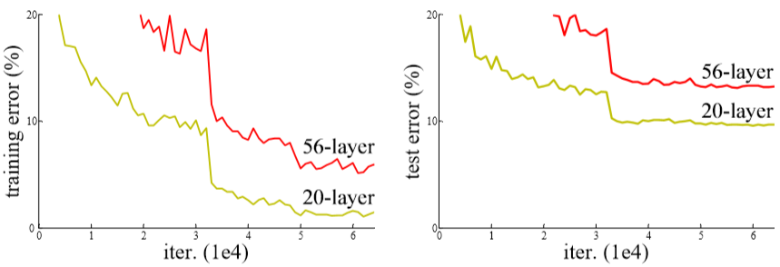
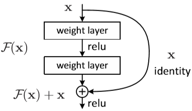

# ResNet

CVPR2016 best paper Deep Residual Learning for Image Recognition

​	层数越深，就有更多学习好的层，但同时也混进来一些学习不好的层

​	resnet 让学习好的层保留下来，同时消除学习不好的层对网络的影响 

​	即权重w变成0，或者说走上边那条shortcut

​	==对一个特别深的深度网络而言，该网络的浅层形式的解空间应该是这个深度网络解空间的子集==

​	如果任何对于特征 $\mathbf{x}$ 的改变**都会让loss变大**的话，$\mathcal{F}(\mathbf{x})$会自动趋向于学习成为**0**， $\mathbf{x}$则从恒等映射的路径**继续传递**
​	**redidual模块会明显减小模块中参数的值从而让网络中的参数对反向传导的损失值有更敏感的响应能力，虽然根本上没有解决回传的损失小得问题，但是却让参数减小，相对而言增加了回传损失的效果，也产生了一定的正则化作用。**

## Abstract

​	Deeper neural networks are more difficult to train. We present a residual learning framework to ease the training of networks that are substantially deeper than those used previously. We explicitly reformulate the layers as learning residual functions with reference to the layer inputs, instead of learning unreferenced functions. We provide comprehensive empirical evidence showing that these residual networks are easier to optimize, and can gain accuracy from considerably increased depth. On the ImageNet dataset we evaluate residual nets with a depth of up to 152 layers—8× deeper than VGG nets [41] but still having lower complexity. An ensemble of these residual nets achieves 3.57% error on the ImageNet test set. This result won the 1st place on the ILSVRC 2015 classification task. We also present analysis on CIFAR-10 with 100 and 1000 layers. 

​	更深的神经网络更难训练。 我们提出了一个残差学习框架，以简化比以前使用的网络更深入的网络训练。 我们显式地将层重新配置为参考层输入学习剩余函数，而不是学习未参考函数。 我们提供了全面的经验证据，表明这些残差网络更易于优化，并且可以通过深度的增加而获得准确性。 在ImageNet数据集上，我们评估深度最大为152层的残差网络-比VGG网络[41]深8倍，但复杂度仍然较低。 这些残留网络的整体在ImageNet测试仪上实现了3.57％的误差。 该结果在ILSVRC 2015分类任务中获得第一名。 我们还将介绍具有100和1000层的CIFAR-10的分析。

​	The depth of representations is of central importance for many visual recognition tasks. Solely due to our extremely deep representations, we obtain a 28% relative improvement on the COCO object detection dataset. Deep residual nets are foundations of our submissions to ILSVRC & COCO 2015 competitions1 , where we also won the 1st places on the tasks of ImageNet detection, ImageNet localization, COCO detection, and COCO segmentation.

​	深度的表示对于许多视觉识别任务至关重要。 仅由于我们的深度表示，我们在COCO对象检测数据集上获得了28％的相对改进。 深度残差网是我们提交ILSVRC和COCO 2015竞赛1的基础，在该竞赛中，我们还获得了ImageNet检测，ImageNet本地化，COCO检测和COCO分割等任务的第一名。

## 1. Introduction

​	Deep convolutional neural networks [22, 21] have led to a series of breakthroughs for image classification [21, 50, 40]. Deep networks naturally **integrate** 整合low/mid/high level features [50] and classifiers in an end-to-end multilayer fashion, and the “levels” of features can be enriched by the number of stacked layers (depth). Recent evidence [41, 44] reveals that network depth is of crucial importance.  

​	深度卷积神经网络[22，21]导致了图像分类的一系列突破[21，50，40]。 深度网络自然地以端到端的多层方式集成了低/中/高级功能[50]和分类器，并且函数的“级别”可以通过堆叠的层数（深度）来丰富。最新证据[41，44]揭示了网络深度至关重要。

​	Driven by the significance of depth, a question arises: Is learning better networks as easy as stacking more layers? An obstacle to answering this question was the notorious problem of **vanishing/exploding gradients** [1, 9], which hamper convergence from the beginning. This problem, however, has been largely addressed by **normalized initialization** [23, 9, 37, 13] and **intermediate normalization layers** [16], which enable networks with tens of layers to start converging for stochastic gradient descent (SGD) with backpropagation [22]. 

​	在深度意义的驱动下，出现了一个问题：学习更好的网络是否像堆叠更多的层一样容易？ 回答这个问题的障碍是臭名昭著的**梯度消失/爆炸**[1，9]，从一开始就阻碍了收敛。但是，此问题已通过归一化初始化[23、9、37、13]和**中间归一化层**[16]得到了很大解决，这使具有数十层的网络能够通过反向传播开始收敛用于随机梯度下降（SGD）[22]。

​	When deeper networks are able to start converging, a **degradation problem** has been exposed: with the network depth increasing, **accuracy gets saturated** (which might be unsurprising) and then degrades rapidly. Unexpectedly, such degradation is not caused by overfitting, and adding more layers to **a suitably deep model leads to higher training error**, as reported in [11, 42] and thoroughly verified by our experiments. Fig. 1 shows a typical example. 

​	当更深层的网络能够开始融合时，就会出现**退化问题**：随着网络深度的增加，**准确度达到饱和**（这可能不足为奇），然后迅速降级。 出乎意料的是，这种降级不是由过度拟合引起的，并且在[11，42]中报告并由我们的实验充分验证了，**将更多层添加到适当深度的模型中会导致更高的训练误差**。 图1显示了一个典型示例。  

**Fig.1** Training error (left) and test error (right) on CIFAR-10 with 20-layer and 56-layer “plain” networks. The deeper network has higher training error, and thus test error. Similar phenomena on ImageNet is presented in Fig. 4.

​	**The degradation (of training accuracy) indicates that not all systems are similarly easy to optimize.** Let us consider a shallower architecture and its deeper counterpart that adds more layers onto it. 	**训练准确性的下降表明并非所有系统都同样容易优化。** 让我们考虑一个更浅的体系结构，以及在它上添加了更多层的更深层次的体系结构。

​	There exists a solution by construction to the deeper model: the added layers are **identity mapping**, and the other layers are copied from the learned shallower model. 

​	通过构建更深层的模型，可以找到一种解决方案：添加的层是**恒等映射**，其他层是从学习到的浅层模型中复制的。 

​	The existence of this constructed solution indicates that a deeper model should produce no higher training error than its shallower counterpart. But experiments show that our current solvers on hand are unable to find solutions that are comparably good or better than the constructed solution (or unable to do so in feasible time). 

​	这种构造的解决方案的存在表明，较深的模型与其较浅的模型相比，不会产生更高的训练误差。但是实验表明，我们现有的求解器无法找到比构造的解决方案好或更好的解决方案（或无法在可行的时间内找到解决方案）。

​	In this paper, we address the degradation problem by introducing a deep residual learning framework. Instead of hoping each few stacked layers directly fit a desired underlying mapping, we explicitly let these layers fit a residual mapping. Formally, denoting the desired underlying mapping as H(x), we let the stacked nonlinear layers fit another mapping of F(x) := H(x)−x. The original mapping is recast into F(x)+x. We hypothesize that it is easier to optimize the residual mapping than to optimize the original, unreferenced mapping. **To the extreme, if an identity mapping were optimal, it would be easier to push the residual to zero than to fit an identity mapping by a stack of nonlinear layers.** 

​	在本文中，我们通过引入深度残差学习框架来解决退化问题。 而不是希望每个堆叠的层都直接拟合所需的基础映射，我们明确让这些**堆叠层**适合残差映射。形式上，将所需的基础映射表示为 $\mathcal{H}(\mathbf{x})$，我们让堆叠的非线性层适合 $\mathcal{F}(\mathbf{x}):= \mathcal{H}(\mathbf{x})-\mathbf{x}$ 的另一个映射。原始映射将重铸为 $\mathcal{F}(\mathbf{x})+\mathbf{x}$。我们假设优化残差映射比优化原始未引用映射要容易。**极端地，如果恒等映射是最佳的，则将残差推到零比通过非线性层的堆栈拟合恒等映射要容易。**

​	The formulation of F(x) +x can be realized by feedforward neural networks with “shortcut connections” (Fig. 2). Shortcut connections [2, 34, 49] are those skipping one or more layers. In our case, the shortcut connections simply perform **identity mapping**, and their outputs are added to the outputs of the stacked layers (Fig. 2). Identity shortcut connections add neither extra parameter nor computational complexity. The entire network can still be trained end-to-end by SGD with backpropagation, and can be easily implemented using common libraries (e.g., Caffe [19]) without modifying the solvers. 

​	$\mathcal{F}(\mathbf{x})+\mathbf{x}$的公式可以通过具有 “shortcut connections” 的前馈神经网络来实现（图2）。 shortcut connections [2、34、49]是跳过一层或多层的连接。 在我们的例子中，shortcut connections 仅执行**恒等映射**，并将它们的输出添加到堆叠层的输出中（图2）。 Identity shortcut connections既不增加额外的参数，也不增加计算复杂度。整个网络仍然可以通过SGD反向传播进行端到端训练，并且可以使用通用库（例如Caffe [19]）轻松实现，而无需修改求解器。

**Fig .2**  残差学习：构建基块。shortcut connections

​	We present comprehensive experiments on ImageNet [36] to show the degradation problem and evaluate our method. We show that: 1) Our extremely deep residual nets are easy to optimize, but the counterpart “plain” nets (that simply stack layers) exhibit higher training error when the depth increases; 2) Our deep residual nets can easily enjoy accuracy gains from greatly increased depth, producing results substantially better than previous networks.  我们在ImageNet [36]上进行了全面的实验，以显示退化问题并评估我们的方法。我们证明：1）我们极深的残差网络很容易优化，但是当深度增加时，对应的“普通”网络（简单地堆叠层）显示出更高的训练误差；  2）我们的深层残差网络可以通过大大增加深度来轻松享受准确性的提高，从而产生比以前的网络更好的结果。

​	Similar phenomena are also shown on the CIFAR-10 set [20], suggesting that the optimization difficulties and the effects of our method are not just akin to a particular dataset. We present successfully trained models on this dataset with over 100 layers, and explore models with over 1000 layers.  在CIFAR-10集上也显示了类似的现象[20]，这表明优化困难和我们方法的效果不仅类似于特定的数据集。 我们在此数据集上展示了经过成功训练的100层以上的模型，并探索了1000层以上的模型。

​	On the ImageNet classification dataset [36], we obtain excellent results by extremely deep residual nets. Our 152- layer residual net is the deepest network ever presented on ImageNet, while still having lower complexity than VGG nets [41]. Our ensemble has 3.57% top-5 error on the ImageNet test set, and won the 1st place in the ILSVRC 2015 classification competition. The extremely deep representations also have excellent generalization performance on other recognition tasks, and lead us to further win the 1st places on: ImageNet detection, ImageNet localization, COCO detection, and COCO segmentation in ILSVRC & COCO 2015 competitions. This strong evidence shows that the residual learning principle is generic, and we expect that it is applicable in other vision and non-vision problems.  在ImageNet分类数据集[36]上，我们通过极深的残差网获得了出色的结果。 我们的152层残差网络是ImageNet上提出的最深的网络，同时其复杂度仍低于VGG网络[41]。我们的合奏在ImageNet测试集上的前5个错误的错误率为3.57％，并在2015年ILSVRC分类比赛中获得第一名。极深的表示形式在其他识别任务上也具有出色的泛化性能，使我们在ILSVRC和COCO 2015竞赛中进一步赢得了第一名：ImageNet检测，ImageNet本地化，COCO检测和COCO分割。 有力的证据表明，残差学习原理是通用的，我们希望它适用于其他视觉和非视觉问题。

---

## 2. Related Work

### Residual Representations. 

​	In image recognition, VLAD [18] is a representation that encodes by the residual vectors with respect to a dictionary, and Fisher Vector [30] can be formulated as a probabilistic version [18] of VLAD. Both of them are powerful shallow representations for image retrieval and classification [4, 48]. For vector quantization, encoding residual vectors [17] is shown to be more effective than encoding original vectors. In low-level vision and computer graphics, for solving Partial Differential Equations (PDEs), the widely used Multigrid method [3] reformulates the system as subproblems at multiple scales, where each subproblem is responsible for the residual solution between a coarser and a finer scale. An alternative to Multigrid is hierarchical basis preconditioning [45, 46], which relies on variables that represent residual vectors between two scales. It has been shown [3,45,46] that these solvers converge much faster than standard solvers that are unaware of the residual nature of the solutions. These methods suggest that a good reformulation or preconditioning can simplify the optimization. 

​	在图像识别中，VLAD [18]是通过相对于字典的残差矢量进行编码的表示形式，Fisher Vector [30]可以表示为VLAD的概率版本[18]。 两者都是用于图像检索和分类的有力的浅层表示[4，48]。 对于矢量量化，编码残差矢量[17]比编码原始矢量更有效。 在低级视觉和计算机图形学中，为了求解偏微分方程（PDE），广泛使用的Multigrid方法[3]将系统重新形成为多个尺度的子问题，其中每个子问题负责更粗糙和更精细之间的剩余解。 规模。  Multigrid的替代方法是分层基础预处理[45，46]，它依赖于表示两个标度之间的残差矢量的变量。 已经证明[3,45,46]，这些求解器的收敛速度比不知道解决方案剩余性质的标准求解器快得多。 这些方法表明，良好的重构或预处理可以简化优化过程。

### Shortcut Connections. 

Practices and theories that lead to shortcut connections[2,34,49] have been studied for a long time. An early practice of training multi-layer perceptrons (MLPs) is to add a linear layer connected from the network input to the output [34, 49]. In [44, 24], a few intermediate layers are directly connected to auxiliary classifiers for addressing vanishing/exploding gradients. The papers of [39, 38, 31, 47] propose methods for centering layer responses, gradients, and propagated errors, implemented by shortcut connections. In [44], an “inception” layer is composed of a shortcut branch and a few deeper branches. Concurrent with our work, “highway networks” [42, 43] present shortcut connections with gating functions [15]. shortcut 	connections[2,34,49]的实践和理论已经研究了很长时间。 训练多层感知器（MLP）的早期实践是添加从网络输入连接到输出的线性层[34，49]。 在[44，24]中，一些中间层直接连接到辅助分类器上，以解决消失/爆炸梯度。[39，38，31，47]的论文提出了一种通过 shortcut connections 实现居中层响应，梯度和传播误差居中的方法。在[44]中，“起始”层由一个快捷分支和一些更深的分支组成。 与我们的工作同时，“高速公路网络” [42、43]提供了具有选通功能[15]的 shortcut connections。 

​	These gates are data-dependent and have parameters, in contrast to our **identity shortcuts** that are parameter-free. When a gated shortcut is “closed” (approaching zero), the layers in highway networks represent non-residual functions. On the contrary, our formulation always learns residual functions; our **identity shortcuts** are never closed, and all information is always passed through, with additional residual functions to be learned. In addition, high way networks have not demonstrated accuracy gains with extremely increased depth (e.g., over 100 layers). 

与我们的不带参数的恒等 shortcuts 相反，这些门取决于数据并具有参数。 当封闭的快捷方式“关闭”（接近零）时，公路网中的图层表示非残留功能。 相反，我们的公式总是学习残差函数。 我们的恒等 shortcuts 永远不会关闭，所有信息始终都会通过传递，并需要学习其他残余功能。 另外，高速公路网络还没有显示出深度大大增加（例如超过100层）的准确性。

---

## 3. Deep Residual Learning

#### 3.1. Residual Learning

​	Let us consider H(x) as an underlying mapping to be fit by a few stacked layers (not necessarily the entire net), with x denoting the inputs to the first of these layers. If one hypothesizes that multiple nonlinear layers can **asymptotically approximate complicated functions**, then it is **equivalent** to hypothesize that they can **asymptotically approximate the residual functions**, i.e., H(x)−x (assuming that the input and output are of the same dimensions). So rather than expect stacked layers to approximate H(x), we explicitly let these layers approximate a residual function F(x) := H(x) − x. The original function thus becomes F(x)+x. Although both forms should be able to asymptotically approximate the desired functions (as hypothesized), the ease of learning might be different. 

​	让我们将 $\mathcal{H}(\mathbf{x})$ 视为由几个堆叠层（不一定是整个网络）拟合的基础映射，其中 $\mathbf{x}$ 表示这些层的第一个输入。 如果假设多个非线性层可以渐近地逼近复杂函数，则等效于假设它们可以渐近地近似残差函数，即$\mathcal{H}(\mathbf{x})-\mathbf{x}$（假设输入和输出的维数相同）。 因此，我们没有让堆叠的层近似为$\mathcal{H}(\mathbf{x})$，而是明确地让这些层近似为残差函数$\mathcal{F}(\mathbf{x}):= \mathcal{H}(\mathbf{x})-\mathbf{x}$。 因此，原始函数变为$\mathcal{F}(\mathbf{x})+\mathbf{x}$。 尽管两种形式都应该能够渐近地逼近所需的函数（如假设的那样），但学习的难易程度可能会有所不同。

​	This reformulation is motivated by the counterintuitive phenomena about the degradation problem(Fig.1,left). As we discussed in the introduction, if the added layers can be constructed as **identity mappings**, a deeper model should have training error no greater than its shallower counterpart. The degradation problem suggests that the solvers might have difficulties in approximating **identity mappings** by multiple nonlinear layers. With the residual learning reformulation, if **identity mappings** are optimal, the solvers may simply drive the weights of the multiple nonlinear layers toward zero to approach **identity mappings**. 

​	关于退化问题的反直觉现象促使了这种重新形成（图1，左）。 正如我们在简介中讨论的那样，如果可以将添加的层构造为**恒等映射**，则较深的模型应具有的训练误差不大于其较浅的模型的训练误差。退化问题表明，求解器可能难以通过多个非线性层拟合**恒等映射**。通过残差学习的重构，如果**恒等映射**是最佳的，则求解器可以简单地将多个非线性层的权重逼近零以逼近**恒等映射**。

​	In real cases,it is unlikely that **identity mappings** are optimal, but our reformulation may help to precondition the problem. If the optimal function is closer to an identity mapping than to a zero mapping, it should be easier for the solver to find the perturbations with reference to an identity mapping, than to learn the function as a new one. We show by experiments(Fig.7) that the learned residual functions in general have small responses, suggesting that **identity mappings** provide reasonable preconditioning. 

​	在实际情况下，**恒等映射**不太可能是最佳的，但是我们的重新制定可能有助于解决问题。如果最优函数比零映射更接近于一个恒等式，那么求解器应该比恒等式更容易找到参考恒等式的扰动，而不是学习一个新的函数。我们通过实验（图7）表明，学习到的残差函数通常具有较小的响应，这表明**恒等映射**提供了合理的预处理。

#### 3.2. Identity Mapping by Shortcuts 

​	We adopt residual learning to every few stacked layers. A building block is shown in Fig. 2. Formally, in this paper we consider a building block defined as: 我们对每几个堆叠的层采用残差学习。 一个构建块如图2所示。在形式上，在本文中，我们考虑一个定义为的构建块：
$$
\mathbf{y}=\mathcal{F}\left(\mathbf{x},\left\{W_{i}\right\}\right)+\mathbf{x} \tag{1}
$$
Here x and y are the input and output vectors of the layers considered. The function F(x,{Wi}) represents the residual mapping to be learned. For the example in Fig. 2 that has two layers, F = W2σ(W1x) in which σ denotes ReLU [29] and the biases are omitted for simplifying notations. The operation F + x is performed by a shortcut connection and element-wise addition. We adopt the second nonlinearity after the addition (i.e., σ(y), see Fig. 2). 

这里的 $\mathbf{x}$ 和 $\mathbf{y}$ 是所考虑的图层的输入和输出矢量。 函数 $\mathcal{F}\left(\mathbf{x},\left\{W_{i}\right\}\right)$ 表示要学习的残差映射。 对于图2中具有两层的示例，$\mathcal{F}=W_{2} \sigma\left(W_{1} \mathbf{x}\right)$，其中 $\sigma$ 表示ReLU，为了简化符号，省略了偏差项。 $\mathcal{F}+\mathbf{x}$ 操作是通过shortcut connection和逐元素加法执行的。 我们采用加法后的第二个非线性度（即$\sigma(y)$，见图2）。

​	The shortcut connections in Eqn.(1) introduce neither extra parameter nor computation complexity. This is not only attractive in practice but also important in our comparisons between plain and residual networks. We can fairly compare plain/residual networks that simultaneously have the same number of parameters, depth, width, and computational cost(except for the negligible element-wise addition). 

​	式（1）中的 shortcut connections 既没有引入额外的参数，也没有引入计算复杂性。 这不仅在实践中具有吸引力，而且在我们比较普通网络和残差网络时也很重要。 我们可以公平地比较同时具有相同数量的参数，深度，宽度和计算成本（除了可以忽略的逐元素加法）的普通/残差网络。

​	The dimensions of x and F must be equal in Eqn.(1). If this is not the case (e.g., when changing the input/output channels), we can perform a linear projection Ws by the shortcut connections to match the dimensions:

​	$\mathbf{x}$和 $\mathcal{F}$ 的尺寸在式（1）中必须相等。 如果不是这种情况（例如，在更改输入/输出通道时），我们可以通过shortcut connections 执行线性投影 $W_s$ 以匹配尺寸：
$$
\mathbf{y}=\mathcal{F}\left(\mathbf{x},\left\{W_{i}\right\}\right)+W_{s} \mathbf{x}\tag{2}
$$
We can also use a square matrix Ws in Eqn.(1). But we will show by experiments that the **identity mapping** is sufficient for addressing the degradation problem and is economical, and thus Ws is only used when matching dimensions. 我们也可以在等式（1）中使用平方矩阵 $W_s$ 。 但是我们将通过实验证明，**恒等映射**足以解决退化问题，并且很经济，因此 $W_s$ 仅在匹配尺寸时使用。

​	The form of the residual function F is flexible. Experiments in this paper involve a function F that has two or three layers (Fig. 5), while more layers are possible. But if F has only a single layer,Eqn.(1)is similar to a linear layer: y = W1x+x,for which we have not observed advantages. 

​	残差函数 $\mathcal{F}$ 的形式是灵活的。 本文中的实验涉及一个具有两层或三层的函数 $\mathcal{F}$ （图5），而更多的层是可能的。 但是，如果 $\mathcal{F}$ 仅具有单层，则等式（1）类似于线性层：$\mathbf{y}=W_{1} \mathbf{x}+\mathbf{x}$，对此我们没有观察到优势。

​	We also note that although the above notations are about fully-connected layers for simplicity, they are applicable to convolutional layers. The function F(x,{Wi}) can represent multiple convolutional layers. The element-wise addition is performed on two feature maps, channel by channel. 

​	我们还注意到，尽管为简化起见，上述符号是关于全连接层的，但它们也适用于卷积层。 函数 $\mathcal{F}\left(\mathbf{x},\left\{W_{i}\right\}\right)$ 可以表示多个卷积层。在两个特征图上逐个通道执行逐元素加法。

#### 3.3.Network Architectures 

​	We have tested various plain/residual nets, and have observed consistent phenomena. To provide instances for discussion, we describe two models for ImageNet as follows. 

​	我们已经测试了各种平原/残差网络，并观察到了一致的现象。为了提供讨论实例，我们描述了ImageNet的两个模型，如下所示。

**Plain Network.** Our plain baselines (Fig. 3, middle) are mainlyinspiredbythephilosophyofVGGnets[41](Fig.3, left). The convolutional layers mostly have 3×3 filters and follow two simple design rules: (i) for the same output feature map size, the layers have the same number of filters; and (ii) if the feature map size is halved, the number of filters is doubled so as to preserve the time complexity per layer. We perform downsampling directly by convolutional layers that have a stride of 2. The network ends with a global average pooling layer and a 1000-way fully-connected layer with softmax. The total number of weighted layers is 34 in Fig. 3 (middle). 我们简单的基线（图3，中间）主要是受VGG nets哲学的启发[41]（图3，左）。 卷积层通常具有3×3的过滤器，并遵循两个简单的设计规则：（i）对于相同的输出要素图大小，这些层具有相同的过滤器数量；  （ii）如果特征图的大小减半，则过滤器的数量将增加一倍，以保持每层的时间复杂度。 我们直接通过步长为2的卷积层执行下采样。网络的结尾是全局平均池化层和带有softmax的1000路全连接层。 在图3中，加重层的总数为34（中）。

​	It is worth noticing that our model has fewer filters and lower complexity than VGG nets[41](Fig.3,left). Our 34 layer baseline has 3.6 billion FLOPs(multiply-adds),which is only 18% of VGG-19 (19.6 billion FLOPs).

**Residual Network.** Based on the above plain network, we insert shortcut connections (Fig. 3, right) which turn the network into its counterpart residual version. The identity shortcuts (Eqn.(1)) can be directly used when the input and output are of the same dimensions (solid line shortcuts in Fig.3). When the dimensions increase(dotted line shortcuts in Fig. 3), we consider two options: (A) The shortcut still performs identity mapping, with extra zero entries padded for increasing dimensions. This option introduces no extra parameter; (B) The projection shortcut in Eqn.(2) is used to match dimensions (done by 1×1 convolutions). For both options, when the shortcuts go across feature maps of two sizes, they are performed with a stride of 2. 

