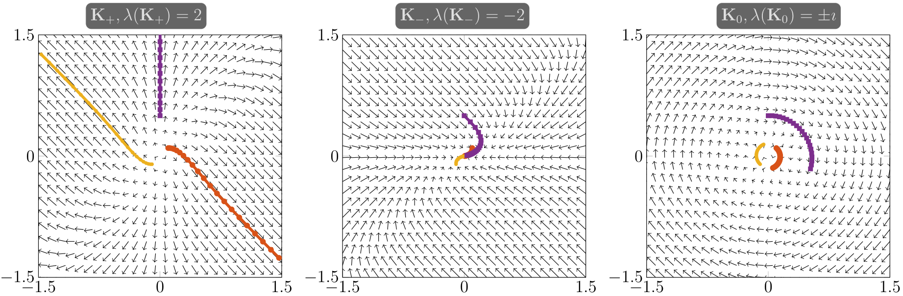

# Stable architectures for deep neural networks

Stable architectures for deep neural networks. Inverse Problems, 2018.

Haber, E. and Ruthotto, L. 

## Abstract

深度神经网络已成为监督机器学习（例如，文本或图像分类）的宝贵工具。 尽管通常提供优于传统技术的结果并成功表达数据中的复杂模式，但众所周知，深层架构在设计和培训方面具有挑战性，因此很难很好地推广到新数据。深度架构的关键问题是**基于导数的学习算法中的数值不稳定性，通常称为爆炸梯度或消失梯度**。 在本文中，我们提出了一种新的正向传播技术，该技术受常微分方程（ODE）系统的启发，该技术克服了这一挑战，并为任意深度的网络带来了适度的学习问题。

我们方法的基础是我们将深度学习解释为**非线性动力学系统的参数估计问题**。 有了这个公式，我们就可以分析深度学习的稳定性和适用性，并利用这种新的理解来开发新的网络架构。我们将爆炸和消失的梯度现象与**离散ODE的稳定性**联系起来，并提出了稳定非常深网络的深度学习的几种策略。尽管我们的新体系结构限制了解决方案的空间，但一些数值实验证明了它们在最新网络中的竞争力。

---

## 1. Introduction

在这项工作中，我们提出了用于深度神经网络（DNN）的新架构，并示例性地展示了它们在解决监督式机器学习（ML）问题方面的有效性； 有关DNN和ML的一般概述，请参见[40，21，1，22]及其参考。 我们考虑以下分类问题：假设我们得到的训练数据由s个特征向量y 1，...，ys∈R n和标签向量c 1，...，cs∈R m组成，它们的第k个分量 表示示例属于类别k的可能性。 目的是学习一种函数，该函数可以近似训练数据上的数据标签关系，并将其很好地概括为相似的未标签数据。 我们在这项工作中的目标是突出学习问题与动态逆问题的关系，进行分析它对于常用架构的稳定性和不适性，并推导出了新的架构，从而减轻了任意深度架构的某些困难。

我们对深度学习特别感兴趣，即使用具有许多隐藏层的神经网络进行机器学习。  DNN在有监督的学习中很成功，尤其是当数据和标签之间的关系是高度非线性的时候。 参见例如[34、30、5、35]和其中的参考。 它们的深度（即，它们的层数）允许DNN表达复杂的数据标签关系，因为每一层都非线性地变换特征，因此有效地过滤了信息内容。

给定训练数据（y 1，c 1），...（y s，c s），则需要解决反问题才能训练给定的网络体系结构。 这个问题（也称为学习问题）旨在找到DNN的参数化，以解释数据标签关系并将其很好地概括为新的未标签数据。 显然，使用更深的网络体系结构会增加网络的容量，还会增加参数估计问题的维度，从而增加计算复杂度。 此外，需要更多的标签数据才能可靠地校准非常深的网络。因此，尽管事实上自70年代初就开始使用神经网络，但深度学习直到最近才使许多应用程序发生了革命性变化，这得益于计算硬件的进步和海量数据集的可用性。

- 给定网络结构和通过某些优化过程获得的参数，正向传播问题是否存在？
- 学习问题是否处于适当的位置？ 换句话说，给定足够的训练，是否存在可以使DNN很好地泛化的参数，或者可以通过添加适当的正则化来改善泛化？

第一个问题很重要，因为尽管即使对于不稳定的前向传播模型也可以拟合训练数据，但训练后的网络不太可能一概而论。 换句话说，例如由于噪声引起的数据中的小偏差可能被前向传播急剧地放大，从而导致不正确的标签。 我们证明正向问题可以看作是常微分方程（ODE）的离散化。 因此，网络的稳定性与其基础ODE的稳定性相对应。 基于此观察，我们为简化的常用残差网络（ResNet）体系结构开发了稳定性标准[27]并开发新的网络架构，以确保其稳定并导致适当的学习问题。

本文的结构如下。 在第2节中，我们对使用ResNet架构说明的深度学习问题进行了简单的数学推导。 在第3节中，我们分析了简化的ResNet正向传播的稳定性以及由此产生的学习问题的适定性。 我们的分析和示例提出了稳定性标准，因此，在第4节中，我们提出了三种新的稳定架构。 在第5节中，我们提出了有利于平滑参数和多层次思想来初始化深层网络的正则化函数。 在第6节中，我们演示了我们的新体系结构在许多小规模模型问题上的有效性，并探讨了它们在解决图像分类问题方面的有效性。 最后，在第7节中，我们对论文进行了总结。

---

## 2. Mathematical Formulation of the Deep Learning Problem

在本节中，我们简要介绍了与我们的工作相关的深度学习的三个主要要素； 有关详细介绍，请参见[40，21，1，22]。 首先，我们概述了正向传播技术，该技术以非线性方式转换输入特征以过滤其信息。其次，我们描述分类，该分类使用输出层（即，前向传播的输出）中的特征预测类标签的概率。 最后，我们提出了学习问题，其目的是估计正向传播和分类的参数，这些参数近似于数据标签关系。

为了符号上的方便，我们将训练特征和行标签堆叠到矩阵中 $ \mathbf{Y}_{0}=\left[\mathbf{y}_{1}, \mathbf{y}_{2}, \ldots, \mathbf{y}_{s}\right]^{\top} \in \mathbb{R}^{s \times n} $  和 $ \mathbf{C}=\left[\mathbf{c}_{1}, \mathbf{c}_{2}, \ldots, \mathbf{c}_{s}\right]^{\top} \in \mathbb{R}^{s \times m} $。共 s 个样本

为了举例说明我们对正向传播的讨论，我们考虑一下残差神经网络（ResNet）模型的简化版本，该模型在使用深度网络体系结构对图像进行分类方面非常成功； 其他选项请参见[22]。 在ResNets中，输入值 $ \mathbf{Y}_{0} \in \mathbb{R}^{s \times n} $ 通过由 $N$ 层组成的网络的正向传播由下式给出： 
$$
\begin{equation}
 \mathbf{Y}_{j+1}=\mathbf{Y}_{j}+h \sigma\left(\mathbf{Y}_{j} \mathbf{K}_{j}+b_{j}\right) \quad \text{for} \quad j=0, \ldots, N-1 
\end{equation}\tag{2.1}
$$
[Eq. 2.1](eq21) 中的传播。由非线性激活函数 $ \sigma: \mathbb{R}^{s \times n} \rightarrow \mathbb{R}^{s \times n} $参数化，并由其权重 $ \mathbf{K}_{0}, \mathbf{K}_{1}, \ldots, \mathbf{K}_{N-1} \in \mathbb{R}^{n \times n} $ 和偏差 $ b_{0}, b_{1}, \ldots, b_{N-1} \in \mathbb{R} $ 表示的仿射变换。我们通过参数 $h> 0$ 来扩充 ResNet 中的原始公式，以增加前向传播的稳定性并允许对该过程进行连续的解释 ; 见 [Sec. 3](#sec3) 。$ \mathbf{Y}_{1}, \ldots, \mathbf{Y}_{N-1} $ 的值也称为隐藏层，$Y_N$ 称为输出层。 激活函数逐个元素地应用，并且通常（逐段）平滑且单调非递减。 作为两个常用示例，我们考虑了双曲正切和整流线性单位（ReLU）激活
$$
\begin{equation}
 \sigma_{\mathrm{ht}}(\mathbf{Y})=\operatorname{tann}(\mathbf{Y}) \quad \operatorname{and} \quad \sigma_{\operatorname{ReLU}}(\mathbf{Y})=\max (0, \mathbf{Y}) 
\end{equation}
$$
使用输出层的值 $Y_N$ ，假设的函数 $ \mathbf{h}\left(\mathbf{Y}_{N} \mathbf{W}+\mathbf{e}_{s} \mu^{\top}\right) $ 及其相关权重 $ \mathbf{W} \in \mathbb{R}^{n \times m} $ 和偏差 $ \mu \in \mathbb{R}^{m} $ 来预测类别标签概率。这里 $ \mathbf{e}_{k} \in \mathbb{R}^{n} $ 表示所有的 $k$ 维向量。 对于伯努利变量（即 $ \mathbf{C} \in\{0,1\}^{s \times m} $），自然会考虑逻辑回归函数
$$
\begin{equation}
 \mathbf{h}(\mathbf{x})=\exp (\mathbf{x}) \cdot /(1+\exp (\mathbf{x})) 
\end{equation}\tag{2.2}
$$
其中指数和除法是按元素进行应用的。 对于多项式分布，我们使用**softmax函数**
$$
\begin{equation}
 \mathbf{h}(\mathbf{X})=\exp (\mathbf{X}) \cdot /\left(\exp (\mathbf{X}) \mathbf{e}_{m}\right) 
\end{equation}\tag{2.3}
$$
学习问题旨在估计**正向传播的参数**（即，$ \mathbf{K}_{0}, \mathbf{K}_{1}, \ldots, \mathbf{K}_{N-1} $ 和 $ b_{0}, b_{1}, \ldots, b_{N-1} $）和**分类器**（$\mathbf{W}$ 和 $\mu$），以便DNN准确地估算训练数据的数据标签关系，并将其概括为新的未标签数据。如下所示，学习问题可以看作是一个**动态逆问题**（ dynamic inverse problem），这为从参数估计到深度学习问题的理论和计算技术的应用提供了新的机会。 我们将学习视为优化问题  
$$
\begin{equation}
 \begin{array}{ll}\min & \frac{1}{s} S\left(\mathbf{h}\left(\mathbf{Y}_{N} \mathbf{W}+\mathbf{e}_{s} \mu^{\top}\right), \mathbf{C}\right)+\alpha R\left(\mathbf{W}, \mu, \mathbf{K}_{0, \ldots, N-1}, b_{0, \ldots, N-1}\right) \\ \text { s.t. } & \mathbf{Y}_{j+1}=\mathbf{Y}_{j}+h \sigma\left(\mathbf{Y}_{j} \mathbf{K}_{j}+b_{j}\right), \quad j=0,1, \ldots, N-1\end{array} 
\end{equation}\tag{2.4}
$$
其中损失函数 $S$ 在其第一个参数中是凸的，并测量预测的类标签概率的质量，凸正则化器 $R$ 惩罚不希望的（例如，高度振荡的 highly oscillatory）参数，并且参数 $α> 0$ 是在最小化数据拟合和规则性之间取得**平衡**的参数。

损失函数的一个简单示例是**平方和差**函数 $ S\left(\mathbf{C}_{\text {pred }}, \mathbf{C}\right)=\frac{1}{2}\left\|\mathbf{C}_{\text {pred }}-\mathbf{C}\right\|_{F}^{2} $。由于我们的数值实验涉及分类，因此我们使用交叉熵损失函数。选择“最佳”正则化函数 $R$ 和正则化参数 $α$ 同样是重要的。 通常，已经使用了Tikhonov 正则化[19，26，48]，也称为权重衰减[23]，尽管已经提出了其他一些稀疏性或其他结构的可能性[41]。在 [Sec. 5](#sec5)中，我们将介绍新颖的正则化函数。为简单起见，我们假设学者选择了一个适当的 $α> 0$ 值，或者假定它是按[12]中的建议动态完成的。

这里有许多解决学习问题的方法。 在这项工作中，我们使用一种简单的块坐标下降（block coordinate descent）法来演示正向传播的特性。我们的方法在更新分类器（$\mathbf{W}$ 和 $\mu$）的参数（固定传播特征 $Y_N$ 的当前值）与更新前向传播的参数（同时保持分类器的更新权重固定）之间交替进行。由于前向传播过程，第一个问题通常是凸的，而后一个问题通常是非凸的。这两个步骤都基于对训练数据进行**二次采样**。

为此，请注意，最常见的损失函数可以写成所有示例的总和，即
$$
\begin{equation}
 \begin{aligned} \frac{1}{s} S\left(\mathbf{h}\left(\mathbf{Y}_{N} \mathbf{W}+\mathbf{e}_{s} \mu^{\top}\right), \mathbf{C}\right) &=\frac{1}{s} \sum_{i=1}^{s} S\left(\mathbf{h}\left(\mathbf{y}_{i}^{\top} \mathbf{W}+\mu^{\top}\right), \mathbf{c}_{i}^{\top}\right) \\ \approx & \frac{1}{|\mathcal{T}|} \sum_{i \in \mathcal{T}} S\left(\mathbf{h}\left(\mathbf{y}_{i}^{\top} \mathbf{W}+\mu^{\top}\right), \mathbf{c}_{i}^{\top}\right) \end{aligned} 
\end{equation}
$$
其中 $ \mathcal{T} \subset\{1,2, \ldots, s\} $ 是在块坐标下降法的每次迭代中更新的**随机选择的集合**。批次的大小是我们算法中的一个参数，其选择取决于问题的大小和复杂性以及资源考虑因素。在下文中，我们假设样本大小是恒定的； 对于样本大小的自适应选择。在块坐标下降方案的每次迭代中，我们的算法都使用 Newton-PCG 方法（即使用预条件共轭梯度（Preconditioned Conjugate Gradient,PCG）方法确定搜索方向的 inexact 不精确的 Newton方法）来近似解决由此产生的分类问题。随后，使用高斯-牛顿-PCG更新前向传播的权重方法。

请注意，梯度和近似Hessian计算要求矩阵向量乘积具有相对于 $ \mathbf{K}_{0, \ldots, N-1} $ 和 $ b_{0, \ldots, N-1} $ 的输出层 $Y_N$ 的值的导数矩阵。具有导数矩阵的矩阵向量乘积可以分别通过前向传播和后向传播而无需显式构造地进行计算。但是，这需要在输出层存储（或重新计算）值；有关导数计算，请参见第4.4节。 因此，正如在[13]中所建议的，我们进一步对$\mathcal{T}$ 进行子采样，以降低PCG方案中Hessian矩阵向量乘积的成本。

我们的实现包括在块坐标下降方法的每次迭代中计算验证误差。 我们算法的最终输出是达到最低验证误差的参数。

---

## 3. Stability and well-posedness of the forward propagation

在本节中，我们分析ResNet正向问题2.1的稳定性，并说明为什么某些变换权重选择可能会产生不稳定性或完全禁止有效学习。

众所周知，任何参数估计问题都需要适当解决的前向问题，即，其输出相对于其输入是**连续**的问题。例如，实际的图像分类算法需要对嘈杂的或稍微偏移的输入图像具有鲁棒性。 前向问题的不适性意味着，即使估计的参数导致较小的训练误差，它们也可能会失败或在干扰数据方面表现不佳。 换句话说，其前向传播不适当地的网络将不能很好地推广。 因此，正向传播的适定性是获得**良好泛化**的DNN的必要条件。

以下讨论还提供了有关深度学习社区中两个著名现象的新观点：消失和爆炸梯度； 参见例如[6]。这些现象是指 方程中目标函数 [Eq. 2.4](eq24) 的梯度。这对非常深的体系结构构成了严峻的挑战。注意，梯度表示输出相对于输入中的扰动的灵敏度。因此，爆炸梯度意味着输出相对于输入是不稳定的。 类似地，消失的梯度意味着输出相对于输入不敏感。显然，这两种情况都禁止有效的培训，但更重要的是，可能无法提供能很好地推广的DNN。

为了理解这种现象，我们考虑方程式 [Eq. 2.1](#eq21)中给出的 ResNets 中正向传播的简化形式。正如在[25]中指出的，前向传播可以看作是非线性常微分方程（ODE）的显式欧拉离散化。

$$
\begin{equation}
 \dot{\mathbf{y}}(t)=\sigma\left(\mathbf{K}^{\top}(t) \mathbf{y}(t)+b(t)\right), \quad \text{with} \quad \mathbf{y}(0)=\mathbf{y}_{0} 
\end{equation}\tag{3.5}
$$
在时间间隔 $t = [0，T]$ 上。最终时间 $T> 0$ 和 $\mathbf{K}^{\top}(t)$ 的振幅控制网络的深度。如果想要ODE 稳定，那么 $\mathbf{K}^{\top}(t)$ 应该变化的足够慢 ：
$$
\begin{equation}
 \max _{i=1,2, \ldots, n} \operatorname{Re}\left(\lambda_{i}(\mathbf{J}(t))\right) \leq 0, \quad \forall t \in[0, T] 
\end{equation}\tag{3.6}
$$
其中 $ \operatorname{Re}(\cdot) $ 表示实部，$ \lambda_{i}(\mathbf{J}(t)) $ 是 [Eq. 3.5](#eq35) 中右侧 Jacobian 的第 $i$ 个特征值。用 $ \mathbf{J}(t) \in \mathbb{R}^{n \times n} $ 表示。在[3]中可以找到使用雅可比运动学奇异值的更准确的陈述。在这里，雅可比式是
$$
\begin{equation}
 \begin{aligned} \mathbf{J}(t) &=\left(\nabla_{\mathbf{y}}\left(\sigma\left(\mathbf{K}(t)^{\top} \mathbf{y}+b(t)\right)\right)\right)^{\top} \\=& \operatorname{diag}\left(\sigma^{\prime}\left(\mathbf{K}(t)^{\top} \mathbf{y}+b(t)\right)\right) \mathbf{K}(t)^{\top}  \end{aligned} 
\end{equation}\tag{3.7}
$$
由于激活函数 $\sigma$ 通常单调非递减，即 $ \sigma^{\prime}(\cdot) \geq 0 $，因此如果想要 [Eq. 3.6](eq36) 成立，则应该满足 $\mathbf{K}$ **足够缓慢地变化**，并且：
$$
\begin{equation}
 \max _{i=1,2, \ldots, n} \operatorname{Re}\left(\lambda_{i}(\mathbf{K}(t))\right) \leq 0, \quad \forall t \in[0, T] 
\end{equation}\tag{3.8}
$$
如 [Sec. 5](#sec5) 所述，可以通过正则化来控制 $\mathbf{K}$ 的平滑度。为确保整体离散前向传播的稳定性，我们还要求 ODE 的离散版本具有足够小的 $h$ ，如以下众所周知的 [Lemma 1](#lemma1) 所示。

### Lemma 1

（前向欧拉法的稳定性）若要求 [Eq. 2.1](#eq21) 中的前向传播稳定，则应满足下式:
$$
\begin{equation}
 \max _{i=1,2, \ldots, n}\left|1+h \lambda_{i}\left(\mathbf{J}_{j}\right)\right| \leq 1, \quad \forall j=0,1, \ldots, N-1 
\end{equation}\tag{3.9}
$$
**Proof 1**

以上讨论表明 [Eq. 3.8](eq38) 等式中连续正向传播的稳定性。及其离散模拟 [Eq. 3.9](eq39) 需要作为约束添加到优化问题 [Eq. 2.4](eq24) 中。否则，可能会获得一些变换权重 $ \mathbf{K}_{0}, \mathbf{K}_{1}, \ldots, \mathbf{K}_{N-1} $，这些权重可能适合训练数据，但会产生不稳定的过程。 如上所述，不能期望这些解决方案能很好地概括其他数据。

我们使用一个简单的示例来说明ResNet中的稳定性问题。

**Example 1**

> 对于 $s = 3$ 和 $n = 2$ ，我们考虑通过ResNet的正向传播，如 [Eq. 2.1](eq21) 所示。我们考虑由 $N = 10$ 个相同的层组成的三个网络，即在每一层上，我们使用激活函数 $ \sigma_{\mathrm{ht}}=\tanh$ , $h=0.1, b=0 $ 和恒定权重矩阵。为了说明权重矩阵的特征值对传播的影响，我们考虑了三个通过参数化的 ResNet。
> $$
> \begin{equation}
>  \mathbf{K}_{+}=\left(\begin{array}{rr}2 & -2 \\ 0 & 2\end{array}\right), \mathbf{K}_{-}=\left(\begin{array}{rr}-2 & 0 \\ 2 & -2\end{array}\right), \mathbf{K}_{0}=\left(\begin{array}{rr}0 & -1 \\ 1 & 0\end{array}\right) 
> \end{equation}\tag{3.10}
> $$
> 其中$ \lambda_{1}\left(\mathbf{K}_{+}\right)=\lambda_{2}\left(\mathbf{K}_{+}\right)=2$ , $\lambda_{1}\left(\mathbf{K}_{-}\right)=\lambda_{2}\left(\mathbf{K}_{-}\right)=-2 $ 并且 $ \lambda_{1}\left(\mathbf{K}_{0}\right)=\imath, \lambda_{2}\left(\mathbf{K}_{0}\right)=-\imath $。 我们考虑特征向量 $ \mathbf{y}_{1}=[0.1,0.1]^{\top}$, $\mathbf{y}_{2}=-\mathbf{y}_{1}$, $\mathbf{y}_{3}=[0,0.5]^{T} $ 。在通过图层传播特征之后，我们在 **Fig. 1** 中说明了不同的传播。我们将隐藏层的值表示为 2D 平面中的彩色线，其中每种颜色都与一个特征向量相关联。 为了突出显示这三种情况下的动力学差异，我们还使用黑色箭头在背景中描绘了力场。 该图通常称为相平面图（phase planed diagram）。
>
> 可以在左子图中看到，特征偏离原点，并且彼此之间使用 $\mathbf{K}_{+}$ 分开。注意，最初彼此靠近的 $y_1$ 和 $y_2$ 向相反的方向偏离。这清楚地表明了不稳定的正向传播，这是无法很好地概括的。与此相反，中间的子图显示 $\mathbf{K}_{-}$ 在原点产生一个累积点。而前向传播满足 [Eq. 3.8](#eq38) 如此稳定，因此需要逆转该过程的学习问题是不适当的。最后，反对称矩阵 $\mathbf{K}_{0}$ 在特征空间中产生旋转，这保留了特征之间的距离，并导致稳定的前向传播和适度的学习问题。
>
> 显然，此处描述的效果在具有更多层和/或更大的h值的更深层网络中更为明显。

**Fig. 1:** ResNets的相平面图，其中 $N = 10$ 个相同的层，由 [Eq. 3.10](#eq310)  中的权重矩阵参数化。从三个不同的输入特征开始。隐藏层的值由彩色线表示，箭头表示力场。左：由于其正奇异值，特征使用 $\mathbf{K}_{+}$ 分散，导致不稳定的前向传播。 中心：$\mathbf{K}_{-}$ 产生收缩，消除了特征上的差异，并使学习问题不适当地出现。右：反对称矩阵 $\mathbf{K}_{0}$ 导致旋转，保留特征之间的距离，并产生良好的正向传播和学习。

而 [Example 1](#example1) 的第一个例子则表明 [Eq. 3.8](#eq38) 是成功学习的必要条件，第二个例子表明这还不够。通常，当大多数情况下 $ \operatorname{Re}(\lambda(\mathbf{K}(t)))<0 $ 且网络很深时（例如长时间积分），初始特征向量中的差异会衰减。换句话说，对于所有初始条件 $ \mathbf{y}_{0} $，我们有 $ \mathbf{y}(t) \rightarrow 0 $ 当 $ t \rightarrow  \infty $； 与 **Fig. 1** 中的中间图进行比较。因此，即使正向问题稳定，逆向问题也很不利，因为它与逆向热方程相当。 在这些情况下，目标函数的梯度在 [Eq. 2.4](eq24) 中将消失，因为内核的微小变化不会对输出值产生明显影响。

如果我们从信号通过神经元的传播中受到启发。对于所有神经元组成 $i$，具有 $ \max _{i} \operatorname{Re}\left(\lambda_{i}(\mathbf{K})\right)>0 $ 的 [Eq. 2.4](eq24) 中的 ResNet 会无上限地放大信号（这不是生物学的）。并且具有 $ \max _{i} \operatorname{Re}\left(\lambda_{i}(\mathbf{K})\right) \ll 0 $ 的 ResNet 可以看作是有损网络。当输入有噪声时，适度有损的网络可能是有利的，因为它会衰减高阶振荡。但是，信号丢失过多显然是有害的，因为它还会消除输入函数中的相关差异。

总而言之，我们对ResNets的讨论表明，在以下情况下，深层网络可以获得稳定的前向传播和良好的学习问题：
$$
\begin{equation}
 \operatorname{Re}\left(\lambda_{i}(\mathbf{K}(t))\right) \approx 0, \quad \forall i=1,2, \ldots, n, t \in[0, T] 
\end{equation}\tag{3.11}
$$
在这种情况下，前向传播只会引起**中等程度的放大或损失**，因此，即使是深层网络也会保留输入数据中的特征并允许有效学习。

---

## 4. Stable Forward Propagation for DNNs

根据上一节的讨论，我们介绍了三种新的正向传播方法，这些方法对于任意深度的神经网络都是稳定的，并会导致适当的学习问题。 我们在第 4.1 节和第 4.2 节中介绍的方法使用不同的方法来强制执行特征值很小的雅可比行列式。 参见 [Eq. 3.11](#eq311)。第 4.2 节中的方法受汉密尔顿系统的启发，我们在第 4.3 节中提出了用于前向传播的跳越和Verlet积分技术。 最后，我们使用反向传播[46]计算Verlet方法的导数，并在 4.4 节中讨论反向传播与较旧且更通用的伴随方法[32]之间的关系。

---

### 4.1. Antisymmetric Weight Matrices

反对称权重矩阵

获得稳定的前向传播的最简单方法也许就是构造其雅可比行列式是非对称的力场。 例如，考虑前向传播
$$
\begin{equation}
 \mathbf{Y}_{j+1}=\mathbf{Y}_{j}+h \sigma\left(\frac{1}{2} \mathbf{Y}_{j}\left(\mathbf{K}_{j}-\mathbf{K}_{j}^{\top}-\gamma \mathbf{I}\right)+b_{j}\right), j=0, \ldots, N-1 
\end{equation}\tag{4.12}
$$
其中 $ \gamma \geq 0 $ 是一个小常数，而 $ \mathbf{I} $ 是一个单位矩阵。 由此产生的前向传播可以看作是ODE的前向Euler离散化
$$
\begin{equation}
 \dot{\mathbf{y}}(t)=\sigma\left(\frac{1}{2}\left(\mathbf{K}(t)-\mathbf{K}(t)^{\top}-\gamma \mathbf{I}\right) \mathbf{y}(t)+b(t)\right), \quad \forall t \in[0, T] . 
\end{equation}
$$
由于 $ \mathbf{K}(t)-\mathbf{K}(t)^{\top} $ 是反对称的，因此其特征值是虚数的，这对于 [Eq. 3.7](#eq37) 中的雅可比行列式也成立。因此，在使用适当的积分技术和足够小的时间步长的情况下，由反对称权重矩阵参数化的连续 ResNet 是稳定的，并且可以保留信息。

为了稳定基于前向欧拉方法的离散前向传播，我们在 [Eq. 4.12](#eq412) 中向系统添加了扩散。扩散量取决于参数 $ \gamma \geq 0 $ 。虽然较小的 $γ$ 值可能会提高特征向量中抗噪声的鲁棒性，但太大的值可能会使学习问题不适当地解决。或者，可以使用更高级的时间积分方法，其中 $γ= 0$，即不增加扩散。

---

### 4.2. Hamiltonian Inspired Neural Networks

---

### 4.3. Symplectic Forward Propagation

---

### 4.4 Derivatives of the Verlet Method

Verlet方法的导数

---

## 5. Regularization

## 6. Numerical Examples

In this section we present numerical examples fo