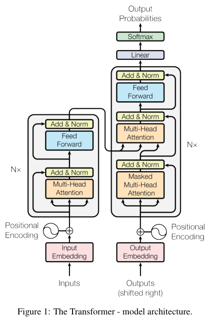
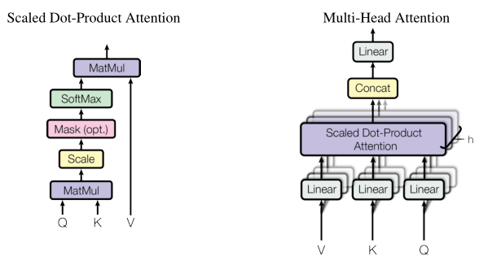

# Attention Is All You Need

## 3. Model Architecture

大多数有竞争力的神经序列转导模型都具有编码器-解码器结构 [5, 2, 35]。在这里，编码器将符号表示的输入序列 $ \left(x_{1}, \ldots, x_{n}\right) $ 映射到连续表示的序列 $ \mathbf{z}=\left(z_{1}, \ldots, z_{n}\right) $ 。 给定 $z$ ，解码器然后生成一个符号的输出序列 $ \left(y_{1}, \ldots, y_{m}\right) $，一次一个元素。 在每一步，模型都是自回归的 [10]，在生成下一个时，将先前生成的符号作为额外的输入使用。

Transformer 遵循这一整体架构，使用堆叠的自注意力和逐点、完全连接的编码器和解码器层，分别如Fig. 1 的左半部分和右半部分所示。

---

### 3.1. Encoder and Decoder Stacks

编码器：编码器由 N = 6 个相同层的堆栈组成。 每层有两个子层。 第一个是多头自注意力机制，第二个是简单的、位置全连接的前馈网络。 我们在两个子层的每一个周围都使用了一个残差连接 [11]，然后是层归一化 [1]。 即每个子层的输出是 LayerNorm(x + Sublayer(x)) ，其中 Sublayer(x) 是子层自己实现的函数。 为了促进这些残差连接，模型中的所有子层以及嵌入层产生维度为 d 模型 = 512 的输出。

解码器：解码器也由 N = 6 个相同层的堆栈组成。 除了每个编码器层中的两个子层之外，解码器还插入了第三个子层，该子层对编码器堆栈的输出执行多头注意。 与编码器类似，我们在每个子层周围使用残差连接，然后进行层归一化。 我们还修改了解码器堆栈中的自注意子层，以防止位置关注后续位置。 这种掩蔽与输出嵌入偏移一个位置的事实相结合，确保位置 i 的预测只能依赖于小于 i 的位置的已知输出

---

### 3.2. Attention

注意力函数可以描述为将一个 query 和一组 key-value 对映射到一个输出，其中 query、keys、values 和 output 都是向量。输出计算为 values 的加权总和，其中分配给每个 value 的权重由 query 与相应 key 的兼容性 compatibility 函数计算。

### 3.2.1. Scaled Dot-Product Attention

我们将我们的特别关注称为“Scaled Dot-Product Attention”（图 2）。 输入由维度 $ d_{k} $ 的 queries 和 keys 以及维度 $d_v$ 的 values 组成。 我们计算 query 和所有 keys 的点积，将每个 keys 除以 $ \sqrt{d_{k}} $，然后应用 softmax 函数来获得值的权重。

在实践中，我们同时计算一组 queries 的注意力函数，将它们打包成一个矩阵 $Q$ 。keys 和 values 也一起打包到矩阵 $K$ 和 $V$ 中。 我们计算输出矩阵为：
$$
\begin{equation}
 \operatorname{Attention}(Q, K, V)=\operatorname{softmax}\left(\frac{Q K^{T}}{\sqrt{d_{k}}}\right) V 
\end{equation}
$$
两个最常用的注意力函数是加性注意力[2]和点积（乘法）注意力。 除了缩放因子 $ \frac{1}{\sqrt{d_{k}}} $ 之外，点积注意力与我们的算法相同。加法注意力使用具有单个隐藏层的前馈网络计算兼容性函数。 虽然两者在理论复杂度上相似，但点积注意力在实践中速度更快，空间效率更高，因为它可以使用高度优化的矩阵乘法代码来实现。

虽然对于较小的 $ d_{k} $ 值，两种机制的表现相似，但加性注意力优于点积注意力，而无需针对较大的 $ d_{k} $ 值进行缩放 [3]。 我们怀疑对于较大的 $ d_{k} $ 值，点积的量级会变大，从而将 softmax 函数推入梯度极小的区域 4 。 为了抵消这种影响，我们将点积缩放 $ \frac{1}{\sqrt{d_{k}}} $ 。

### 3.2.2 Multi-Head Attention

与使用 $ d_{\text {model }} $-维度的 keys、values 和 queries 执行单个注意力函数不同，我们发现将 queries、keys 和 values 分别线性投影到  $ d_{k} $、$d_{k} $  和  $ d_{v} $  维度的不同学习线性投影 $h$ 次是有益的。然后，在 queries、keys 和 values 的这些投影版本中的每一个上，我们并行执行注意力功能，产生 $d_v$ 维输出值。这些被连接并再次投影，从而产生最终值，如图 2 所示。

多头注意力允许模型共同关注来自不同位置的不同表示子空间的信息。 使用单个注意力头，平均会抑制这一点。
$$
\begin{equation}
 \begin{aligned} \operatorname{MultiHead}(Q, K, V) &=\text { Concat }\left(\text { head }_{1}, \ldots, \text { head }_{\mathrm{h}}\right) W^{O} \\ \text { where head }_{\mathrm{i}} &=\operatorname{Attention}\left(Q W_{i}^{Q}, K W_{i}^{K}, V W_{i}^{V}\right) \end{aligned} 
\end{equation}
$$
其中投影是参数矩阵 $ W_{i}^{Q} \in \mathbb{R}^{d_{\text {model }} \times d_{k}}, W_{i}^{K} \in \mathbb{R}^{d_{\text {model }} \times d_{k}}, W_{i}^{V} \in \mathbb{R}^{d_{\text {model }} \times d_{v}} $ 和 $ W^{O} \in \mathbb{R}^{h d_{v} \times d_{\text {model }}} $。

在这项工作中，我们使用了 $h = 8$ 个平行的注意力层或头部。 对于这些中的每一个，我们使用 $ d_{k}=d_{v}=d_{\text {model }} / h=64 $。由于每个头部的维数减少，总的计算成本与全维的单头注意力相似。

### 3.2.3 Applications of Attention in our Model

Transformer 以三种不同的方式使用多头注意力： 

• 在“编码器-解码器注意力”层中，查询来自前一个解码器层，记忆键和值来自编码器的输出。 这允许解码器中的每个位置都参与输入序列中的所有位置。 这模仿了序列到序列模型中典型的编码器-解码器注意机制，例如 [38, 2, 9]。

• 编码器包含自注意层。 在自注意力层中，所有的键、值和查询都来自同一个地方，在这种情况下，是编码器上一层的输出。 编码器中的每个位置都可以参与编码器前一层中的所有位置。

• 类似地，解码器中的自注意力层允许解码器中的每个位置关注解码器中直到并包括该位置的所有位置。 我们需要防止解码器中的左向信息流以保留自回归特性。 我们通过屏蔽（设置为 −∞ ）softmax 输入中与非法连接相对应的所有值来在缩放点积注意力内部实现这一点。 见图 2。

