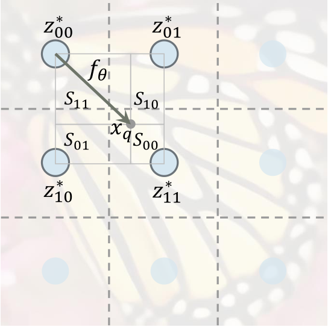
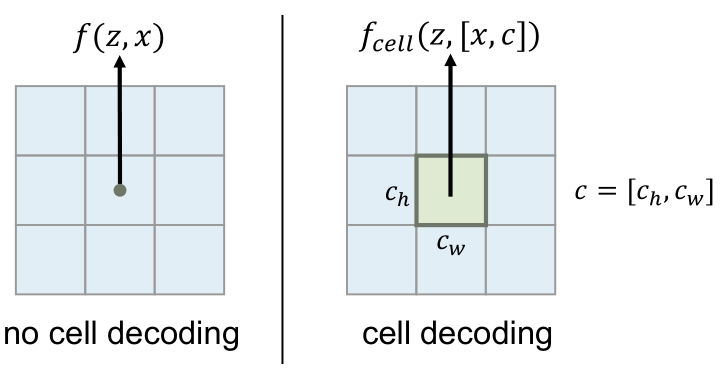
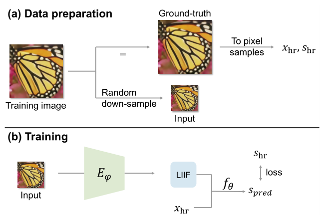

# Learning Continuous Image Representation with Local Implicit Image Function

CVPR 2020 Oral https://yinboc.github.io/liif/

## Abstract

How to represent an image? While the visual world is presented in a continuous manner, machines store and see the images in a discrete way with 2D arrays of pixels. In this paper, we seek to learn a **continuous representation** for images. 如何表示图像？ 在以连续方式呈现视觉世界的同时，机器以 2D 像素矩阵的离散方式存储和查看图像。在本文中，我们试图学习图像的连续表示。

Inspired by the recent progress in 3D reconstruction with **implicit neural representation**, we propose **Local Implicit Image Function** (LIIF), which takes an **image coordinate** and the **2D deep features** around the coordinate as inputs, predicts the **RGB value** at a given coordinate as an output. Since the coordinates are continuous, LIIF can be presented in **arbitrary resolution**. To generate the continuous representation for images, we train an encoder with LIIF representation via a self-supervised task with super-resolution. The learned continuous representation can be presented in arbitrary resolution even extrapolate to ×30 higher resolution, where the training tasks are not provided. 

受到最近以隐式神经表示进行 3D 重建的进展的启发，我们提出了局部隐式图像函数（LIIF），该函数将图像坐标和坐标周围的二维深度特征作为输入，预测给定坐标下的 RGB 值作为输出。由于坐标是连续的，因此可以以任意分辨率呈现 LIIF。为了生成图像的连续表示，我们通过具有超分辨率的自监督任务训练具有 LIIF 表示的编码器。所学习的连续表示可以任意分辨率呈现，甚至可以外推到 30 倍的高分辨率，而无需提供训练任务。

We further show that LIIF representation builds a bridge between discrete and continuous representation in 2D, it naturally supports the learning tasks with size-varied image ground-truths and significantly outperforms the method with resizing the ground-truths. 我们进一步证明，LIIF表示法在2D离散表示法和连续表示法之间架起了一座桥梁，它自然支持大小可变的图像地面实况的学习任务，并且在调整地面实境大小方面明显优于该方法。

---

## 1. Introduction

我们的视觉世界是连续的。 但是，当机器尝试处理场景时，通常需要先将图像存储和表示为2D像素阵列，其中复杂度和精度之间的权衡是由分辨率控制的。 尽管基于像素的表示已成功应用于各种计算机视觉任务中，但它们也受到分辨率的限制。 例如，数据集通常由具有不同分辨率的图像呈现。 如果要训练卷积神经网络，通常需要将图像调整为相同大小，这可能会牺牲保真度。 代替以固定的分辨率表示图像，我们建议研究图像的连续表示。 通过将图像建模为在连续域中定义的函数，我们可以根据需要恢复和生成任意分辨率的图像。

How do we represent an image as a continuous function? 我们如何将图像表示为连续函数？

Our work is inspired by the recent progress in implicit neural representation [34, 27, 6, 38, 18, 41] for 3D shape reconstruction. The key idea of implicit neural representation is to **represent an object** as **a function** that **maps coordinates** to the corresponding **signal** (e.g. **signed distance** to a **3D object surface**, **RGB value** in an image), where the function is parameterized by a deep neural network. 我们的工作受到3D形状重构的隐式神经表示[34，27，6，38，18，41]的最新进展的启发。 隐式神经表示的关键思想是**将对象表示为将坐标映射到相应信号的函数**（例如，到3D对象表面的有符号距离，图像中的RGB值），其中该函数由**深度神经网络进行参数化**。 

To share knowledge across instances instead of fitting individual functions for each object, **encoder-based** methods [27, 6, 41] are proposed to predict latent codes for different objects, then a decoding function is shared by all the objects while it takes the **latent code** as an additional input to the coordinates.   为了在实例之间**共享知识**，而不是为每个对象拟合单独的函数，提出了基于编码器的方法[27、6、41]来预测不同对象的潜在代码，然后所有解码器都将一个解码函数共享给潜在的潜在对象。 代码作为坐标的附加输入。

Despite its success in 3D tasks [38, 39], **previous encoder-based** methods of **implicit neural representation** only succeeded in representing **simple images such as digits** [6], but failed to represent **natural images with high fidelity** [41].  尽管它在3D任务中取得了成功[38，39]，但是以前基于编码器的隐式神经表示方法仅成功地表示了简单的图像，例如数字[6]，但未能表示出具有高保真度的自然图像[41]。

In this paper, we propose the Local Implicit Image Function (**LIIF**) for representing **natural and complex images** in a continuous manner. In LIIF, an image is represented as a set of **latent codes** distributed in **spatial dimensions**. Given a **coordinate**, the decoding function takes the coordinate information and **queries the local latent codes around the coordinate** as inputs, then **predicts the RGB value** at the given coordinate as an output. Since the coordinates are continuous, LIIF can be presented in arbitrary resolution.

在本文中，我们提出了局部隐式图像函数（LIIF），用于以连续方式表示自然图像和复杂图像。 在LIIF中，图像表示为**分布在空间维度上的一组潜在编码**。 给定一个坐标，解码功能将获取坐标信息，并**查询该坐标周围的局部潜码**作为输入，然后**预测给定坐标处的RGB值**作为输出。由于坐标是连续的，因此可以以任意分辨率呈现LIIF。

To generate such continuous representation for pixel-based images, since we hope the generated continuous representation can generalize to higher precision than the in-
put image, we train an encoder with the LIIF representation via a self-supervised task with super-resolution, where the input and ground-truth are provided in continuously
changing up-sampling scales. 为了生成基于像素的图像的这种连续表示，由于我们希望生成的连续表示可以比输入图像泛化到更高的精度，因此我们通过具有超分辨率的自监督任务训练了具有LIIF表示形式的编码器，其中输入和 G.T. 以不断变化的上采样比例提供。 

In this task, take a pixel-based image as an input, the encoded LIIF representation is trained to predict a higher resolution counterpart of the input. While most of the previous works on image super-resolution [10, 23, 24, 22] focus on learning an up-sampling function for specific scales in a convolution-deconvolution
framework, LIIF representation is continuous, and we show it can be presented in arbitrary high resolution, that can even extrapolate to ×30 higher resolution where the training tasks are not provided. 在此任务中，以基于像素的图像作为输入，对编码的LIIF表示进行训练以预测输入的更高分辨率。尽管先前有关图像超分辨率的大多数工作[10，23，24，22]都专注于学习卷积-反卷积框架中特定比例的上采样函数，但LIIF表示是连续的，并且我们证明了它可以任意表示高分辨率，甚至可以推断出不提供训练任务的30倍高分辨率。

We further demonstrate that LIIF builds a bridge between discrete and continuous representation in 2D. In the learning tasks with size-varied image ground-truths, LIIF
can naturally exploit the information provided in different resolutions. Previous methods with fixed-size output usually need to resize all the ground-truths to the same size for training, which may sacrifice fidelity. Since the LIIF representation can be presented in arbitrary resolution, it can be trained in an end-to-end manner without resizing ground truths, which achieves significantly better results than the
method with resizing the ground-truths. Our contributions include: 

(i) A novel method for representing natural and complex images continuously; (ii) LIIF representation allows extrapolation to even ×30 higher resolution which is not presented during training time; (iii) We show LIIF representation is effective for the learning tasks with size-varied image ground-truths.

我们进一步证明了LIIF在2D**离散表示和连续表示之间架起了一座桥梁**。在具有可变大小图像 G.T. 的学习任务中，LIIF可以自然地利用以不同分辨率提供的信息。 以前具有固定大小输出的方法通常需要将所有地面真实大小调整为相同大小以进行训练，这可能会牺牲保真度。 由于LIIF表示可以以任意分辨率呈现，因此可以以端到端的方式进行训练，而无需调整 G.T. 大小，这与调整 G.T. 大小的方法相比，可以获得明显更好的结果。 我们的贡献包括：

（i）一种连续呈现自然和复杂图像的新颖方法；  

（ii）LIIF表示允许外推至30倍的高分辨率，而这在培训期间是不会出现的；  

（iii）我们证明了LIIF表示对于大小可变的图像真实性的学习任务是有效的。

---

## 2. Related Work

### Implicit neural representation. 

In implicit neural representation, an object is usually represented as a multilayer perceptron (MLP) that maps coordinates to signal. This idea has been widely applied in modeling 3D object shapes [6, 28, 2, 13], 3D surfaces of the scene [42, 18, 36, 4]
as well as the appearance of the 3D structure [33, 32, 29]. For example, Mildenhall et al. [29] propose to perform novel view synthesis by learning an implicit representation
for a specific scene using multiple image views. Comparing to explicit 3D representations such as voxel, point cloud, and mesh, the continuous implicit representation can capture the very fine details of the shape with a small number
of parameters. Its differentiable property also allows back propagation through the model for neural rendering [42] .

在隐式神经表示中，对象通常表示为将**坐标映射到信号**的多层感知器（MLP）。这个想法已广泛应用于建模3D对象形状[6、28、2、13]，场景的3D表面[42、18、36、4]以及3D结构的外观[33、32、29  ]。例如，Mildenhall等[29] 提出通过使用多个图像视图学习特定场景的隐式表示来执行新颖的视图合成。 与诸如体素，点云和网格之类的显式3D表示相比，连续的隐式表示可以使用少量参数捕获形状的非常精细的细节。它的可区分属性还允许通过模型进行反向传播以进行神经渲染[42]。

---

### Learning implicit function space. 

Instead of learning an independent implicit neural representation for each object, recent works share a function space for the implicit representations of different objects. Typically, a latent space is defined where each object corresponds to a latent code.
The latent code can be obtained by optimization with an auto-decoder [34, 6]. For example, Park et al. [34] propose to learn a Signed Distance Function (SDF) for each object shape and different SDFs can be inferred by changing the input latent codes. Recent work from Sitzmann et al. [40] also proposes a meta-learning-based method for sharing the function space. Instead of using auto-decoder, our work adopts the auto-encoder architecture [27, 6, 38, 39, 47], which gives an efficient and effective manner for sharing knowledge between a large variety of samples. For example, Mescheder et al. [27] propose to estimate a latent code given an image as input, and use an occupancy function conditioning on this latent code to perform 3D reconstruction
for the input object.

最近的工作没有为每个对象学习独立的隐式神经表示，而是共享用于不同对象的隐式表示的功能空间。 通常，在每个对象对应一个潜在代码的地方定义一个潜在空间。

   可以通过使用自动解码器[34，6]进行优化来获得潜在代码。 例如，Park等。  [34]提出学习每种物体形状的符号距离函数（SDF），通过改变输入的潜在代码可以推断出不同的SDF。  Sitzmann等人的最新工作[40]也提出了一种基于元学习的方法来共享功能空间。 我们的工作没有使用自动解码器，而是采用了自动编码器体系结构[27、6、38、39、47]，该体系结构提供了一种有效且有效的方式来在各种样本之间共享知识。 例如，Mescheder等 [27]提议估计给定图像作为输入的潜在码，并使用对该潜在码的占用函数条件来对输入对象执行3D重构。

Recently, Sitzmann et al. [41] observe that previous implicit neural representation parameterized by MLP with ReLU [31] is incapable of representing fine details of natural images. They replace ReLU with periodic activation functions (sinusoidal) and demonstrates it can model the natural images in higher quality.

尽管隐式神经表示在 3D 任务中取得了成功，但在表示图像方面的应用却相对不足。 早期工作[43，30]使用合成图案生成网络对2D图像进行参数化。Chen等 [6]探索从潜在空间生成2D形状以获得简单的数字。**最近，Sitzmann等[41]观察到，由MLP与ReLU [31]参数化的先前隐式神经表示无法表示自然图像的精细细节。他们用周期性的激活函数（正弦波）代替了ReLU，并证明了它可以以更高的质量对自然图像进行建模。** 但是，这些方法都无法在共享隐函数空间时以高保真度呈现自然和复杂的图像，而如果不**共享隐函数空间**，则推广到更高的精度是有限的。与3D隐式神经表示的最新研究[38、11、7、37、18]相关，LIIF表示基于局部潜码，可以恢复自然图像和复杂图像的精细细节。 最近提出了类似的公式用于3D重建[18]和超分辨物理约束解决方案[19]。 与这些作品不同，LIIF专注于学习连续图像表示并具有特定于图像的设计选择（例如    单元解码）。

### Image generation and super-resolution.

我们的工作与一般的 image-to-image 转换任务[50、17、52、14、8]有关，其中将一张图像作为输入，并将其转换为不同的域或格式。 例如，Isola等[17]提出了有条件的GAN [12]来执行多个图像翻译任务。与基于反卷积的方法不同，LIIF 表示支持通过从生成的隐式表示中独立查询位于不同坐标的像素来执行逼真的和高分辨率图像生成。

虽然LIIF可用于一般用途，但在本文中，我们进行了针对生成具有低分辨率输入的高分辨率图像的实验，这与图像超分辨率任务有关[5，46，44，9，9，23，24，22，51，49]。 例如，赖等[22] 提出了拉普拉斯金字塔网络，以逐步重建图像。 虽然相关，但我们强调，这种学习连续表示的工作与传统的超分辨率设置不同。

以前的大多数超分辨率模型都是为**特定比例**（或一组固定比例）上采样而设计的，而我们的目标是学习可以以任意高分辨率呈现的连续表示形式。在这方面，我们的工作与放大倍率任意超分辨率的MetaSR [15]有关。 他们的方法通过其元网络生成卷积上采样层，尽管它可以在其训练规模上执行任意上采样，但是在推广到训练分布之外的大规模综合方面，其性能有限。 另一方面，LIIF表示在训练从×1到×4的任务时，可以基于一个 forward pass 中的连续表示生成×30的高分辨率图像。

---

## 3. Local Implicit Image Function

**Fig . 2**: LIIF representation with local ensemble. 一张连续图像被表示为2D特征图，解码函数 $f_θ$ 由所有图像共享。该信号通过局部预测的集合来预测，这保证了不同区域之间的平滑过渡。

在 LIIF 表示中，每个连续图像 $ I^{(i)} $ 被表示为 2D 特征图 $ M^{(i)} \in \mathbb{R}^{H \times W \times D} $。 所有图像共享一个解码函数 $f_θ$（以 $θ$ 为参数），将其参数化为 MLP 并采用以下形式：
$$
\begin{equation}
 s=f_{\theta}(z, x) 
\end{equation}\tag{1}
$$
其中 $z$ 是向量，$ x\in \mathcal{X} $ 是连续图像域中的 **2D 坐标**，$s∈S$ 是预测信号（即RGB值）。实际上，我们假设二维的 $x$ 范围为 $[0,2H]$ 和 $[0,2W]$ 。在定义了 $f_θ$ 的情况下，可以将每个矢量 $z$ 视为表示函数 $ f_{\theta}(z, \cdot): \mathcal{X} \mapsto \mathcal{S} $，即将坐标映射到 RGB 值的函数。我们假设 $ M^{(i)} $ 的 $H×W$ 特征向量（即latent codes）均匀分布在 $ I^{(i)} $ 连续图像域的 2D 空间中（**Fig 2**中的蓝色圆圈），然后我们为其分配一个 2D 坐标。对于连续图像 $ I^{(i)} $，坐标 $x_{q}$ 的 RGB 值定义为

$$
\begin{equation}
 I^{(i)}\left(x_{q}\right)=f_{\theta}\left(z^{*}, x_{q}-v^{*}\right) 
\end{equation}\tag{2}
$$
其中 $z^{*}$ 是距离 $x_q$ （在 $ M^{(i)} $ 中）最近的（欧几里得距离）latent code，$v^{*}$ 是图像域中潜在码 $z^{*}$ 的坐标。 以 **Fig. 2** 为例，在我们当前的定义中，$ z_{11}^{*} $ 是 $x_q$ 的 $z^∗$，而 $v^∗$ 被定义为 $ z_{11}^{*} $ 的坐标。

综上所述，在所有图像共有一个函数 $f_θ$ 的情况下，连续图像表示为 2D 特征图 $ M^{(i)} \in \mathbb{R}^{H \times W\times D} $，被视为在 2D 域中均匀分布的 $H×W$ latent code。 $ M^{(i)} $ 中的每个latent code $z$ 表示连续图像的局部片段，它负责预测最接近其自身的一组坐标的信号。

---

**Feature unfolding**

为了丰富 $ M^{(i)} $ 中每个 latent code 中包含的信息，我们将特征展开应用于 $ M^{(i)} $ 并获得 $ \hat{M}^{(i)} $。$ \hat{M}^{(i)} $中的潜在代码是 $ M^{(i)} $ 中 3×3 相邻（8邻域） latent code 的串联。特征展开定义为
$$
\begin{equation}
 \hat{M}_{j k}^{(i)}=\operatorname{Concat}\left(\left\{M_{j+l, k+m}^{(i)}\right\}_{l, m \in\{-1,0,1\}}\right) 
\end{equation}\tag{3}
$$
其中 `Concat` 是指一组向量的串联， $ M^{(i)} $ 由其边界外的零向量填充。 特征展开后，$ \hat{M}^{(i)} $ 替换 $ M^{(i)} $ 进行任何计算。 为简单起见，我们将在以下各节中仅使用符号 $ M^{(i)} $ ，而与特征展开无关。

---

**Local ensemble**

**Eq. 2** 中的一个问题是不连续的预测。具体来说，由于 $x_q$ 处的信号预测是通过查询 $ M^{(i)} $ 中最接近的潜在码 $z^∗$ 来完成的，所以当 $x_q$ 在2D域中移动时， $z^∗$ 的选择可能会**突然从一个切换为另一个**（即，最接近的选择 latent code 更改）；当 $x_q$ 越过 **Fig 2** 中的虚线时，就会发生这种情况。在选择 $z^∗$ 切换的那些坐标周围，将根据不同的潜在代码来预测两个无限接近的坐标的信号。只要学习的函数 $f_θ$ 不完美，在 $z^*$ 选择切换的这些边界处就会出现不连续的模式。为了解决此问题，如 **Fig 2** 所示，我们将 **Eq. 2** 扩展为：
$$
\begin{equation}
 I^{(i)}\left(x_{q}\right)=\sum_{t \in\{00,01,10,11\}} \frac{S_{t}}{S} \cdot f_{\theta}\left(z_{t}^{*}, x_{q}-v_{t}^{*}\right) 
\end{equation}\tag{4}
$$
其中 $ z_{t}^{*}(t \in\{00,01,10,11\}) $ 是左上，右上，左下，右下子空间中最接近的 latent code，$ v_{t}^{*} $ 是 $z_t^*$ 的坐标，$ S_{t} $ 是 $x_q$ 和 $ v_{t^{\prime}}^{*} $ 之间的矩形面积，其中 $t^{\prime}$ 与 $t$ 成对角线（即00到11、10到01）。 权重通过 $ S=\sum_{t} S_{t} $ 归一化。 我们认为特征图 $ M^{(i)} $ 在边界外被镜像填充，因此上面的公式也适用于边界附近的坐标。

直观上，这是让由本地潜码表示的局部片段与其相邻片段重叠，从而在每个坐标上有四个潜码用于独立地预测信号。 然后通过投票以归一化的置信度**合并这四个预测**，归一化的置信度与查询点及其最近的潜在代码的对角线对角线之间的矩形区域成比例，因此，当查询坐标越近时，置信度就越高。 它可在 $z^*$ 切换的坐标处实现连续过渡（如 **Fig. 2** 中的虚线）。

----

**Cell decoding**

**Fig .3:** Cell decoding. 通过单元解码，解码函数将查询像素的形状作为附加输入，并预测该像素的RGB值。

实际上，我们希望 LIIF 表示可以以任意分辨率显示基于像素的形式。假设给出了所需的分辨率，直接的方法是查询连续表示 $ I^{(i)}(x) $ 中像素中心坐标处的 RGB 值。 尽管这已经可以很好地工作了，但是由于查询像素的预测 RGB 值与 size 无关，因此它不是最佳的，它的像素**区域中的信息**（除中心值以外）**都被丢弃**。

为了解决这个问题，我们添加了单元解码，如图3所示。我们将 **Eq. 1** 中的 $f$（省略 $θ$ ）重新格式化为 $f_{cell}$，形式为
$$
\begin{equation}
 s=f_{\text {cell }}(z,[x, c]) 
\end{equation}\tag{5}
$$
其中 $$ c=\left[c_{h}, c_{w}\right] $$ 包含两个值，这些值指定查询像素的高度和宽度，$[x, c]$ 表示 $x$ 和 $c$ 的串联。$f_{\text {cell }}(z,[x, c]) $ 的含义可以解释为：如果我们绘制一个形状为 $c$ 的，以坐标 $x$ 为中心的像素，则RGB值应该是什么。正如我们将在实验中显示的那样，当以给定的分辨率呈现连续表示时，具有额外的输入 $c$ 可能是有益的。

## 4. Learning Continuous Image Representation

**Fig .4:**  Learning to generate continuous representation for pixel-based images. 在自监督的超分辨率任务中，对编码器与LIIF表示进行了联合训练，以鼓励 LIIF 表示在更高的分辨率下保持高保真度。

在本节中，我们介绍学习用于生成**图像的连续表示**的方法，**Fig. 4 **中对此进行了概述。在此任务中，我们有**一组图像作为训练集**，目标是为 unseen 图像**生成连续的图像**。

一般的想法是训练一个编码器 $ E_{\varphi} $（以 $\varphi$ 作为其参数），该编码器将图像映射到 2D 特征图作为其 LIIF 表示，共同**训练所有图像共享的函数** $f_θ$ 。我们希望生成的LIIF表示不仅能够重建其输入，而且更重要的是，作为连续表示，即使以更高的分辨率呈现，它也应保持高保真度。 因此，我们建议在具有超分辨率的自监督任务中训练框架。

我们首先以单个训练图像为例，如 **Fig. 4** 所示，对于训练图像，通过以**随机比例**对训练图像进行**下采样**来生成输入。通过将训练图像表示为像素样本 $x_{hr}$，$s_{hr}$来获得真实性，其中 $x_{hr}$ 是图像域中像素的中心坐标，$s_{hr}$ 是像素的相应RGB值。 编码器 $E_{\varphi}$ 将输入图像映射为 2D 特征图，作为其 LIIF 表示。 然后，将坐标 $x_{hr}$ 用于查询 LIIF 表示，其中 $f_θ$ 基于 LIIF 表示针对这些坐标中的每一个预测信号（RGB值）。 令 $s_{pred}$ 表示预测信号，然后在 $s_{pred}$ 和G.T. $s_{hr}$ 之间计算出训练损失（在我们的实验中为 $L1$ 损失）。 对于批次训练，我们从训练集中采样批次，其中损失是实例的平均值。 进行单元解码时，将 $x$ 替换为 $[x,c]$。

## 5. Experiments

### 5.1. Learning continuous image representation

**Implementation details.**

我们遵循先前的工作[24]，并使用 $48×48$ 的 patches 作为编码器的输入。 令 $B$ 代表批次大小，我们首先以均匀分布 $ \mathcal{U}(1,4) $ 采样 $B$ 个 patches 的随机尺度 $r_{1〜B}$，然后从训练图像中裁剪大小为 $ \left\{48 r_{i} \times 48 r_{i}\right\}_{i=1}^{B} $ 的 $B$ 个块。

$48×48$ 输入是其降采样后的对应输入。对于G.T. 我们将这些图像转换为像素样本（coordinate-RGB pairs），并为每个样本采样 $48^2$个像素样本，以使G.T. 的形状在批次中相同。

我们的方法可以与不同的编码器结合使用。我们使用 EDSR-baseline[24]或RDN [51]（不带上采样模块）作为编码器 $E_{ϕ}$，它们生成**与输入图像 size 相同的特征图**。 解码函数 $f_θ$ 是具有**ReLU** 激活和 256 个隐藏维的5层MLP。我们遵循[24]并使用 $L1$ 损失。

对于训练，我们在 PyTorch[35] 中使用 bicubic 调整大小来执行连续的下采样。为了评估标度$×2，×3，×4$，我们使用 DIV2K 和基准数据集中提供的低分辨率输入（紧随[24]之后的border-shaving）。为了评估比例尺 $×6–×30$，我们首先裁剪 G.T. 以使其形状可被比例尺整除，然后通过双三次降采样生成低分辨率输入。

我们使用初始学习率为 $1\times 10^{-4}$ 的Adam[21] 优化器，针对 batchsize 为16的1000个epoch训练模型，学习速度每200个 epoch 衰减0.5倍。MetaSR 的实验设置与 LIIF 相同，只是用其meta decoder 替换了 LIIF 表示。

