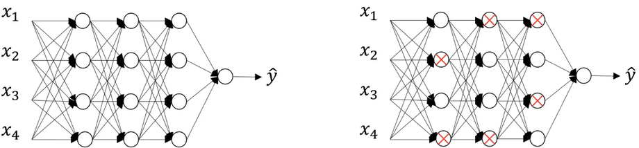
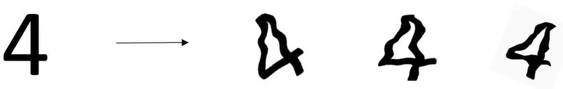
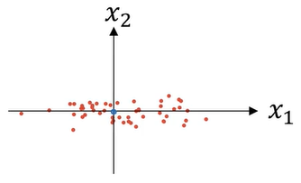
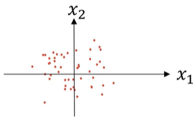
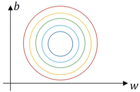

# 深度学习工程师

由 deeplearning.ai 出品，网易引进的正版授权中文版深度学习工程师微专业课程，让你在了解丰富的人工智能应用案例的同时，学会在实践中搭建出最先进的神经网络模型，训练出属于你自己的 AI。


deeplearning.ai

https://www.coursera.org/learn/neural-networks-deep-learning?action=enroll

https://study.163.com/my#/smarts

https://www.bilibili.com/video/av66524657


**note**

https://blog.csdn.net/red_stone1/article/details/78208851

https://www.zhihu.com/column/DeepLearningNotebook

http://www.ai-start.com/dl2017/


**课后作业**

https://blog.csdn.net/u013733326/article/details/79827273

https://www.heywhale.com/mw/project/5e20243e2823a10036b542da


## Question

- [x] 神经网络和深度学习-[3.9](#dz) $dZ^{[2]}$ ????????????????
- [ ] 改善深层神经网络-1.11 权重初始化，有这个概念，但没在各大网络中代码中见过。


## 神经网络和深度学习

### 第一周 深度学习概论

#### 1.1. 欢迎来到深度学习工程微专业

#### 1.2. 什么是神经网络？


输入为房屋面积 , 通过一个神经元（函数运算），然后输出房价 y

ReLU （Rectified Linear Unit，railu） 修正线性单元  修正是指取不小于0的值


中间三个圈为隐藏单元，每个隐藏单元都来自自己学习到的权重，与输入加权求和。


---

#### 1.3. 用神经网络进行监督学习

监督学习的应用

实值估计，在线广告，


机智的选择输入和输出，解决特定问题，并把这部分学习过的组件嵌入到更大型的系统。

普通应用 对应 标准的神经网络NN

图像领域内，卷积神经网络 CNN

对于序列数据，循环神经网络 RNN

更复杂的应用 复杂的混合神经网络架构。


训练数据分为**结构化数据**和**非结构化数据**

结构化数据 	  每个特征都有清晰的定义。

非结构化数据   例如音频，图像，文本


好的网络能够同时适应结构化和非结构化数据


---

#### 1.4. 为什么深度学习会兴起？

普通的模型无法应用海量数据带来的益处，有时也无法处理海量数据，

而给规模足够大（有许多隐藏神经元）的神经网络输入海量数据，会增强performance


一些算法创新可以让神经网络运行效率更高，效果更好，是我们可以训练更大规模的网络。


传统sigmod函数，让负值梯度趋近于零但不是零，学习会变得非常缓慢，因为当梯度接近0时，使用梯度下降法，参数会变化得很慢，学习也变得很慢。

而relu让负值梯度直接为0，直接不学习。加速梯度下降。


很多时候，有了一个新想法，关于神经网络结构的想法，然后写代码实现想法，结果表现神经网络的效果，然后进一步赶紧神经网络结构的细节。


---

#### 1.5. 关于这门课

#### 1.6. 课程资源

coursea -> disscusion 


---

### 第二周 神经网络基础

#### 2.1. 二分分类

m个样本的训练集，遍历这个训练集，

正向过程/传播	forward pass/propagation

反向过程/传播	backward pass/propagation


计算机存储图像，用红绿蓝三个通道的矩阵表示。


在进行网络训练时，通常要unroll或者reshape为一维向量。


（x，y） 来表示一个单独的样本，x是n_x维的特征向量 $x \in \mathbb{R}^{n_x}$，y是标签值为 0 或 1

共有m个样本 ：$(x^{(1)},y^{(1)}) , (x^{(2)},y^{(2)}), \dots, (x^{(m)},y^{(m)})$


也可以用大写 $X$ 表示训练集

![[公式]](assets/equation-1617340213621.svg)


m列表示m个样本，n_x行表示每个样本有n_x条特征，表示为 $X \in \mathbb{R}^{n_x \times m}$ 或者 `X.shape=(n_x,m)`，有时行列相反。

![[公式]](assets/equation-1617340240915.svg)

m列表示m个样本，1行表示每个样本有1个输出标签，表示为 $Y \in \mathbb{R}^{1\times m}$ 或者 `Y.shape=(1,m)`


---

#### 2.2. logistic 回归

给输入 $x$ 希望输出 $\hat{y}$ 判断是不是一副 cat picture。一般  $\hat{y}$ 是一个概率，当输入特征x满足一定的条件时，y就是1。
$$
\hat{y} = P(y=1|x)
$$
输入 $X \in \mathbb{R}^{n_x \times m}$ ，logistic 参数  $w \in \mathbb{R}^{n_x}$  , $b \in \mathbb{R}$ 是一个实数。
$$
\hat{y} = w^Tx+b
$$
可能是一个上述的线性函数，但可能性不大，因为输出概率在0到1之间。

而 logistic 回归给一个 sigmoid 函数
$$
\hat{y} = \sigma (w^Tx+b)
$$


输出为从 0 到 1 的光滑函数 $\sigma (z)$，其中在本例中 $z = w^Tx+b$
$$
\sigma (z) = \frac{1}{1-e^{-z}}
$$
如果 z 特别大，趋近于1；z 特别小，趋近于0。

神经网络学习 w 和 b 两个参数，通常 b 对应一个 intercepter 拦截器


---

#### 2.3. logistic 回归损失函数<span id="logistic"></span>

为了训练 w 和 b 两个参数，需要定义一个 loss function。给定输入$(x^{(1)},y^{(1)}) , (x^{(2)},y^{(2)}), \dots, (x^{(m)},y^{(m)})$ ，我们希望预测到的 $\hat{y}^{(i)} \approx  y^{(i)}$

我们可以定义损失函数，衡量预测值与实际值的差距，用误差平方不利于梯度下降，因为会将问题变成**非凸non-convex函数**（w形状，有多个局部最小值）。
$$
\begin{equation}
 \mathcal{L}(\hat{y}, y)=\frac{1}{2}(\hat{y}-y)^{2} 
\end{equation}
$$
换一种损失函数，**凸convex函数**（v形状，有一个全局最小值）。
$$
\begin{equation}
 \mathcal{L}(\hat{y}, y)=-(y \log \hat{y}+(1-y) \log (1-\hat{y})) 
\end{equation}
$$


如果 y = 1 时， $\mathcal{L}(\hat{y}, y)=- \log \hat{y}$。损失函数越小越好，即 $\log \hat{y}$ 越大越好，这时 $ \hat{y}$ 要接近 y 的值 1

如果 y = 0 时， $ \mathcal{L}(\hat{y}, y)= -\log (1-\hat{y})) $。损失函数越小越好， $\log (1-\hat{y}))$ 越大越好，这时 $ \hat{y}$ 要接近 y 的值 0


loss函数衡量了**单个**训练样本的表现。cost 函数衡量**全体**训练样本的表现。
$$
\begin{split}
 J(w, b)&=\frac{1}{m} \sum_{i=1}^{m} L\left(\hat{y}^{(i)}, y^{(i)}\right)\\&=-\frac{1}{m} \sum_{i=1}^{m}\left[y^{(i)} \log \hat{y}^{(i)}+\left(1-y^{(i)}\right) \log \left(1-\hat{y}^{(i)}\right)\right]
\end{split}
$$
即损失函数的平均值。


---

#### 2.4. 梯度下降法

gradient descent

已知待训练sigmod函数： $ \hat{y}=\sigma\left(w^{T} x+b\right), \sigma(z)=\frac{1}{1+e^{-z}} $

成本函数： 
$$
\begin{split} J(w, b)&=\frac{1}{m} \sum_{i=1}^{m} L\left(\hat{y}^{(i)}, y^{(i)}\right)\\&=-\frac{1}{m} \sum_{i=1}^{m}\left[y^{(i)} \log \hat{y}^{(i)}+\left(1-y^{(i)}\right) \log \left(1-\hat{y}^{(i)}\right)\right]\end{split} 
$$
找到合适的 w 和 b 让成本函数较小。


**J(w,b) 是在水平轴 w 和 b 上的曲面，找到 J(w,b) 最小值对应的参数。**


方法:

用某个随即参数初始化一个点，朝最陡的方向走。

重复执行$ \omega=\omega-\alpha \frac{dJ(\omega)}{d \omega} $，直到算法收敛。其中 $\alpha$ 为学习率，控制每次迭代中梯度下降的步长，$\frac{dJ(\omega)}{d \omega}$ 是参数的更新量或变化量。

```c++
w = w - a * dw; // dw = deltaJ / deltaw;  dw是此点的导数 此点函数的斜率
b = b - a * db; // db = deltaJ / deltab;  pytorch自动求导
```


---

#### 2.5. 导数

derivatives

slope斜率 = 绿色极限三角形的高除以宽 = 0.003/0.001 = 3


a1 = 2 			f(a1) = 6

a2 = 2.001 	f(a2) = 6.003

df = f(a2) - f(a1) / (a2 - a1) = 6.003 - 6 / (2.001 - 2) = 3

这个函数任何地方的斜率都是 3。


---

#### 2.6. 更多导数的例子

也就是复杂函数求导


---

#### 2.7. 计算图

computation graph

神经网络都是按照**前向**或者**反向传播**过程来实现的。

首先计算出神经网络的输出，紧接着进行一个**反向传输操作**。后者用来计算出对应的梯度或者导数。

$J(a,b,c) = 3(a + b * c)$ 是三个变量a,b,c的函数，我们可以设定 `u = b*c`，`v = a + u`，`J = 3*v`，则有下图


通过一个从左向右的过程，可以计算出 $J$ 的值。通过从右向左可以计算出导数。


---

#### 2.8. 计算图中的导数计算

按照上图计算，$J$ 对 $v$ 的导数，$\frac{dJ}{dv} = 3$。a的值改变，v的值就会改变，J的值也会改变。a改变，v改变量取决于 $\frac{dv}{da}$，

链式法则 $\frac{dJ}{da} = \frac{dJ}{dv}  \frac{dv}{da}$，$\frac{dJ}{db} = \frac{dJ}{dv}  \frac{dv}{du} \frac{du}{db}$，$\frac{dJ}{dc} = \frac{dJ}{dv}  \frac{dv}{du} \frac{du}{dc}$


---

#### 2.9. logistic回归中的梯度下降法

$$
z = w^Tx+b
$$

$$
\hat{y} = a =\sigma (z)
$$

$$
\mathcal{L}(\hat{y}, y)=-(y \log a+(1-y) \log (1-a))
$$

a是logistics函数的输出，y是标签真值。

如果有两个特征 $x_1$ 和 $x_2$ 则
$$
z = w_1^Tx_1+w_2^Tx_2 +b
$$
在logistic回归中，我们需要做的是，**变换参数**w和b来最小化损失函数，


其中
$$
\frac{dL}{da} = -\frac{y}{a} + \frac{1-y}{1-a}
$$
其中<span id="dz"></span>
$$
\begin{split}\frac{dL}{dz} &= \frac{dL}{da} \frac{da}{dz}\\&=(-\frac{y}{a} + \frac{1-y}{1-a}) * (a(1-a))\\&=a-y\end{split}
$$
其中目标函数对三个参数的导数如下：
$$
\begin{split}
\frac{dL}{dw_1} &= x_1*\frac{dL}{dz}\\
\frac{dL}{dw_2} &= x_2*\frac{dL}{dz}\\
\frac{dL}{db} &= \frac{dL}{dz}
\end{split}
$$
然后根据下式更新参数。
$$
\begin{split}
w_1 &= w_1 - \alpha \frac{dL}{dw_1}\\
w_2 &= w_2 - \alpha \frac{dL}{dw_2}\\
b &= b - \alpha \frac{dL}{db}
\end{split}
$$

---

#### 2.10. m个样本的梯度下降

上一节均为单一样本的求导与参数更新。实际情况下，训练集会有很多样本。

$$
\begin{split}
 J(w, b)&=\frac{1}{m} \sum_{i=1}^{m} L(\hat{y}^{(i)}, y^{(i)})\\&=-\frac{1}{m} \sum_{i=1}^{m}\left[y^{(i)} \log \hat{y}^{(i)}+(1-y^{(i)}) \log (1-\hat{y}^{(i)})\right]
\end{split}
$$
其中
$$
\hat{y}^{i} = a =\sigma (z^{i})=\sigma (w^Tx^{i}+b)
$$
直接求导
$$
\frac{\partial J(w, b)}{\partial w_1} = \frac{1}{m} \sum_{i=1}^{m}\frac{\partial L(\hat{y}^{(i)}, y^{(i)})}{\partial w_i}
$$
计算每一个样本的梯度值，然后求平均，会得到全局梯度值，可以直接用到梯度下降法。


整个过程相当于一次epoch。每次将所有样本计算过一边后，梯度下降一次，更改参数。重复多次。

**显式的使用循环，会使算法很低效。**因此向量化编程有很大的帮助。


---

#### 2.11. 向量化

消除代码中显式for循环语句的艺术。**不能使用显式for循环**，numpy隐式循环。


 ```python
import numpy as np
import time 

# vectorization version
a = np.randrom.rand(1000000)
b = np.randrom.rand(1000000)

tic = time.time()
c = np.dot(a,b)
toc = time.tiem()

print("Vectorized version:" + str(1000*(toc-tic)) + "ms")

# for loop version
c = 0
tic = time.time()
for i in range(1000000)
	c += a[i]*b[i]
toc = time.time()   
print("For loop version:" + str(1000*(toc-tic)) + "ms")  # 时间比向量化版本长

 ```

CPU 和 GPU 都有并行处理能力 **SIMD 单指令多数据流**


---

#### 2.12. 向量化的更多例子

计算
$$
\begin{split}
u &= Av\\
u_i &= \sum_i\sum_jA_{ij}v_j
\end{split}
$$

```python
u = np.zeros((n, 1))
for i 
	for j
    	u[i] = A[i][j] * v[j]

# 或
u = np.dot(A,v)       
```

计算
$$
u_i = e^{v_i}
$$

```python
u = np.zeros((n, 1))
for i in range(n)
	u[i] = math.exp(v[i])
# 或
u = np.exp(v);
np.log(v);
np.abs(v);
np.maximun(v,0) # v中所有元素和0之间相比的最大值
v**2			#v^2    
1/v     		#v的倒数
```


Logistic 回归求导


``` python
J = 0, dw1 = 0, dw2 = 0, db = 0
for i = 1 to n:
    z[i] = w^T * x[i] + b
    a[i] = sigma(z[i])  #sigma  1 / (1 + e^-x)
    J += -[y[i] * log(yhat[i]) + (1 - y[i]) * log(1 - yhat[i])]
    dz = a[i] * (1 - a[i])   # dz = da/dz
    dw1 = x1[i] * dz[i]
    dw2 = x2[i] * dz[i]
    db += dz[i]
J = J / m
dw1 = dw1 / m
dw2 = dw2 / m
db = db / m
```


---

#### 2.13. 向量化 logistics 回归

```python
z = np.dot(w.t ,x) + b
a = 1 / np.exp(-z)
```

b 是一个实数，python会自动把实数b 扩展成一个` 1*m` 的行向量


---

#### 2.14. 向量化 logistics 回归的梯度输出

```python
dz = a - y;   # dz = dL/dz  不是   da/dz
dw = np.sum(np.dot(x, dz.t)) / m
db = np.sum(dz) / m
```


```python
# 总向量化编程logistics回归
z = np.dot(w.t ,x) + b
a = 1 / np.exp(-z)
dz = a - y;   # dz = dL/dz  不是   da/dz
dw = np.sum(np.dot(x, dz.t)) / m
db = np.sum(dz) / m

w = w - alpha * dw
b = b - alpha * db
```

仍然需要一个大 for 循环，实现每一次梯度更新，即eopch。


---

#### 2.15. Python 中的广播

```python
A = np.array([56 , 0 , 4.4 , 68],
            [1.2, 104, 52, 8],
            [1.8, 135, 99, 0.9])
cal = A.sum(axis = 0) #按列求和  按行求和axis = 1
percentage = 100 * A / cal.reshape(1,4)  #A 3x4         cal 1x4 
#.reshape(1,4) 可以确保矩阵形状是我们想要的

```

广播（broadcasting）即**同型复制**

**general principle**

size ：[m,n] +-*/ [1,n]  把 [1,n] 复制m行变成  [m,n]再和前项运算

size ：[m,n] +-*/ [m,1] 把 [m,1]复制n列变成 [m,n] 再和前项


---

#### 2.16. 关于 python/numpy 向量的说明

```python
# 避免使用秩为 1 的矩阵
import numpy as np

a = np.random.randn(5)

a.shape  #(5, ) 秩为1的数组 
np.dot(a, a.T)   # 算出来是内积 一个数

# 尽量不要使用秩为1的数组 即
a = np.random.randn(5) 
# 改为
a = np.random.randn(5, 1)

a.shape  #(5, 1) 秩不为1的数组 
np.dot(a, a.T)   # 算出来是外积 一个矩阵
```


```python
# 使用断言加以保障 执行很快 
assert(a.shape == (5,1))
```


```python
#确保形状
reshape
```


---

#### 2.17. Jupyter/Ipython笔记本的快速指南

shift + enter 执行代码段

kernel 重启内核

submit assignment 提交任务


---

#### 2.18 logistic 损失函数的[解释](#logistic)

$$
\hat{y} = \sigma (w^Tx+b)
$$

$$
\sigma (z) = \frac{1}{1-e^{-z}}
$$

我们设定
$$
\begin{equation}
 \hat{y}=P(y=1 \mid x) 
\end{equation}
$$
即算法的输出 $\hat{y}$ 是给定训练样本 x 条件下 y 等于 1 的概率。

换句话说，如果 y=1，那么在给定 x 得到 y=1的概率等于 $\hat{y}$ 

反过来说，如果 y=0，那么在给定 x 得到 y=0 的概率等于$1-\hat{y}$

下边有验证。


简单说  $\hat{y}$ 表示 y=1的概率。
$$
\begin{equation}
if \quad y=1: \quad p(y \mid x)=\hat{y} \\
if \quad y=0: \quad p(y \mid x)=1-\hat{y} 
\end{equation}
$$
二分类问题，y的取值只能是0或1。

0-1分布/二项分布/伯努利分布，上述两条公式可以合并成
$$
\begin{equation}
 p(y \mid x)=\hat{y}^{y}(1-\hat{y})^{(1-y)} 
\end{equation}
$$
当 y = 1或 y = 0 代入上式可以得到上上式的结论。


两边同时取**对数**，方便**展开**/**求导/优化**。
$$
\begin{equation}
 \log p\left(\left.y\right|x\right)=\log \hat{y}^{y}(1-\hat{y})^{(1-y)}=y \log \hat{y}+(1-y) \log (1-\hat{y}) 
\end{equation}
$$
概率为1时，log函数为0，概率为0时，log函数为负无穷。


假设所有样本**独立同分布**
$$
\begin{equation}
P= \prod_{i=1}^{m} p\left(y^{(i)} \mid x^{(i)}\right) 
\end{equation}
$$
由于各个样本**独立**，因此求得**全局最优**的条件便是求得**各样本最优**，也即各个样本取得**最优的概率的连乘**


两边同时取**对数**，方便**展开**/**求导/优化**。
$$
\begin{equation}
\log P= \sum_{i=1}^{m} \log p\left(y^{(i)} \mid x^{(i)}\right) 
\end{equation}
$$
最大似然估计，即求出一组参数，这里就是w和b，使这个式子取最大值。

也就是说这个式子最大值，$\hat{y}$ 和 $y$ 越接近，网络越好。


---

### 第三周 浅层神经网络

#### 3.1. 神经网络概览

右上角方括号内表示网络的层数

右上角圆括号表示第几个训练样本

右下角表示特征索引


这是一个简单的两层神经网络的计算过程，第一层得到的概率 $a^{[1]}$ ，又被输入到下一层，再次进行学习，第二层得到的概率为最终输出 $a^{[2]}$，并进一步计算 loss


---

#### 3.2. 神经网络表示

下图为双层神经网络，输入层不算在内。 


左边一层称为输入层，第二层称为隐藏层，第三层只有一个节点，称为输出层。在训练时，隐藏层节点的值，不知道。

$X$ 或 $a^{[0]}$表示输入。第二层为 $a^{[1]}$ 是一个四维向量。输出为 $a^{[2]}$。

隐藏层有两个相关的参数 W 和 b，W 是（4，3）的矩阵，有三个输入，b 是（4，1）的矩阵。

输出层有两个相关的参数 W 和 b，W 是（1，4）的矩阵，有四个隐藏层单元，b 是（1，4）的矩阵。

 

---

#### 3.3. 计算神经网络的输出


这个圆圈代表了回归计算的两个步骤，首先按照步骤计算出z，然后在第二步计算激活函数。神经网络就是不断重复这个过程


**第一隐藏层的第一个**节点先计算
$$
\begin{equation}
 z_{1}^{[1]}=\omega_{1}^{[1]} x+b_{1}^{[1]} 
\end{equation}
$$
再计算
$$
\begin{equation}
 a_{1}^{[1]}=\sigma(z_{1}^{[1]}) 
\end{equation}
$$
上标表示层数，下标表示节点索引（1-4）


**第一隐藏层的第二个**节点先计算
$$
\begin{equation}
 z_{2}^{[1]}=\omega_{2}^{[1]} x+b_{2}^{[1]} 
\end{equation}
$$
再计算
$$
\begin{equation}
 a_{2}^{[1]}=\sigma(z_{2}^{[1]}) 
\end{equation}
$$


如下图


$$
\begin{split}
z_{1}^{[1]}=\omega_{1}^{[1]T} x+b_{1}^{[1]}, a_{1}^{[1]}=\sigma(z_{1}^{[1]}) \\
z_{2}^{[1]}=\omega_{2}^{[1]T} x+b_{2}^{[1]}, a_{2}^{[1]}=\sigma(z_{2}^{[1]}) \\
z_{3}^{[1]}=\omega_{3}^{[1]T} x+b_{3}^{[1]}, a_{3}^{[1]}=\sigma(z_{3}^{[1]}) \\
z_{4}^{[1]}=\omega_{4}^{[1]T} x+b_{4}^{[1]}, a_{4}^{[1]}=\sigma(z_{4}^{[1]}) \\
\end{split}
$$
矩阵化


上述输出为 $z^{[1]}$ 第一层的输出向量

给定输入 x
$$
\begin{split}
z^{[1]}&=W^{[1]} x+b^{[1]} \\
a^{[1]}&=\sigma(z^{[1]}) \\
\end{split}
$$
(4,1) = (4,3) * (3,1) + (4,1)               W 是四个不同的节点，对三个输入的权重

(4,1) = (4,1)
$$
\begin{split}
z^{[2]}&=W^{[2]} a^{[1]}+b^{[2]} \\
a^{[2]}&=\sigma(z^{[2]}) 
\end{split}
$$
(1,1) = (1,4) * (4,1) + (1,1)

(1,1) = (1,1)


---

#### 3.4. 多个例子中的向量化

 样本的循环正向反向，权重是同一套。m个样本


  全部变成矩阵运算。

![[公式]](assets/equation-1617340426834.svg)

![[公式]](assets/equation-1617340433434.svg)

![[公式]](assets/equation-1617340436976.svg)


---

#### 3.5. 向量化实现的解释

 以样本数目直接扩展为矩阵

![[公式]](assets/equation-1617340602054.svg)

![[公式]](assets/equation-1617340606506.svg)

![[公式]](assets/equation-1617340610258.svg)


![[公式]](assets/equation-1617340684960.svg)


---

#### 3.6. 激活函数

tanh 函数比 sigmoid 函数激活非线性效果好一些，因为值介于-1和1之间，激活函数的均值为 0。类似数据中心化的效果。


但是 tanh 一般**不在输出层使用**，因为有时输出为概率，概率在 0 - 1 之间。如果做二分类问题，可以试着用 sigmoid 函数。


tanh 和 sigmoid 在 z 很大或很小时，函数的斜率很接近 0，会拖慢梯度下降。


relu 在 z 为正数时，导数为 1，负数时为 0。


sigmoid 二元分类用，其余不用

tanh 可以替代sigmoid

relu  最常用

leaky relu


Relu 的输入值为负的时候，输出始终为0，其一阶导数也始终为0，这样会导致神经元不能更新参数，也就是神经元不学习了，这种现象叫做“Dead Neuron”。**失活**。为了解决 Relu 函数这个缺点，在 Relu 函数的负半区间引入一个泄露（Leaky）值。


实际选择激活函数可以在交叉验证集上做个小实验。


---

#### 3.7. 为什么需要非线性激活函数？

如果没有激活函数，就只是一个线性组合。


---

#### 3.8. 激活函数的导数

**sigmoid 函数**


$$
g(z)=\frac{1}{1+e^{-z}}
$$
求导
$$
g^{\prime}(z) = \frac{d}{d z} g(z) = g(z)(1-g(z))
$$
z 特别大 g(z) = 1 梯度为0

z 特别小 g(z) = 0 梯度为0

z = 0    g(z) = 0.5  梯度为0.25


**tanh 函数**


$$
g(z) = \frac{e^{z}-e^{-z}}{e^{z}+e^{-z}}
$$
求导
$$
g^{\prime}(z) = \frac{d}{d z} g(z) = 1-g(z)^2
$$
z 特别大 g(z) = 1  梯度为0

z 特别小 g(z) = -1 梯度为0

z = 0       g(z) = 0  梯度为1


**ReLU函数**


$$
g(z) = max(0, z)
$$
求导
$$
g^{\prime}(z)=\left\{\begin{array}{ll}
0 & \text { if } z<0 \\
1 & \text { if } z \geqslant 0
\end{array}\right.
$$


**Leaky ReLU函数**


$$
g(z) = max(0.01z, z)
$$
求导
$$
g^{\prime}(z)=\left\{\begin{array}{ll}
0.01 & \text { if } z<0 \\
1 & \text { if } z \geqslant 0
\end{array}\right.
$$

---

#### 3.9. 神经网络的梯度下降法

待训练参数：$w^{[1]}, b^{[1]}, w^{[2]}, b^{[2]}$，    有隐藏单元： $n^{[0]}, n^{[1]}, n^{[2]}$

矩阵 $w^{[1]}$ 维度为 $(n^{[1]}, n^{[0]})$，$b^{[1]}$ 就是一个 $(n^{[1]},1)$ 维的向量，$w^{[2]}$ 维度为 $(n^{[2]}, n^{[1]})$，$b^{[2]}$ 就是一个 $(n^{[2]},1)$ 维的向量。

cost函数为：
$$
J\left(\omega^{[1]}, b^{(1)}, \omega^{[2]}, b^{[2]}\right)=\frac{1}{m} \sum_{i=1}^{n}\mathcal{L}(\hat{y}, y)
$$
其中 $\hat{y}=a^{[2]}$ 是网络输出。

梯度下降过程：

​	重复：   $d\omega ^{[1]}=\frac{\partial J}{\partial \omega^{[1]}}$，$db^{[1]}=\frac{\partial J}{\partial b^{[1]}}$

​				   $\omega^{[1]}=\omega^{[1]}-\alpha d\omega^{[1]}$，$b^{[1]}=b^{[1]}-\alpha db^{[1]}$，$\omega^{[2]}=\omega^{[2]}-\alpha d\omega^{[2]}$，$b^{[2]}=b^{[2]}-\alpha db^{[2]}$


**正向传播**
$$
\begin{split}
Z^{[1]}&=W^{[1]} x+b^{[1]} \\
A^{[1]}&=g^{[1]}(Z^{[1]}) \\
Z^{[2]}&=W^{[2]} A^{[1]}+b^{[2]} \\
A^{[2]}&=g^{[2]}(Z^{[2]}) 
\end{split}
$$
**反向传播**
$$
\begin{split}
dZ^{[2]} &= A^{[2]} - Y_{truth}\\
dW^{[2]} &= \frac{1}{m}dZ^{[2]}A^{[1]T}\\
db^{[2]} &= \frac{1}{m}np.sum(dZ^{[2]}, axis=1, keepdims=True)\\
dZ^{[1]} &= W^{[2]T}dZ^{[2]} * g^{[1]\prime}(Z^{[1]})\\
dW^{[1]} &= \frac{1}{m}dZ^{[1]}X^{T}\\
db^{[1]} &= \frac{1}{m}np.sum(dZ^{[1]}, axis=1, keepdims=True)\\
\end{split}
$$
第一行推导过程公式见[dZ](#dz) ，这里假设使用sigmoid激活函数，直接转化为最终式子，所以没有 $g^{[2]\prime}$。

第二行直接求导结果为系数，$\frac{1}{m}$ 因为是直接对cost function求导，所以要除以m

第三行 `axis=1` 水平相加求和，`keepdims` 防止 python 输出秩为 1 的数组$(n^{[2]},)    $       $(n^{[2]},1)$

第四行 $g^{[1]\prime}$是隐藏层的激活函数的导数。*为逐个元素相乘，点乘。$W^{[2]T}dZ^{[2]}$ 的size $(n^{[1]},m)$
$$
dZ^{[1]} = \frac{\part \mathcal{L}}{\part Z^{[1]}}=\frac{\part \mathcal{L}}{\part Z^{[2]}}\frac{\part Z^{[2]}}{\part A^{[1]}} \frac{\part A^{[1]}}{\part Z^{[1]}}\\=W^{[2]T}dZ^{[2]} *g^{[1]\prime}(Z^{[1]})
$$
~~为什么是 $dZ^{[2]}$ ???????????????????????????????????????????~~ <span id="dz"></span>

答案的$W^{[2]T}dZ^{[2]}$ 与上边偏导对应的位置刚好相反


第五行 $db^{[1]}$ 的size $(n^{[1]},1)$


**上边的公式解释见下节**


---

#### 3.10. 直观理解反向传播

任意变量与其导数维度相同
$$
\begin{split}
dz^{[2]} &= a^{[2]} - y\\
dW^{[2]} &= \frac{1}{m}dz^{[2]}a^{[1]T}\\
db^{[2]} &= dz^{[2]}\\
dz^{[1]} &= W^{[2]T}dz^{[2]} * g^{[1]\prime}(z^{[1]})\\
dW^{[1]} &= \frac{1}{m}dz^{[1]}x^{T}\\
db^{[1]} &= dz^{[1]}\\
\end{split}
$$
向量化
$$
\begin{split}
dZ^{[2]} &= A^{[2]} - Y_{truth}\\
dW^{[2]} &= \frac{1}{m}dZ^{[2]}A^{[1]T}\\
db^{[2]} &= \frac{1}{m}np.sum(dZ^{[2]}, axis=1, keepdims=True)\\
dZ^{[1]} &= W^{[2]T}dZ^{[2]} * g^{[1]\prime}(Z^{[1]})\\
dW^{[1]} &= \frac{1}{m}dZ^{[1]}X^{T}\\
db^{[1]} &= \frac{1}{m}np.sum(dZ^{[1]}, axis=1, keepdims=True)\\
\end{split}
$$

---

#### 3.11. 随机初始化

权重不能初始化为0。偏置可以初始化为0。若初始化为 0 输入不同的样本，计算过程相同，得到相同的结果和梯度。

神经元对称 symmetric


```python
W1 = np.random.randn((2, 2)) * 0.01 #
b1 = np.zeros((2, 1))

W2 = np.random.randn((1, 2)) * 0.01
b2 = np.zeros((2, 1))
```

w 初始化为很小的数。b 不受影响。

一般初始化为较小的值，如果初始化较大，使用tanh和sigmoid激活函数时，梯度接近 0。

如果没有tanh和sigmoid激活函数时，初始化大小无所谓

如果网络比较深选用0.01外的初始化倍数


---

### 第四周 深层神经网络

#### 4.1 深层神经网络


L 表示神经网络的层数

$n^{[L]}$ 表示L层的隐藏单元的数目

$n^{[1]} = 5$，$n^{[2]} = 5$，$n^{[3]} = 3$，输入层 $n^{[0]} = 3$


----

#### 4.2 深层网络中的前向传播

四层公式如下：
$$
\begin{split}
Z^{[1]}&=W^{[1]} x+b^{[1]} \\
a^{[1]}&=g^{[1]}(Z^{[1]}) \\
Z^{[2]}&=W^{[2]} a^{[1]}+b^{[2]} \\
a^{[2]}&=g^{[2]}(Z^{[2]}) \\
Z^{[3]}&=W^{[3]} a^{[2]}+b^{[3]} \\
a^{[3]}&=g^{[3]}(Z^{[3]}) \\
Z^{[4]}&=W^{[4]} a^{[3]}+b^{[4]} \\
a^{[4]}&=g^{[4]}(Z^{[4]}) \\
\end{split}
$$
通用公式如下：
$$
\begin{split}
Z^{[L]} &= W^{[L]}a^{[L-1]}+b^{[L-1]}\\
a^{[L]} &= g^{[L]}(Z^{[L]}) \\
\end{split}
$$


---

#### 4.3 核对矩阵的维数

检查网络的bug，按照算法流程逐行检查矩阵维度。

归纳演绎法：从特殊到一般；从一个到整体；从一个实数到一组向量；从一组向量到一个矩阵。


**单个样本**的维度变化：

$Z^{[1]}=W^{[1]} A^{[0]}+b^{[1]}$ ，$n^{[1]} = 3$，W的size为 （3，2）； $A^{[0]}=X$的size为（2，1）；b的size为（3，1）；Z的size为（3，1）

$A^{[1]} = g^{[1]}(Z^{[1]})$，Z的size为 （3，1）； A的size为（3，1）


$Z^{[2]}=W^{[2]} A^{[1]}+b^{[2]}$ ，$n^{[1]} = 3$，W的size为 （5，3）； X的size为（3，1）；b的size为（3，1）；Z的size为（5，1）

$A^{[2]} = g^{[2]}(Z^{[2]})$，Z的size为 （5，1）； A的size为（5，1）


$Z^{[3]}=W^{[3]} A^{[2]}+b^{[3]}$ ，$n^{[1]} = 3$，W的size为 （4，5）； X的size为（5，1）；b的size为（4，1）；Z的size为（4，1）

$A^{[3]} = g^{[3]}(Z^{[3]})$，Z的size为 （4，1）； A的size为（4，1）


$Z^{[4]}=W^{[4]} A^{[3]}+b^{[4]}$ ，$n^{[1]} = 3$，W的size为 （2，4）； X的size为（4，1）；b的size为（2，1）；Z的size为（2，1）

$A^{[4]} = g^{[4]}(Z^{[4]})$，Z的size为 （2，1）； A的size为（2，1）


$Z^{[5]}=W^{[5]} A^{[4]}+b^{[5]}$ ，$n^{[1]} = 3$，W的size为 （1，2）； X的size为（2，1）；b的size为（1，1）；Z的size为（1，1）

$A^{[5]} = g^{[5]}(Z^{[5]})$，Z的size为 （1，1）； A的size为（1，1）


**使用下边两个公式检查**

W/dW的size为（$n^{[L]},n^{[L-1]}$），b/db的size为（$n^{[L]},1$）

z/dz的size为（$n^{[L]},1$），x/dx的size为（$n^{[L]},1$）


---


**多m个样本**的维度变化，即经过向量化后：

$Z^{[1]}=W^{[1]} A^{[0]}+b^{[1]}$ ，$n^{[1]} = 3$，W的size为 （3，2）； $A^{[0]}=X$的size为（2，m）；b的size为（3，m）；Z的size为（3，m）

$A^{[1]} = g^{[1]}(Z^{[1]})$，Z的size为 （3，m）； A的size为（3，m）


$Z^{[2]}=W^{[2]} A^{[1]}+b^{[2]}$ ，$n^{[1]} = 3$，W的size为 （5，3）； X的size为（3，m）；b的size为（3，m）；Z的size为（5，m）

$A^{[2]} = g^{[2]}(Z^{[2]})$，Z的size为 （5，m）； A的size为（5，m）


$Z^{[3]}=W^{[3]} A^{[2]}+b^{[3]}$ ，$n^{[1]} = 3$，W的size为 （4，5）； X的size为（5，m）；b的size为（4，m）；Z的size为（4，m）

$A^{[3]} = g^{[3]}(Z^{[3]})$，Z的size为 （4，m）； A的size为（4，m）


$Z^{[4]}=W^{[4]} A^{[3]}+b^{[4]}$ ，$n^{[1]} = 3$，W的size为 （2，4）； X的size为（4，m）；b的size为（2，m）；Z的size为（2，m）

$A^{[4]} = g^{[4]}(Z^{[4]})$，Z的size为 （2，m）； A的size为（2，m）


$Z^{[5]}=W^{[5]} A^{[4]}+b^{[5]}$ ，$n^{[1]} = 3$，W的size为 （1，2）； X的size为（2，m）；b的size为（1，m）；Z的size为（1，m）

$A^{[5]} = g^{[5]}(Z^{[5]})$，Z的size为 （1，m）； A的size为（1，m）


**使用下边两个公式检查**

W/dW的size为（$n^{[L]},n^{[L-1]}$），b/db的size为（$n^{[L]},m$），其中b使用python广播机制，每列相等

Z/dZ的size为（$n^{[L]},m$），X/dX的size为（$n^{[L]},m$）


---

#### 4.4 为什么使用深层表示


网络第一层，当成一个边缘检测器/特征检测器。隐藏单元就是下边的20ge小方块，第一个小方块会找垂直方向的边缘线，第19个会找水平方向的边缘线。找输入照片的各个边缘。

第二层，把被检测到的边缘组合成面部的不同部分。比如：一个神经元会去找眼睛的部分，另一个神经元会去找鼻子的部分 。然后把这许多的边缘结合在一起，就可以开始检测人脸的不同部分。

第三层，把这些部分放在一起，就可以识别或检测不同的人脸。


**语音识别实例：**

第一层，探测比较低层次的音频波形的一些特征（低频、高频、音调）

第二层，然后把特征组合成一个单元，去探测声音的基本单元（音位）

第三层，组合音位，识别单词

第四层，组合单词，识别词组/语句


**解释**

前几层，学习低层次的简单特征，可以理解为探测简单的函数，比如边缘。后几层，把简单的特征结合在一起，就能学习更多复杂的函数。


**circuit theory 电路理论**

浅层网络需要指数级的隐藏单元才能像一些函数 与或非门一样计算。


可以先用浅层做实验，然后逐步加深。


---

#### 4.5 搭建深层神经网络块


第一行是正向传播

第二行是反向传播 （需要缓存正向传播过程中 z 的值来计算梯度）


根据反向传播过程中每层计算出的梯度，更新参数


---

#### 4.6 前向和反向传播

**正向传播**

输入 $a^{[L-1]}$

输出 $a^{[L]}$，缓存 $cache(z^{[L]})$

循环：
$$
\begin{split}
Z^{[L]}&=W^{[L]} A^{[L-1]}+b^{[L]} \\
a^{[L]}&=g^{[L]}(Z^{[L]}) 
\end{split}
$$


**反向传播**

输入 $da^{[L]}$

提取缓存 $cache(z^{[L]})$

输出 $da^{[L-1]}，dW^{[L-1]}，db^{[L-1]}$       

循环：
$$
\begin{split}
dz^{[L]}&=da^{[L]} * g^{[L]\prime}(z^{[L]}) \\
dW^{[L]}&=dz^{[L]}a^{[L-1]T	} \\
db^{[L]}&=dz^{[L]} \\
da^{[L-1]}&=W^{[L]T}dz^{[L]}\\
dz^{[L]}&=W^{[L+1]T}dz^{[L+1]} * g^{[L]\prime}(z^{[L]}) \\
\end{split}
$$
这里的导数是损失函数 L 对参数求导，第五行是dz的另一种表示，*表示逐点相乘。
$$
\begin{split}
dZ^{[L]}&=dA^{[L]} * g^{[L]\prime}(Z^{[L]}) \\
dW^{[L]}&=\frac{1}{m}dZ^{[L]}A^{[L-1]T	} \\
db^{[L]}&=\frac{1}{m}np.sum(dZ^{[L]},axis=1,keepdims=True) \\
dA^{[L-1]}&=W^{[L]T}dz^{[L]}
\end{split}
$$
上式为**向量化**后，其中 $dA^{[L]}$ 是矩阵


---

#### 4.7 参数 VS 超参数

参数：$W^{[1]},b^{[1]},W^{[2]},b^{[2]},W^{[3]},b^{[3]},\dots$

超参数： 学习率$\alpha$，迭代次数，隐藏层数$L$，隐藏单元$n^{[1]},n^{[2]},\dots$，激活函数

​              momentum，mini batch_size，正则化参数

**超参数确定控制了参数的值**。

必须通过训练/交叉验证，试试各种参数。看那个loss下降又小又快


----

#### 4.8 这和大脑有什么关系？


---

### 第五周 人工智能行业大师访谈

#### 5.1. 吴恩达采访 Geoffrey Hinton

Geoffrey Hinton             			 推动反向传播/波尔兹曼机

Yann LeCun（Hinton的学生） 	

Yoshua Bengio							推动RNN


AlexNet

全息图 hologram

Relu 等同于许多 logistics 单元 

变分法


建模型：先记录测量， 对其应用非线性变化，直到状态向量变成表达式。这项活动变得线性。

不能假设线性，应该找一个从观察转换到**潜在变量**（有因果能力）的转换，线性操作。比如**潜在变量**的矩阵乘积，就是如此。


---

#### 5.2. 吴恩达采访 Pieter Abbeel

深度强化学习

概率图模型


---

#### 5.3. 吴恩达采访 Ian Goodfellow

 GAN


---

## 改善深层神经网络：超参数调试、正则化以及优化

### 第一周 深度学习的实用层面

---

#### 1.1 训练 / 开发 / 测试集

层数、隐藏单元、学习率、激活函数

这些参数都是需要大迭代更新学习的。


一组数据 = 训练集+ 验证集\交叉验证集 + 测试集    普通量级 70 + 0 + 30     60 + 20 +20  数据量级越大 后两者占比越小 百万级别 98 + 1 + 1


**训练集** 加入训练

作用：估计模型，用于训练模型以及确定模型权重

学习样本数据集，通过匹配一些参数来建立一个分类器。建立一种分类的方式，主要是用来训练模型的。

**验证集** 加入训练

作用：确定网络结构或者控制模型复杂程度的参数，

对学习出来的模型，调整分类器的参数，如在神经网络中选择隐藏单元数。验证集还用来确定网络结构或者控制模型复杂程度的参数。

**测试集 ** 不加入训练

作用：检验最终选择最优的模型的性能如何，泛化能力

主要是测试训练好的模型的分辨能力（识别率等）


**不要**在训练集和测试集**分布不同**的情况下训练网络，要确保训练集和测试集使用**同一分布**

**测试集**的目的是让最终所选定的神经网络系统做出**无偏估计**。如果不需要做无偏估计，就不需要测试集。（但比较bug的一点是，这时的验证集又可以被看做是测试集）


---

#### 1.2 偏差 / 方差


高偏差 欠拟合

高方差 过拟合


如果人的误差为 0%

| 训练集误差 |   1%   |  15%   |      15%      |     0.5%      |
| :--------: | :----: | :----: | :-----------: | :-----------: |
| 验证集误差 |  11%   |  16%   |      30%      |      1%       |
|            | 高方差 | 高偏差 | 高偏差+高方差 | 低偏差+低方差 |


太线性 高偏差

太非线性 高方差


方差度量随机变量和其数学期望（即均值）之间的偏离程度

方差越大，数据的波动越大，数据分布比较分散

方差越小，数据的波动越小，数据分布比较集中


---

#### 1.3 机器学习基础

检查偏差，评估训练集性能，如果偏差高（训练集误差大），甚至无法拟合训练集，需要更换一个新的网络（更多层，更多隐藏单元，加大训练时间）

 一旦偏差降到可接受范围，就需要检查方差，评估验证集性能，如果方差高（验证集误差大），正则化/更换网络架构/需要采用更多的数据来训练。

直到找到一个低偏差、低方差的网络。

bias variance trade off 权衡


---

#### 1.4 正则化

如果网络过拟合，即存在高方差的问题。**正则化**可以处理！ 

**L1范数**

向量参数 w 的 L1 范数如下: 
$$
\begin{equation}
\|w\|_{1} =\sum_{i=1}^{n_{y}}|w|
\end{equation}
$$
如果用L1正则化，w最终会是稀疏的。

**L2范数**

向量参数 w 的 L2 范数，用到了欧几里得法线
$$
\begin{equation}\|\omega\|_{2}^{2}=\sum_{j=1}^{n_{x}} \omega_{j}^{2}=\omega^{\top} \omega\end{equation}
$$
如果用L2正则化，w的值会比较小，避免过拟合

**实例**

普通的 logistics 回归任务 $\min _{w, b} J(w, b)$
$$
\begin{equation}J(\omega, b)=\frac{1}{m} \sum_{i=1}^{m} \mathcal{L}\left(\hat{y}^{(i)}, y^{(i)}\right)+\frac{\lambda}{2 m}\|\omega\|_{2}^{2}\end{equation}
$$
其中 w 和 b 是logistics 的两个参数，$w\in \mathbb{R^{nx}}$， $b\in\mathbb{R}$ 

不加 b 的L2范数是因为，w 通常为高维，可以独立表达高偏差问题，b 对模型影响不大，加上也可以。其中 $\lambda$ 是一个需要调整的超参数
$$
J\left(\omega^{[1)}, b^{[1]}, \ldots, \omega^{[L]}, b^{[L]}\right)=\sum_{i=1}^{m} L\left(\hat{y}^{(i)} ,y^{(i)}\right)+\frac{\lambda}{2 m} \sum_{l=1}^{L}\left\|\omega^{[l] }\right\|^{2}_{F}
$$
其中
$$
\| \omega^{[l]}||^{2}=\sum_{i=1}^{n^{[l-1]}} \sum_{j=1}^{n^{[l]}}\left(\omega_{i j}^{[l]}\right)^{2}_{F}
$$
矩阵范式，被定义为矩阵中所有元素的平方求和，其中 w 的 size 为 $(n^{[l]},n^{[l-1]})$ 

被称为 frobenius 范数/F范数    弗罗贝尼乌斯


参数更新公式为
$$
\begin{split}
w^{[l]}&=w^{[l]}-\alpha(backward)
\end{split}
$$


如果加上这个正则项，就相当于对梯度 $dW^{[l]}$ 加上了 $\frac{\lambda}{m}w^{[l]}$
$$
\begin{split}
w^{[l]}&=w^{[l]}-\alpha\left[backward+\frac{\lambda}{m} w^{[l]}\right]\\
&=w^{[l]}-\frac{\alpha\lambda}{m}w^{[l]}-\alpha(backward)
\end{split}
$$
w 的系数是 $(1-\frac{\alpha\lambda}{m})$   **权重衰减**，不论w是什么值，都打算让他变得更小


---

#### 1.5 为什么正则化可以减少过拟合？

$$
J\left(\omega^{[1)}, b^{[1]}, \ldots, \omega^{[L]}, b^{[L]}\right)=\sum_{i=1}^{m} L\left(\hat{y}^{(i)} ,y^{(i)}\right)+\frac{\lambda}{2 m} \sum_{l=1}^{L}\left\|\omega^{[l] }\right\|^{2}_{F}
$$

如果将 $\lambda$ 设置足够大，则 w 足够小，许多隐藏单元减少产生的影响，即减少非线性。（考虑极端，如果其他隐藏单元都不产生影响，只有一个有影响，那就是变成线性回归了）


---

#### 1.6 Dropout 正则化

随机失活，设定节点保留和消除的概率




**inverted dropout 反向随机失活**

根据阈值，生成一个 bool 类型矩阵，与参数 w 矩阵相乘，得到随机失活后的参数矩阵 w。 

```python
d = np.random.rand(a.shape[0], a.shape[1]) < keep_prob
a = np.multiply(a, d)
a = a / keep_prob
```

下一层的计算如下
$$
z = w * a + b
$$
假设`keep_prob = 0.8` ，那么有 20% 的数变成了 0，`a` 的期望变成了原来的 80%， `z` 的期望也变成了原来的80%。

为了不影响 `z` 的期望值，需要给 `a` 除以 0.8 ，修正弥补。


**训练测试**

不同的训练样本，失活的隐藏单元也不同。每次训练数据的梯度不同，则随机对不同隐藏单元归零。每个 epoch 将不同的隐藏单元归零。  

**测试阶段不使用 dropout 函数。也不用除以 `keep_prob`**


---

#### 1.7 理解 Dropout

使用正则化就像是采用一个较小的神经网络。

不愿意吧权重全部放在其中一个特征（输入），因为有可能失活被删除。

实施dropout会减小权重，类似L2正则，预防过拟合。但L2对不同参数的衰减程度不同，

可以针对不同层设置不同的 `keep_prob`


除非算法过拟合（数据不够），否则一般不用dropout

dropout 缺点是损失函数不确定了 。

先关闭 drop 确定损失函数单调递减之后再打开 dropout


---

#### 1.8 其他正则化方法

**数据增强**

扩增数据，即加大数据量


水平**翻转**图片，训练集可以大一倍。还处于同一分布。

或**裁剪**图片，但要确保猫还在图片中。




特殊的数据还可以随意轻微的**旋转**或**扭曲**。


**early stopping**

绘制训练误差和验证误差。验证集误差通常是先变小后变大。在最小值就可以提前停止训练了。

训练神经网络之前，w 很小，在迭代过程中 w 会越来越大。


但是提前停止训练，不能独立的处理代价函数 J 和验证集误差。了解即可，不建议用。

**解决办法就是给J加上正则化项，并不使用early stopping**，这会使超参数搜索空间更容易分解，更容易搜索。缺点就是需要调整正则化参数 $\lambda$


---

#### 1.9 正则化输入

归一化输入 normalizing 


**第一步 零均值化**


$$
\begin{equation}
  \mu=\frac{1}{m} \sum_{i=1}^{m} x^{(i)} \\
 x = x -\mu
\end{equation}
$$
相当于移动数据集。


**第二步 归一化方差**


$$
\begin{equation}
 \sigma^{2}=\frac{1}{m} \sum_{i=1}^{M} x^{(i)} * * 2 \\
 x = x / \sigma
\end{equation}
$$
`**2` 表示每个元素都平方 element-wise

$\sigma^2$ 是一个向量，它的每个特征都有方差，因为均值已经为 0，所以 x 的平方直接就是方差。


**注意**

也应该用**从训练集计算得到的参数**处理**测试集**。


比较狭长。梯度下降可能拐来拐去，才能到最优值。




比较均匀。梯度下降法直接指向最小值，能用较大步长。


---

#### 1.10 梯度消失与梯度爆炸


参数比1大，随层数 L 指数增长。参数比1小，随层数 L 指数递减


---

####  1.11 神经网络的权重初始化


其中有n个特征
$$
\begin{equation}
 z=\omega_{1} x_{1}+\omega_{2} x_{2}+\cdots \cdot + \omega_{n} x_{n} 
\end{equation}
$$
因为 z 是求和，所以 n 越大，z 越大

合理的方法是设置
$$
W=\frac{1}{n}W
$$
即令其**方差**为 $\frac{1}{n}$，即上一层的特征数量的平方根

```python
w[l] = np.random.randn(n[l],n[l-1]) * np.sqrt(1/n[l-1]) 
```

如果是 `ReLu` 函数，令其**方差**为 $\frac{2}{n}$，

```python
w[l] = np.random.randn(n[l],n[l-1])  * np.sqrt(2/n[l-1]) 
```

如果是 `Tanh` 函数，令其**方差**为 $\frac{1}{n}$。Xavier 初始化

 

> x ~ N(μ, σ²)                  kx ~ N(kμ, k²σ²)
>
> 整个大型前馈神经网络无非就是一个超级大映射，将原始样本**稳定的**映射成它的类别。也就是将样本空间映射到类别空间。
>
> 
>
> 如果样本空间与类别空间的**分布差异**很**大**，比如说**类别空间特别稠密**，**样本空间特别稀疏辽阔**，那么在类别空间得到的用于反向传播的误差丢给样本空间后简直变得微不足道，也就是会导致模型的训练非常缓慢。同样，如果**类别空间特别稀疏**，**样本空间特别稠密**，那么在类别空间算出来的误差丢给样本空间后简直是爆炸般的存在，即导致模型发散震荡，无法收敛。
>
> 因此，我们要让样本空间与类别空间的分布差异（密度差别）不要太大，**也就是要让它们的方差尽可能相等**。


---

#### 1.12 梯度的数值逼近

在反向传播时，有一步梯度检验。对计算数值做逼近

双边误差，更逼近导数，误差量级更小，结果更准确。
$$
\begin{equation}
 f^{\prime}(\theta)=\lim _{\varepsilon \rightarrow 0} \frac{f(\theta+\varepsilon)-f(\theta-\varepsilon)}{2 \varepsilon} 
\end{equation}
$$
逼近误差为 $O(\epsilon^2)$


---

#### 1.13 梯度检验

计算梯度的数值逼近 $d\theta_{approx}$ 和数值解 $d\theta$，比较二者差距。使用欧几里得范数
$$
\begin{equation}
\frac{\left\|d\theta_{approx}-d \theta\right\|_{2}}{\left\|d\theta_{approx}\right\|_{2} +
\left\|d \theta\right\|_{2} }
\end{equation}
$$
误差平方和然后在求平方根，得到欧氏距离。分母预方向量太大或太小。分母为两个参数向量的模之和。

三角形两边之和大于第三边，确保上式落在 $[0, 1]$ 之间。

如果值小于 $1e-7$ 或更小即通过验证。

如果大于 $1e-5$ ，就需要检查有没有其中一项的误差，即两者差值特别大。


---

#### 1.14 关于梯度检验实现的注记

1. 不要在训练中使用梯度检验，只用于debug
2. 如果梯度检验失败。检查每一项逼近解 $d\theta_{approx}$ 和数值解 $d\theta$ 的插值，寻找哪一项误差最大。如果发现某层的 $d\theta^{[l]}$ 特别大，但是 $dw^{[l]}$ 的各项非常接近，那么一定是在计算参数 $b$ 的导数 $db^{[l]}$ 存在bug。同理，如果发现某层的 $d\theta^{[l]}$ 特别大，但是 $db^{[l]}$ 的各项非常接近，那么一定是在计算参数 $w$ 的导数 $dw^{[l]}$ 存在bug。
3. 注意正则化项，要包含进去
4. 不能与dropout共同使用
5. 如果碰到当 $w$ 和 $b$ 接近0时，检验正确；但是训练过程， $w$ 和 $b$ 逐渐变大，检验不通过。可以在一开始做一下梯度检验，训练一段时间后再进行一次梯度检验确保正确。


----

### 第二周 优化算法

#### 2.1 Mini-batch 梯度下降法

特征 X 的 size 为 $[x_n, m]$，标签 Y 的 size 为 $[1,m]$.

如果样本数 m 巨大如 5000000个，训练速度很慢。因为每次迭代都要对所有样本进行进行求和运算和矩阵运算。如果让梯度下降法处理一部分，算法速度会很快。

可以把训练集分割为小一点的子训练集 如1000个一组。子集被称为 mini-batch。

![[公式]](assets/equation.svg)


![[公式]](assets/equation-1617340169208.svg)

则有5000个 mini-batch


---

#### 2.2 理解 mini-batch 梯度下降法


---

#### 2.3 指数加权平均


#### 2.4 理解指数加权平均


#### 2.5 指数加权平均的偏差修正


---

#### 2.6 动量梯度下降法


#### 2.7 RMSprop


#### 2.8 Adam 优化算法


#### 2.9 学习率衰减


#### 2.10 局部最优的问题


---


