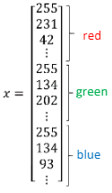

# 深度学习工程师

由 deeplearning.ai 出品，网易引进的正版授权中文版深度学习工程师微专业课程，让你在了解丰富的人工智能应用案例的同时，学会在实践中搭建出最先进的神经网络模型，训练出属于你自己的 AI。


deeplearning.ai

https://www.coursera.org/learn/neural-networks-deep-learning?action=enroll


## Question

- [x] 3.9 $dZ^{[2]}$ ????????????????


## 神经网络和深度学习

### 第一周 深度学习概论

#### 1.1. 欢迎来到深度学习工程微专业

#### 1.2. 什么是神经网络？


输入为房屋面积 , 通过一个神经元（函数运算），然后输出房价 y

ReLU （Rectified Linear Unit，railu） 修正线性单元  修正是指取不小于0的值


中间三个圈为隐藏单元，每个隐藏单元都来自自己学习到的权重，与输入加权求和。


---

#### 1.3. 用神经网络进行监督学习

监督学习的应用

实值估计，在线广告，


机智的选择输入和输出，解决特定问题，并把这部分学习过的组件嵌入到更大型的系统。

普通应用 对应 标准的神经网络NN

图像领域内，卷积神经网络 CNN

对于序列数据，循环神经网络 RNN

更复杂的应用 复杂的混合神经网络架构。


训练数据分为**结构化数据**和**非结构化数据**

结构化数据 	  每个特征都有清晰的定义。

非结构化数据   例如音频，图像，文本


好的网络能够同时适应结构化和非结构化数据


---

#### 1.4. 为什么深度学习会兴起？

普通的模型无法应用海量数据带来的益处，有时也无法处理海量数据，

而给规模足够大（有许多隐藏神经元）的神经网络输入海量数据，会增强performance


一些算法创新可以让神经网络运行效率更高，效果更好，是我们可以训练更大规模的网络。


传统sigmod函数，让负值梯度趋近于零但不是零，学习会变得非常缓慢，因为当梯度接近0时，使用梯度下降法，参数会变化得很慢，学习也变得很慢。

而relu让负值梯度直接为0，直接不学习。加速梯度下降。


很多时候，有了一个新想法，关于神经网络结构的想法，然后写代码实现想法，结果表现神经网络的效果，然后进一步赶紧神经网络结构的细节。


---

#### 1.5. 关于这门课

#### 1.6. 课程资源

coursea -> disscusion 


---

### 第二周 神经网络基础

#### 2.1. 二分分类

m个样本的训练集，遍历这个训练集，

正向过程/传播	forward pass/propagation

反向过程/传播	backward pass/propagation


计算机存储图像，用红绿蓝三个通道的矩阵表示。


在进行网络训练时，通常要unroll或者reshape为一维向量。



（x，y） 来表示一个单独的样本，x是n_x维的特征向量 $x \in \mathbb{R}^{n_x}$，y是标签值为 0 或 1

共有m个样本 ：$(x^{(1)},y^{(1)}) , (x^{(2)},y^{(2)}), \dots, (x^{(m)},y^{(m)})$


也可以用大写 $X$ 表示训练集


m列表示m个样本，n_x行表示每个样本有n_x条特征，表示为 $X \in \mathbb{R}^{n_x \times m}$ 或者 `X.shape=(n_x,m)`，有时行列相反。


m列表示m个样本，1行表示每个样本有1个输出标签，表示为 $Y \in \mathbb{R}^{1\times m}$ 或者 `Y.shape=(1,m)`


---

#### 2.2. logistic 回归

给输入 $x$ 希望输出 $\hat{y}$ 判断是不是一副 cat picture。一般  $\hat{y}$ 是一个概率，当输入特征x满足一定的条件时，y就是1。
$$
\hat{y} = P(y=1|x)
$$
输入 $X \in \mathbb{R}^{n_x \times m}$ ，logistic 参数  $w \in \mathbb{R}^{n_x}$  , $b \in \mathbb{R}$ 是一个实数。
$$
\hat{y} = w^Tx+b
$$
可能是一个上述的线性函数，但可能性不大，因为输出概率在0到1之间。

而 logistic 回归给一个 sigmoid 函数
$$
\hat{y} = \sigma (w^Tx+b)
$$


输出为从 0 到 1 的光滑函数 $\sigma (z)$，其中在本例中 $z = w^Tx+b$
$$
\sigma (z) = \frac{1}{1-e^{-z}}
$$
如果 z 特别大，趋近于1；z 特别小，趋近于0。

神经网络学习 w 和 b 两个参数，通常 b 对应一个 intercepter 拦截器


---

#### 2.3. logistic 回归损失函数<span id="logistic"></span>

为了训练 w 和 b 两个参数，需要定义一个 loss function。给定输入$(x^{(1)},y^{(1)}) , (x^{(2)},y^{(2)}), \dots, (x^{(m)},y^{(m)})$ ，我们希望预测到的 $\hat{y}^{(i)} \approx  y^{(i)}$

我们可以定义损失函数，衡量预测值与实际值的差距，用误差平方不利于梯度下降，因为会将问题变成**非凸non-convex函数**（w形状，有多个局部最小值）。
$$
\begin{equation}
 \mathcal{L}(\hat{y}, y)=\frac{1}{2}(\hat{y}-y)^{2} 
\end{equation}
$$
换一种损失函数，**凸convex函数**（v形状，有一个全局最小值）。
$$
\begin{equation}
 \mathcal{L}(\hat{y}, y)=-(y \log \hat{y}+(1-y) \log (1-\hat{y})) 
\end{equation}
$$


如果 y = 1 时， $\mathcal{L}(\hat{y}, y)=- \log \hat{y}$。损失函数越小越好，即 $\log \hat{y}$ 越大越好，这时 $ \hat{y}$ 要接近 y 的值 1

如果 y = 0 时， $ \mathcal{L}(\hat{y}, y)= -\log (1-\hat{y})) $。损失函数越小越好， $\log (1-\hat{y}))$ 越大越好，这时 $ \hat{y}$ 要接近 y 的值 0


loss函数衡量了**单个**训练样本的表现。cost 函数衡量**全体**训练样本的表现。
$$
\begin{split}
 J(w, b)&=\frac{1}{m} \sum_{i=1}^{m} L\left(\hat{y}^{(i)}, y^{(i)}\right)\\&=-\frac{1}{m} \sum_{i=1}^{m}\left[y^{(i)} \log \hat{y}^{(i)}+\left(1-y^{(i)}\right) \log \left(1-\hat{y}^{(i)}\right)\right]
\end{split}
$$
即损失函数的平均值。


---

#### 2.4. 梯度下降法

gradient descent

已知待训练sigmod函数： $ \hat{y}=\sigma\left(w^{T} x+b\right), \sigma(z)=\frac{1}{1+e^{-z}} $

成本函数： 
$$
\begin{split} J(w, b)&=\frac{1}{m} \sum_{i=1}^{m} L\left(\hat{y}^{(i)}, y^{(i)}\right)\\&=-\frac{1}{m} \sum_{i=1}^{m}\left[y^{(i)} \log \hat{y}^{(i)}+\left(1-y^{(i)}\right) \log \left(1-\hat{y}^{(i)}\right)\right]\end{split} 
$$
找到合适的 w 和 b 让成本函数较小。


**J(w,b) 是在水平轴 w 和 b 上的曲面，找到 J(w,b) 最小值对应的参数。**


方法:

用某个随即参数初始化一个点，朝最陡的方向走。

重复执行$ \omega=\omega-\alpha \frac{dJ(\omega)}{d \omega} $，直到算法收敛。其中 $\alpha$ 为学习率，控制每次迭代中梯度下降的步长，$\frac{dJ(\omega)}{d \omega}$ 是参数的更新量或变化量。

```c++
w = w - a * dw; // dw = deltaJ / deltaw;  dw是此点的导数 此点函数的斜率
b = b - a * db; // db = deltaJ / deltab;  pytorch自动求导
```


---

#### 2.5. 导数

derivatives

slope斜率 = 绿色极限三角形的高除以宽 = 0.003/0.001 = 3


a1 = 2 			f(a1) = 6

a2 = 2.001 	f(a2) = 6.003

df = f(a2) - f(a1) / (a2 - a1) = 6.003 - 6 / (2.001 - 2) = 3

这个函数任何地方的斜率都是 3。


---

#### 2.6. 更多导数的例子

也就是复杂函数求导


---

#### 2.7. 计算图

computation graph

神经网络都是按照**前向**或者**反向传播**过程来实现的。

首先计算出神经网络的输出，紧接着进行一个**反向传输操作**。后者用来计算出对应的梯度或者导数。

$J(a,b,c) = 3(a + b * c)$ 是三个变量a,b,c的函数，我们可以设定 `u = b*c`，`v = a + u`，`J = 3*v`，则有下图


通过一个从左向右的过程，可以计算出 $J$ 的值。通过从右向左可以计算出导数。


---

#### 2.8. 计算图中的导数计算

按照上图计算，$J$ 对 $v$ 的导数，$\frac{dJ}{dv} = 3$。a的值改变，v的值就会改变，J的值也会改变。a改变，v改变量取决于 $\frac{dv}{da}$，

链式法则 $\frac{dJ}{da} = \frac{dJ}{dv}  \frac{dv}{da}$，$\frac{dJ}{db} = \frac{dJ}{dv}  \frac{dv}{du} \frac{du}{db}$，$\frac{dJ}{dc} = \frac{dJ}{dv}  \frac{dv}{du} \frac{du}{dc}$


---

#### 2.9. logistic回归中的梯度下降法

$$
z = w^Tx+b
$$

$$
\hat{y} = a =\sigma (z)
$$

$$
\mathcal{L}(\hat{y}, y)=-(y \log a+(1-y) \log (1-a))
$$

a是logistics函数的输出，y是标签真值。

如果有两个特征 $x_1$ 和 $x_2$ 则
$$
z = w_1^Tx_1+w_2^Tx_2 +b
$$
在logistic回归中，我们需要做的是，**变换参数**w和b来最小化损失函数，


其中
$$
\frac{dL}{da} = -\frac{y}{a} + \frac{1-y}{1-a}
$$
其中<span id="dz"></span>
$$
\begin{split}\frac{dL}{dz} &= \frac{dL}{da} \frac{da}{dz}\\&=(-\frac{y}{a} + \frac{1-y}{1-a}) * (a(1-a))\\&=a-y\end{split}
$$
其中目标函数对三个参数的导数如下：
$$
\begin{split}
\frac{dL}{dw_1} &= x_1*\frac{dL}{dz}\\
\frac{dL}{dw_2} &= x_2*\frac{dL}{dz}\\
\frac{dL}{db} &= \frac{dL}{dz}
\end{split}
$$
然后根据下式更新参数。
$$
\begin{split}
w_1 &= w_1 - \alpha \frac{dL}{dw_1}\\
w_2 &= w_2 - \alpha \frac{dL}{dw_2}\\
b &= b - \alpha \frac{dL}{db}
\end{split}
$$

---

#### 2.10. m个样本的梯度下降

上一节均为单一样本的求导与参数更新。实际情况下，训练集会有很多样本。

$$
\begin{split}
 J(w, b)&=\frac{1}{m} \sum_{i=1}^{m} L(\hat{y}^{(i)}, y^{(i)})\\&=-\frac{1}{m} \sum_{i=1}^{m}\left[y^{(i)} \log \hat{y}^{(i)}+(1-y^{(i)}) \log (1-\hat{y}^{(i)})\right]
\end{split}
$$
其中
$$
\hat{y}^{i} = a =\sigma (z^{i})=\sigma (w^Tx^{i}+b)
$$
直接求导
$$
\frac{\partial J(w, b)}{\partial w_1} = \frac{1}{m} \sum_{i=1}^{m}\frac{\partial L(\hat{y}^{(i)}, y^{(i)})}{\partial w_i}
$$
计算每一个样本的梯度值，然后求平均，会得到全局梯度值，可以直接用到梯度下降法。


整个过程相当于一次epoch。每次将所有样本计算过一边后，梯度下降一次，更改参数。重复多次。

**显式的使用循环，会使算法很低效。**因此向量化编程有很大的帮助。


---

#### 2.11. 向量化

消除代码中显式for循环语句的艺术。**不能使用显式for循环**，numpy隐式循环。


 ```python
import numpy as np
import time 

# vectorization version
a = np.randrom.rand(1000000)
b = np.randrom.rand(1000000)

tic = time.time()
c = np.dot(a,b)
toc = time.tiem()

print("Vectorized version:" + str(1000*(toc-tic)) + "ms")

# for loop version
c = 0
tic = time.time()
for i in range(1000000)
	c += a[i]*b[i]
toc = time.time()   
print("For loop version:" + str(1000*(toc-tic)) + "ms")  # 时间比向量化版本长

 ```

CPU 和 GPU 都有并行处理能力 **SIMD 单指令多数据流**


---

#### 2.12. 向量化的更多例子

计算
$$
\begin{split}
u &= Av\\
u_i &= \sum_i\sum_jA_{ij}v_j
\end{split}
$$

```python
u = np.zeros((n, 1))
for i 
	for j
    	u[i] = A[i][j] * v[j]

# 或
u = np.dot(A,v)       
```

计算
$$
u_i = e^{v_i}
$$

```python
u = np.zeros((n, 1))
for i in range(n)
	u[i] = math.exp(v[i])
# 或
u = np.exp(v);
np.log(v);
np.abs(v);
np.maximun(v,0) # v中所有元素和0之间相比的最大值
v**2			#v^2    
1/v     		#v的倒数
```


Logistic 回归求导


``` python
J = 0, dw1 = 0, dw2 = 0, db = 0
for i = 1 to n:
    z[i] = w^T * x[i] + b
    a[i] = sigma(z[i])  #sigma  1 / (1 + e^-x)
    J += -[y[i] * log(yhat[i]) + (1 - y[i]) * log(1 - yhat[i])]
    dz = a[i] * (1 - a[i])   # dz = da/dz
    dw1 = x1[i] * dz[i]
    dw2 = x2[i] * dz[i]
    db += dz[i]
J = J / m
dw1 = dw1 / m
dw2 = dw2 / m
db = db / m
```


---

#### 2.13. 向量化 logistics 回归

```python
z = np.dot(w.t ,x) + b
a = 1 / np.exp(-z)
```

b 是一个实数，python会自动把实数b 扩展成一个` 1*m` 的行向量


---

#### 2.14. 向量化 logistics 回归的梯度输出

```python
dz = a - y;   # dz = dL/dz  不是   da/dz
dw = np.sum(np.dot(x, dz.t)) / m
db = np.sum(dz) / m
```


```python
# 总向量化编程logistics回归
z = np.dot(w.t ,x) + b
a = 1 / np.exp(-z)
dz = a - y;   # dz = dL/dz  不是   da/dz
dw = np.sum(np.dot(x, dz.t)) / m
db = np.sum(dz) / m

w = w - alpha * dw
b = b - alpha * db
```

仍然需要一个大 for 循环，实现每一次梯度更新，即eopch。


---

#### 2.15. Python 中的广播

```python
A = np.array([56 , 0 , 4.4 , 68],
            [1.2, 104, 52, 8],
            [1.8, 135, 99, 0.9])
cal = A.sum(axis = 0) #按列求和  按行求和axis = 1
percentage = 100 * A / cal.reshape(1,4)  #A 3x4         cal 1x4 
#.reshape(1,4) 可以确保矩阵形状是我们想要的

```

广播（broadcasting）即**同型复制**

**general principle**

size ：[m,n] +-*/ [1,n]  把 [1,n] 复制m行变成  [m,n]再和前项运算

size ：[m,n] +-*/ [m,1] 把 [m,1]复制n列变成 [m,n] 再和前项


---

#### 2.16. 关于 python/numpy 向量的说明

```python
# 避免使用秩为 1 的矩阵
import numpy as np

a = np.random.randn(5)

a.shape  #(5, ) 秩为1的数组 
np.dot(a, a.T)   # 算出来是内积 一个数

# 尽量不要使用秩为1的数组 即
a = np.random.randn(5) 
# 改为
a = np.random.randn(5, 1)

a.shape  #(5, 1) 秩不为1的数组 
np.dot(a, a.T)   # 算出来是外积 一个矩阵
```


```python
# 使用断言加以保障 执行很快 
assert(a.shape == (5,1))
```


```python
#确保形状
reshape
```


---

#### 2.17. Jupyter/Ipython笔记本的快速指南

shift + enter 执行代码段

kernel 重启内核

submit assignment 提交任务


---

#### 2.18 logistic 损失函数的[解释](#logistic)

$$
\hat{y} = \sigma (w^Tx+b)
$$

$$
\sigma (z) = \frac{1}{1-e^{-z}}
$$

我们设定
$$
\begin{equation}
 \hat{y}=P(y=1 \mid x) 
\end{equation}
$$
即算法的输出 $\hat{y}$ 是给定训练样本 x 条件下 y 等于 1 的概率。

换句话说，如果 y=1，那么在给定 x 得到 y=1的概率等于 $\hat{y}$ 

反过来说，如果 y=0，那么在给定 x 得到 y=0 的概率等于$1-\hat{y}$

下边有验证。


简单说  $\hat{y}$ 表示 y=1的概率。
$$
\begin{equation}
if \quad y=1: \quad p(y \mid x)=\hat{y} \\
if \quad y=0: \quad p(y \mid x)=1-\hat{y} 
\end{equation}
$$
二分类问题，y的取值只能是0或1。

0-1分布/二项分布/伯努利分布，上述两条公式可以合并成
$$
\begin{equation}
 p(y \mid x)=\hat{y}^{y}(1-\hat{y})^{(1-y)} 
\end{equation}
$$
当 y = 1或 y = 0 代入上式可以得到上上式的结论。


两边同时取**对数**，方便**展开**/**求导/优化**。
$$
\begin{equation}
 \log p\left(\left.y\right|x\right)=\log \hat{y}^{y}(1-\hat{y})^{(1-y)}=y \log \hat{y}+(1-y) \log (1-\hat{y}) 
\end{equation}
$$
概率为1时，log函数为0，概率为0时，log函数为负无穷。


假设所有样本**独立同分布**
$$
\begin{equation}
P= \prod_{i=1}^{m} p\left(y^{(i)} \mid x^{(i)}\right) 
\end{equation}
$$
由于各个样本**独立**，因此求得**全局最优**的条件便是求得**各样本最优**，也即各个样本取得**最优的概率的连乘**


两边同时取**对数**，方便**展开**/**求导/优化**。
$$
\begin{equation}
\log P= \sum_{i=1}^{m} \log p\left(y^{(i)} \mid x^{(i)}\right) 
\end{equation}
$$
最大似然估计，即求出一组参数，这里就是w和b，使这个式子取最大值。

也就是说这个式子最大值，$\hat{y}$ 和 $y$ 越接近，网络越好。


---

### 第三周 浅层神经网络

#### 3.1. 神经网络概览

右上角方括号内表示网络的层数

右上角圆括号表示第几个训练样本

右下角表示特征索引


这是一个简单的两层神经网络的计算过程，第一层得到的概率 $a^{[1]}$ ，又被输入到下一层，再次进行学习，第二层得到的概率为最终输出 $a^{[2]}$，并进一步计算 loss


---

#### 3.2. 神经网络表示

下图为双层神经网络，输入层不算在内。 


左边一层称为输入层，第二层称为隐藏层，第三层只有一个节点，称为输出层。在训练时，隐藏层节点的值，不知道。

$X$ 或 $a^{[0]}$表示输入。第二层为 $a^{[1]}$ 是一个四维向量。输出为 $a^{[2]}$。

隐藏层有两个相关的参数 W 和 b，W 是（4，3）的矩阵，有三个输入，b 是（4，1）的矩阵。

输出层有两个相关的参数 W 和 b，W 是（1，4）的矩阵，有四个隐藏层单元，b 是（1，4）的矩阵。

 

---

#### 3.3. 计算神经网络的输出


这个圆圈代表了回归计算的两个步骤，首先按照步骤计算出z，然后在第二步计算激活函数。神经网络就是不断重复这个过程


**第一隐藏层的第一个**节点先计算
$$
\begin{equation}
 z_{1}^{[1]}=\omega_{1}^{[1]} x+b_{1}^{[1]} 
\end{equation}
$$
再计算
$$
\begin{equation}
 a_{1}^{[1]}=\sigma(z_{1}^{[1]}) 
\end{equation}
$$
上标表示层数，下标表示节点索引（1-4）


**第一隐藏层的第二个**节点先计算
$$
\begin{equation}
 z_{2}^{[1]}=\omega_{2}^{[1]} x+b_{2}^{[1]} 
\end{equation}
$$
再计算
$$
\begin{equation}
 a_{2}^{[1]}=\sigma(z_{2}^{[1]}) 
\end{equation}
$$


如下图


$$
\begin{split}
z_{1}^{[1]}=\omega_{1}^{[1]T} x+b_{1}^{[1]}, a_{1}^{[1]}=\sigma(z_{1}^{[1]}) \\
z_{2}^{[1]}=\omega_{2}^{[1]T} x+b_{2}^{[1]}, a_{2}^{[1]}=\sigma(z_{2}^{[1]}) \\
z_{3}^{[1]}=\omega_{3}^{[1]T} x+b_{3}^{[1]}, a_{3}^{[1]}=\sigma(z_{3}^{[1]}) \\
z_{4}^{[1]}=\omega_{4}^{[1]T} x+b_{4}^{[1]}, a_{4}^{[1]}=\sigma(z_{4}^{[1]}) \\
\end{split}
$$
矩阵化


上述输出为 $z^{[1]}$ 第一层的输出向量

给定输入 x
$$
\begin{split}
z^{[1]}&=W^{[1]} x+b^{[1]} \\
a^{[1]}&=\sigma(z^{[1]}) \\
\end{split}
$$
(4,1) = (4,3) * (3,1) + (4,1)               W 是四个不同的节点，对三个输入的权重

(4,1) = (4,1)
$$
\begin{split}
z^{[2]}&=W^{[2]} a^{[1]}+b^{[2]} \\
a^{[2]}&=\sigma(z^{[2]}) 
\end{split}
$$
(1,1) = (1,4) * (4,1) + (1,1)

(1,1) = (1,1)


---

#### 3.4. 多个例子中的向量化

 样本的循环正向反向，权重是同一套。


  全部变成矩阵运算。


---

#### 3.5. 向量化实现的解释

 以样本数目直接扩展为矩阵


---

#### 3.6. 激活函数

tanh 函数比 sigmoid 函数激活非线性效果好一些，因为值介于-1和1之间，激活函数的均值为 0。类似数据中心化的效果。


但是 tanh 一般**不在输出层使用**，因为有时输出为概率，概率在 0 - 1 之间。如果做二分类问题，可以试着用 sigmoid 函数。


tanh 和 sigmoid 在 z 很大或很小时，函数的斜率很接近 0，会拖慢梯度下降。


relu 在 z 为正数时，导数为 1，负数时为 0。


sigmoid 二元分类用，其余不用

tanh 可以替代sigmoid

relu  最常用

leaky relu


Relu 的输入值为负的时候，输出始终为0，其一阶导数也始终为0，这样会导致神经元不能更新参数，也就是神经元不学习了，这种现象叫做“Dead Neuron”。**失活**。为了解决 Relu 函数这个缺点，在 Relu 函数的负半区间引入一个泄露（Leaky）值。


实际选择激活函数可以在交叉验证集上做个小实验。


---

#### 3.7. 为什么需要非线性激活函数？

如果没有激活函数，就只是一个线性组合。


---

#### 3.8. 激活函数的导数

**sigmoid 函数**


$$
g(z)=\frac{1}{1+e^{-z}}
$$
求导
$$
g^{\prime}(z) = \frac{d}{d z} g(z) = g(z)(1-g(z))
$$
z 特别大 g(z) = 1 梯度为0

z 特别小 g(z) = 0 梯度为0

z = 0    g(z) = 0.5  梯度为0.25


**tanh 函数**


$$
g(z) = \frac{e^{z}-e^{-z}}{e^{z}+e^{-z}}
$$
求导
$$
g^{\prime}(z) = \frac{d}{d z} g(z) = 1-g(z)^2
$$
z 特别大 g(z) = 1  梯度为0

z 特别小 g(z) = -1 梯度为0

z = 0       g(z) = 0  梯度为1


**ReLU函数**


$$
g(z) = max(0, z)
$$
求导
$$
g^{\prime}(z)=\left\{\begin{array}{ll}
0 & \text { if } z<0 \\
1 & \text { if } z \geqslant 0
\end{array}\right.
$$


**Leaky ReLU函数**


$$
g(z) = max(0.01z, z)
$$
求导
$$
g^{\prime}(z)=\left\{\begin{array}{ll}
0.01 & \text { if } z<0 \\
1 & \text { if } z \geqslant 0
\end{array}\right.
$$


---

#### 3.9. 神经网络的梯度下降法

待训练参数：$w^{[1]}, b^{[1]}, w^{[2]}, b^{[2]}$，    有隐藏单元： $n^{[0]}, n^{[1]}, n^{[2]}$

矩阵 $w^{[1]}$ 维度为 $(n^{[1]}, n^{[0]})$，$b^{[1]}$ 就是一个 $(n^{[1]},1)$ 维的向量，$w^{[2]}$ 维度为 $(n^{[2]}, n^{[1]})$，$b^{[2]}$ 就是一个 $(n^{[2]},1)$ 维的向量。

cost函数为：
$$
J\left(\omega^{[1]}, b^{(1)}, \omega^{[2]}, b^{[2]}\right)=\frac{1}{m} \sum_{i=1}^{n}\mathcal{L}(\hat{y}, y)
$$
其中 $\hat{y}=a^{[2]}$ 是网络输出。

梯度下降过程：

​	重复：   $d\omega ^{[1]}=\frac{\partial J}{\partial \omega^{[1]}}$，$db^{[1]}=\frac{\partial J}{\partial b^{[1]}}$

​				   $\omega^{[1]}=\omega^{[1]}-\alpha d\omega^{[1]}$，$b^{[1]}=b^{[1]}-\alpha db^{[1]}$，$\omega^{[2]}=\omega^{[2]}-\alpha d\omega^{[2]}$，$b^{[2]}=b^{[2]}-\alpha db^{[2]}$


**正向传播**
$$
\begin{split}
Z^{[1]}&=W^{[1]} x+b^{[1]} \\
A^{[1]}&=g^{[1]}(Z^{[1]}) \\
Z^{[2]}&=W^{[2]} A^{[1]}+b^{[2]} \\
A^{[2]}&=g^{[2]}(Z^{[2]}) 
\end{split}
$$
**反向传播**
$$
\begin{split}
dZ^{[2]} &= A^{[2]} - Y_{truth}\\
dW^{[2]} &= \frac{1}{m}dZ^{[2]}A^{[1]T}\\
db^{[2]} &= \frac{1}{m}np.sum(dZ^{[2]}, axis=1, keepdims=True)\\
dZ^{[1]} &= W^{[2]T}dZ^{[2]} * g^{[1]\prime}(Z^{[1]})\\
dW^{[1]} &= \frac{1}{m}dZ^{[1]}X^{T}\\
db^{[1]} &= \frac{1}{m}np.sum(dZ^{[1]}, axis=1, keepdims=True)\\
\end{split}
$$
第一行推导过程公式见[dZ](#dz) ，这里假设使用sigmoid激活函数，直接转化为最终式子，所以没有 $g^{[2]\prime}$。

第二行直接求导结果为系数，$\frac{1}{m}$ 因为是直接对cost function求导，所以要除以m

第三行 `axis=1` 水平相加求和，`keepdims` 防止 python 输出秩为 1 的数组$(n^{[2]},)    $       $(n^{[2]},1)$

第四行 $g^{[1]\prime}$是隐藏层的激活函数的导数。*为逐个元素相乘，点乘。$W^{[2]T}dZ^{[2]}$ 的size $(n^{[1]},m)$
$$
dZ^{[1]} = \frac{\part \mathcal{L}}{\part Z^{[1]}}=\frac{\part \mathcal{L}}{\part Z^{[2]}}\frac{\part Z^{[2]}}{\part A^{[1]}} \frac{\part A^{[1]}}{\part Z^{[1]}}\\=W^{[2]T}dZ^{[2]} *g^{[1]\prime}(Z^{[1]})
$$
~~为什么是 $dZ^{[2]}$ ???????????????????????????????????????????~~

答案的$W^{[2]T}dZ^{[2]}$ 与上边偏导对应的位置刚好相反


第五行 $db^{[1]}$ 的size $(n^{[1]},1)$


**上边的公式解释见下节**


---

#### 3.10. 直观理解反向传播

任意变量与其导数维度相同
$$
\begin{split}
dz^{[2]} &= a^{[2]} - y\\
dW^{[2]} &= \frac{1}{m}dz^{[2]}a^{[1]T}\\
db^{[2]} &= dz^{[2]}\\
dz^{[1]} &= W^{[2]T}dz^{[2]} * g^{[1]\prime}(z^{[1]})\\
dW^{[1]} &= \frac{1}{m}dz^{[1]}x^{T}\\
db^{[1]} &= dz^{[1]}\\
\end{split}
$$
向量化
$$
\begin{split}
dZ^{[2]} &= A^{[2]} - Y_{truth}\\
dW^{[2]} &= \frac{1}{m}dZ^{[2]}A^{[1]T}\\
db^{[2]} &= \frac{1}{m}np.sum(dZ^{[2]}, axis=1, keepdims=True)\\
dZ^{[1]} &= W^{[2]T}dZ^{[2]} * g^{[1]\prime}(Z^{[1]})\\
dW^{[1]} &= \frac{1}{m}dZ^{[1]}X^{T}\\
db^{[1]} &= \frac{1}{m}np.sum(dZ^{[1]}, axis=1, keepdims=True)\\
\end{split}
$$


---

#### 3.11. 随机初始化

权重不能初始化为0。偏置可以初始化为0。若初始化为 0 输入不同的样本，计算过程相同，得到相同的结果和梯度。

神经元对称 symmetric


```python
W1 = np.random.randn((2, 2)) * 0.01 #
b1 = np.zeros((2, 1))

W2 = np.random.randn((1, 2)) * 0.01
b2 = np.zeros((2, 1))
```

w 初始化为很小的数。b 不受影响。

一般初始化为较小的值，如果初始化较大，使用tanh和sigmoid激活函数时，梯度接近 0。

如果没有tanh和sigmoid激活函数时，初始化大小无所谓

如果网络比较深选用0.01外的初始化倍数


---

### 第四周 深层神经网络

#### 4.1 深层神经网络

1

----

#### 4.2 深层网络中的前向传播

#### 4.3 核对矩阵的维数

#### 4.4 为什么使用深层表示

#### 4.5 搭建深层神经网络块

#### 4.6 前向和反向传播

#### 4.7 参数 VS 超参数

#### 4.8 这和大脑有什么关系？


