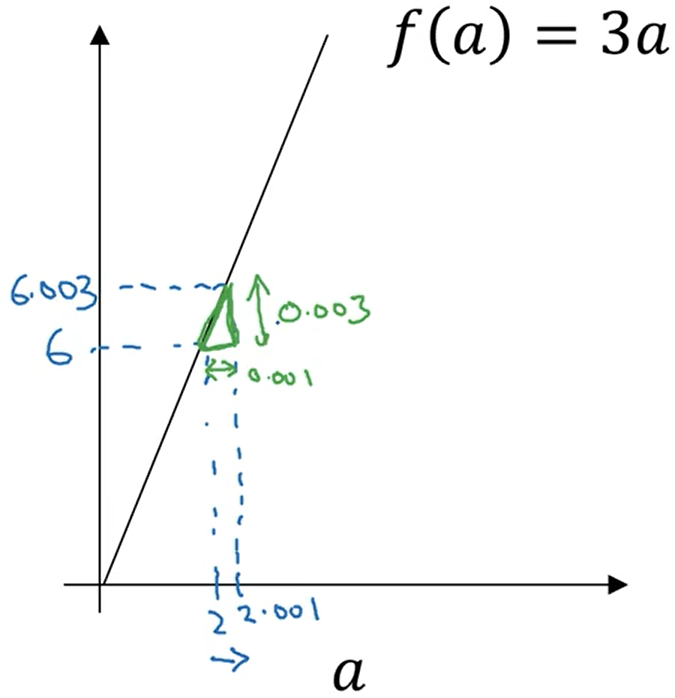

# 深度学习工程师

由 deeplearning.ai 出品，网易引进的正版授权中文版深度学习工程师微专业课程，让你在了解丰富的人工智能应用案例的同时，学会在实践中搭建出最先进的神经网络模型，训练出属于你自己的 AI。


deeplearning.ai


## 神经网络和深度学习

### 第一周 深度学习概论

#### 1.1. 欢迎来到深度学习工程微专业

#### 1.2. 什么是神经网络？


输入为房屋面积 , 通过一个神经元（函数运算），然后输出房价 y

ReLU （Rectified Linear Unit，railu） 修正线性单元  修正是指取不小于0的值


中间三个圈为隐藏单元，每个隐藏单元都来自自己学习到的权重，与输入加权求和。


---

#### 1.3. 用神经网络进行监督学习

监督学习的应用

实值估计，在线广告，


机智的选择输入和输出，解决特定问题，并把这部分学习过的组件嵌入到更大型的系统。

普通应用 对应 标准的神经网络NN

图像领域内，卷积神经网络 CNN

对于序列数据，循环神经网络 RNN

更复杂的应用 复杂的混合神经网络架构。


训练数据分为**结构化数据**和**非结构化数据**

结构化数据 	  每个特征都有清晰的定义。

非结构化数据   例如音频，图像，文本


好的网络能够同时适应结构化和非结构化数据


---

#### 1.4. 为什么深度学习会兴起？

普通的模型无法应用海量数据带来的益处，有时也无法处理海量数据，

而给规模足够大（有许多隐藏神经元）的神经网络输入海量数据，会增强performance


一些算法创新可以让神经网络运行效率更高，效果更好，是我们可以训练更大规模的网络。


传统sigmod函数，让负值梯度趋近于零但不是零，学习会变得非常缓慢，因为当梯度接近0时，使用梯度下降法，参数会变化得很慢，学习也变得很慢。

而relu让负值梯度直接为0，直接不学习。加速梯度下降。


很多时候，有了一个新想法，关于神经网络结构的想法，然后写代码实现想法，结果表现神经网络的效果，然后进一步赶紧神经网络结构的细节。


---

#### 1.5. 关于这门课

#### 1.6. 课程资源

coursea -> disscusion 


---

### 第二周 神经网络基础

#### 2.1. 二分分类

m个样本的训练集，遍历这个训练集，

正向过程/传播	forward pass/propagation

反向过程/传播	backward pass/propagation


计算机存储图像，用红绿蓝三个通道的矩阵表示。


在进行网络训练时，通常要unroll或者reshape为一维向量。


（x，y） 来表示一个单独的样本，x是n_x维的特征向量 $x \in \mathbb{R}^{n_x}$，y是标签值为 0 或 1

共有m个样本 ：$(x^{(1)},y^{(1)}) , (x^{(2)},y^{(2)}), \dots, (x^{(m)},y^{(m)})$


也可以用大写 $X$ 表示训练集


m列表示m个样本，n_x行表示每个样本有n_x条特征，表示为 $X \in \mathbb{R}^{n_x \times m}$ 或者 `X.shape=(n_x,m)`，有时行列相反。


m列表示m个样本，1行表示每个样本有1个输出标签，表示为 $Y \in \mathbb{R}^{1\times m}$ 或者 `Y.shape=(1,m)`


---

#### 2.2. logistic 回归

给输入 $x$ 希望输出 $\hat{y}$ 判断是不是一副 cat picture。一般  $\hat{y}$ 是一个概率，当输入特征x满足一定的条件时，y就是1。
$$
\hat{y} = P(y=1|x)
$$
输入 $X \in \mathbb{R}^{n_x \times m}$ ，logistic 参数  $w \in \mathbb{R}^{n_x}$  , $b \in \mathbb{R}$ 是一个实数。
$$
\hat{y} = w^Tx+b
$$
可能是一个上述的线性函数，但可能性不大，因为输出概率在0到1之间。

而 logistic 回归给一个 sigmoid 函数
$$
\hat{y} = \sigma (w^Tx+b)
$$


输出为从 0 到 1 的光滑函数 $\sigma (z)$，其中在本例中 $z = w^Tx+b$
$$
\sigma (z) = \frac{1}{1-e^{-z}}
$$
如果 z 特别大，趋近于1；z 特别小，趋近于0。

神经网络学习 w 和 b 两个参数，通常 b 对应一个 intercepter 拦截器


---

#### 2.3. logistic 回归损失函数

为了训练 w 和 b 两个参数，需要定义一个 loss function。给定输入$(x^{(1)},y^{(1)}) , (x^{(2)},y^{(2)}), \dots, (x^{(m)},y^{(m)})$ ，我们希望预测到的 $\hat{y}^{(i)} \approx  y^{(i)}$

我们可以定义损失函数，衡量预测值与实际值的差距，用误差平方不利于梯度下降，因为会将问题变成**非凸non-convex函数**（w形状，有多个局部最小值）。
$$
\begin{equation}
 \mathcal{L}(\hat{y}, y)=\frac{1}{2}(\hat{y}-y)^{2} 
\end{equation}
$$
换一种损失函数，**凸convex函数**（v形状，有一个全局最小值）。
$$
\begin{equation}
 \mathcal{L}(\hat{y}, y)=-(y \log \hat{y}+(1-y) \log (1-\hat{y})) 
\end{equation}
$$


如果 y = 1 时， $\mathcal{L}(\hat{y}, y)=- \log \hat{y}$。损失函数越小越好，即 $\log \hat{y}$ 越大越好，这时 $ \hat{y}$ 要接近 y 的值 1

如果 y = 0 时， $ \mathcal{L}(\hat{y}, y)= -\log (1-\hat{y})) $。损失函数越小越好， $\log (1-\hat{y}))$ 越大越好，这时 $ \hat{y}$ 要接近 y 的值 0


loss函数衡量了**单个**训练样本的表现。cost 函数衡量**全体**训练样本的表现。
$$
\begin{equation}
 J(w, b)=\frac{1}{m} \sum_{i=1}^{m} L\left(\hat{y}^{(i)}, y^{(i)}\right)=-\frac{1}{m} \sum_{i=1}^{m}\left[y^{(i)} \log \hat{y}^{(i)}+\left(1-y^{(i)}\right) \log \left(1-\hat{y}^{(i)}\right)\right]
\end{equation}
$$
即损失函数的平均值。


---

#### 2.4. 梯度下降法

gradient descent

已知待训练sigmod函数： $ \hat{y}=\sigma\left(w^{T} x+b\right), \sigma(z)=\frac{1}{1+e^{-z}} $

成本函数： $ J(w, b)=\frac{1}{m} \sum_{i=1}^{m} L\left(\hat{y}^{(i)}, y^{(i)}\right)=-\frac{1}{m} \sum_{i=1}^{m}\left[y^{(i)} \log \hat{y}^{(i)}+\left(1-y^{(i)}\right) \log \left(1-\hat{y}^{(i)}\right)\right]$

找到合适的 w 和 b 让成本函数较小。

图

**J(w,b) 是在水平轴 w 和 b 上的曲面，找到 J(w,b) 最小值对应的参数。**


方法:

用某个随即参数初始化一个点，朝最陡的方向走。

重复执行$ \omega=\omega-\alpha \frac{dJ(\omega)}{d \omega} $，直到算法收敛。其中 $\alpha$ 为学习率，控制每次迭代中梯度下降的步长，$\frac{dJ(\omega)}{d \omega}$ 是参数的更新量或变化量。

```c++
w = w - a * dw; // dw = deltaJ / deltaw;  dw是此点的导数 此点函数的斜率
b = b - a * db; // db = deltaJ / deltab;  pytorch自动求导
```


---

#### 2.5. 导数

derivatives

slope斜率 = 绿色极限三角形的高除以宽 = 0.003/0.001 = 3



a1 = 2 			f(a1) = 6

a2 = 2.001 	f(a2) = 6.003

df = f(a2) - f(a1) / (a2 - a1) = 6.003 - 6 / (2.001 - 2) = 3

这个函数任何地方的斜率都是 3。


---

#### 2.6. 更多导数的例子

也就是复杂函数求导


---

#### 2.18 logistic 损失函数的解释

$$
\hat{y} = \sigma (w^Tx+b)
$$

$$
\sigma (z) = \frac{1}{1-e^{-z}}
$$

我们设定
$$
\begin{equation}
 \hat{y}=P(y=1 \mid x) 
\end{equation}
$$
即算法的输出 $\hat{y}$ 是给定训练样本 x 条件下 y 等于 1 的概率。

换句话说，如果 y=1，那么在给定 x 得到 y=1的概率等于 $\hat{y}$ 

反过来说，如果 y=0，那么在给定 x 得到 y=0 的概率等于$1-\hat{y}$

下边有验证。


简单说  $\hat{y}$ 表示 y=1的概率。
$$
\begin{equation}
if \quad y=1: \quad p(y \mid x)=\hat{y} \\
if \quad y=0: \quad p(y \mid x)=1-\hat{y} 
\end{equation}
$$
二分类问题，y的取值只能是0或1。

0-1分布/二项分布/伯努利分布，上述两条公式可以合并成
$$
\begin{equation}
 p(y \mid x)=\hat{y}^{y}(1-\hat{y})^{(1-y)} 
\end{equation}
$$
当 y = 1或 y = 0 代入上式可以得到上上式的结论。


两边同时取**对数**，方便**展开**/**求导/优化**。
$$
\begin{equation}
 \log p\left(\left.y\right|x\right)=\log \hat{y}^{y}(1-\hat{y})^{(1-y)}=y \log \hat{y}+(1-y) \log (1-\hat{y}) 
\end{equation}
$$
概率为1时，log函数为0，概率为0时，log函数为负无穷。


假设所有样本**独立同分布**
$$
\begin{equation}
P= \prod_{i=1}^{m} p\left(y^{(i)} \mid x^{(i)}\right) 
\end{equation}
$$
由于各个样本**独立**，因此求得**全局最优**的条件便是求得**各样本最优**，也即各个样本取得**最优的概率的连乘**


两边同时取**对数**，方便**展开**/**求导/优化**。
$$
\begin{equation}
\log P= \sum_{i=1}^{m} \log p\left(y^{(i)} \mid x^{(i)}\right) 
\end{equation}
$$
最大似然估计，即求出一组参数，这里就是w和b，使这个式子取最大值。

也就是说这个式子最大值，$\hat{y}$ 和 $y$ 越接近，网络越好。


---


