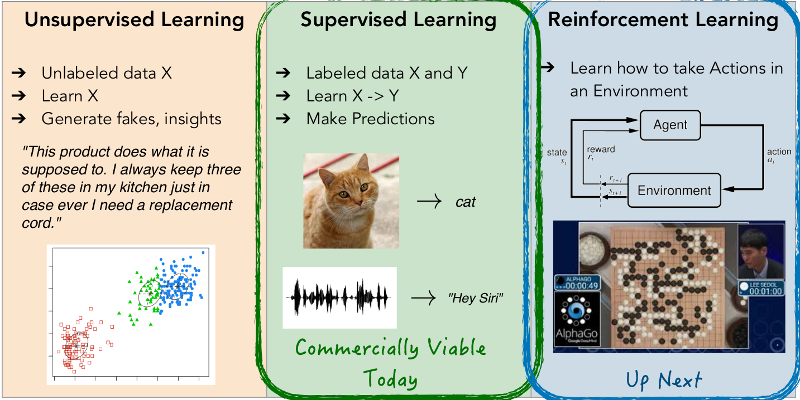

# 全栈深度学习训练营

https://www.bilibili.com/video/BV1BT4y1P7u6

https://fullstackdeeplearning.com/spring2021/

https://github.com/full-stack-deep-learning/fsdl-text-recognizer-2021-labs/

https://www.youtube.com/playlist?list=PL1T8fO7ArWlcWg04OgNiJy91PywMKT2lv

课外网站 http://neuralnetworksanddeeplearning.com/

每周阅读一章

https://setosa.io/ev/image-kernels/

卷积演示

https://github.com/vdumoulin/conv_arithmetic

卷积指南

https://paperswithcode.com/area/computer-vision

cv论文分类

------

## Week 1: Fundamentals

### Lecture 1: DL Fundamentals

**Neural Networks**

受生物学启发，通过神经元对我们的身体进行所有计算。

axon 轴突（神经细胞的突起，将信号发送到其他细胞）

synapse 突触（一个神经元的冲动传到另一个神经元或传到另一细胞间的相互接触的结构）

dendrite 树突(位于神经元末端的细分支，接收其他神经元传来的信号)

b就是一个偏差，因为这是想要的线性函数，对 y 截距的偏移。通过激活函数，变成非线性函数。

神经元也就是感知器。如果将感知器如下分层排列。

每一个感知器都有自己的权重 w 和偏差 y，这个网络表示了某个函数 $y =f(x)$

目的是让这个函数变得有用且正确。

------

**Universality**

万能近似定理（universal approximation theorem）

有一个连续函数 $f(x)$ ，如果一个两层神经网络有足够多的隐藏单元（即神经元），一定存在一组权重能够让神经网络无限近似函数$f(x)$

------

**Learning Problems**

- 无监督学习，了解数据的结构，从而了解输入。预测下一个单词，寻找相关关系，预测下一个像素，VAE，GAN，learn X
- 监督学习，图像识别，语音识别，机器翻译   learn X --> Y
- 强化学习，环境交互   learn to interact with environment  $x_t -> a_t, x_{t+1} -> a_{t+1}, ...$

- 迁移学习
- 模仿学习
- 元学习

------

**Empirical Risk Minimization / Loss Function**

线性规划，找到一条合适的线，表示这些数据的关系

最小化平方差
$$
\min _{w, b} \sum_{i=1}^{m}\left(w \cdot x^{(i)}+b-y^{(i)}\right)^{2} 
$$
在具体些，最小化损失函数
$$
\min _{w, b} \sum_{i=1}^{m} L\left(f_{w, b}\left(x^{(i)}\right), y^{(i)}\right)
$$
找到最好的参数，最优化损失函数。（MSE，Huber，cross-entropy）

------

**Gradient Descent**

更新参数$w_i$
$$
\begin{aligned}
w_{i} & \leftarrow w_{i}-\alpha \frac{\partial}{\partial w_{i}} \mathcal{L}(w, b) \\
\frac{\partial}{\partial w_{i}} \mathcal{L}(w, b) &=\lim _{\varepsilon \rightarrow 0} \frac{\mathcal{L}\left(w+\varepsilon e_{i}, b\right)-\mathcal{L}\left(w-\varepsilon e_{i}, b\right)}{2 \varepsilon}
\end{aligned}
$$
变换形式
$$
\begin{array}{l}
w \leftarrow w-\alpha \nabla_{w} \mathcal{L}(w, b) \\
\left(\nabla_{w} \mathcal{L}(w, b)\right)_{i}=\frac{\partial}{\partial w_{i}} \mathcal{L}(w, b)
\end{array}
$$
$\nabla$ 是场论中的符号,是矢量(向量)微分算符，所代表的的意义是：某一点上，变化最快的方向。实例：
$$
f (x,y,z) = 3xy + z^2 \\
∇f = (3y, 3x, 2z)
$$
数据在所有维度上均具有零均值和均等方差，这样梯度下降效果要好，可以让梯度最大程度的下降。

调整策略有如下，重点看加粗部分：

- **Initialization** (more later)
- Normalization
  - **Batch norm**, weight norm, layer norm, ... (more later)
- Second order methods:
  - Exact:
    - Newton’s method
    - Natural gradient
  - Approximate second order methods:
    - Adagrad, **Adam**, Momentum

实际训练时，只计算一部分数据而不是整个数据的梯度
$$
w \leftarrow w-\alpha \nabla_{w} \sum_{i\in minibatch} L\left(w, b, x^{(i)}, y^{(i)}\right)
$$
批量梯度下降或随机梯度下降（Stochastic Gradient Descent）。因为可能一个参数适合一小批的学习和迭代。如果千万级别，取平均然后作为梯度值下降也没有意义。

------

**Backpropagation / Automatic Differentation**

链式求导法则
$$
f(x) = g(h(x))\\
f^{'}(x)=g^{'}(h(x))h^{'}(x)
$$
Automatic differentiation software 自动求导软件

- e.g. PyTorch, TensorFlow, Theano, Chainer, etc.
- Only need to program the function f(x,w).
- Software automatically computes all derivatives
- This is typically done by **caching info** during **forward** computation pass off, and then doing a backward pass = “**backpropagation**”

------

**Architectural Considerations (deep/conv/rnn)**

最简单的就是多层感知机，全连接

- Data efficiency: 数据效率
  - Extremely large networks can represent anything (see “universal function approximation theorem”) but might also need extremely large amount of data to latch onto（抓住） the right thing
  - -> Encode prior knowledge into the architecture, e.g.:
    - Computer vision: Convolutional Networks = spatial translation invariance 空间平移不变性
    - Sequence processing (e.g. NLP): Recurrent Networks = temporal invariance 时间不变性
- Optimization landscape / conditioning: 
  - Depth over Width 深度宽度
  - Skip connections 残差层
  - Batch / Weight / Layer Normalization 标准化处理
- Computational / Parameter efficiency 计算效率
  - Factorized convolutions 分解卷积
  - Strided convolutions 步长卷积

------

**CUDA / Cores of Compute**

神经网络计算只是矩阵乘法。

### Notebook: Coding a neural net from scratch

------

### Lab 1: Setup and Introduction

 Formulate problem, structure codebase, train an MLP on MNIST data. 

通过网络后端，POST请求发送图像编码，解码后输入至编译好的模型，输出结果。

**Set up our computing environment**

**Review Codebase and Train on MNIST**

------

## Week 2: CNNs

### Lecture 2A: CNNs

全连接层参数的数量随图像的尺寸和要分类的个数成正比。Poor scaling with the size of the image!

通过flatten可以使二维向量拉平成一维向量

**Convolutional Filters**

不去考虑整个图像，而是每次考虑图像的一部分。

 

**Filter Stacks and ConvNets**

两个卷积层。

加了非线性激活函数RELU层

---

**Strides and Padding**

**步长**和**填充**

Convolutions can subsample the image by jumping across some locations — this is called ‘stride

卷积可以通过在某些位置跳过来对图像进行二次采样，这称为“跨步”

Padding solves the problem of filters running out of image 解决了过滤器图像用尽的问题

Done by adding extra rows/cols to the input (usually set to 0) 通过向输入中添加额外的行/列（通常设置为0）来完成

‘SAME’ padding is illustrated here for filter=(3,3) with stride=(2,2)  填充为边界相同的值

Not padding is called ‘VALID’ 不填充称为“有效”

**Conv2D Math**

Input:  $W\times H\times D$ volume

Parameters:

- K filters, each with size (F, F)   F 通常为2的幂数
- moving at stride (S, S)             通常为(5,5)  (3,3)  (2,2)  (1,1)
- with padding P                          自动填充为相同值

Output: $W’\times H’\times K$ volume

- W’ = (W - F + 2P) / S + 1
- H’ = (H - F + 2P) / S + 1

Each filter has (F * F * D) parameters

K * (F * F * D) total in the layer

---

**Some important ConvNet operation**

X_col (27 x 9)

1. 扩张感受野 increasing the Receptive Field

一个接一个地堆叠卷积会增加原始的感受野：两个（3，3）转换会变成一个（5，5）感受野

- 比单个（5，5）转换更容易表现

- 更少的参数！18 < 25

2. 膨胀卷积 dilated convolutions

膨胀的卷积可以通过跳过像素来“查看”图像的较大部分

此处所示的（3，3）1 - 膨胀的卷积具有（5，5）感受野

向上堆叠膨胀的卷积会迅速到达较大的接收场

3. 减小输出的大小 Decreasing the size of the tensor

- Pooling

通过区域的**平均值**或**最大值**对图像进行二次采样

最常见的是 2x2 最大池化

最近失宠了 recently fallen out of favor

- 1x1-convolutions

减少通道数目

减少卷积输出“深度”维度的一种方法

对应于对卷积输出中的每个像素应用MLP

对于像Inception（GoogleNet）这样的流行卷积网络架构至关重要

