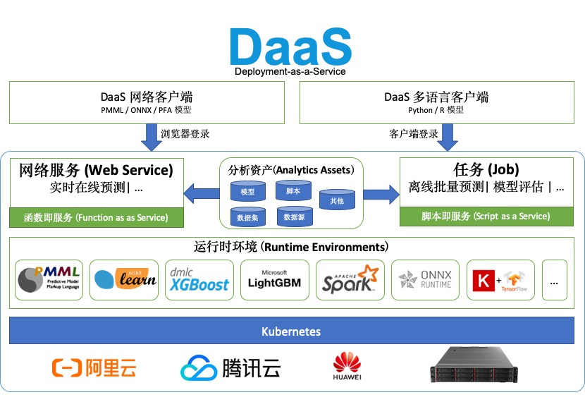

# 深度学习模型部署

## 学习深度学习如何避免成为程序员？

https://www.zhihu.com/question/348474416

- 数据存储
- 数据清洗
- 架构设计
- 组件开发
- 单元与性能测试
- 前端展示
- 生产环境部署

## 将深度学习模型部署为web应用有多难？答案自己找

http://www.lingchenliang.com/post/52329.html

​	传统来说，一般由数据科学家负责开发模型，而前端工程师负责把模型向外界展示。

> Flask 框架:是一个使用 Python 编写的轻量级 Web 应用框架

localhost:50000

## 深度学习模型在移动端部署方法

https://my.oschina.net/u/4391831/blog/3312371

### 1. Keras 转 tflite

　　模型转化之后，就可以在移动端通过 `tflite` 相应的工具进行调用了。比如，如果需要通过c语言的调用的话，则可以将得到的模型转化为c语言的代码。

> TensorFlow Lite: 是一种用于设备端推断的开源深度学习框架。可帮助开发者在移动设备、嵌入式设备和IoT设备上运行TensorFlow模型。

### 2. Pytorch to Onnx

> Open Neural Network Exchange(*ONNX*,开放神经网络交换)，是一个用于表示深度学习模型的标准,可使模型在不同框架之间进行转移。它使得不同的人工智能框架（如Pytorch, MXNet）可以采用相同格式存储模型数据并交互。

---

## 实践指南：如何在生产环境中高效部署深度学习模型

https://news.hexun.com/2019-10-16/198884354.html)

地点：智东西公开课直播间

讲师介绍

　　胡麟，NVIDIA高级系统架构师，硕士毕业于西安交通大学，目前在NVIDIA从事企业级客户深度学习解决方案架构工作，拥有多年异构计算从业经验。

课程内容

　　主题：使用TensorRT Inference Server加速深度学习模型的部署

　　提纲：

　　1.部署深度学习模型的挑战

　　2.如何利用TensorRT Inference Server提升模型部署效率

　　3.Demo：使用TensorRT Inference Server部署图像分类模型

---

## 弹性部署您的AI/ML模型到生产环境中

https://www.autodeploy.ai/cn/

