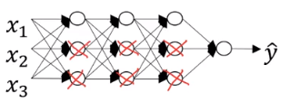
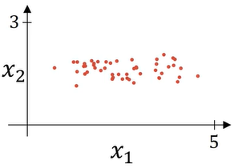
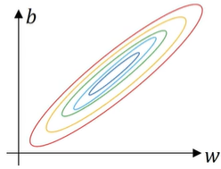
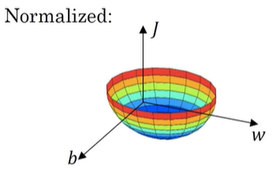
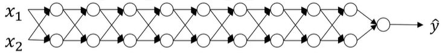
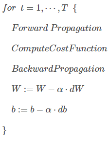
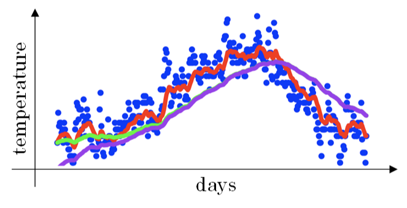

深度学习工程师

由 deeplearning.ai 出品，网易引进的正版授权中文版深度学习工程师微专业课程，让你在了解丰富的人工智能应用案例的同时，学会在实践中搭建出最先进的神经网络模型，训练出属于你自己的 AI。


deeplearning.ai

https://www.coursera.org/learn/neural-networks-deep-learning?action=enroll

https://study.163.com/my#/smarts

https://www.bilibili.com/video/av66524657


**note**

https://blog.csdn.net/red_stone1/article/details/78208851

https://www.zhihu.com/column/DeepLearningNotebook

http://www.ai-start.com/dl2017/


**课后作业**

https://blog.csdn.net/u013733326/article/details/79827273

https://www.heywhale.com/mw/project/5e20243e2823a10036b542da


## Question

- [ ] 改善深层神经网络-[1.11 权重初始化](#winit)，有这个概念，但没在主流模型的代码中见过。


---

## 改善深层神经网络：超参数调试、正则化以及优化

### 第一周 深度学习的实用层面

---

#### 1.1 训练 / 开发 / 测试集

层数、隐藏单元、学习率、激活函数

这些参数都是需要大迭代更新学习的。


一组数据 = 训练集+ 验证集\交叉验证集 + 测试集    普通量级 70 + 0 + 30     60 + 20 +20  数据量级越大 后两者占比越小 百万级别 98 + 1 + 1


**训练集** 加入训练

作用：估计模型，用于训练模型以及确定模型权重

学习样本数据集，通过匹配一些参数来建立一个分类器。建立一种分类的方式，主要是用来训练模型的。

**验证集** 加入训练

作用：确定网络结构或者控制模型复杂程度的参数，

对学习出来的模型，调整分类器的参数，如在神经网络中选择隐藏单元数。验证集还用来确定网络结构或者控制模型复杂程度的参数。

**测试集 ** 不加入训练

作用：检验最终选择最优的模型的性能如何，泛化能力

主要是测试训练好的模型的分辨能力（识别率等）


**不要**在训练集和测试集**分布不同**的情况下训练网络，要确保训练集和测试集使用**同一分布**

**测试集**的目的是让最终所选定的神经网络系统做出**无偏估计**。如果不需要做无偏估计，就不需要测试集。（但比较bug的一点是，这时的验证集又可以被看做是测试集）


---

#### 1.2 偏差 / 方差


高偏差 欠拟合

高方差 过拟合


如果人的误差为 0%

| 训练集误差 |   1%   |  15%   |      15%      |     0.5%      |
| :--------: | :----: | :----: | :-----------: | :-----------: |
| 验证集误差 |  11%   |  16%   |      30%      |      1%       |
|            | 高方差 | 高偏差 | 高偏差+高方差 | 低偏差+低方差 |


太线性 高偏差

太非线性 高方差


方差度量随机变量和其数学期望（即均值）之间的偏离程度

方差越大，数据的波动越大，数据分布比较分散

方差越小，数据的波动越小，数据分布比较集中


---

#### 1.3 机器学习基础

检查偏差，评估训练集性能，如果偏差高（训练集误差大），甚至无法拟合训练集，需要更换一个新的网络（更多层，更多隐藏单元，加大训练时间）

 一旦偏差降到可接受范围，就需要检查方差，评估验证集性能，如果方差高（验证集误差大），正则化/更换网络架构/需要采用更多的数据来训练。

直到找到一个低偏差、低方差的网络。

bias variance trade off 权衡


---

#### 1.4 正则化

如果网络过拟合，即存在高方差的问题。**正则化**可以处理！ 

**L1范数**

向量参数 w 的 L1 范数如下: 
$$
\begin{equation}
\|w\|_{1} =\sum_{i=1}^{n_{y}}|w|
\end{equation}
$$
如果用L1正则化，w最终会是稀疏的。

**L2范数**

向量参数 w 的 L2 范数，用到了欧几里得法线
$$
\begin{equation}\|\omega\|_{2}^{2}=\sum_{j=1}^{n_{x}} \omega_{j}^{2}=\omega^{\top} \omega\end{equation}
$$
如果用L2正则化，w的值会比较小，避免过拟合

**实例**

普通的 logistics 回归任务 $\min _{w, b} J(w, b)$
$$
\begin{equation}J(\omega, b)=\frac{1}{m} \sum_{i=1}^{m} \mathcal{L}\left(\hat{y}^{(i)}, y^{(i)}\right)+\frac{\lambda}{2 m}\|\omega\|_{2}^{2}\end{equation}
$$
其中 w 和 b 是logistics 的两个参数，$w\in \mathbb{R^{nx}}$， $b\in\mathbb{R}$ 

不加 b 的L2范数是因为，w 通常为高维，可以独立表达高偏差问题，b 对模型影响不大，加上也可以。其中 $\lambda$ 是一个需要调整的超参数
$$
J\left(\omega^{[1)}, b^{[1]}, \ldots, \omega^{[L]}, b^{[L]}\right)=\sum_{i=1}^{m} L\left(\hat{y}^{(i)} ,y^{(i)}\right)+\frac{\lambda}{2 m} \sum_{l=1}^{L}\left\|\omega^{[l] }\right\|^{2}_{F}
$$
其中
$$
\| \omega^{[l]}||^{2}=\sum_{i=1}^{n^{[l-1]}} \sum_{j=1}^{n^{[l]}}\left(\omega_{i j}^{[l]}\right)^{2}_{F}
$$
矩阵范式，被定义为矩阵中所有元素的平方求和，其中 w 的 size 为 $(n^{[l]},n^{[l-1]})$ 

被称为 frobenius 范数/F范数    弗罗贝尼乌斯


参数更新公式为
$$
\begin{split}
w^{[l]}&=w^{[l]}-\alpha(backward)
\end{split}
$$


如果加上这个正则项，就相当于对梯度 $dW^{[l]}$ 加上了 $\frac{\lambda}{m}w^{[l]}$
$$
\begin{split}
w^{[l]}&=w^{[l]}-\alpha\left[backward+\frac{\lambda}{m} w^{[l]}\right]\\
&=w^{[l]}-\frac{\alpha\lambda}{m}w^{[l]}-\alpha(backward)
\end{split}
$$
w 的系数是 $(1-\frac{\alpha\lambda}{m})$   **权重衰减**，不论w是什么值，都打算让他变得更小


---

#### 1.5 为什么正则化可以减少过拟合？

$$
J\left(\omega^{[1)}, b^{[1]}, \ldots, \omega^{[L]}, b^{[L]}\right)=\sum_{i=1}^{m} L\left(\hat{y}^{(i)} ,y^{(i)}\right)+\frac{\lambda}{2 m} \sum_{l=1}^{L}\left\|\omega^{[l] }\right\|^{2}_{F}
$$

如果将 $\lambda$ 设置足够大，则 w 足够小，许多隐藏单元减少产生的影响，即减少非线性。（考虑极端，如果其他隐藏单元都不产生影响，只有一个有影响，那就是变成线性回归了）




---

#### 1.6 Dropout 正则化

随机失活，设定节点保留和消除的概率


**inverted dropout 反向随机失活**

根据阈值，生成一个 bool 类型矩阵，与参数 w 矩阵相乘，得到随机失活后的参数矩阵 w。 

```python
d = np.random.rand(a.shape[0], a.shape[1]) < keep_prob
a = np.multiply(a, d)
a = a / keep_prob
```

下一层的计算如下
$$
z = w * a + b
$$
假设`keep_prob = 0.8` ，那么有 20% 的数变成了 0，`a` 的期望变成了原来的 80%， `z` 的期望也变成了原来的80%。

为了不影响 `z` 的期望值，需要给 `a` 除以 0.8 ，修正弥补。


**训练测试**

不同的训练样本，失活的隐藏单元也不同。每次训练数据的梯度不同，则随机对不同隐藏单元归零。每个 epoch 将不同的隐藏单元归零。  

**测试阶段不使用 dropout 函数。也不用除以 `keep_prob`**


---

#### 1.7 理解 Dropout

使用正则化就像是采用一个较小的神经网络。

不愿意吧权重全部放在其中一个特征（输入），因为有可能失活被删除。

实施dropout会减小权重，类似L2正则，预防过拟合。但L2对不同参数的衰减程度不同，

可以针对不同层设置不同的 `keep_prob`


除非算法过拟合（数据不够），否则一般不用dropout

dropout 缺点是损失函数不确定了 。

先关闭 drop 确定损失函数单调递减之后再打开 dropout


---

#### 1.8 其他正则化方法

**数据增强**

扩增数据，即加大数据量


水平**翻转**图片，训练集可以大一倍。还处于同一分布。

或**裁剪**图片，但要确保猫还在图片中。


特殊的数据还可以随意轻微的**旋转**或**扭曲**。


**early stopping**

绘制训练误差和验证误差。验证集误差通常是先变小后变大。在最小值就可以提前停止训练了。

训练神经网络之前，w 很小，在迭代过程中 w 会越来越大。


但是提前停止训练，不能独立的处理代价函数 J 和验证集误差。了解即可，不建议用。

**解决办法就是给J加上正则化项，并不使用early stopping**，这会使超参数搜索空间更容易分解，更容易搜索。缺点就是需要调整正则化参数 $\lambda$


---

#### 1.9 正则化输入

归一化输入 normalizing 



**第一步 零均值化**


$$
\begin{equation}
  \mu=\frac{1}{m} \sum_{i=1}^{m} x^{(i)} \\
 x = x -\mu
\end{equation}
$$
相当于移动数据集。


**第二步 归一化方差**


$$
\begin{equation}
 \sigma^{2}=\frac{1}{m} \sum_{i=1}^{M} x^{(i)} * * 2 \\
 x = x / \sigma
\end{equation}
$$
`**2` 表示每个元素都平方 element-wise

$\sigma^2$ 是一个向量，它的每个特征都有方差，因为均值已经为 0，所以 x 的平方直接就是方差。


**注意**

也应该用**从训练集计算得到的参数**处理**测试集**。




比较狭长。梯度下降可能拐来拐去，才能到最优值。




比较均匀。梯度下降法直接指向最小值，能用较大步长。


---

#### 1.10 梯度消失与梯度爆炸



参数比1大，随层数 L 指数增长。参数比1小，随层数 L 指数递减


---

####  1.11 神经网络的权重初始化<span id="winit"></span>


其中有n个特征
$$
\begin{equation}
 z=\omega_{1} x_{1}+\omega_{2} x_{2}+\cdots \cdot + \omega_{n} x_{n} 
\end{equation}
$$
因为 z 是求和，所以 n 越大，z 越大

合理的方法是设置
$$
W=\frac{1}{n}W
$$
即令其**方差**为 $\frac{1}{n}$，即上一层的特征数量的平方根

```python
w[l] = np.random.randn(n[l],n[l-1]) * np.sqrt(1/n[l-1]) 
```

如果是 `ReLu` 函数，令其**方差**为 $\frac{2}{n}$，

```python
w[l] = np.random.randn(n[l],n[l-1])  * np.sqrt(2/n[l-1]) 
```

如果是 `Tanh` 函数，令其**方差**为 $\frac{1}{n}$。Xavier 初始化

 

> x ~ N(μ, σ²)                  kx ~ N(kμ, k²σ²)
>
> 整个大型前馈神经网络无非就是一个超级大映射，将原始样本**稳定的**映射成它的类别。也就是将样本空间映射到类别空间。
>
> 
>
> 如果样本空间与类别空间的**分布差异**很**大**，比如说**类别空间特别稠密**，**样本空间特别稀疏辽阔**，那么在类别空间得到的用于反向传播的误差丢给样本空间后简直变得微不足道，也就是会导致模型的训练非常缓慢。同样，如果**类别空间特别稀疏**，**样本空间特别稠密**，那么在类别空间算出来的误差丢给样本空间后简直是爆炸般的存在，即导致模型发散震荡，无法收敛。
>
> 因此，我们要让样本空间与类别空间的分布差异（密度差别）不要太大，**也就是要让它们的方差尽可能相等**。


---

#### 1.12 梯度的数值逼近

在反向传播时，有一步梯度检验。对计算数值做逼近

双边误差，更逼近导数，误差量级更小，结果更准确。
$$
\begin{equation}
 f^{\prime}(\theta)=\lim _{\varepsilon \rightarrow 0} \frac{f(\theta+\varepsilon)-f(\theta-\varepsilon)}{2 \varepsilon} 
\end{equation}
$$
逼近误差为 $O(\epsilon^2)$


---

#### 1.13 梯度检验

计算梯度的数值逼近 $d\theta_{approx}$ 和数值解 $d\theta$，比较二者差距。使用欧几里得范数
$$
\begin{equation}
\frac{\left\|d\theta_{approx}-d \theta\right\|_{2}}{\left\|d\theta_{approx}\right\|_{2} +
\left\|d \theta\right\|_{2} }
\end{equation}
$$
误差平方和然后在求平方根，得到欧氏距离。分母预方向量太大或太小。分母为两个参数向量的模之和。

三角形两边之和大于第三边，确保上式落在 $[0, 1]$ 之间。

如果值小于 $1e-7$ 或更小即通过验证。

如果大于 $1e-5$ ，就需要检查有没有其中一项的误差，即两者差值特别大。


---

#### 1.14 关于梯度检验实现的注记

1. 不要在训练中使用梯度检验，只用于debug
2. 如果梯度检验失败。检查每一项逼近解 $d\theta_{approx}$ 和数值解 $d\theta$ 的插值，寻找哪一项误差最大。如果发现某层的 $d\theta^{[l]}$ 特别大，但是 $dw^{[l]}$ 的各项非常接近，那么一定是在计算参数 $b$ 的导数 $db^{[l]}$ 存在bug。同理，如果发现某层的 $d\theta^{[l]}$ 特别大，但是 $db^{[l]}$ 的各项非常接近，那么一定是在计算参数 $w$ 的导数 $dw^{[l]}$ 存在bug。
3. 注意正则化项，要包含进去
4. 不能与dropout共同使用
5. 如果碰到当 $w$ 和 $b$ 接近0时，检验正确；但是训练过程， $w$ 和 $b$ 逐渐变大，检验不通过。可以在一开始做一下梯度检验，训练一段时间后再进行一次梯度检验确保正确。


----

### 第二周 优化算法

#### 2.1 Mini-batch 梯度下降法

特征 X 的 size 为 $[x_n, m]$，标签 Y 的 size 为 $[1,m]$.

如果样本数 m 巨大如 5000000个，训练速度很慢。因为每次迭代都要对所有样本进行进行求和运算和矩阵运算。如果先让梯度下降法处理一部分，算法速度会很快。

可以把训练集**分割**为小一点的子训练集 如1000个一组。子集被称为 **mini-batch**。如下共有 5000 个 mini-batch。

![[公式]](assets/equation.svg)


![[公式]](assets/equation-1617340169208.svg)


一个 mini-batch 的特征 X 的 size 为 $[x_n, 1000]$，标签 Y 的 size 为 $[1, 1000]$.



把所有训练集完整的遍历完为 1 个 epoch。采用 mini-batch 方法 1 个 epoch 梯度下降 5000 次，否则 1 个 epoch 只下降一次。


---

#### 2.2 理解 mini-batch 梯度下降法


mini-batch 梯度不是每次都在下降的。但如果数据足够均匀，右图噪声就越小。

如果mini-batch size =  m （样本数 ），称为batch 梯度下降，只有一个子集就是其本身

如果mini-batch size =  1  ，称为随机梯度下降，每个样本都是一个 mini-batch

随机梯度永远不会收敛，在最小值附近波动


蓝色的线代表 Batch gradient descent，紫色的线代表 Stachastic gradient descent。Batch gradient descent会比较**平稳**地接近全局最小值，但是因为使用了所有m个样本，每次前进的**速度**有些慢。Stachastic gradient descent每次前进**速度**很快，但是路线曲折，有较大的**振荡**，最终会在最小值附近来回波动，难以真正达到最小值处。而且在数值处理上就**不能**使用**向量化**的方法来提高运算速度。

因此要设置一个合适的 mini-batch size


一般来说，如果总体样本数量 $m$ 不太大时，例如 $m≤2000$，建议直接使用Batch gradient descent。

如果总体样本数量 $m$ 很大时，建议将样本分成许多mini-batches。推荐常用的mini-batch size为 64,128,256,512。这些都是2的幂。之所以这样设置的原因是计算机存储数据一般是2的幂，这样设置可以提高运算速度。

---

#### 2.3 指数加权平均

$$
\begin{equation}
 V_{t}=\beta V_{t-1}+(1-\beta) \theta_{t} 
\end{equation}
$$

- **large β:** 适应的慢，相对平滑
- **small β:** 噪声更大，不平滑

如果参数设置为 0.9，即第 $t$ 天与第 $t-1$ 天的气温迭代关系为：
$$
\begin{equation}
 \begin{aligned} V_{t} &=0.9 V_{t-1}+0.1 \theta_{t} \\ &=0.9^{t} V_{0}+0.9^{t-1} \cdot 0.1 \theta_{1}+0.9^{t-2} \cdot 0.1 \theta_{2}+\cdots+0.9 \cdot 0.1 \theta_{t-1}+0.1 \theta_{t} \end{aligned} 
\end{equation}
$$
$β$ 值决定了指数加权平均的天数，近似表示为：
$$
\frac{1}{1-\beta}
$$


指数加权移动平均值

指数加权平均数 


---

#### 2.4 理解指数加权平均


$$
\begin{equation}
 \begin{aligned} V_{t}=& \beta V_{t-1}+(1-\beta) \theta_{t} \\=&(1-\beta) \theta_{t}+(1-\beta) \cdot \beta \cdot \theta_{t-1}+(1-\beta) \cdot \beta^{2} \cdot \theta_{t-2}+\cdots \\ &+(1-\beta) \cdot \beta^{t-1} \cdot \theta_{1}+\beta^{t} \cdot V_{0} \end{aligned} 
\end{equation}
$$


观察上面这个式子，$ \theta_{t}, \theta_{t-1}, \theta_{t-2}, \cdots, \theta_{1} $ 是原始数据值，$ (1-\beta),(1-\beta) \beta,(1-\beta) \beta^{2}, \cdots,(1-\beta) \beta^{t-1} $ 是类似指数曲线，从右向左，呈指数下降的。$V_t$ 的值就是这两个子式的点乘，将原始数据值与衰减指数点乘，相当于做了指数衰减，离得越近，影响越大，离得越远，影响越小，衰减越厉害。


实践中，经常vθ初始化为0

```python
vθ = 0
repeat:
    get next θt
    vθ = β * vθ + (1-β) * θt
```


---

#### 2.5 指数加权平均的偏差修正

上文中提到当 $β=0.98$ 时，指数加权平均结果如下图绿色曲线所示。但是实际上，真实曲线如紫色曲线所示。



我们注意到，紫色曲线与绿色曲线的区别是，紫色曲线开始的时候相对较低一些。这是因为开始时我们设置 $V_0=0$，所以初始值会相对小一些，直到后面受前面的影响渐渐变小，趋于正常。

修正这种问题的方法是进行偏移校正（bias correction），即在每次计算完 $V_t$ 后，对 $V_t$ 进行下式处理：

$$
\begin{equation}
 \frac{V_{t}}{1-\beta^{t}} 
\end{equation}
$$
在刚开始的时候，$t$ 比较小，$(1−β^t)<1$，这样就将 $V_t$ 修正得更大一些，效果是把紫色曲线开始部分向上提升一些，与绿色曲线接近重合。随着 $t$ 增大，$(1−β^t)≈1$ ，$V_t$ 基本不变，紫色曲线与绿色曲线依然重合。这样就实现了简单的偏移校正，得到我们希望的绿色曲线。

机器学习中，偏移校正并不是必须的。因为，在迭代一次次数后（$t$ 较大），$V_t$ 受初始值影响微乎其微，紫色曲线与绿色曲线基本重合。所以，一般可以**忽略初始迭代过程**，等到一定迭代之后再取值，这样就不需要进行偏移校正了。


---

#### 2.6 动量梯度下降法


#### 2.7 RMSprop


#### 2.8 Adam 优化算法


#### 2.9 学习率衰减


#### 2.10 局部最优的问题


---


