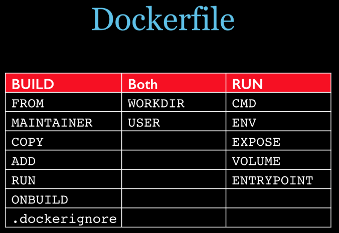
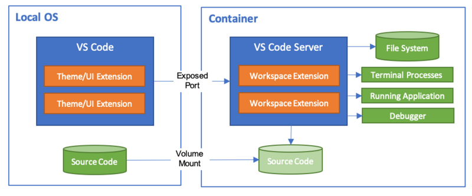

# Docker

## 管理

````bash
# PU-Flow
docker run --runtime=nvidia --rm -it -w /home -v /home/duan/windows/udata:/home/data/ -v /tmp/.X11-unix:/tmp/.X11-unix -e DISPLAY=unix$DISPLAY -e GDK_SCALE -e GDK_DPI_SCALE nvidia/cudagl:10.2-devel-ubuntu18.04

docker commit -p 43d4f8e0674a nvidia/cudagl:10.2-devel-ubuntu18.04

tensorboard --logdir ./runs/lightning_logs
````

```bash
# latent_3d_points_Pytorch  
# pointnet.pytorch
# NICE
# MSN
docker run --runtime=nvidia --rm -it -p 127.0.0.2:8097:8097 -w /home -v /home/duan/windows/udata:/home/data/ -v /tmp/.X11-unix:/tmp/.X11-unix -e DISPLAY=unix$DISPLAY -e GDK_SCALE -e GDK_DPI_SCALE nvidia/cudagl:duan

docker commit -p 06ea5c52cbaa nvidia/cudagl:duan
python -m visdom.server # 开启visdom服务

http://127.0.0.2:8097/

# /usr/local/lib/python3.6/dist-packages/
```

```bash
# samplenet
docker run --runtime=nvidia --rm -it -w /home -v /home/duan/windows/udata:/home/data/ -v /tmp/.X11-unix:/tmp/.X11-unix -e DISPLAY=unix$DISPLAY -e GDK_SCALE -e GDK_DPI_SCALE tensorflow/tensorflow:1.13.2-gpu-py3

docker commit -p f3c9beddda91 tensorflow/tensorflow:1.13.2-gpu-py3
```

```bash
# pugan
docker run --runtime=nvidia --rm -it -w /root/PU-GAN -v /home/duan/windows/udata:/home/data/ -v /tmp/.X11-unix:/tmp/.X11-unix -e DISPLAY=unix$DISPLAY -e GDK_SCALE -e GDK_DPI_SCALE tensorflow/pu-gan:latest

docker commit -p f3c9beddda91 tensorflow/pu-gan:latest
```


## 安装

```
//由于apt官方库里的docker版本可能比较旧，所以先卸载可能存在的旧版本：
sudo apt-get remove docker docker-engine docker-ce docker.io
//更新apt包索引：
sudo apt-get update
//安装以下包以使apt可以通过HTTPS使用存储库（repository）：
sudo apt-get install -y apt-transport-https ca-certificates curl software-properties-common
//添加Docker官方的GPG密钥：
curl -fsSL https://download.docker.com/linux/ubuntu/gpg | sudo apt-key add -
//使用下面的命令来设置stable存储库：
sudo add-apt-repository "deb [arch=amd64] https://download.docker.com/linux/ubuntu $(lsb_release -cs) stable"
//再更新一下apt包索引：
sudo apt-get update
//安装最新版本的Docker CE：
sudo apt-get install -y docker-ce
```

## 查看状态

```
systemctl status docker

//启动
sudo systemctl start docker
sudo systemctl stop docker

//hello world：
sudo docker run hello-world
```


## 设置docker权限

```
sudo groupadd docker #添加docker用户组

sudo gpasswd -a $USER docker #将登陆用户加入到docker用户组中

newgrp docker #更新用户组
```


## 编写dockerfile文件

```dockerfile
From nvidia/cuda:9.0-cudnn7-devel-ubuntu16.04

LABEL version="1.0" maintainer="Unknownue <unknownue@outlook.com>"

ARG DEBIAN_FRONTEND=noninteractive

# COPY mirror-ubuntu1604.txt /etc/apt/sources.list

RUN apt update && \
    apt install -y software-properties-common && \
    apt install -y wget git && \
    add-apt-repository ppa:deadsnakes/ppa && \
    add-apt-repository ppa:ubuntu-toolchain-r/test

# Install python and pip
RUN apt update && \
    apt install -y python3.6 python3.6-tk && \
    wget https://bootstrap.pypa.io/get-pip.py && \
    python3.6 get-pip.py && rm get-pip.py && \
    ln -sf /usr/bin/python3.6 /usr/bin/python && \
    ln -sf /usr/bin/python3.6 /usr/bin/python3 && \
    ln -sf /usr/bin/pip3 /usr/bin/pip

# change the source & use the aliyun miror
# RUN pip install pqi && \
#     pqi use aliyun

# Install tensorflow
RUN pip install --no-cache-dir tensorflow-gpu==1.11.0
RUN pip install --no-cache-dir numpy==1.15.4 matplotlib==2.2.0 scikit-learn==0.20.0 && \
    pip install --no-cache-dir plyfile Pillow tqdm

RUN pip install --no-cache-dir open3d==0.9.0 && \
    apt install -y libgl1-mesa-glx python-apt && \
    cp /usr/lib/python3/dist-packages/apt_pkg.cpython-35m-x86_64-linux-gnu.so /usr/lib/python3/dist-packages/apt_pkg.cpython-36m-x86_64-linux-gnu.so && \
    apt update && \
    apt upgrade -y libstdc++6 && \
    rm /usr/bin/python && \
    ln -sf /usr/bin/python3.6 /usr/bin/python

CMD ["bash"]
```





/dev/sda1: LABEL="DUAN" UUID="CABE4987BE496D4F" TYPE="ntfs" PARTUUID="ba8c85ef-01"

/dev/sda1       812G  408G  405G   51% /media/duan/DUAN


```
安装python
下载tar 解压并make install
# 软链接
sudo ln -sf /usr/local/python3/bin/python3.7 /usr/bin/python
sudo ln -sf /usr/bin/pip3 /usr/bin/pip
```


## 更换apt软件源

```bash
https://developer.aliyun.com/mirror/

https://developer.aliyun.com/mirror/ubuntu?spm=a2c6h.13651102.0.0.3e221b11FlkJJ3

echo "deb http://mirrors.aliyun.com/ubuntu/ bionic main restricted universe multiverse
deb-src http://mirrors.aliyun.com/ubuntu/ bionic main restricted universe multiverse

deb http://mirrors.aliyun.com/ubuntu/ bionic-security main restricted universe multiverse
deb-src http://mirrors.aliyun.com/ubuntu/ bionic-security main restricted universe multiverse

deb http://mirrors.aliyun.com/ubuntu/ bionic-updates main restricted universe multiverse
deb-src http://mirrors.aliyun.com/ubuntu/ bionic-updates main restricted universe multiverse

deb http://mirrors.aliyun.com/ubuntu/ bionic-proposed main restricted universe multiverse
deb-src http://mirrors.aliyun.com/ubuntu/ bionic-proposed main restricted universe multiverse

deb http://mirrors.aliyun.com/ubuntu/ bionic-backports main restricted universe multiverse
deb-src http://mirrors.aliyun.com/ubuntu/ bionic-backports main restricted universe multiverse" > /etc/apt/sources.list

rm -r /etc/apt/sources.list.d
apt clean
apt update
```


## 运行dockerfile编译并生成镜像

```
docker build -f Dockerfile -t myubunut:0.1 .
-f 指定要使用的Dockerfile路径
-t 镜像的名字及标签,通常 name:tag
.表示当前路径 
```


###  Problem

1. 报错

```
W: GPG error: https://developer.download.nvidia.com/compute/cuda/repos/ubuntu1604/x86_64  Release: The following signatures were invalid: BADSIG F60F4B3D7FA2AF80 cudatools <cudatools@nvidia.com>
E: The repository 'https://developer.download.nvidia.com/compute/cuda/repos/ubuntu1604/x86_64  Release' is not signed.
由于没有公钥，无法验证下列签名
```


```
ADD sources.list /etc/apt/
不需要更新nvidia的源 替换即可

开vpn解决

解决
apt-key adv --keyserver keyserver.ubuntu.com --recv-keys F60F4B3D7FA2AF80 && \
```


### 查看镜像变更历史

```
docker history myubunut:0.1
```


### 查看修改镜像名

```
docker images
docker tag 174a07eaba1e myubuntu:docker

此时仓库中有两个镜像，镜像id相同，只是多了一个tag标签，也就是多了一个引用。删除不需要的引用即可，删除时必须用tag删除，用镜像id删除会物理性的删除镜像，这两个引用会同时被删除掉。

docker rmi myubunut:0.1
```


### 运行docker容器

```
sudo docker run -it myubuntu:docker /bin/bash
```


### 查看/删除镜像

```
docker images
docker rmi fb93e677d775
```


### 查看/删除运行容器

```
docker ps
docker ps -a

docker rm fb93e677d775 
```


https://www.qikegu.com/docs/2970

https://zixuephp.net/manual-docker-2139.html


### 修改docker镜像路径-根目录容量不足/更新后镜像丢失

https://www.cnblogs.com/bigberg/p/8057807.html

```bash
# 2.1 修改docker.service文件　
cd /etc/systemd/system/multi-user.target.wants

vi docker.service

ExecStart=/usr/bin/dockerd --graph=/data/docker --storage-driver=overlay --registry-mirror=https://jxus37ad.mirror.aliyuncs.com

--graph=/data/docker：docker新的存储位置
--storage-driver=overlay ： 当前docker所使用的存储驱动
注：存储驱动貌似不改也会变成overlay
　　
# 2.2 重启docker　
systemctl daemon-reload
systemctl restart docker
docker info

# 2.3
--graph=/home/duan/workspace/docker
```


### 导入镜像

```bash
docker load -i PU-GAN.img
```


---

## Nvidia docker

本机安装nividia显卡驱动

https://zhuanlan.zhihu.com/p/59618999


安装nvidia docker2

https://www.cnblogs.com/answerThe/p/12238990.html

最后测试镜像cuda:10.2


### 各种启动命令


```
docker run --runtime=nvidia --rm -it unknownue/pu-flow:latest
```

- -i 表示 把交互界面保留着
- -t 表示 作用是分配一个虚拟的终端
- --rm 表示  容器退出后，自动删除容器
- --runtime=nvidia 表示  开启gpu

https://github.com/DuanYaQi/PU-Flow


```
# 测试nvidia-smi命令
docker run --runtime=nvidia --rm nvidia/cuda:9.0-base nvidia-smi

# 测试tensorflow是否能正确被import
docker run -it --rm tensorflow/tensorflow \
       python -c "import tensorflow as tf; tf.enable_eager_execution();
print(tf.reduce_sum(tf.random_normal([1000, 1000])))"

# 测试nvidia和tf是否能连上
docker run -it --rm --runtime=nvidia tensorflow/tensorflow:latest-gpu-py3 python

# 开启jupyter 若成功开启，则在本地浏览器输入：服务器ip地址，8866端口，加秘钥。就可以进入jupyter页面
docker run -u \$(id -u):\$(id -g) -it --runtime=nvidia -p 8866:8888 tensorflow/tensorflow:latest-gpu-py3-jupyter

# 创建高级的gpu-py3
docker run -u $(id -u):$(id -g) --runtime=nvidia -it -p 8876:6006 -v ~/test:/code_dir -w /code_dir tensorflow/tensorflow:nightly-gpu-py3


-u 指定使用的用户，为了避免一些文件创建的问题
--runtime=nvidia 指定该容器能使用底层的nvidia gpu
-p 8876:6006 是为了让tensorboard的6006端口能映射到宿主机的8876端口，从而使得远程可以看tensorboard
-v 是将本地的目录test映射到容器的code_dir中。你先把代码在test目录里面写好，然后在容器内部运行。在容器里面只干一件事，就是跑服务。
-w 是指定进去容器的初始目录在哪里，这里建议就是进映射的那个目录。
后面的就是指定了tensorflow的版本，目前都是用py3，不要再用py2了。


# 如果想开一个jupyter和tensorboard的二合一服务
# 先开启一个jupyter的后台服务
docker run -u $(id -u):$(id -g) --runtime=nvidia -d -p 8878:8888 -p 8876:6006 -v ~/test3:/code_dir -w /code_dir tensorflow/tensorflow:nightly-gpu-py3-jupyter

这时候是以-d的方式执行，所以不会显示乱七八糟的内容。但是要查看token才能从外面进jupyter呀：
docker exec 容器名 jupyter notebook list

查看到了之后，jupyter就完成了。然后开tensorboard后台服务：
docker exec -d blissful_hypatia tensorboard --logdir=/code_dir/TensorBoard

至此成功。
```

Docker_1_nvidia-docker+tensorflow-gpu搭建和使用 https://zhuanlan.zhihu.com/p/64741420

基于 Docker 搭建 TensorFlow 开发环境https://segmentfault.com/a/1190000015053704?utm_source=channel-hottest

ubuntu16.04 docker tensorflow-gpu镜像使用https://www.cnblogs.com/deepllz/p/9009486.html

从零开始用docker 搭建tensorflow gpu 环境https://blog.csdn.net/qq_37341836/article/details/80303357


```
docker cp /home/duan/windows/Workspace/PU-Flow/runs/PUGAN/ckpt/4577251581f7b1fe1dea6f6320002e46ba1348b4-PatchSRFlow-resort4-100epoch.ckpt af6c9fadb71c:/home/
```


```
docker commit -a "duan" -m "mkdir test" -p 401ad1da19e4 unknownue/pu-flow:latest
```


## docker pull速度问题

阿里云公开镜像找

https://cr.console.aliyun.com/cn-hangzhou/instances/images

```
sudo vi /etc/docker/daemon.json

{
    "runtimes": {
        "nvidia": {
            "path": "nvidia-container-runtime",
            "runtimeArgs": []
        }
    },
    "registry-mirrors": ["https://foqt1i8i.mirror.aliyuncs.com"]
}


sudo systemctl daemon-reload
sudo systemctl restart docker
```


---

# docker + GUI显示

## X11 socket

### core

```bash
sudo apt-get install x11-xserver-utils
xhost +
```


```bash
 -v /tmp/.X11-unix:/tmp/.X11-unix \           #共享本地unix端口
 -e DISPLAY=unix$DISPLAY \                    #修改环境变量DISPLAY
 -e GDK_SCALE \                               #我觉得这两个是与显示效果相关的环境变量，没有细究
 -e GDK_DPI_SCALE \
```


```bash
# 每次开机，运行一次
xhost +
```


```
sudo apt-get install xarclock       #安装这个小程序
xarclock  
```


---

​	Docker通过namespace将容器与主机上的网络和运行环境进行了隔离，默认情况下，在容器中运行带界面的软件在外部是看不到的。

​	可以通过共享X11套接字让外部主机显示容器中运行的程序界面的方法。并讨论在**『运行本地的GUI程序』**和**『运行远程服务器上的GUI程序』**两种场景的下的实现原理。

​	X11图形显示方式为 Client/Server模式，在服务端和客户端之间，X11通过『DISPLAY』环境变量来指定将图形显示到何处。

[应用程序]->[X11客户端]->[X11服务端]->[显示屏幕]

​	DISPLAY的格式是『unix:端口』或『主机名:端口』，前一种格式表示使用本地的unix套接字，后一种表示使用tcp套接字。

​	默认情况下，X11的服务端会监听本地的『unit:0』端口，而DISPLAY的默认值为『:0』，这实际上是『unit:0』的简写。因此如果在Linux的控制台启动一个图形程序，它就会出现在当前主机的显示屏幕中。	

​	基于这个原理，将Docker中的GUI程序显示到外面，就是通过某种方式把X11的客户端的内容从容器里面传递出来。基本的思路无非有两种：

1. 通过SSH连接或远程控制软件，最终通过tcp套接字将数据发送出来
2. 让容器和主机共享X11的unix套接字，直接将数据发送出来

​    从应用场景上划分，又可以分成两类情况：『运行本地的GUI程序』和『运行远程服务器上的GUI程序』。这两类情况在操作上很相似，但前者可以使用unix套接字，而后者必然要使用tcp套接字转发，原理上有很大差别。

### 本地docker运行GUI程序

```bash
docker run -d \
  -v /etc/localtime:/etc/localtime:ro \
  -v /tmp/.X11-unix:/tmp/.X11-unix \
  -e DISPLAY=unix$DISPLAY \
  -v $HOME/slides:/root/slides \
  -e GDK_SCALE \
  -e GDK_DPI_SCALE \
  --name libreoffice \
  jess/libreoffice
```


​	其中的**『-v /tmp/.X11-unix:/tmp/.X11-unix』**参数就是将主机上X11的unix套接字共享到了容器里面。因为每个unix套接字实际上就是系统/tmp/.X11-unix目录下面依据套接字编号命名的一个特殊文件。

​	由于X11服务默认只允许『来自本地的用户』启动的图形程序将图形显示在当前屏幕上。

​	解决的办法很简单，允许所有用户访问X11服务即可。这个事情可以用xhost命令完成。

```bash
sudo apt-get install x11-xserver-utils
xhost + # 参数『+』表示允许任意来源的用户。
```

​	由于是直接共享了X11的unix套接字，在效率上与运行安装在主机上的程序基本没有差异。

### 远程服务器docker运行GUI程序

​	此时，整个数据连接实际就变成了这样的：

[应用程序]->[X11客户端]->[SSH服务端]->[SSH客户端]->[X11服务端]->[显示屏幕]

​	这种情况实际上已经演化成为了通过tcp套接字转发的X11连接，只不过用户并没有直接使用SSH连接到容器里面的tcp端口上，而是连接到了远程主机。相应的X11数据先从容器传递到了主机，再通过SSH通过传递到了用户的电脑上。

​	这就必须有**要求用于展示的用户电脑安装有X11服务**，大多数的Linux系统默认就具备了，Mac系统可以安装XQuartz软件，Windows则可以使用Xming等第三方X11服务端实现。首先将本地的X11服务运行起来。

​	其次，当用户使用SSH连接运行程序的服务器时，应该开启SSH的**『X11-Forwarding』**功能。具体来说，有两个注意点。

​	**1）**检测服务器上的/etc/ssh/sshd_config文件，是否已经有『X11Forwarding yes』这样的配置，如果没有则需要加上。

​	**2）**当连接到服务器时，应该在ssh命令后面加上-X参数，表示使用X11-Forwarding特性。

```bash
ssh -X <user>@<ip-addr>   #-X参数
```

​	

​	登陆上去后运行刚才的docker run命令，并不能看到LibreOffice运行起来的迹象。通过`docker logs libreoffice`发现错误还是『Failed to open display』。在前面已经说过，对于远程连接运行GUI的情况，必然要换成tcp套接字的X11转发方式。而命令中的『-v /tmp/.X11-unix:/tmp/.X11-unix』参数仅仅是共享了unix套接字。那么怎样才能换成tcp套接字呢？需要修改两个地方：

​	**1）**首先为容器里面设置的环境变量『DISPLAY』，不能是『unix$DISPLAY』了

​	**2）**其次共享unix套接字可以不必了，而是要用『--net=host』让容器内的网络环境与主机共享

​	DISPLAY改成什么呢？首先要看SSH登陆后得到的系统DISPLAY变量值，我这里看到的是『localhost:10.0』，主机的localhost:10.0到了容器里面就要变成0.0.0.0:10.0。原因不解释了，这个是Docker默认添加的映射。

​	因此DISPLAY的值应该赋予『0.0.0.0:10.0』。可以简写为『:10.0』，X11会先去找unix:10.0，发现没有那个套接字文件，然后就会去试0.0.0.0:10.0。结果是一样的。修改过后的启动命令变成了：

```bash
docker run -d \
  -v /etc/localtime:/etc/localtime:ro \
  --net=host \
  -e DISPLAY=:10.0 \
  -v $HOME/slides:/root/slides \
  -e GDK_SCALE \
  -e GDK_DPI_SCALE \
  --name libreoffice \
  jess/libreoffice
```

​	再次运行这个镜像，然而，依旧没有看到LibreOffice。查看Docker logs，这次的错误信息是：

『X11 connection rejected because of wrong authentication』。

​	这是因为在使用SSH通道转发X11时，会生成一个随机的授权cookie，存放在服务器的Xauthority文件中。这个cookie会在每次X11客户端发送数据时被用到。

​	我们使用了**『--net=host』**参数后，容器中的X11客户端将直接通过tcp套接字与外部通信，然而容器里面并没有这个授权文件。因此我需要加上参数『-v $HOME/.Xauthority:/root/.Xauthority』把授权文件也放到容器里面。

​	此外，启动命令中的两个GDK开头的环境变量在服务器端的Ubuntu上是不存在的，因此也可以删掉。

```bash
docker run -d \
  -v /etc/localtime:/etc/localtime:ro \
  --net=host \
  -e DISPLAY=:10.0 \
  -v $HOME/slides:/root/slides \
  -v $HOME/.Xauthority:/root/.Xauthority \
  --name libreoffice \
  jess/libreoffice
```

​	执行这个命令后，就看到LibreOffice已经在本地电脑的显示器上运行起来啦！

### QA

**问题1. X11是什么，与KDE有什么区别？**

**林帆：**X11是Linux下面的界面显示服务。KDE是一种窗口管理软件，是具体的界面，X11是在更下面一层的协议层。

**问题2. 在服务端运行GUI镜像时会收到网络的影响画面卡顿吗?**

**林帆：**这个和网速关系比较大。

**问题3. 通过这种gui方式，是不是可以做docker桌面云了？**

**林帆：**不算是，因为这种做法需要SSH登录，其实有点不安全.

**问题4.可以多用户连接同一docker image不？就像remote desktop service一样？**

**林帆：**用这种方式不能，SSH的X-Forwarding是单点的。

**问题5.可以考虑用xvfb吗？**

**林帆：**原理上是可以的，不过这样就看不到运行的界面了。

**问题6.理论上讲,只要配置合理正确并且GUI支持X11,这种方式可以运行大部分linux下的gui应用?**

**林帆：**是的，对于应用程序本身感觉不到图像是被现实到了本地还是远程的屏幕上

**问题7. 请问在docker上运行的gui应用，应用间的互操作性如何保障？x11协议应该只能转发显示数据，无法转发实际数据（如电子表格中的数据，用以粘贴到其他打开的文档文件中），是否有其他协议可以保证互操作性？**

**林帆：**目前看来互操作的话只能用其他协议代替X11了，比如VNC或者FreeNX。X11协议中，剪贴板的数据都是保存在X的客户端，两个远程窗口之间不能共享。

---

## 已经启动的容器修改系统参数


## References

Docker容器图形界面显示（运行GUI软件）的配置方法

https://blog.csdn.net/ericcchen/article/details/79253416


 Docker容器显示图形到宿主机屏幕

https://blog.csdn.net/Frank_Abagnale/article/details/80243939?utm_medium=distribute.pc_relevant.none-task-blog-BlogCommendFromMachineLearnPai2-3.channel_param&depth_1-utm_source=distribute.pc_relevant.none-task-blog-BlogCommendFromMachineLearnPai2-3.channel_param


Docker容器通过X11转发显示图形界面

https://blog.csdn.net/lucifly/article/details/89030118?utm_medium=distribute.pc_relevant.none-task-blog-BlogCommendFromMachineLearnPai2-3.channel_param&depth_1-utm_source=distribute.pc_relevant.none-task-blog-BlogCommendFromMachineLearnPai2-3.channel_param


docker中使用matplotlib显示图片

https://blog.csdn.net/weixin_42698556/article/details/86661877


---

# docker + vscode

## docker配置篇

​	在 docker 中不应该启用 ssh 服务，并且 VSCode 似乎也是可以直接通过 docker 容器远程连接[3]


##  vscode配置篇


### remote-containers

​	安装对应的插件remote development extension pack

​	重启vscode 左下角>< 点击，remote-containers



​	源代码通过卷映射进去的。命令行和运行app和debugger都是在容器中完成的。

### 容器内打开项目

​	运行docker run 之后

​	选择 remote-containers: attach to running  container 会进入到附加到一运行的容器中的过程，选择对应的容器即可。

​	然后安装对应的语言的扩展，即可进行操作

### 修改配置

​	devcontainer.json文件

### 管理扩展

​	本地

​	远程的


## References

在 VS Code 中使用容器开发

https://zhuanlan.zhihu.com/p/88565144

https://code.visualstudio.com/docs/remote/attach-container

https://code.visualstudio.com/docs/remote/containers


VSCode+Docker: 打造最舒适的深度学习环境

https://zhuanlan.zhihu.com/p/80099904


VSCode玩转远程开发之Docker容器

https://zhuanlan.zhihu.com/p/129908390


Docker+VSCode 配置属于自己的深度学习炼丹炉

https://mp.weixin.qq.com/s?__biz=MzIwOTc2MTUyMg==&mid=2247496031&idx=2&sn=c4cffb694e7b6da6aeda11b55fcc4b12&chksm=976c54c2a01bddd40335bd34cfe983319f956f44e7dc92c368d658a5b929d84c6240e3ca232f&mpshare=1&scene=1&srcid=&sharer_sharetime=1581209859633&sharer_shareid=69c2dc2b0fd2	e402d2771218812300dc&key=2c4881e20dc9fe0ff3aeb777a0a5fd6f5c4dda40604a9c3a5926fcb8fbe7f4f6c349d2b6339e37951652d72842ebf715aeaa83be7875406c5a6f950d25d9237fc11b5800d03c3e8e8817fdbf868f89b0&ascene=1&uin=Nzg1Mzk1MTg0&devicetype=Windows+10&version=62080079&lang=zh_CN&exportkey=AeXgoaqBS0aeerNEurcioQA%3D&pass_ticket=QCK5Q2BnABxVpCO5L0EUmesGL3sGiHOXgOGT1%2B6DCaa6KDpnGSQT19URVzskJdq7

---

# docker cpu
<<<<<<< HEAD:T_Docker+Git.md
=======

cpu限制分析 https://blog.csdn.net/asd05txffh/article/details/52267818Docker 

Docker: 限制容器可用的 CPU https://www.cnblogs.com/sparkdev/p/8052522.html
>>>>>>> a422c3362363be336f2919522247dfed5665e492:T_Docker+Git.md

cpu限制分析 https://blog.csdn.net/asd05txffh/article/details/52267818Docker 

Docker: 限制容器可用的 CPU https://www.cnblogs.com/sparkdev/p/8052522.html


---


---

# Git

## 流程


Workspace：工作区

Index/Stage： 暂存区

Repository：仓库

Remote：远程仓库


## 管理

### 创建版本库

​	在一个目录下`git init`，把这个目录变成 git 可以管理的仓库

​	目录中的.git 是Git来跟踪管理版本的

---

### 添加暂存区

​	在该目录下新建文件 readme.txt，使用命令`git add readme.txt` 添加到暂存区

---

### 提交仓库

​	命令`git commit -m '添加了readme文件' `提交文件

---

### 查看状态

​	命令`git status` 查看是否还有文件未提交

​	nothing to commin, working directory clean

---

### 修改文件

​	修改readme.txt文件后，`git status`告诉我们被修改但未提交的内容。

---

### 查看不同

​	`git diff readme.txt`查看readme文件的不同

---

### 历史记录

​	继续修改readme.txt ，并添加提交。

​	`git log` 或 `git log –pretty=oneline`，查看历史记录，后边会跟每次提交的版本号

​	`git reflog` 查看全部记录

---

### 版本回退

​	`git reset --hard 6bcfc1f` 

---

### 撤销修改

​	readme.txt文件里面增加一行 内容为555555555555，未提交之前，我发现添加5555555555555内容有误，需要恢复以前的版本。

​	`git status` 、`git checkout -- readme.txt` 可以丢弃工作区的修改


---

### 删除文件

​	提交了b.txt文件，并提交了b.txt文件。这时在工作区删除了b.txt文件

​	若需要回复b.txt文件，`git checkout -- b.txt`

---


## 仓库操作

### 创建ssh key

```
ssh-keygen -t rsa –C “youremail@example.com”
```

​	登录github，setting 中的 SSH Keys 页面 add ssh keys ：填写任意 titile 、 key文本框粘贴pub的内容、点击addkey


### 添加远程库

​	本地创建了一个git仓库后，又想在github上创建一个git仓库，并且希望两个仓库远程同步。

​	github上 create a new repo 创建一个新仓库。

​	`git remote add origin https://github.com/***/***.git` 添加链接关系

​	`git push -u origin master` 把本地仓库分支master内容推送到元仓库去


​	只要本地做了提交`git commit`，就可以通过`git push origin master` 把本地master分支的最新修改推送到github上了


### 创建并合并分支

​	`git checkout -b dev` 创建并切换至dev分支，相当于`git branch dev,git checkout dev`

​	`git branch` 查看当前的分支，当前分支前有*号

​	在dev分支进行add、commit操作，不会影响 master 分支

​	`git merge dev` 在master分支上合并了dev的内容

​	`git branch -d dev` 合并完之后，可以删除dev分支


### 解决冲突

​	merge conflict in readme.txt

​	<<<HEAD是指主分支修改的内容，>>>>>dev 是指dev上修改的内容

​	将dev上的内容修改成与主分支相同的内容


### 合并历史

​	`git log`


### 分支管理策略

​	通常合并分支时，git一般使用”Fast forward”模式，在这种模式下，删除分支后，会丢掉分支信息，现在我们来使用带参数 –no-ff来禁用”Fast forward”模式

​	创建一个dev分支 `git checkout -b dev`

​	修改readme.txt内容

​	添加到暂存区 `git add readme.txt`    `git commit -m 'test'`

​	切换回主分支(master) `git checkout master`

​	合并dev分支，使用命令 git merge –no-ff -m “注释” dev `git merge --no--ff -m 'test' dev`

​	查看历史记录 `git branch -d dev`


### bug分支

​	比如我在开发中接到一个404 bug时候，我们可以创建一个404分支来修复它，但是，当前的dev分支上的工作还没有提交。并不是我不想提交，而是工作进行到一半时候，我们还无法提交。


​	比如我这个dev要2天完成，但是我issue-404 bug需要5个小时内完成。怎么办呢？还好，Git还提供了一个stash功能，可以把当前工作现场 ”隐藏起来”，等以后恢复现场后继续工作。如下

​	`git stash` 将当前工作现场隐藏起来

​	`git status` 查看状态，没有任何变换

​	`git checkout -b issue-404`创建并切换临时分支404 以解决bug

​	`git add bug.txt & git commit -m 'fix bug'`解决bug并添加提交

​	`git checkout master`切换到主分支

​	`git merge --no--ff -m 'merge bug fix' issue-404` 合并分支issue-404的内容

​	`git branch -d issue-404` 删除无用分支

​	`git checkout dev` 回到dev继续开发

​	`git stash list` 查看之前保存的工作现场

​	`git stash pop` 恢复同时把保存的工作现场删除  或者`git stash apply` 恢复并不删除


## 多人协作

​	当你从远程库克隆时候，实际上Git自动把本地的master分支和远程的master分支对应起来了，并且远程库的默认名称是origin。

​	要查看远程库的信息，使用 `git remote`

​	要查看远程库的详细信息，使用 `git remote –v`

### 推送分支

​	推送分支就是把该分支上所有本地提交到远程库中，推送时，要指定本地分支，这样，Git就会把该分支推送到远程库对应的远程分支上：使用命令 `git push origin master`

​	推送到其他分支，比如dev分支上，还是那个命令 `git push origin dev`

​	master分支是主分支，因此要时刻与远程同步。一些修复bug分支不需要推送到远程去，可以先合并到主分支上，然后把主分支master推送到远程去。


### 抓取分支

​	多人协作时，大家都会往master分支上推送各自的修改。现在我们可以模拟另外一个同事，可以在另一台电脑上（注意要把SSH key添加到github上）或者同一台电脑上另外一个目录克隆，新建一个目录名字叫testgit2

​	但是我首先要把dev分支也要推送到远程去，`git push origin dev`

​	接着进入testgit2目录，进行克隆远程的库到本地来

​	现在我们的小伙伴要在dev分支上做开发，就必须把远程的origin的dev分支到本地来，于是可以使用命令创建本地dev分支 `git checkout -b dev origin/dev`

​	现在小伙伴们就可以在dev分支上做开发`git add`   `git commit`  

​	开发完成后，把现在的dev分支推送到远程去`git push origin dev`


​	小伙伴们已经向origin/dev分支上推送了提交，而我在我的目录文件下也对同样的文件同个地方作了修改，也试图推送到远程库时：

​	推送失败，因为我的小伙伴最新提交的和我试图推送的有冲突，解决的办法也很简单，上面已经提示我们，**先用git pull把最新的提交从origin/dev抓下来，然后在本地合并，解决冲突，再推送**。

​	git pull也失败了，原因是没有指定本地dev分支与远程origin/dev分支的链接，根据提示，设置dev和origin/dev的链接：如下

​	`git branch --set-upstream dev origin/dev`

​	`git pull`

​	修改后add、commit后

​	`git push origin dev`


因此：多人协作工作模式一般是这样的：

​	首先，可以试图用git push origin branch-name推送自己的修改.
​	如果推送失败，则因为远程分支比你的本地更新早，需要先用 git pull 试图合并。
​	如果合并有冲突，则需要解决冲突，并在本地提交。再用 git push origin branch-name 推送。    


参考文章

Git使用教程：最详细、最傻瓜、最浅显、真正手把手教！（又一篇万字长文）

https://mp.weixin.qq.com/s?__biz=MzIwNTc4NTEwOQ==&mid=2247487611&idx=2&sn=67022b1b6bf75927bc77b6b09f4369f6&chksm=972ac101a05d4817988b050809674f7965be2fd197019927ea78cf73e8ff5262826bb709c15f&mpshare=1&scene=1&srcid=&sharer_sharetime=1575827298777&sharer_shareid=69c2dc2b0fd2e402d2771218812300dc&key=2c4881e20dc9fe0fdd3dc66efae2c29fb7f73cce2c4a71f9bab65cd7d7118d806e9e726f909354bfc0c5e8f6e337f2cdf47f993983544f21d1f0e32f9bc9e53eb23dcaadcda91f84e426f02eb5275c28&ascene=1&uin=Nzg1Mzk1MTg0&devicetype=Windows+10&version=62080079&lang=zh_CN&exportkey=AY59imMjuDalEq%2B2FAmFklg%3D&pass_ticket=QCK5Q2BnABxVpCO5L0EUmesGL3sGiHOXgOGT1%2B6DCaa6KDpnGSQT19URVzskJdq7


## 冲突实战

​	git checkout master

​	git pull https://github.com/unknownue/PU-Flow.git

​	git push -u origin master

### fork 更新

https://blog.csdn.net/ganquanzhong/article/details/103023081


# Git + Typora

## github

​	创建仓库PointCloudDoc


## 初始化文件夹

```
git init
```


## 添加提交

```
git add .
git commit -m "first commit"
```


## 添加仓库关联

```
git remote add origin git@github.com:DuanYaQi/PointCloudDoc.git
```


## push仓库

```bash
git push -u origin master  #-u 设置默认分支为master
```


## 删除某个分支

```bash
git push origin :main
```


## 删除一个文件所有历史记录日志

```shell
git filter-branch --force --index-filter 'git rm --cached --ignore-unmatch T_Temp.md' --prune-empty --tag-name-filter cat -- --all

##############################解释#################################
git filter-branch --index-filter 让每个提交的文件都复制到索引(.git/index)中
然后运行过滤器命令：git rm --cached --ignore-unmatch 文件名 ，让每个提交都删除掉“文件名”文件
然后--prune-empty 把空的提交“修剪”掉
然后--tag-name-filter cat 把每个tag保持原名字，指向修改后的对应提交
最后-- --all 将所有ref（包括branch、tag）都执行上面的重写
##############################解释#################################


<<<<<<< HEAD:T_Docker+Git.md
=======
    
git push origin --force --all
git push origin --force --tags


# 删除缓存下来的ref和git操作记录
git for-each-ref --format='delete %(refname)' refs/original | git update-ref --stdin
git reflog expire --expire=now --all

#垃圾回收
git gc --prune=now

# 强推
git push --force
```


>>>>>>> a422c3362363be336f2919522247dfed5665e492:T_Docker+Git.md
## 添加key

```bash
ssh-keygen -t rsa -C "837738300@qq.com" 
cat ~/.ssh/id_rsa.pub
```


## ! [rejected]       master -> master (fetch first/non-fast-forward)

```
git pull --rebase origin master
git push -u origin master
```

https://blog.csdn.net/downanddusk/article/details/88344389


## upstream/master

```shell
1.本地创建一个本地仓库 

2.关联远程端:
git remote add origin git@github.com:用户名/远程库名.git

3.同步远程仓库到本地
git pull
这个时候会报错
If you wish to set tracking information for this branch you can do so with:
git branch --set-upstream-to=origin/<branch> master
再按提示执行
git branch --set-upstream-to=origin/master master
继续报错
fatal: branch 'master' does not exist


<<<<<<< HEAD:T_Docker+Git.md
原因:
本地仓没有在master上所以报错了

=======
## ! [rejected]       master -> master (fetch first/non-fast-forward)

```
git pull --rebase origin master
git push -u origin master
```

https://blog.csdn.net/downanddusk/article/details/88344389


## upstream/master

```shell
1.本地创建一个本地仓库 

2.关联远程端:
git remote add origin git@github.com:用户名/远程库名.git

3.同步远程仓库到本地
git pull
这个时候会报错
If you wish to set tracking information for this branch you can do so with:
git branch --set-upstream-to=origin/<branch> master
再按提示执行
git branch --set-upstream-to=origin/master master
继续报错
fatal: branch 'master' does not exist


原因:
本地仓没有在master上所以报错了

>>>>>>> a422c3362363be336f2919522247dfed5665e492:T_Docker+Git.md
解决:
4.在本地仓切换到master，那么刚刚同步的文件就出来了
git checkout master
```

这里实际远程端的其他分支也同步了下来的了，但是 git branch 不会展示出来
直接 git checkout 分支名 就可以直接切过去了

## References

git Key is already in use

https://blog.csdn.net/m0_38072683/article/details/82939535


Couldn't find remote ref master

https://www.jianshu.com/p/f08efd596773


Updates were rejected because the tip of your current branch is behind


```bash
git push -u origin master -f 
```


