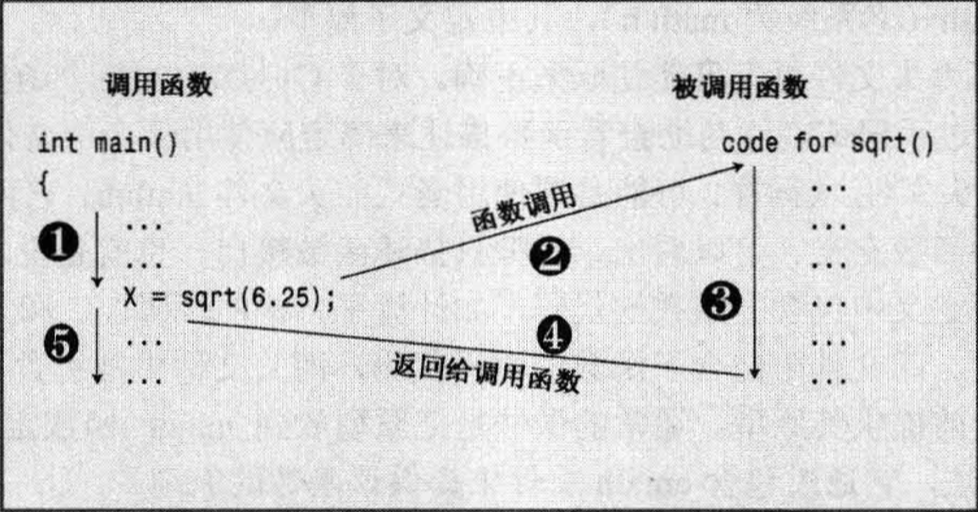
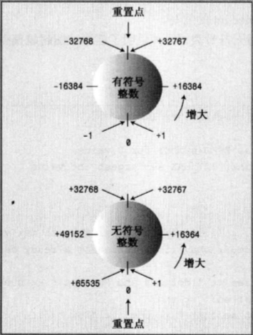

# C++

## LeetCode

### 1. Two Sum

```c++
//只能访问一次，则每次访问
class Solution {
public:
    vector<int> twoSum(vector<int>& nums, int target) {
        unordered_map<int, int> record;   //未排序的哈希表
        for(int i = 0; i < nums.size(); i++){
            int complement = target - nums[i];
            
            if(record.find(complement) != record.end()){
                int res[] = {i, record[complement]}; 
                return vector<int>(res, res + 2);
            }
            record[nums[i]] = i;
        }

        return {};
    }
};
```


## C++标准模板库(STL)介绍

### 6.1 vector

​	向量，“变长数组”，“长度根据需要而自动改变的数组”。有时会碰到只用普通数组会超内存的情况，这种情况使用vector会便捷许多。vector还可以以邻接表的方式储存图，对**无法使用邻接矩阵**的题目（结点数太多）、又害怕**使用指针实现邻接表**的读者十分友好。

```c++
#include<vector>
using namespace std;
```

#### 6.1.1 vector定义

```c++
vector<typename> name;//等同于一维数组name[SIZE],只不过其长度可以根据需要进行变化，比较节省空间。
//typename 可以是 int、double、char、结构体等，也可以是vector、set、queue等
vector<int> name;
vector<double> name;
vector<char> name;
vector<node> name;	//结构体类型

//二维数组  二维vector数组 当作两个都可变长的二维数组
vector<vector<int> > name;	//!!!!!!!! >>之间要加空格

//vector数组
vector<typename> Arrayname[arraySize];
vector<int> vi[100];	//vi[0]~vi[100]中每一个都是一个vector容器。 一维长度已经固定为100
//与vector<vector<int> > name;不同的是  其中一维长度是否已经固定


vector<int> v3(100,9);	//把100长度的数组v3所有值初始化为9

in={1,2,3,4,5,6,7};
vector<int> tin(in, in+7);	// 1 2 3 4 5 6 7
vector<int> tin(in, in+6);	// 1 2 3 4 5 6 
```

#### 6.1.2 vector容器内元素的访问

1. 通过下标访问

```c++
vector<int> vi;
printf("%d %",v[0],v[99]);
```

2. 通过迭代器访问

```c++
vector<typename>::iterator it;	//it为迭代器变量
vector<int> vi;
for(int i=1;i<=5;i++){
    vi.push_back(i);	//push_back(i)在vi的末尾添加元素i，即依次添加1 2 3 4 5 
}
```

通过类似下标和指针访问数组的方式来访问容器内的元素

```c++
#include<stdio.h>
#include<vector>
using namespace std;
int main(){
    vector<int> vi;
    for(int i=1;i<=5;i++){
        vi.push_back(i);
    }
    //vi.begin()为取vi的首元素地址，而it指向这个地址
   	vector<int>::iterator it=vi.begin();
    for(int i=0;i<5;i++){
        printf("%d ",*(it+i));			  			//1 2 3 4 5
    }
    return 0;
}
```

​	 vi[i]和*(vi.begin()+i)是等价的

​	end()取vi的尾元素地址的下一个地址。end()作为迭代器末尾标志，不储存任何元素。

```c++
#include<stdio.h>
#include<vector>
using namespace std;
int main(){
    vector<int> vi;
    for(int i=1;i<=5;i++){
        vi.push_back(i);
    }
    //vi.begin()为取vi的首元素地址，而it指向这个地址
   	
    for(vector<int>::iterator it=vi.begin();it!=vi.end();it++){
        printf("%d ",*it);			//1 2 3 4 5 
    }
    return 0;
}
```

​	**STL容器中，只有vector和string中，允许使用vi.begin()+3这种迭代器加上整数的写法**

#### 6.1.3 vector常用函数

1. push_back(i)

   ```C++
   //在vector后面添加元素x，世家复杂度O(1)
   #include<stdio.h>
   #incldue<vector>
   using namespace std;
   int main(){
       vector<int> vi;
       for(int i=1;i<=3;i++){
           vi.push_back(i);
       }
       for(int i=0;i<vi.size();i++){
           printf("%d ",vi[i]);		// 1 2 3
       }
       return 0;
   }
   ```

2. pop_back()

   ```c++
   //有添加就会有删除， 删除vector尾元素
   #include<stdio.h>
   #incldue<vector>
   using namespace std;
   int main(){
       vector<int> vi;
       for(int i=1;i<=3;i++){
           vi.push_back(i);
       }
       vi.pop_back();	//删除vi尾部元素
       for(int i=0;i<vi.size();i++){
           printf("%d ",vi[i]);		// 1 2 
       }
       return 0;
   }
   ```

3. size()

   ```c++
   //获取vector中元素的个数
   #include<stdio.h>
   #incldue<vector>
   using namespace std;
   int main(){
       vector<int> vi;
       for(int i=1;i<=3;i++){
           vi.push_back(i);
       }
       printf("%d ",vi.size());		// 3
       return 0;
   }
   ```

4. clear()

   ```c++
   //清空vector中所有元素
   #include<stdio.h>
   #incldue<vector>
   using namespace std;
   int main(){
       vector<int> vi;
       for(int i=1;i<=3;i++){
           vi.push_back(i);
       }
       vi.clear();
       printf("%d ",vi.size());		// 0
       return 0;
   }
   ```

5. insert(it,x)

   ```c++
   //向vector的任意迭代器it处插入一个元素x
   #include<stdio.h>
   #incldue<vector>
   using namespace std;
   int main(){
       vector<int> vi;
       for(int i=1;i<=5;i++){
           vi.push_back(i);	//1 2 3 4 5 
       }
       vi.insert(vi.begin()+2,-1);	//将-1插入vi[2]的位置
       for(int i=0;i<vi.size();i++){
           printf("%d ",vi[i]);		// 1 2 -1 3 4 5
       }
       return 0;
   }
   ```

6. erase(it)/erase(first,last)

   ```c++
   //删除迭代器为it处的元素
   #include<stdio.h>
   #incldue<vector>
   using namespace std;
   int main(){
       vector<int> vi;
       for(int i=5;i<=9;i++){
           vi.push_back(i);	//5 6 7 8 9
       }
       //删除8 
       vi.insert(vi.begin()+3);
       for(int i=0;i<vi.size();i++){
           printf("%d ",vi[i]);		// 5 6 7 9 
       }
       return 0;
   }
   ```

   ```c++
   //删除一个区间[fisrt,last)内的所有元素
   #include<stdio.h>
   #incldue<vector>
   using namespace std;
   int main(){
       vector<int> vi;
       for(int i=5;i<=9;i++){
           vi.push_back(i);	//5 6 7 8 9
       }
       //删除8 
       vi.insert(vi.begin()+1，vi.begin()+4);
       for(int i=0;i<vi.size();i++){
           printf("%d ",vi[i]);		// 5 9 
       }
       return 0;
   }
   ```

#### 6.1.4 vector的常见用途

1. 储存数据

   - vector本身可以作为数组使用，而且一些元素个数不确定的场合可以很好的节省空间
   - 有些场合需要根据一些条件把部分数据输出在同一行，数据中间用空格隔开。由于输出数据的个数是不确定的，为了更方便地处理最后一个满足条件的数据后面不输出额外的空格，可以下用vector记录所有需要输出的数据，然后一次性输出。

2. 用邻接表存储图

   使用vector实现邻接表 10.2.2

------

### 6.2 set

​	集合，是一个**内部自动有序**且**不包含重复元素**的容器。有可能出现需要去掉重读元素的情况，有可能元素比较大或者类型不是int型而不能直接开散列表，这种情况可以用set**保留元素本身而不是考虑它的个数**。	也可以再开一个数组进行下标和元素的对应来解决。

```c++
#include<set>
using namespace std;
```

#### 6.2.1 set定义

```c++
set<typename> name;	//typename 可以是 int、double、char、结构体等，也可以是vector、set、queue等
set<int> name;
set<double> name;
set<char> name;
set<node> name;	//node结构体类型

//二维数组  二维set数组
set<set<int> > name;	//!!!!!!!! >>之间要加空格

//set数组
set<typename> Arrayname[arraySize];

set<int> a[100];	//a[0]~a[100]中每一个都是一个set容器。 一维长度已经固定为100
```

------

#### 6.2.2 set容器内元素的访问

1. **只能通过迭代器访问**

```c++
set<typename>::iterator it;	//it为迭代器变量
set<int>::iterator it;	//it为迭代器变量
```

```c++
//只能通过*it方式访问
#include<stdio.h>
#include<vector>
using namespace std;
int main(){
    set<int> st;
    st.insert(3);	//将x插入set中
    st.insert(5);
    st.insert(2);
    st.insert(3);
//注意，不支持it<st.end()的写法
    for(set<int>::iterator it=st.begin();it!=st.end();it++){
        printf("%d ",*it);			//2 3 5 
    }
    return 0;
}
```

------

#### 6.2.3 set常用函数

1. insert(x)

   ```c++
   //向vector的任意迭代器it处插入一个元素x
   #include<stdio.h>
   #incldue<vector>
   using namespace std;
   int main(){
       set<int> st;
       st.insert(2);	
       st.insert(5);
       st.insert(4);
       printf("%d ",st.size());		// 3
       return 0;
   }
   ```

2. find(x)

   ```c++
   //返回set中对应值为value的迭代器
   #include<stdio.h>
   #incldue<set>
   using namespace std;
   int main(){
       set<int> st;
       st.insert(2);	
       st.insert(5);
       st.insert(4);
       set<int>::iterator it=st.find(2);//在set中查找2，返回迭代器
       printf("%d ",*it);		// 2
       return 0;
   }
   ```

3. size()

   ```c++
   //获取set中元素的个数
   #include<stdio.h>
   #incldue<set>
   using namespace std;
   int main(){
       set<int> st;
       st.insert(2);	
       st.insert(5);
       st.insert(4);
       printf("%d ",st.size());		// 3
       return 0;
   }
   ```

4. clear()

   ```c++
   //清空set中所有元素
   #include<stdio.h>
   #incldue<vector>
   using namespace std;
   int main(){
       set<int> st;
       st.insert(2);	
       st.insert(5);
       st.insert(4);
       st.clear();
       printf("%d ",vi.size());		// 0
       return 0;
   }
   ```

5. erase(it)/erase(first,last)

   ```c++
   //删除迭代器为it处的元素
   #include<stdio.h>
   #incldue<set>
   using namespace std;
   int main(){
       set<int> st;
       st.insert(100);	
       st.insert(200);
       st.insert(100);
       st.insert(300);
       st.erase(st.find(100));
       st.erase(st.find(200));
      	for(set<int>::iterator it=st.begin();it!=st.end();it++){
           printf("%d ",*it);			//300
       }
       return 0;
   }
   
   //直接删除所需要删除的值
   #include<stdio.h>
   #incldue<set>
   using namespace std;
   int main(){
       set<int> st;
       st.insert(100);	
       st.insert(200);
       st.erase(100);
       for(set<int>::iterator it=st.begin();it!=st.end();it++){
           printf("%d ",*it);			//200
       }
       return 0;
   }
   ```

   ```c++
   //删除一个区间[fisrt,last)内的所有元素
   #include<stdio.h>
   #incldue<set>
   using namespace std;
   int main(){
       set<int> st;
       st.insert(20);	
       st.insert(10);
       st.insert(40);
       st.insert(30);
       set<int>::iterator it=st.find(30);//在set中查找2，返回迭代器
       st.erase(it,st.end());
       for(set<int>::iterator it=st.begin();it!=st.end();it++){
           printf("%d ",*it);			//10 20
       }
       return 0;
   }
   ```

------

#### 6.2.4 set的常见用途

​	set最主要的作用是**自动去重**并按**升序排序**，因此碰到**需要去重但是不方便直接开数组**的情况，可以尝试用set解决。
​	**延伸**：set 中元素是唯一的，如果需要处理不唯一的情况，则需要使用multiset。增加了unordered_set，以散列代替set内部的红黑树（自平衡二叉查找树）实现，使其可以用来处理只去重但不排序的需求，速度比set要快得多

​	

### 6.3 string

​	在c语言中，一般使用字符数组char str[]来存放字符串，但是使用字符数组有时会显得操作麻烦。

```c++
#include<string>
using namespace std;
//！！！！！！！！string 和cstring不一样
```

#### 6.3.1 string定义

```c++
string str;	//str变量名

string str="abcd";
```

------

#### 6.3.2 string容器内元素的访问

1. **通过下标访问**

   ```C++
   #incldue<stdio.h>
   #include<string>
   using namespace std;
   int main(){
       string str="abcd";
       for(int i=0;i<str.length();i++){
           printf("%c",str[i]);	//abcd
       }
       return0
   }
   ```

   如果要**读入和输出**整个字符串，则只能用**cin和cout**;

   ```c++
   #include<isotream>
   #include<string>
   using namespace std;
   int main{
       string str;
       cin>>str;
       cout<<str;
       return 0;
   }
   ```

2. **通过迭代器访问**

   ```c++
   string::iterator it;	//it为迭代器变量
   ```

   这样就得到了迭代器it，并且可以通过*it来访问string里的每一位

   ```c++
   #include<isotream>
   #include<string>
   using namespace std;
   int main{
       string str="abcd";
       for(string::iterator it=st.begin();it!=st.end();it++){
           printf("%c ",*it);			//abcd
       }
       return 0;
   }
   ```

​	**STL容器中，只有vector和string中，允许使用str.begin()+3这种迭代器加上整数的写法**

------

#### 6.3.3 string常用函数

1. operator+=	string的加法 直接拼接

   ```c++
   #include<isotream>
   #include<string>
   using namespace std;
   int main{
       string str1="abc",str2="xyz",str3;
       str3=str1+str2;
       str1+=str2;
       cout<<str1<<endl;	//abcxyz
       cout<<str3<<endl;	//abcxyz
       return 0;
   }
   ```

2. compare operator

   ```c++
   //两个string类型可以直接使用== ！= 等比较大小 字典序
   #include<isotream>
   #include<string>
   using namespace std;
   int main{
       string str1="aa",str2="aaa",str3="abc",str4="xyz";
       if(str1<str2) printf("ok1\n");	//ok1
       if(str1!=str3) printf("ok2\n");	//ok2
       if(str4>=str3) printf("ok3\n");	//ok3
       return 0;
   }
   ```

3. length()/size()

   ```C++
   //返回string的长度，即存放的字符数
   #include<stdio.h>
   #include<string>
   using namespace std;
   int main(){
       string str="abcxyz";	
       printf("%d %d",str.size(),str.length());// 6 6
       return 0;
   }
   ```

4. insert(x)

   ```c++
   //insert(pos,string) 早pos号位置插入字符串string
   string str="abcxyz" ,str2="opq";
   str.insert(3,str2);	//往str[3]处插入opq，str2的位置直接写"opq"也可以
   cout<<str<<endl; //abcopqxzy
   ```

   ```c++
   //insert(it,it2,it3)，it为原字符串的欲插入位置，it2和it3为待插字符串的首尾迭代器，用来表示串[it2,it3)将被插在it的位置上。
   string str="abcxyz" ,str2="opq";
   str.insert(str.begin()+3,str2.begin(),str2.end());
   cout<<str<<endl;//abcopqxyz
   ```

5. erase()

   ```c++
   //删除单个元素
   int main(){
       string str="abcdefg";
       str.erase(str.begin()+4);	//删除4号位
      	cout<<str<<endl;	//abcdfg
       return 0;
   }
   ```

   ```c++
   //删除一个区间[fisrt,last)内的所有元素
   int main(){
        string str="abcdefg";
       str.erase(str.begin()+2,str.end()-1);	//删除cdef
      	cout<<str<<endl;	//abg
       return 0;
   }
   ```

   ```c++
   //str.erase(pos,length) pos开始删除的起始位置，length为删除的字符个数
   int main(){
       string str="abcdefg";
       str.erase(3，2);	//删除de
      	cout<<str<<endl;	//abcfg
       return 0;
   }
   ```

6. clear()

   ```c++
   //清空string中所有元素
   int main(){
       string str="abcdefg";
       str.clear();	
      	printf("%d",str.length());	//0
       return 0;
   }
   ```

7. substr()

   ```c++
   //substr(pos,len) 返回从pos号位开始、长度为len的子串
   int main(){
       string str="Thank you for your smile";
      	cout<<str.substr(0,5)<<endl;	//Thank
       cout<<str.substr(14,4)<<endl;	//your
       return 0;
   }
   ```

8. string::npos

   ```c++
   //本身的值为-1/4294967295 find函数失配时的返回值
   ```

9. find(x)

   ```c++
   //find(str2)，当str2是str的子串时，返回其在str中第一次出现的位置；如果str2不是str的子串，返回string::npos
   //find(str2,pos),从str和pos号位开始寻找str2
   int main(){
       string str="Thank you for your smile";
       string str2="you";
       string str3="me";
       if(str.find(str2)!=string::npos){
           cout<<str.find(str2)<<endl;
       }
       if(str.find(str2,7)!=string::npos){
           cout<<str.find(str2,7)<<endl;
       }
       if(str.find(str2)!=string::npos){
           cout<<str.find(str3)<<endl;
       }else{
           cout<<"i know"<<endl;
       }
       return 0;
   }
   ```

10. replace()

```c++
   //replace(pos,len,str2)	把str从pos号位开始，长度为len的子串替换为str2
   //replace(it1,it2,str2)把str的迭代器[it1，it2)范围的子串替换为str2
   int main(){
       string str="Maybe you will turn around";
       string str2="will not";
       string str3="surely";
       cout<<str.replace(10,4,str2)<<endl;
       //Maybe you will not turn around
       cout<<str.replace(str.begin(),str.begin()+5,str3)<<endl;
       //surely you will turn around
       return 0;
   }
```

------

### 6.4 map-映射

​	映射，普通数组是int型映射到其他类型。map可以将**任何基本类型**（包括STL容器）映射到**任何基本类型**（包括STL容器）.

​	情况：判断给定数字在某个文件中是否出现过。如果数字很大hashtable数组无法开。map可以把数字当作字符串建立string到int的映射。

```c++
#include<map>
using namespace std;
```

#### 6.4.1 map定义

```c++
map<typename1, typename2> mp;	//键key	值value 两个类型

//字符到整形的映射，只能string不能char数组
map<string,int> mp;

//键和值也可以是stl容器
map<set<int>,string> mp;
```

------

#### 6.4.2 map容器内元素的访问

1. 通过下标访问

   ```c++
   map<char int> mp;
   mp['c']=20;
   mp['c']=30;//20被覆盖
   printf("%d\n",mp['c'])；//输出30
   ```

2. 通过迭代器访问

   ```c++
   map<typename1,typename2>::iterator it;	//it为迭代器变量
   ```

   ```c++
   //map可以用it->first来访问键，使用it->second来访问值
   map<char int> mp;
   mp['m']=20;
   mp['r']=30;
   mp['a']=40；
   for(map<char,int>::iterator it=mp.begin();it!=mp.end();it++){
   	printf("%c %d\n",it->first,it->second);
   }
   //a 40
   //m 20
   ```

   **map会以键从小到大的顺序自动排序**，即按a<m<r的顺序排列三对映射。

------

#### 6.4.3 map常用函数

1. find()

   ```c++
   //返回键为key的映射的迭代器
   map<char int> mp;
   mp['a']=1;
   mp['b']=2;
   mp['c']=3；
   map<char,int>::iterator it=mp.find('b');
   printf("%c %d\n",it->first,it->second);
   //b 2
   ```

2. erase()

   ```c++
   //删除单个元素erase(it)   it为需要删除的元素的迭代器
   map<char int> mp;
   mp['a']=1;
   mp['b']=2;
   mp['c']=3；
   map<char,int>::iterator it=mp.find('b');
   mp.erase(it); //删除b 2
   for(map<char,int>::iterator it=mp.begin();it!=mp.end();it++){
   	printf("%c %d\n",it->first,it->second);
   }
   //a 1
   //c 3
   
   //erase(key)	key为欲删除的映射的键
   map<char int> mp;
   mp['a']=1;
   mp['b']=2;
   mp['c']=3；
   mp.erase('b'); //删除b 2
   for(map<char,int>::iterator it=mp.begin();it!=mp.end();it++){
   	printf("%c %d\n",it->first,it->second);
   }
   //a 1
   //c 3
   ```

   ```c++
   //删除一个区间内的所有元素	erase(first,last) [first,last）
   map<char int> mp;
   mp['a']=1;
   mp['b']=2;
   mp['c']=3；
   map<char,int>::iterator it=mp.find('b');
   mp.erase(it,mp.end()); //删除it之后的所有映射
   for(map<char,int>::iterator it=mp.begin();it!=mp.end();it++){
   	printf("%c %d\n",it->first,it->second);
   }
   //a 1
   ```

3. size()

   ```c++
   //获取map中映射对数
   map<char int> mp;
   mp['a']=1;
   mp['b']=2;
   mp['c']=3；
   printf("%d\n",mp.size());	//3
   ```

4. clear()

   ```c++
   //清空map中所有元素
   map<char int> mp;
   mp['a']=1;
   mp['b']=2;
   mp['c']=3；
   mp.clear();
   printf("%d\n",mp.size());	//3
   ```


unordered_map

无序关联容器

```c++

struct Node { double x, y; };
 
int main() {
    Node nodes[3] = { {1, 0}, {2, 0}, {3, 0} };
 
    // mag 是将 Node 的地址映射到其在平面中的模的映射
    std::unordered_map<Node *, double> mag = {
        { nodes,     1 },
        { nodes + 1, 2 },
        { nodes + 2, 3 }
    };

	for(auto iter = mag.begin(); iter != mag.end(); ++iter){
        auto cur = iter->first;
        mag[cur] = std::hypot(cur->x, cur->y);
        std::cout << "The magnitude of (" << cur->x << ", " << cur->y << ") is ";
        std::cout << iter->second << '\n';
    }
}
```


-----

#### 6.4.4 map的常见用途

1. 需要建立字符(或字符串)与整数之间映射的题目，使用map可以减少代码量
2. 判断大整数或者其他类型数据是否存在的题目，可以把map当作bool数组用
3. 字符串和字符串的映射可以也会用到

延伸:map的键和值是唯一的，如果一个键需要对应多个值，只能用multimap。还增加了unordered_map，以散列代替map内部红黑树，速度快

------

### 6.5 queue-队列

​	队列，实现**先进先出**的容器

```c++
#include<queue>
using namespace std;
```

#### 6.5.1 queue定义

```c++
queue<typename> name;	//typename 任意基本数据类型或容器
```

------

#### 6.5.2 queue容器内元素的访问

1. **只能通过front()来访问队首元素,或back()访问队尾元素**

```c++
queue<int> q;
for(int i=1;i<=5;i++){
    q.push(i);
}
printf("%d %d",q.front(),q.back());//1 5 
```

------

#### 6.5.3 queue常用函数

1. push()

   ```c++
   //push(x)将x压入队列
   queue<int> q;
   for(int i=1;i<=5;i++){
       q.push(i);
   }
   ```

2. front()\back()

   ```c++
   printf("%d %d",q.front(),q.back());//1 5 
   ```

3. pop()

   ```c++
   //令队首元素出队
   queue<int> q;
   for(int i=1;i<=5;i++){
       q.push(i);
   }
   printf("%d %d",q.front(),q.back());//1 5 
   for(int i=1;i<=3;i++){
       q.pop();//出队首元素三次 1 2 3 
   }
   printf("%d %d",q.front(),q.back());//4 5 
   ```

4. empty()

   ```c++
   //检测queue是否为空,true为空,false为非空
   queue<int> q;
   if(q.empty==ture){
       printf("empty");
   }else{
       printf("not empty")
   }
   q.push(1);
   if(q.empty==ture){
       printf("empty");
   }else{
       printf("not empty")
   }
   //empty
   //not empty
   ```

5. size()

   ```c++
   //返回queue内元素的个数
   queue<int> q;
   for(int i=1;i<=5;i++){
       q.push(i);
   }
   printf("%d",q.size());	//5
   ```

------

#### 6.5.4 queue的常见用途

1. 需要实现广度优先搜索时,使用queue代替
2. 使用front()和pop()函数前,必须用empty()判断队列是否为空.

延伸:双队列deque/优先队列priority_queue

------

### 6.6 priority_queue-优先队列

​	优先队列，其底层是用堆来进行实现的.优先队列中,**队首元素一定是当前队列中优先级最高**的那一个.例如在队列有如下元素,且定义好了优先级

```c++
//此处规定数字越大优先级越高
桃子	(优先级3)
梨子	(优先级4)
苹果	(优先级1)
```

那么出队的顺序为梨子(4)→桃子(3)→苹果(1).

​	当然,可以在任何时候往优先队列里push元素,而优先队列底层的数据结构堆heap会随时调整结构,使得每次的队首元素都是优先级最大的

```c++
#include<queue>
using namespace std;
```

#### 6.6.1 priority_queue定义

```c++
priority_queue<typename> name;	//typename 任意基本数据类型或容器
```

------

#### 6.6.2 priority_queue容器内元素的访问

1. **只能通过top()访问队首元素(堆顶元素)**,优先级最高的元素

```c++
priority_queue<int> q;
for(int i=1;i<=5;i++){
    q.push(i);
}
printf("%d",q.top());//5
```

------

#### 6.6.3 priority_queue常用函数

1. push()

   ```c++
   //push(x)将x压入队列
   priority_queue<int> q;
   for(int i=1;i<=5;i++){
       q.push(i);
   }
   ```

2. top()

   ```c++
   printf("%d",q.top());//5 
   ```

3. pop()

   ```c++
   //令队首元素(堆顶元素)出队
   priority_queue<int> q;
   for(int i=1;i<=5;i++){
       q.push(i);
   }
   printf("%d",q.top());//5
   q.pop();//出队首元素
   printf("%d",q.top());//4
   ```

4. empty()

   ```c++
   //检测queue是否为空,true为空,false为非空
   priority_queue<int> q;
   if(q.empty==ture){
       printf("empty");
   }else{
       printf("not empty")
   }
   q.push(1);
   if(q.empty==ture){
       printf("empty");
   }else{
       printf("not empty")
   }
   //empty
   //not empty
   ```

5. size()

   ```c++
   //返回priority_queue内元素的个数
   priority_queue<int> q;
   for(int i=1;i<=5;i++){
       q.push(i);
   }
   printf("%d",q.size());	//5
   ```

------

#### 6.6.4 priority_queue内元素元素优先级的设置

1. 基本数据类型的优先级设置

   int型 double型 char 型,默认数字大的/字典序大的优先级高.队首元素为优先队列内元素最大的那个

   ```c++
   //等价
   priority_queue<int> q;
   priority_queue<int,vector<int>,less<int> > q;
   //第二个参数时来承载底层数据结构堆(heap)的容器,
   //第三个参数是对第一个参数的比较累,less<int>表示数字大的优先级越大,而greater<int>表示数字小的优先级越大
   priority_queue<int,vector<int>,greater<int> > q;
   ```

2. 结构体的优先级设置

   ```c++
   struct fruit{
       string name;
       int price;
   }
   //希望水果的价格高的为优先级高,就需要重载(overload)小于号"<".重载是指对已有的运算符进行重新定义,也就是改变小于号的功能
   struct fruit{
       string name;
       int price;
       friend bool operator < (fruit f1,fruit f2){
           return f1.price<f2.price;
       }
   }
   //fruit增加了一个函数 friend为友元
   //"bool operator <(fruit f1,fruit f2)"对fruit类型的操作符"<"进行重载
   //f1>f2   f2<f1
   //f1==f2  !(f1<f2)&&!(f2<f1)
   //"return f1.price<f2.price;" 以价格高的水果为优先级高
   ```

   ```c++
   struct fruit{
       string name;
       int price;
       friend bool operator < (fruit f1,fruit f2){
           return f1.price>f2.price;	//价格低的水果优先级高
       }
   }f1,f2,f3
   
   int main(){
   	priority_queue<fruit> q;
   	f1.name="aaa";
   	f1.price=3;
   	f2.name="bbb";
   	f2.price=4;
   	f3.name="ccc";
   	f3.price=1;
   	q.push(f1);
   	q.push(f2);
   	q.push(f3);
   	cout<<q.top().name<<""<<q.top.price<<endl;
   	return 0;
   }
   //苹果1
   
   ```

   ```c++
   struct fruit{
       string name;
       int price;
   }f1,f2,f3
   
   struct cmp{
       bool operator <(fruit f1,fruit f2){		//去掉friend
           return f1.price>f2.price;	//价格低的水果优先级高
       }
   }
   
   priority_queue<fruit,vector<fruit>,cmp > q;
   
   ```

   **即便是基本数据类型或者其他STL容器,也可以通过同样的方式来定义优先级.**

   如果结构体内的数据较为庞大(例如出现了字符串或者数组),建议使用引用来提高效率,此时比较类的参数中需要加上"const"和"&"

   ```c++
   friend bool operator < (const fruit &f1,const fruit &f2){
           return f1.price>f2.price;	//价格低的水果优先级高
   }
   
   bool operator () (const fruit &f1,const fruit &f2){
           return f1.price>f2.price;	//价格低的水果优先级高
   }
   
   ```

#### 6.6.5 priority_queue的常见用途

1. 可以解决一些贪心问题,也可以对dijkstra算法进行优化(因为优先队列的本质是堆)
2. 使用ftop()函数前,必须用empty()判断队列是否为空.

------

### 6.7 stack-栈

​	栈，后进先出的容器

​	当然,可以在任何时候往优先队列里push元素,而优先队列底层的数据结构堆heap会随时调整结构,使得每次的队首元素都是优先级最大的

```c++
#include<stack>
using namespace std;

```

#### 6.7.1 stack定义

```c++
stack<typename> name;	//typename 任意基本数据类型或容器

```

#### 6.7.2 stack容器内元素的访问

1. **只能通过top()访问队首元素(栈顶元素)**

```c++
stack<int> st;
for(int i=1;i<=5;i++){
    st.push(i);
}
printf("%d",st.top());//5

```

#### 6.7.3 stack常用函数

1. push()

   ```c++
   //push(x)将x入栈
   stack<int> st;
   for(int i=1;i<=5;i++){
       st.push(i);
   }
   
   ```

2. top()

   ```c++
   printf("%d",st.top());//5 
   
   ```

3. pop()

   ```c++
   //令栈顶元素出队
   stack<int> st;
   for(int i=1;i<=5;i++){
       st.push(i);
   }
   for(int i=1;i<=3;i++){
       st.pop();		//连续三次将栈顶元素出栈 5 4 3 
   }
   printf("%d",st.top());//2
   
   ```

4. empty()

   ```c++
   //检测stack是否为空,true为空,false为非空
   stack<int> st;
   if(st.empty==ture){
       printf("empty");
   }else{
       printf("not empty")
   }
   st.push(1);
   if(st.empty==ture){
       printf("empty");
   }else{
       printf("not empty")
   }
   //empty
   //not empty
   
   ```

5. size()

   ```c++
   //返回stack内元素的个数
   stack<int> st;
   for(int i=1;i<=5;i++){
       st.push(i);
   }
   printf("%d",st.size());	//5
   
   ```

#### 6.7.4 stack的常见用途

1. 用来模拟实现一些递归,防止程序对栈内存的限制而导致程序运行出错.

------

### 6.8 pair

​	pair,当想要将两个元素绑在一起作为一个合成元素,又不想要因此定义结构体时,使用pair可以很方便的作为一个替代品.也就是说,pair实际上可以看作一个内部有两个元素的结构体,且这两个元素的类型是可以指定的.

```c++
struct pair{
    typename1 first;
    typename2 second;
}

#include<utility>   或   #include<map>
using namespace std;
```

#### 6.8.1 pair定义

```c++
pair<typename1,typename2> name;	//typename 任意基本数据类型或容器
//定义参数为string和int类型的pair
pair<string,int> p;
//如果想在定义pair时进行初始化,只需要跟上一个小括号,里面填写两个想要初始化的元素即可
pair<string, int>p("haha",5);

//临时构建一个pair
//将类型定义写在前面,后面用小括号内两个元素的方式
pair<string,int>("haha",5);
//使用自带的make_pair函数
make_pair("haha",5);
```

#### 6.8.2 pair容器内元素的访问

1. pair中只有两个元素,分别是first和second,按正常结构体的方式去访问.

```c++
pair<string,int> p;
p.first="haha";
p.second=5;
cout<<p.first<<" "<<p.second<<endl;
p=make_pair("xixi",55);
cout<<p.first<<" "<<p.second<<endl;
p=pair<string,int>("heihei",555);
cout<<p.first<<" "<<p.second<<endl;

//haha 5
//xixi 55
//heihei 555
```

#### 6.8.3 pair常用函数

​        比较操作数,两个pair类型数据可以直接使用== !=等等比较大小,**先以first的大小作为标准,只有当first相等时才去判别second的大小**

```c++
pair<int,int> p1(5,10);
pair<int,int> p2(5,15);
pair<int,int> p3(10,5);
if(p1<p3) printf("p1<p3\n");
if(p1<=p3) printf("p1<=p3\n");
if(p1<p2) printf("p1<p2\n");
//p1<p3
//p1<=p3
//p1<p2
```

------

#### 6.8.4 pair的常见用途

1. 用来代替二元结构体及其构造函数,可以节省编码时间
2. 作为map的键值对来进行插入,例如下面的例子

```c++
map<string,int> mp;
mp.insert(make_pair("heihei",5));
mp.insert(pair<string,int>("haha",10));
for(map<string,int>::iterator it=mp.begin();it!=mp.begin();it++){
	cout<<it->first<<" "<<it->second<<endl;
}
//haha 10
//heihei 5
```

### 6.9 algorithm头文件下的常用函数

#### 6.9.1 max()、min()和abs()

​	max(x,y)和min(x,y)分别返回x和y中的最大值和最小值，且**参数必须是两个**(可以是浮点数)。如果返回三个数x、y、z的最大值，可以使用max(x,max(y,z))的写法

​	abs(x)返回x的绝对值。注意：x必须是整数，浮点型的绝对值请用math头文件下的fabs

#### 6.9.2  swap()

​	swap(x,y)用来交换x和y的值

```c++
int x=1,y=2;
swap(x,y);
printf("%d %d",x,y);
//2 1
```

#### 6.9.3 reverse()

​	reverse(it,it2)可以将数组指针在[it,it2)之间的元素或容器的迭代器在[it,it2)范围内的元素进行反转。

```c++
int a[10]={10,11,12,13,14,15};
reverse(a.a+4);	//将a[0]~a[3]反转
//printf   13 12 11 10 14 15

string str="abcdefghi";
reverse(str.begin()+2,str.begin()+6);
//printf abfedcghi
```

#### 6.9.4 next_permutation()

​	next_permutation()给出一个序列在全排列中的下一个序列

```c++
123 132 213 231 312 321
```

这样231的下一个序列就是312

```c++
int a[10]={1,2,3};
do{
    printf("%d%d%d\n",a[0],a[1],a[2]);
}while(next_permutation(a,a+3));
//	123
    132
    213
    231
    312
    321
```

#### 6.9.5 fill()	

​	fill()可以把数组或容器中的某一段区间赋为某个相同的值。和memset不同，这里可以给数组类型对应范围中任意值。

```c++
int a[5]={1,2,3,4,5};
fill(a,a+5,233);
//printf 233 233 233 233 233
```

#### 6.9.6 sort()

1. sort的函数形式

```c++
sort(首元素地址(必填),尾元素地址的*下一个地址(必填),比较函数(非必填));
//默认递增

```

2. 比较函数cmp

   - 基本数据类型排序

     默认从小到大排序，字典序

     ```c++
     bool cmp(int a,int b){
         return a>b;	//当a>b时把a放在b前面
     }
     sort(a,a+4,cmp);//从大到小排序
     
     ```

   - 结构体类型排序

     ```c++
     struct node{
         int x,y;
     }ssd[10];
     
     bool cmp(node a,node b){
         return a.x>b.x;			//按x值从大到小对结构体数组ssd排序
     }
     
     bool cmp(node a,node b){
         if(a.x!=b.x)	return a.x>b.x;			
         else return a.y<b.y;
         //按x值从大到小对结构体数组ssd排序，若x相等然后再按y从小到大
     }
     
     sort(ssd,ssd+10,cmp);
     ```

   - STL容器排序

     只有**vector、string、deque**是可以用sort的，set、map这种容器都是用红黑树实现的，元素本身有序。

     ```c++
     bool cmp(int a,int b){
         return a>b;	//当a>b时把a放在b前面
     }
     int main(){
         vector<int> vi;
         vi.push_back(3);
         vi.push_back(1);
         vi.push_back(2);
         sort(vi.begin(),vi.begin+3,cmp);
         printf//3 2 1
     }
     ```

     ```c++
     string str[3]={"bbbb","cc","aaa"};
     sort(str,str+3);//将string数组按字典序从小到大输出
     printf//aaa bbbb cc
         
     bool cmp(string str1,string str2){//按string的长度从小到大排序
     	return str1.length()<str2.length();
     }
     printf//cc aaa bbbb
     ```

------

#### 6.9.7 lower_bound()和upper_bound()

​	lower_bound()和upper_bound()需要用在一个**有序**数组或容器中。		

​	lower_bound(first,last,val)用来寻找在数组或容器的[first,last)范围内**第一个值大于等于**val元素的位置，如果是数组，返回该位置的指针；如果是容器，返回该位置迭代器

​	upper_bound(first,last,val)用来寻找在数组或容器的[first,last)范围内**第一个值大于**val元素的位置，如果是数组，返回该位置的指针；如果是容器，返回该位置迭代器

​	如果数组或容器中没有需要寻找的元素，则lower_bound()和upper_bound()均返回可以插入该元素的位置的指针或迭代器(即假设存在该元素时，该元素应当在的位置)

```c++
int a[10]={1,2,2,3,3,3,5,5,5,5};
int *lowerPos=lower_bound(a,a+10,-1);
int *upperPos=upper_bound(a,a+10,-1);
printf("%d %d",lowerPos-a,upperPos-a);//0 0
int *lowerPos=lower_bound(a,a+10,1);
int *upperPos=upper_bound(a,a+10,1);
printf("%d %d",lowerPos-a,upperPos-a);//0 1
int *lowerPos=lower_bound(a,a+10,3);
int *upperPos=upper_bound(a,a+10,3);
printf("%d %d",lowerPos-a,upperPos-a);//3 6
int *lowerPos=lower_bound(a,a+10,4);
int *upperPos=upper_bound(a,a+10,4);
printf("%d %d",lowerPos-a,upperPos-a);//6 6
int *lowerPos=lower_bound(a,a+10,6);
int *upperPos=upper_bound(a,a+10,6);
printf("%d %d",lowerPos-a,upperPos-a);//10 10
```


c++ primer plus

## 第1章 预备知识

面向对象编程(OOP)  强调数据

类是一种规范。类规定了可使用哪些**数据**来表示对象以及可以对这些数据执行哪些**操作**。

泛型编程（generic programming）模板


**linux**

```
可以生成可执行文件 a.out
g++ spiffy.cpp

个别版本需要链接C++库
g++ spiffy.cpp -lg++

要编译多个源文件
g++ my.cpp precious.cpp
将生成一个名为a.out的可执行文件和两个目标代码文件my.o和precious.o。

如果修改了其中的某个源代码文件，如mu.cxx，则可以使用my.cxx和precious.o来重新编译：
g++ my.cpp precious.o
```


**windows**

compile 对当前打开的文件中的代码进行编译

build和make 编译项目中所有源代码文件的代码。如果项目包含3个文件，而只有其中一个文件修改，则只重新编译该文件。

build all 重新编译所有的源代码文件

link 将编译后的源代码与所需的库代码组合起来

run或execute 运行程序。如果没执行前面的步骤，将在运行程序前完成这些步骤

debug 以步进方式执行程序。


## 第2章 开始学习C++

### 2.1 进入C++

**2.1.3 预处理器和iostream**

```c++
#include<iostream>   		//预处理器   编译指令#include 该编译指令导致预处理器将iostream文件的内容添加到程序中。这是一种典型的预处理器操作：在源代码被编译之前，替换或添加文本

int main(){					//函数头
    using namespace std;	//编译指令
    cout << "Come up and c++ me some time,";
    cout << endl;
    cout << "You wont regret it!"<<endl;
    return 0;				//结束函数
}
```

​	**编译指令#include** 该编译指令导致预处理器将iostream文件的内容添加到程序中。这是一种典型的预处理器操作：在源代码被编译之前，替换或添加文本。

​	**编译指令#include**  导致iostream文件的内容随源代码文件的内容一起被发送给了编译器。实际上iostream文件的内容将取代程序中的代码行`#include<iostream>`。原始文件没有被修改，而是将源代码文件和iostream组合成一个复合文件，编译的下一阶段将使用该文件。


**2.1.4 头文件名**

​	像iostream这样的文件叫做包含文件（include file）也叫头文件（head file）。C++去掉 `.h` 而是在前边加上了 `c`。如`math.h` 变为 `cmath`。没有 `h` 的头文件也可以包含名称空间。


**2.1.5 名称空间**

​	如果使用iostream，则应使用下面的名称空间编译指令来使iostream中的定义对程序可用：

```
using namespace std;
```

​	这叫做 **using 编译指令**。名称空间避免不同厂商封装的相同命名产品函数

```c++
Microflop::wanda("go dancing?");
Piscine::wanda("a fish named Desire")
```

​	类、函数和变量使C++编译器的标准组件，它们现在都被放置在**名称空间std**中。所以用于输出的 `cout` 变量实际上是`std::count`，而 `endl` 实际上是 `std::endl`。因此

```c++
    cout << "Come up and c++ me some time,";
    cout << endl;
如果省略using编译指令，可以用下述方式进行编码
	std::cout << "Come up and c++ me some time,";
    std::cout << std::endl;
```

​	然而 using 编译指令使得std名称空间中**所有名称都可用**。这是一种偷懒的做法，在大型项目中存在潜在的问题。更好的方法是，只使所需的名称可用，可用通过 using 声明来实现：

```c++
using std::cout;
using std::endl;
using std::cin;
```

​	用这些编译指令替换下述代码后，便可以使用 `cin` 和`cout`，而不必加上`std::`前缀


**2.1.6 cout输出**

```c++
cout << "Come up and c++ me some time,";
```

​	<< 表示该语句将把这个字符串发送给 `cout`；该符号指出了**信息流动的路径**。`cout`对象有一个简单的接口，如果string是一个字符串，则下面的代码将显示该字符串

```c++
cout<<string
```

​	从概念上来看，输出是一个流，即从程序流出的一系列字符。cout对象表示这种流，其属性是在iostream文件中定义的。 cout 的对象属性包括一个**插入运算符 <<**，它可用将其右侧的信息插入到流中。


​	<<是按位左移运算符，这是一个运算符重载的例子，通过**重载**，同一个运算符将有不同的含义。编译器会通过**上下文来确定运算符的含义**。


​	**endl**是一个特殊的C++符号，表示**重起一行**。诸如 endl 等对于cout来说有特殊含义的特殊符号被称为**控制符（manipulator）**。endl 也是在 iostream 中定义的，且位于名称空间 std 中。


---

### 2.2 C++语句

```c++
#include<iostream>
using namespace std;

int main(){
    int carrots;
    carrots = 25;
    cout << "I have ";
    cout << carrots;
    cout << " carrots.";
    cout << endl;
    carrots -= 1;
    cout << "Crunch ,crunch. Now I have " << carrots << " carrots." << endl;
    return 0;
}
```


**2.2.1 声明语句和变量**

```c++
//定义声明语句 定义
int carrots;
```

​	提供了两项信息：需要的内存以及该内存单元的名称。

​	在首次使用变量前声明它。


2.2.2 赋值语句

​	赋值语句将值赋给储存单元。

```c++
carrots = 25;
```

​	将整数25赋给变量carrots表示的内存单元

​	`=` 叫做赋值运算符。C++ 可以连续使用赋值运算符。

```c++
int a;
int b;
int c;
a = b = c = 1;
```

​	复制从右向左进行。首先，88被赋给c；然后c的值被赋给b；然后b的值被赋给a。


### 2.3 其他C++语句

**2.3.1. 使用cin**

**2.3.2. cout进行拼接**

**2.3.3 类简介**

​	类是用户定义的一种数据类型。要定义类，需要描述它能够表示什么信息和可对数据执行哪些操作。

​	cout就是一个对象， <<是一个类方法（利用重新定义运算符）


---

### 2.4 函数

```c++
x = sqrt(6.25);
```

​	表达式 `sqrt(6.25)` 被称为 `函数调用`，被调用的函数叫做 `被调用函数` ， 包含 `函数调用` 的函数叫做 `调用函数`




​	圆括号中的值（即6.25）是发送给函数的信息，被称为 `传递给函数`，以这种方式发送给函数的值叫做 `参数`。函数sqrt()得到的结果为2.5，并将这个值发送给调用函数； 发送回去的值叫做`函数的返回值`。 

​	函数执行完毕后，语句中的`函数调用`部分就会被替换为返回的值。


​	函数原型用来指出涉及的类型。

```c++
#include<iostream>
#include<cmath>
using namespace std;


int main(){
    double area;
    cin >> area;
    double side;
    side = sqrt(area);
    cout << side<< endl;
    
    return 0;
}
```


​	编译器编译程序时，必须在库文件搜索您使用的函数。如果在linux下报错_sqrt是一个没有定义的外部函数，则需要结尾添加使用`-lm`

```
g++ sqrt.c -lm
```

​	C++允许创建变量时对它进行赋值，

```c++
double side = sqrt(area)
```


**2.4.2 函数变体**

```c++
double pow(double, double);	
int rand(void); //不接受任何参数，返回一个随机整数
//不需要返回的函数 调用时单独执行即可 如打印函数
showAns(123.456);
```


**2.4.3 用户定义的函数**

关键字不能用作他用 附录B


**2.4.4 用户定义的有返回值的函数**

​	return后边可以直接跟一个表达式，避免创建新变量。


**2.4.5 在多函数程序中使用using编译指令**

```c++
using namespace std;
//放在函数的外面，且位于两个函数的前面，就不用重复定义名称空间std
```


**命名约定**


---

## 第3章 处理数据

​	面向数据编程的本质是**设计并扩展自己的数据类型**。设计自己的数据类型就是让类型与数据匹配。

​	内置的C++类型分两组：基本类型和复合类型。基本类型：整数和浮点数。复合类型：数组、字符串、指针和结构。

### 3.1 简单变量

​	&运算符检索变量的内存地址。

**3.1.1 变量名**

第一个字符不能是数字；以两个下划线和一个下划线开头的铭恒被保留给实现。

`n` 前缀表示整数值，`str`表示以空字符结束的字符串、`b`表示布尔值、`p`表示指针、`c` 表示单个字符


**3.1.2 整形**

​	char、short、int、long、long long 每个类型又分有符号和无符号版本


**3.1.3 整形short、int、long和long long**

​	计算机内存由位的单元组成。不同类型通过不同数目的位来存储值。

​	short 至少16位

​	int至少与short一样长

​	long至少32位，且至少与int一样长

​	long long至少64位，且至少与long一样长


**位与字节**

​	计算机内存的基本单元是位bit。可以将位看作电子开关，可以开，也可以关。关表示值0，开表示值1。8位的内存可以设置256中不同的组合，即2^8。因此8位单元可以表示0-255或者-128到127。每增加一位，组合数便加倍。这意味着可以把16位单元设置位65536个不同的值。

​	字节byte通常指的是8位的内存单元。字节指的就是描述计算机内存量的度量单位，1KB = 1024b，1M=1024K。C++对字节的定义不同。C++字节由至少能够容纳实现的基本字符集的相邻位组成，也就是说，可能取值的数目必须等于或超过字符数目。ASCII和EBCDIC字符集可以用8位来容纳，在这两种系统中，C++字节通常包含8位。国际编程可能需要更大的字符集，如Unicode，因此有些实现可能使用16位甚至32位的字节。


1. 运算符sizeof和头文件limtis

   sizeof运算符指出，在使用8位字节的系统中，int的长度为4个字节。

```c++
int n_int = INT_MAX;
cout << sizeof(n_int) << endl;	//4
```


3. C++初始化方式

```c++
int emus{7}; //set emus to 5
int rocs{};	 //set rocs to 0
```


4. C++上溢下溢

```c++
#include<iostream>
#define ZERO 0
#include<climits>
using namespace std;

int main(){
    short sam = SHRT_MAX;
    unsigned short sue = sam;

    cout << "Sam has " << sam << " dollars and sue has " << sue;
    cout << " dollars deposited." << endl
         << "Add $1 to each account." << endl
         << "Now";
    sam += 1;
    sue += 1;
    cout << "Sam has " << sam << " dollars and sue has " << sue;
    cout << " dollars deposited." << endl;

    sam = ZERO;
    sue = ZERO;
    cout << "Sam has " << sam << " dollars and sue has " << sue;
    cout << " dollars deposited." << endl
         << "Take $1 from each account." << endl;
    sam -= 1;
    sue -= 1;
    cout << "Sam has " << sam << " dollars and sue has " << sue;
    cout << " dollars deposited." << endl;

    return 0;
}

/*Sam has 32767 dollars and sue has 32767 dollars deposited.
Add $1 to each account.
NowSam has -32768 dollars and sue has 32768 dollars deposited.
Sam has 0 dollars and sue has 0 dollars deposited.
Take $1 from each account.
Sam has -1 dollars and sue has 65535 dollars deposited.
```




**3.1.5 选择整数类型**

​	通常，int被设置为对目标计算机而言最为“自然”的长度。

​	如果short比int小，则使用short可以节省内存。通常，仅当有大型整形数组时，才有必要使用short。如果节省内存很重要，则应使用short而不是使用int。假设将程序从int为16位系统移到int为32位的系统，则用于存储int数组的内存量将翻倍，但short数组不受影响。


**3.1.6 整型字面值**

​	C++使用前一（两）位来标识数字常量的基数。如果第一位为1~9，则基数位10（十进制）。如果第一位是0，第二位为1~7，则基数为8（八进制）；因此042的基数是8，它相当于十进制数34。如果前两位为 0x 或 0X ，则基数为16（十六进制）；因此0x42为十六进制数，相当于十进制数66。对于十六进制数，字符a~f和A~F表示了十六进制位，对应于10~15。0xF为15，0xA5为165.

```c++
#include<iostream>
using namespace std;

int main(){
    int chest = 42;     //4*10+2
    int waist = 0x42;   //4*16+2
    int inseam = 042;	//4* 8+2

    cout << chest << endl
        << waist << endl 
        << inseam << endl;
    return 0;
}
```

​	不管值被书写为10、012还是0xA，都将以相同的方式存储在计算机中——被存储为二进制数。

```c++
//cout提供了控制符 dec、hex和oct 十进制 十六进制 八进制格式显示整数
#include<iostream>
using namespace std;

int main(){
    int chest = 42;
    int waist = 42;  
    int inseam = 42;

    cout << chest << endl;  //42
    cout << hex;			//一条消息，告诉cout采用何种行为
    cout << waist << endl;  //2a
    cout << oct;
    cout << inseam << endl; //52
    return 0;
}
```


**3.1.7 C++如何确定常量的类型**

​	程序的声明将特定的整型变量的类型告诉了C++编译器。

```c++
cout <<	"Year = " << 1492 << "\n";
```

​	程序将把1492存储在int、long还是其他整型呢？答案是，除非有理由存储为其他类型（如有特定后缀/值太大，不能存储为int），否则C++将整型常量存储为int类型。

​	首先判断后缀

```c++
l/L     long                  22022存为int占16位  22022L存为long占32位
u/U     unsigned int		  22022LU=22022UL
ul/lu   unsigned long 不分大小写
ll		long long
ull     unsigned long long
```

​	然后判断长度。


**3.1.7 char类型：字符和小整数**

​	char类型是专为存储字符而设计的。

​	ASCII字符集

```c++
char ch;
cin >> ch; // input M  把M变为77
cout << ch;//output M  rather than 77 把77变为M

char ch = 'M';
int i = ch;
cout << "the ascii code for " << ch << "is" << i << endl;//the ascii code for M is 77
cout.put(ch); //77
```


```
转义字符
\n 换行符   \" 双引号   \' 单引号   \t 水平制表   \v 垂直制表   \b 退格   \r 回车   \? 问号
```


**3.1.9 bool 类型**

​	将非零值解释为true，将零解释为false


---

### 3.2 const限定符

​	const关键字来修改变量声明和初始化。

```c++
const int Months = 12; 	//首字母大写 意味着是常量  应在声明中直接初始化
```

​	常量被初始化后，其值就被固定了，编译器将不允许再修改该常量的值。


### 3.3 浮点数

​	C++ 第二组基本类型。

**3.3.1 手写浮点数**

​	C++有两种手写浮点数的方式。第一种常用的标准小数点表示法

```c++
12.34 /    939001.32/    0.00023/    8.0 //即使小数部分为零
```

​	第二种使用E表示法：3.45E6，这指的是3.45与1000000相乘的结果；E6指的是10的6次方，即1后面是6个0.

3.45E6表示3450000，6为指数，3.45为尾数。

```
2.52e+8
8.33E-4
7E5
-18.32e13
9.11e-31
```

​	E表示法最适合于非常大和非常小的数。

> d.dddE+n 将小数点向右浮动n位，d.dddE-n将小数点向左浮动n位


**3.3.2 浮点类型**

​	float、double和long double。按它们可以表示的有效数位和允许的指数最小范围来描述的。有效位是数字中有意义的位。

​	14179 5个有效位

​    14000 2个有效位 3个占位符

​    14.162 5个有效位

​	有效位数不依赖于小数点的位置


**3.3.3 浮点常量**

​	默认为double，若后缀 f 或 F 为float，l 或 L 为long double类型

1.234f

2.45E20F

2.345324E28

2.2L


**3.3.2 浮点类型**

​	范围大；但运算速度满，精度将降低


---

### 3.4 C++算术运算符

```c++
+ 加
- 减
* 乘
/ 除 如果两个操作数是整型 结果为商的整数部分
% 模 两个操作数必须都是整型
```


**3.4.1 运算符优先级和结核性**

​	算术运算符遵循通常的**代数优先级**，先乘除，后加减。可以用括号执行自己定义的优先级。

​	优先级相同 从左到右


**3.4.2 除法分支**

​	如果两个操作数是整型 结果为商的整数部分

​	但凡有一个操作数是浮点值，则小数部分将保留，结果为浮点数

```c++
cout<< 4/5; //0
```


> 运算符重载：除法包括int除法、float除法、double除法。C++根据上下文来确定运算符的含义。使用相同的符号进行多种操作叫做运算符重载。


**3.4.3 求模运算符**


**3.4.4 类型转换**

- 将一种算术类型的值赋给另一种算术类型的变量时，C++将对值进行转换；

- 表达式中包含不同的类型时，C++将对值进行转换；
- 将参数传递给函数时，C++将对值进行转换


1. 初始化和赋值进行的转换

```c++
so_long = thirty; //thirty类型为short 前者为long
```

​	进行赋值时，将thirty的值由short扩展为long类型


2. 以{}方式初始化时进行的转换
3. 表达式中的转换
4. 传递参数时的转换
5. 强制类型转换


**3.4.5 auto声明**

​	如果使用关键字auto，而不指定变量的类型，编译器将把变量的类型设置成与初始值相同：

```c++
auto n = 100; //int
auto x= 1.5;  //double
auto y= 1.3e12L;//long double
```


## 第4章 复合类型

### 4.1 数组

​	数组是一种数据格式，能够存储多个同类型的值。

数组声明应包含以下三点：

- 存储在每个元素中的值的类型
- 数组名
- 数组中的元素数

```c++
short months[12];
//short类型 名为months 中括号内12为元素数目
//元素数必须为整形常数
```

数组被称为复合类型，是因为它是使用其他类型来创建的（派生类型）。

数组赋值可以提供一个用逗号分隔的值列表，并将它们用花括号括起即可。列表中的空格是可选的。


**4.1.2 数组的初始化规则**

​	**只有在定义数组时才能使用初始化**，以后就不能使用了，也不能将一个数组赋给另一个数组：

```c++
int cards[4] = {3,6,8,10};
int hand[4];
hand[4] = {5,6,7,9} //error
hand = cards; //error
```

​	然而，可以使用下标分别给数组中的元素赋值。

​	**初始化时，提供的值可以少于数组的数目**。

​	如果只对数组的一部分进行初始化，则编译器将把其他元素设置为0.

​	如果初始化中括号内元素数不填，编译器将计算元素个数。


**4.1.3 C++11 数组初始化方法**

​	首先，初始化时，可以省略等号

```c++
double earnings[4] {1.2e4, 1.6e4, 1.1e4, 1.7e4}
```

​	其次，可不在大括号内包含任何东西，将把所有元素设置为0：

```c++
unsigned int counts[10] = {};
float balance[100] {};
```

​	第三，列表初始化禁止缩窄转换

```c++
long plifs[] = {25,92,3.0};				//not allowed 浮点数转换为整型是缩窄操作
char slifs[4]  {'h','i',1122011,'\0'};	//not allowed 1122011超出char变量的取值范围
char tlifs[4]  {'h','i',112,'\0'};		//allowed
```


### 4.2 字符串

​	


# Python