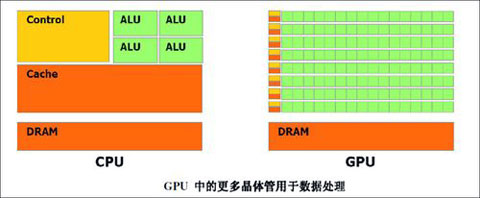
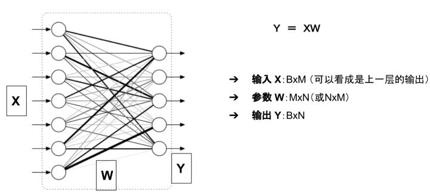
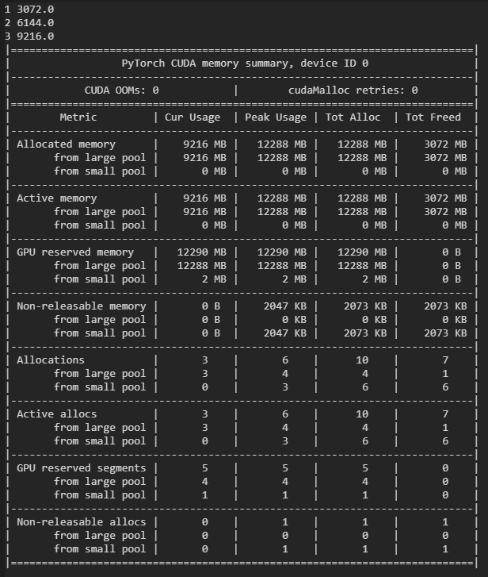
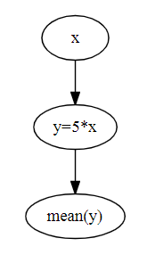
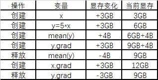
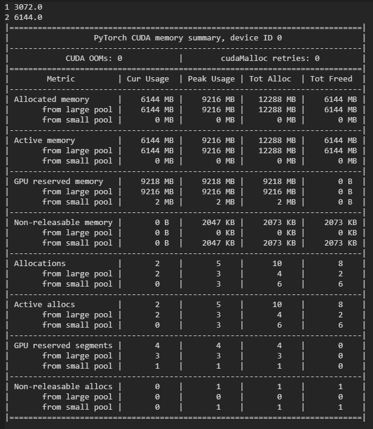

# GPU编程

> Neural net training very tolerant of reduced precision -- Jeff Dean

`tf.to_bfloat16`


```shell
docker run --runtime=nvidia --rm -it -w /home -v /home/duan/windows/udata:/home/data/ -v /tmp/.X11-unix:/tmp/.X11-unix -e DISPLAY=unix$DISPLAY -e GDK_SCALE -e GDK_DPI_SCALE nvidia/cudagl:duan

docker commit -p 78d220933b21 nvidia/cudagl:duan
```


---

https://zhuanlan.zhihu.com/p/51380356

# GPU性能

​	主要处理问题为 矩阵算法

​	GPU 图像处理单元是具有**专用内存**的专用单芯片处理器，通常会执行渲染图形所需的浮点计算

​	GPU按比例分配了更多的晶体管用于**算术逻辑单元**，减少了对**高速缓存**和**流控制**的投入。

​	GPU是专用图形渲染而设计的，后经过增强以加速其他**几何计算**（变换多边形或旋转垂直线）进入不同的坐标系。

​	GPU具有更多的逻辑核心（算术逻辑单元或ALU，控制单元和内存缓存）

​	如果您将CPU视为玛莎拉蒂，那么GPU可以算是一辆大卡车。CPU（玛莎拉蒂）可以在RAM中快速获取少量包裹（3-4位乘客），而GPU（卡车）速度较慢，但可以在一圈内获取大量内存（约20位乘客）。




​										  绿色的是计算单元，橙红色的是存储单元，橙黄色的是控制单元

​	CPU中的大部分晶体管主要用于构建控制电路（如分支预测等）和Cache，只有少部分的晶体管来完成实际的运算工作。GPU与CPU的设计目标不同，其控制电路相对简单，而且对Cache的需求较小，所以大部分晶体管可以组成各类专用电路和多条流水线，使GPU的计算速度有了突破性的飞跃，拥有惊人的处理浮点运算的能力。

​	GPU采用了数量众多的计算单元和超长的流水线，但控制逻辑非常简单并省去了Cache。而CPU不仅被Cache占据了大量空间，而且还有复杂的控制逻辑和诸多优化电路，相比之下计算能力只是CPU很小的一部分。

​	GPU的工作定位大部分情景是计算量大，**但没什么技术含量**，而且要重复很多很多次。就像你有个工作需要算几亿次一百以内加减乘除一样，最好的办法就是雇上几十个小学生一起算，一人算一部分，反正这些计算也没什么技术含量，纯粹体力活而已。而CPU就像老教授，积分微分都会算，但是工资高，一个老教授资顶二十个小学生，你要是富士康你雇哪个？

​	GPU就是这样，用很多简单的计算单元去完成大量的计算任务，纯粹的人海战术。这种策略基于一个前提，就是小学生A和小学生B的工作没有什么依赖性，是互相独立的。很多涉及到大量计算的问题基本都有这种特性，比如你说的破解密码、挖矿和很多图形学的计算。这些计算可以分解为多个相同的简单小任务，每个任务就可以分给一个小学生去做。


（1）高效的并行性。

​	这一功能主要是通过GPU多条绘制流水线的并行计算来体现的。在目前主流的GPU中，多条流水线可以在单一控制部件的集中控制下运行，也可以独立运行。GPU的顶点处理流水线使用MIMD方式控制，片段处理流水线使用SIMD结构。相对于并行机而言，GPU提供的并行性在十分廉价的基础上，为很多适合于在GPU上进行处理的应用提供了一个很好的并行方案。

（2）高密集的运算。

​	GPU通常具有128位或256位的内存位宽，因此GPU在计算密集型应用方面具有很好的性能。

（3）超长图形流水线。

​	GPU超长图形流水线的设计以吞吐量的最大化为目标，因此GPU作为数据流并行处理机，在对大规模的数据流并行处理方面具有明显的优势。

​	正是由于GPU在并行处理和计算密集型问题求解等方面所具有的诸多优势，GPU已成为目前普通PC机所拥有的强大、高效的计算资源。从系统架构上看，GPU是针对向量计算进行了优化的高度并行的数据流处理机。这种以数据流作为处理单元的处理机，在对数据流的处理上可以获得很高的效率。


​	卷积网络和Transformer：张量核心>FLOPs（每秒浮点运算次数）>显存带宽>16位浮点计算能力

​	循环神经网络：显存带宽>16位浮点计算能力>张量核心>FLOPs

​	以运算矩阵乘法A×B=C为例，将A、B**复制**到显存上比直接**计算**A×B更耗费资源。也就是说，如果你想用LSTM等处理大量小型矩阵乘法的循环神经网络，显存带宽是GPU最重要的属性。

​	矩阵乘法越小，内存带宽就越重要。

​	相反，卷积运算受计算速度的约束比较大。因此，要衡量GPU运行ResNets等卷积架构的性能，最佳指标就是FLOPs。**张量核心可以明显增加FLOPs**。

​	Transformer中用到的大型矩阵乘法介于卷积运算和RNN的小型矩阵乘法之间，16位存储、张量核心和TFLOPs都对大型矩阵乘法有好处，但它仍需要较大的显存带宽。


---

### 内存带宽

​	带宽是GPU比CPU更快的计算速度的主要原因之一。对于大型数据集，CPU在训练模型时会占用大量内存。

​	计算庞大而复杂的作业需要占用CPU大量的时钟周期（CPU 依次处理作业），并且内核数量少于同类GPU。

​	另一方面，独立的GPU带有专用的VRAM（视频RAM）内存。因此，CPU的内存可用于其他任务。

​	GPU 处理大量数据的能力，是最重要的性能指标。

----

### TensorCore

​	**RTX显卡**使用**Tensor Core**精度使用**FP16**（半精度）而不是FP32（单精度），可以提供更快的速度优势

---

### 处理能力

​	表示 GPU 处理数据的速度，我们将其量化为 **CUDA 核心数量**和每一个核心的**频率**的乘积。

​	**GPU计算单元**类似于CPU中的核，用来进行数值计算。衡量计算量的单位是flop： the number of floating-point multiplication-adds，浮点数一乘一加是macc

浮点数**先乘后加**算两个**flop**。计算能力越强大，速度越快。

​	衡量计算能力的单位是**flops**： 每秒能执行的flop数量

```
1*2+3                  2 flop
1*2 + 3*4 + 4*5        6 flop 
```


---

### 显存

​	一次性加载到显卡上的数据量。运行计算机视觉模型时，显存越大越好，特别是如果你想参加 CV Kaggle 竞赛的话。对于自然语言处理和数据分类，显存没有那么重要。		

**显存可以看成是空间，类似于内存。**

- 显存用于存放模型、数据
- 显存越大，所能运行的网络也就越大


#### 存储指标

```python
1Byte = 8 bit
1K = 1024 Byte
1M = 1024 K
1G = 1024 M
1T = 1024 G
10 K = 10*1024 Byte

1Byte = 8 bit
1KB = 1000 Byte
1MB = 1000 KB
1GB = 1000 MB
1TB = 1000 GB
10 KB = 10000 Byte
```

​	在深度学习中会用到各种各样的数值类型，数值类型命名规范一般为TypeNum，比如Int64、Float32、Double64。

​	Type：有Int，Float，Double等
​	Num: 一般是 8，16，32，64，128，表示该类型所占据的比特数目

​	常用的数值类型如下图所示(*int64 准确的说应该是对应c中的long long类型， long类型在32位机器上等效于int32*)：


其中Float32 是在深度学习中**最常用**的数值类型，称为**单精度**浮点数，每一个单精度浮点数占用4Byte的显存。

举例来说：有一个1000x1000的矩阵，float32，那么占用的显存差不多就是

> 1000x1000x4 Byte = 4MB

​	32x3x256x256的四维数组（BxCxHxW）占用显存为：24M	

---

#### 神经网络显存占用

​	神经网络模型占用的显存包括：

- 模型自身的参数
- 模型的输出

举例来说，对于如下图所示的一个全连接网络(不考虑偏置项b)



模型的显存占用包括：

参数：二维数组 W
模型的输出： 二维数组 Y
输入X可以看成是上一层的输出，因此把它的显存占用归于上一层。

这么看来显存占用就是W和Y两个数组？      并非如此！！！


##### 参数的显存占用

只有有参数的层，才会有显存占用。这部份的显存占用和**输入无关**，模型加载完成之后就会占用。

**有参数的层主要包括：**

- 卷积
- 全连接
- BatchNorm
- Embedding层
- ... ...

**无参数的层**：

- 多数的激活层(Sigmoid/ReLU)
- 池化层
- Dropout
- ... ...

更具体的来说，模型的参数数目(这里均不考虑偏置项b)为：

- Linear(M->N): 参数数目：M×N
- Conv2d(Cin, Cout, K): 参数数目：Cin × Cout × K × K
- BatchNorm(N): 参数数目： 2N
- Embedding(N,W): 参数数目： N × W

**参数占用显存 = 参数数目×n**

*n = 4 ：float32*

*n = 2 : float16*

*n = 8 : double64*

​	在PyTorch中，当你执行完`model=MyGreatModel().cuda()`之后就会占用相应的显存，占用的显存大小基本与上述分析的显存差不多（*会稍大一些，因为其它开销*）。

---

##### 梯度与动量的显存占用

​	举例来说， 优化器如果是 SGD，除了保存 W 之外还要保存对应的**梯度** ，因此显存占用等于参数占用的显存x2；如果是带 Momentum-SGD 这时候还需要保存**动量**， 因此显存x3；如果是 Adam 优化器，动量占用的显存更多，显存x4。

---

##### 输入输出的显存占用

模型输出的显存占用，总结如下：

- 需要计算每一层的feature map的形状（多维数组的形状）
- 需要保存输出对应的梯度用以反向传播（链式法则）
- **显存占用与 batch size 成正比**
- 模型输出不需要存储相应的动量信息。

深度学习中神经网络的显存占用，我们可以得到如下公式：

```text
显存占用 = 模型显存占用 + batch_size × 每个样本的显存占用
```

​	可以看出显存不是和 batch-size 简单的成正比，尤其是模型自身比较复杂的情况下：比如全连接很大，Embedding 层很大

另外需要注意：

- 输入（数据，图片）一般不需要计算梯度
- 神经网络的每一层输入输出都需要保存下来，用来反向传播，但是在某些特殊的情况下，我们可以不要保存输入。比如ReLU，在PyTorch中，使用`nn.ReLU(inplace = True)` 能将激活函数ReLU的输出直接覆盖保存于模型的输入之中，**节省不少显存**。

---

#### 节省显存的方法

在深度学习中，一般占用显存最多的是卷积等层的输出，模型参数占用的显存相对较少，而且不太好优化。

节省显存一般有如下方法：

- 降低batch-size
- 下采样(NCHW -> (1/4)*NCHW)
- 减少全连接层（一般只留最后一层分类用的全连接层）

---

#### 计算量分析

常用的操作计算量如下：

- 全连接层是 $BMN$ ,其中 B是batch size，M是输入形状，N是输出形状。
- 卷积的计算量是 $BHWC_{out}C_{in}K^2$ ，其中 $HWC_{out}$ 是输出点的个数，$C_{in}K^2$计算每个点的flop
- BatchNorm 计算量是 $BHWC*{4,5,6}$ 
- 池化的计算量是 $BHWCK^2$ ，其中 $HWC$ 是输出点的个数，$CK$计算每个点的乘法
- ReLU的计算量$BHWC$


#### 总结

- 时间更宝贵，尽可能使模型变快（减少flop）
- 显存占用不是和batch size简单成正比，模型自身的参数及其延伸出来的数据也要占据显存
- batch size越大，速度未必越快。在你充分利用计算资源的时候，加大batch size在速度上的提升很有限

尤其是batch-size，假定GPU处理单元已经充分利用的情况下：

- 增大batch size能增大速度，但是很有限（主要是并行计算的优化）
- 增大batch size能减缓梯度震荡，需要更少的迭代优化次数，收敛的更快，但是每次迭代耗时更长。
- 增大batch size使得一个epoch所能进行的优化次数变少，收敛可能变慢，从而需要更多时间才能收敛（比如batch_size 变成全部样本数目）。


https://zhuanlan.zhihu.com/p/31558973


----

### 数据集大小

​	在深度学习中训练模型需要大量的数据集，因此在内存方面需要大量的计算操作。为了有效地计算数据，GPU是最佳选择。计算量越大，GPU相对于CPU的优势就越大。

----

### 优化

​	在CPU中优化任务要容易得多。尽管CPU内核数量较少，但功能却比数千个GPU内核强大。

​	每个CPU内核可以执行不同的指令（MIMD架构），而通常组织在32个内核的块中的GPU内核在给定的时间并行执行同一条指令（SIMD架构）。

​	鉴于需要付出的努力，密集神经网络中的并行化非常困难。因此，与在CPU中相比，在GPU中难以实现复杂的优化技术。


---

# Pytorch 显存动态分配规律探索

## 1. 显存到主存

创建 1GB 的张量，赋值给 a，代码如下：

```python
a = torch.zeros([256,1024,1024], device= 'cuda') 
```

查看主显存情况：**主存变大 1GB，显存变大 1.7GB**，多出来的内存是 pytorch 运行所需的一些配置变量。

再次创建一个 1GB 的张量，赋值给 b，代码如下：

```python
b = torch.zeros([256,1024,1024], device= 'cuda') 
```

查看主显存情况：**主存没变，显存变高了 1GB**。

然后我们将 b 移动到主存中，代码如下：

```python
b = b.to('cpu')  
```

查看主显存情况：**主存变大 1GB，显存却只变小了0.1GB**，好像只是将显存张量复制到主存一样。实际上，pytorch 的确是复制了一份张量到主存中，但它也对显存中这个张量的移动进行了记录。

再创建 1GB 的张量赋值给 c：

```python
c = torch.zeros([256,1024,1024],device= 'cuda')  
```

查看主显存情况：**主存不变，显存变大了0.1GB**，这说明，pytorch 的确记录了显存中张量的移动，只是**没有立即将显存空间释放**，它选择在下一次创建新变量时**覆盖**这个位置。

接下来，重复执行上面这行代码：

```python
c = torch.zeros([256,1024,1024],device= 'cuda')  
```

主显存情况如下：**主存不变，显存变大了1GB**

明明我们把张量 c 给覆盖了，显存内容却变大了，这是为什么呢？

实际上，pytorch 在执行这句代码时，是首先找到可使用的显存位置，创建这1GB的张量，然后再赋值给c。但因为在新创建这个张量时，**原本的 c 依然占有1GB的显存**，pytorch 只能**先调取另外1GB显存来创建这个张量**，再将这个张量赋值给 c。这样一来，**原本**的那个 c 所在的**显存内容就空出来**了，但和前面说的一样，pytorch 并**不会立即释放**这里的显存，而**等待下一次的覆盖**，所以显存大小并没有减小。

我们再创建1GB的 d 张量，就可以验证上面的猜想，代码如下：

```python
d = torch.zeros([256,1024,1024],device= 'cuda')
```


主显存情况如下：**主存不变，显存不变**，就是因为 pytorch 将新的张量创建在了上一步 **c 空出来的位置**，然后再赋值给了 d。另外，**删除变量操作也同样不会立即释放显存**：

```python
del d 
```

主显存情况：**主存不变，显存不变**，同样是**等待下一次的覆盖**。


## 2. 主存到显存

接着上面的实验，我们创建直接在主存创建 1GB 的张量并赋值给 e，代码如下：

```python
e = torch.zeros([256,1024,1024],device= 'cpu')
```


主显存情况如下：**主存变大1GB，显存不变**。然后将e移动到显存，代码如下：

```python
e = e.to('cuda')
```

主显存情况如下：**主存变小1GB，显存不变**。是因为上面张量 **d 被删除没有被覆盖**。说明**主存的释放是立即执行的**。


## 3.  总结 

通过上面的实验，我们了解到，pytorch **不会立即释放显存中失效变量的内存**，它**会以覆盖的方式利用显存中的可用空间**。另外，如果要**重置显存**中的某个规模较大的**张量**，最好**先将它移动到主存中**，或是**直接删除**，**再创建新值**，否则就需要**两倍的内存**来实现这个操作，就有可能出现显存不够用的情况。 


> [Pytorch显存动态分配规律探索](https://www.cnblogs.com/qizhou/p/13986455.html)

----

# Pytorch训练时显存分配过程探究

```python
import torch 
from torch import cuda 

x = torch.zeros([3,1024,1024,256], requires_grad=True, device='cuda') 
print("1", cuda.memory_allocated()/1024**2)  
y = 5 * x 
print("2", cuda.memory_allocated()/1024**2)  
torch.mean(y).backward()     
print("3", cuda.memory_allocated()/1024**2)    
print(cuda.memory_summary())
```

输出如下：



代码首先分配 3GB 的显存创建变量 `x`，然后计算 `y`，再用 `y` 进行反向传播。可以看到，创建 `x` 后与计算 `y` 后分别占显存 `3GB` 与 `6GB`，这是合理的。另外，后面通过 `backward()`，计算出 `x.grad`，占存与 `x` 一致，所以最终一共占有显存 `9GB`，这也是合理的。但是，输出显示了显存的峰值为 `12GB`，这多出的 `3GB` 是怎么来的呢？首先画出计算图：



下面通过列表的形式来模拟Pytorch在运算时分配显存的过程：



如上所示，由于需要保存反向传播以前所有前向传播的中间变量，所以有了12GB的峰值占存。

我们可以**不存储计算图中的非叶子结点**，达到节省显存的目的，即可以把上面的代码中的 `y=5*x` 与 `mean(y)` 写成一步：

```python
import torch 
from torch import cuda 

x = torch.zeros([3,1024,1024,256],requires_grad=True,device='cuda') 
print("1", cuda.memory_allocated()/1024**2)    
torch.mean(5*x).backward()     
print("2", cuda.memory_allocated()/1024**2)    
print(cuda.memory_summary())
```

占显存量减少了3GB：



> [Pytorch训练时显存分配过程探究](https://www.cnblogs.com/qizhou/p/14110086.html)


---

# 混合精度计算


https://moocaholic.medium.com/fp64-fp32-fp16-bfloat16-tf32-and-other-members-of-the-zoo-a1ca7897d407

FP64, FP32, FP16, BFLOAT16, TF32, and other members of the ZOO


---

# 深度学习工作站

https://www.youtube.com/watch?v=UbiSQ0g_D4I&t=114s

Nvidia RTX 3060是否适合深度学习初学者？加密矿禁令，对您有帮助吗？


|             | cuda核心 |  boost clock  | 显存 | 显存类型 |
| :---------: | :------: | :-----------: | :--: | :------: |
|  RTX 3060   |   3584   |   1777 MHz    | 12GB |  GDDR6   |
| RTX 3060 Ti |   4864   |   1665 MHz    | 8GB  |  GDDR6   |
|  RTX 3070   |   5888   |   1725 MHz    | 8GB  |  GDDR6   |
|  RTX 3080   |   8704   |    1710MHz    | 10GB |  GDDR6X  |
|  RTX 3090   |  10496   |   1695 MHz    | 24GB |  GDDR6X  |
| RTX 2080 Ti |   4352   | 1545/1635 MHz | 11GB |  GDDR6   |
| RTX 1080 Ti |   3584   |   1582 MHz    | 11GB |  GDDR5X  |
|             |          |               |      |          |
|             |          |               |      |          |


cuda 核心数量越多，并行计算的数量越多。RTX 3060 意味着它可以同时处理 3584 个并行计算。


