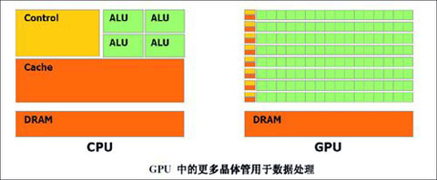
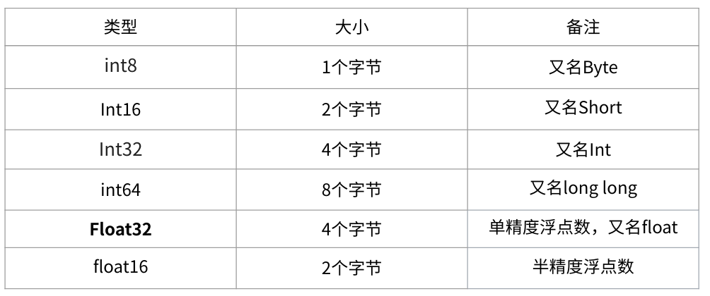
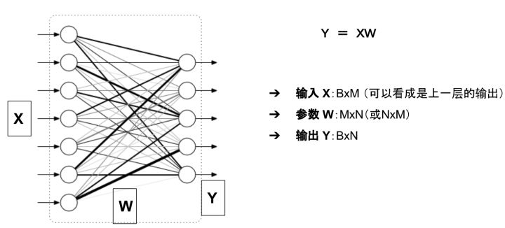

# GPU编程

> Neural net training very tolerant of reduced precision -- Jeff Dean

`tf.to_bfloat16`


## CUDA C编程权威指南

https://face2ai.com/CUDA-F-1-0-%E5%B9%B6%E8%A1%8C%E8%AE%A1%E7%AE%97%E4%B8%8E%E8%AE%A1%E7%AE%97%E6%9C%BA%E6%9E%B6%E6%9E%84/


Compute Unified Device Architecture 统一计算设备架构是NVIDIA英伟达提出的并行计算架构，结合了 CPU 和 GPU 的优点，处理密集型及并行计算。

CPU 和 GPU 两个单独的处理器，通过单个计算节点中的 **PCI-Express总线相连**，GPU 用来提高计算密集型应用程序中**并行程序段**的**执行速度**，CPU 负责管理**设备端的资源**。


实验环境：安装有CUDA工具包的 Linux 系统，C/C++ 编译程序和 NVIDIA Kepler GPU。

https://developer.nvidia.com/cuda-toolkit

​	该CUDA工具包包括了 **NVIDIA GPU编译器**、**CUDA数学库**以及用于**调试**和**优化**应用程序性能的工具，此外还有编程指南、用户手册、API参考指南和其他文档，它们都将帮助你快速掌握GPU应用程序的开发。


---

### 第一章 基于CUDA的异构并行计算

高性能计算（HPC）一般来说，它涉及**多个处理器**或**计算机**的使用，以**高吞吐量**和**高效率**来完成一个复杂的任务。

HPC 不仅可以认为是一个计算架构，还可以认为是包括硬件系统、软件工具、编程平台及并行编程范例的一组元素列表。

在过去的十几年中，高性能计算取得了极大的发展，尤其是 **GPU-CPU 异构架构**的出现，直接导致了在并行程序设计中一个基本的范例转变。将从本章开始学习异构并行程序设计。

#### 1.1. 并行计算

计算原则是一个**大**的问题往往可以被**划分**为很多可以同时解决的**小**问题。并行计算通常涉及两个不同的计算技术领域。

- 计算机**架构**（硬件方面）
- 并行**程序设计**（软件方面）

计算机架构关注的是在**结构级别上支持并行性**，而并行编程设计关注的是充分**使用计算机架构**的计算能力来并发地解决问题。**为了在软件中实现并行执行，硬件必须提供一个支持并行执行多进程或多线程的平台。**


大多数现代处理器都应用了**哈佛体系结构**（Harvard architecture），如图1-1所示，它主要由3个部分组成。

- **内存**（指令内存和数据内存）
- 中央处理单元（控制单元和算术逻辑单元ALU）
- 输入/输出接口

> 指令和数据都是以0、1代码形式存在存储器中，但CPU可以判断出在**取指**阶段访存取出的0、1代码是指令；在**执行**阶段访存取出的0、1代码是数据。（通过不同的时间段区分/通过地址来源区分）


高性能计算的关键部分是中央处理单元（CPU），通常被称为计算机的核心。在早期的计算机中，**一个芯片**上只有**一个CPU**，这种结构被称为单核处理器。

现在，芯片设计的趋势是将**多个核心**集成到一个**单一**的处理器上，以在体系结构级别支持并行性，这种形式通常被称为**多核**处理器。

因此，并行程序设计可以看作是将一个问题的计算分配给可用的核心以实现并行的过程。

当在多核计算机上执行算法时，对于程序员来说，**了解基本的计算机架构的特点**就显得非常重要了。


---

##### 1.1.1. 串行编程和并行编程

当用计算机程序解决一个问题时，我们会很自然地把这个问题划分成许多的运算块，每一个运算块执行一个指定的任务，如图1-2所示。这样的程序叫作**串行程序**。


有两种方法可以区分两个计算单元之间的关系：有些是有**执行次序**的，所以**必须串行**执行；其他的**没有执行次序**的约束，则可以**并发执行**。所有**包含并发执行任务**的程序都是**并行程序**。如图1-3所示，一个并行程序中可能会有一些串行部分。


从程序员的角度来看，一个程序应包含两个基本的组成部分：**指令和数据**。

当一个计算问题被划分成许多小的计算单元后，每个计算单元都是一个任务。在一个任务中，单独的指令负责处理输入和调用一个函数并产生输出。当一个指令处理前一个指令产生的数据时，就有了数据相关性的概念。因此，你可以区分任何两个任务之间的依赖关系，**如果一个任务处理的是另一个任务的输出，那么它们就是相关的，否则就是独立的**。

在并行算法的实现中，**分析数据的相关性是最基本的内容**，因为相关性是限制并行性的一个主要因素，而且在现代编程环境下，为了提高应用程序的运行速度，理解这些是很有必要的。在大多数情况下，具有依赖关系的任务之间的独立的关系链为并行化提供了很好的机会。


---

##### 1.1.2. 并行性

并行性的应用非常广泛，在编程领域，并行编程设计正在成为主流。**多层次的并行性设计是架构设计的驱动力**。在应用程序中有两种基本的并行类型。

- 任务并行
- 数据并行

当许多**任务或函数**可以独立地、大规模地并行执行时，这就是任务并行。任务并行的重点在于利用多核系统对任务进行分配。

当可以**同时处理许多数据**时，这就是数据并行。数据并行的重点在于利用多核系统对数据进行分配。

CUDA编程非常适合解决**数据并行计算**的问题。本书的重点便是如何使用CUDA编程解决数据并行问题。数据并行处理可以将**数据映射给并行线程**。


数据并行程序设计的**第一步**是把**数据依据线程进行划分，以使每个线程处理一部分数据**。

通常来说，有两种方法可以对数据进行划分：**块划分**（block partitioning）和**周期划分**（cyclic partitioning）。

在块划分中，**一组连续的数据被分到一个块内**。每个数据块以任意次序被安排给一个线程，**线程通常在同一时间只处理一个数据块**。

在周期划分中，更少的数据被分到一个块内。相邻的线程处理相邻的数据块，**每个线程可以处理多个数据块**。为一个待处理的线程选择一个新的块，就意味着要跳过和现有线程一样多的数据块。


图1-4所示为对一维数据进行划分的两个例子。在块划分中，每个线程仅需处理数据的一部
分，而在周期划分中，每个线程要处理数据的多个部分。


图1-5所示为对二维数据进行划分的3个例子：沿 y 轴的块划分，沿 x 轴和 y 轴的块划分，以及沿 x 轴的周期划分。其余的划分方式为沿 x 轴的块划分，沿 x 轴和 y 轴的周期划分，以及沿 y 轴的周期划分留作练习。


通常，数据是在一维空间中存储的。即便是多维逻辑数据，仍然要被**映射到一维物理地址空间中**。如何在线程中分配数据不仅与**数据的物理储存方式密切相关**，并且与每个**线程的执行次序**也有很大关系。组织线程的方式对程序的性能有很大的影响。


数据划分

对数据划分有两种基本的方法：

- **块划分**：每个线程作用于一部分数据，通常这些数据具有相同大小。
- **周期划分**：每个线程作用于数据的多部分。

程序性能通常对块的大小比较敏感。块划分与周期划分中划分方式的选择与计算机架构有
密切关系。具体实例详见本书其他章节。


---

##### 1.1.3. 计算机架构

###### 1.1.3.1. 指令数据分类

有多种不同的方法可以对计算机架构进行分类。一个广泛使用的分类方法是**弗林分类法**（Flynn’s Taxonomy），它根据**指令和数据进入CPU的方式**，将计算机架构分为4种不同的类型（如图1-6所示）。

- 单指令单数据（SISD）
- 单指令多数据（SIMD）
- 多指令单数据（MISD）
- 多指令多数据（MIMD）


SISD指的是传统计算机：一种串行架构。在这种计算机上只有**一个核心**。在任何时间点上只有**一个指令流在处理一个数据流**。

SIMD是一种并行架构类型。在这种计算机上有**多个核心**。在任何时间点上所有的核心只有**一个指令流处理不同的数据流**。向量机是一种典型的SIMD类型的计算机，现在大多数计算机都采用了SIMD架构。SIMD最大的优势或许就是，在CPU上编写代码时，程序员可以**继续按串行逻辑思考但对并行数据操作实现并行加速**，而其他细节则由**编译器来负责**。

MISD类架构比较少见，在这种架构中，每个核心通过使用**多个指令流处理同一个数据流**。

MIMD是一种并行架构，在这种架构中，**多个核心**使用**多个指令流**来**异步**处理**多个数据流**，从而实现**空间上的并行性**。许多MIMD架构还包括SIMD执行的子组件。


为了实现以下目的，在架构层次上已经取得了许多进展。

- 降低**延迟**
- 提高**带宽**
- 提高**吞吐量**

**延迟**是一个操作从**开始到完成所需要的时间**，常用微秒来表示。

**带宽**是单位时间内可处理的**数据量**，通常表示为MB/s或GB/s。

**吞吐量**是单位时间内**成功处理的运算数量**，通常表示为gflops（即每秒十亿次的浮点运算数量），特别是在重点使用浮点计算的科学计算领域经常用到。

延迟用来衡量**完成一次操作的时间**，而吞吐量用来衡量在给定的**单位时间内处理的操作量**。


###### 1.1.3.2. 内存组织方式分类

计算机架构也能根据内存组织方式进行进一步划分，一般可以分成下面两种类型。

- **分布式**内存的多节点系统
- **共享内存**的多处理器系统

在多节点系统中，大型计算引擎是由许多**网络连接**的处理器构成的。**每个处理器有自己的本地内存**，而且处理器之间可以通过网络进行通信。图 1-7 所示为一个典型的分布式内存的多节点系统，这种系统常被称作**集群**。


多处理器架构的大小通常是从双处理器到几十个或几百个处理器之间。这些处理器要么是与**同一个物理内存**相关联（如图1-8所示），要么**共用**一个**低延迟的链路**（如 PCI-Express 或 PCIe）。尽管共享内存意味着共享地址空间，但并不意味着它就是一个独立的物理内存。这样的多处理器不仅包括由多个核心组成的单片机系统，即所谓的多核系统，而且还包括由多个芯片组成的计算机系统，其中每一个芯片都可能是多核的。目前，多核架构已经永久地取代了单核架构。


“**众核**”（many-core）通常是指有很多核心（几十或几百个）的多核架构。近年来，计算机架构正在从多核转向众核。

**GPU**代表了一种**众核架构**，几乎包括了前文描述的所有并行结构：**多线程**、MIMD（**多指令多数据**）、SIMD（**单指令多数据**），以及**指令级并行**。NVIDIA公司称这种架构为SIMT（**单指令多线程**）。

GPU 和 CPU 的来源并不相同。历史上，GPU是图形加速器。直到最近，GPU才演化成一个强大的、多用途的、完全可编程的，以及任务和数据并行的处理器，它非常适合解决大规模的并行计算问题。


###### GPU核心和CPU核心

尽管可以使用多核和众核来区分CPU和GPU的架构，但这两种核心是完全不同的。

CPU核心比较重，用来处理非常**复杂的控制逻辑**，以优化串行程序执行。

GPU核心较轻，用于优化具有简单控制逻辑的数据并行任务，**注重并行程序的吞吐量**。


---

#### 1.2. 异构计算


---

https://zhuanlan.zhihu.com/p/51380356

## GPU性能

​	主要处理问题为 矩阵算法

​	GPU 图像处理单元是具有**专用内存**的专用单芯片处理器，通常会执行渲染图形所需的浮点计算

​	GPU按比例分配了更多的晶体管用于**算术逻辑单元**，减少了对**高速缓存**和**流控制**的投入。

​	GPU是专用图形渲染而设计的，后经过增强以加速其他**几何计算**（变换多边形或旋转垂直线）进入不同的坐标系。

​	GPU具有更多的逻辑核心（算术逻辑单元或ALU，控制单元和内存缓存）

​	如果您将CPU视为玛莎拉蒂，那么GPU可以算是一辆大卡车。CPU（玛莎拉蒂）可以在RAM中快速获取少量包裹（3-4位乘客），而GPU（卡车）速度较慢，但可以在一圈内获取大量内存（约20位乘客）。




​										  绿色的是计算单元，橙红色的是存储单元，橙黄色的是控制单元

​	CPU中的大部分晶体管主要用于构建控制电路（如分支预测等）和Cache，只有少部分的晶体管来完成实际的运算工作。GPU与CPU的设计目标不同，其控制电路相对简单，而且对Cache的需求较小，所以大部分晶体管可以组成各类专用电路和多条流水线，使GPU的计算速度有了突破性的飞跃，拥有惊人的处理浮点运算的能力。

​	GPU采用了数量众多的计算单元和超长的流水线，但控制逻辑非常简单并省去了Cache。而CPU不仅被Cache占据了大量空间，而且还有复杂的控制逻辑和诸多优化电路，相比之下计算能力只是CPU很小的一部分。

​	GPU的工作定位大部分情景是计算量大，**但没什么技术含量**，而且要重复很多很多次。就像你有个工作需要算几亿次一百以内加减乘除一样，最好的办法就是雇上几十个小学生一起算，一人算一部分，反正这些计算也没什么技术含量，纯粹体力活而已。而CPU就像老教授，积分微分都会算，但是工资高，一个老教授资顶二十个小学生，你要是富士康你雇哪个？

​	GPU就是这样，用很多简单的计算单元去完成大量的计算任务，纯粹的人海战术。这种策略基于一个前提，就是小学生A和小学生B的工作没有什么依赖性，是互相独立的。很多涉及到大量计算的问题基本都有这种特性，比如你说的破解密码、挖矿和很多图形学的计算。这些计算可以分解为多个相同的简单小任务，每个任务就可以分给一个小学生去做。


（1）高效的并行性。

​	这一功能主要是通过GPU多条绘制流水线的并行计算来体现的。在目前主流的GPU中，多条流水线可以在单一控制部件的集中控制下运行，也可以独立运行。GPU的顶点处理流水线使用MIMD方式控制，片段处理流水线使用SIMD结构。相对于并行机而言，GPU提供的并行性在十分廉价的基础上，为很多适合于在GPU上进行处理的应用提供了一个很好的并行方案。

（2）高密集的运算。

​	GPU通常具有128位或256位的内存位宽，因此GPU在计算密集型应用方面具有很好的性能。

（3）超长图形流水线。

​	GPU超长图形流水线的设计以吞吐量的最大化为目标，因此GPU作为数据流并行处理机，在对大规模的数据流并行处理方面具有明显的优势。

​	正是由于GPU在并行处理和计算密集型问题求解等方面所具有的诸多优势，GPU已成为目前普通PC机所拥有的强大、高效的计算资源。从系统架构上看，GPU是针对向量计算进行了优化的高度并行的数据流处理机。这种以数据流作为处理单元的处理机，在对数据流的处理上可以获得很高的效率。


​	卷积网络和Transformer：张量核心>FLOPs（每秒浮点运算次数）>显存带宽>16位浮点计算能力

​	循环神经网络：显存带宽>16位浮点计算能力>张量核心>FLOPs

​	以运算矩阵乘法A×B=C为例，将A、B**复制**到显存上比直接**计算**A×B更耗费资源。也就是说，如果你想用LSTM等处理大量小型矩阵乘法的循环神经网络，显存带宽是GPU最重要的属性。

​	矩阵乘法越小，内存带宽就越重要。

​	相反，卷积运算受计算速度的约束比较大。因此，要衡量GPU运行ResNets等卷积架构的性能，最佳指标就是FLOPs。**张量核心可以明显增加FLOPs**。

​	Transformer中用到的大型矩阵乘法介于卷积运算和RNN的小型矩阵乘法之间，16位存储、张量核心和TFLOPs都对大型矩阵乘法有好处，但它仍需要较大的显存带宽。


---

### 内存带宽

​	带宽是GPU比CPU更快的计算速度的主要原因之一。对于大型数据集，CPU在训练模型时会占用大量内存。

​	计算庞大而复杂的作业需要占用CPU大量的时钟周期（CPU 依次处理作业），并且内核数量少于同类GPU。

​	另一方面，独立的GPU带有专用的VRAM（视频RAM）内存。因此，CPU的内存可用于其他任务。

​	GPU 处理大量数据的能力，是最重要的性能指标。

----

### TensorCore

​	**RTX显卡**使用**Tensor Core**精度使用**FP16**（半精度）而不是FP32（单精度），可以提供更快的速度优势

---

### 处理能力

​	表示 GPU 处理数据的速度，我们将其量化为 **CUDA 核心数量**和每一个核心的**频率**的乘积。

​	**GPU计算单元**类似于CPU中的核，用来进行数值计算。衡量计算量的单位是flop： the number of floating-point multiplication-adds，浮点数一乘一加是macc

浮点数**先乘后加**算两个**flop**。计算能力越强大，速度越快。

​	衡量计算能力的单位是**flops**： 每秒能执行的flop数量

```
1*2+3                  2 flop
1*2 + 3*4 + 4*5        6 flop 
```


---

### 显存

​	一次性加载到显卡上的数据量。运行计算机视觉模型时，显存越大越好，特别是如果你想参加 CV Kaggle 竞赛的话。对于自然语言处理和数据分类，显存没有那么重要。		

**显存可以看成是空间，类似于内存。**

- 显存用于存放模型、数据
- 显存越大，所能运行的网络也就越大


#### 存储指标

```python
1Byte = 8 bit
1K = 1024 Byte
1M = 1024 K
1G = 1024 M
1T = 1024 G
10 K = 10*1024 Byte

1Byte = 8 bit
1KB = 1000 Byte
1MB = 1000 KB
1GB = 1000 MB
1TB = 1000 GB
10 KB = 10000 Byte
```

​	在深度学习中会用到各种各样的数值类型，数值类型命名规范一般为TypeNum，比如Int64、Float32、Double64。

​	Type：有Int，Float，Double等
​	Num: 一般是 8，16，32，64，128，表示该类型所占据的比特数目

​	常用的数值类型如下图所示(*int64 准确的说应该是对应c中的long long类型， long类型在32位机器上等效于int32*)：



其中Float32 是在深度学习中**最常用**的数值类型，称为**单精度**浮点数，每一个单精度浮点数占用4Byte的显存。

举例来说：有一个1000x1000的矩阵，float32，那么占用的显存差不多就是

> 1000x1000x4 Byte = 4MB

​	32x3x256x256的四维数组（BxCxHxW）占用显存为：24M	

---

#### 神经网络显存占用

​	神经网络模型占用的显存包括：

- 模型自身的参数
- 模型的输出

举例来说，对于如下图所示的一个全连接网络(不考虑偏置项b)



模型的显存占用包括：

参数：二维数组 W
模型的输出： 二维数组 Y
输入X可以看成是上一层的输出，因此把它的显存占用归于上一层。

这么看来显存占用就是W和Y两个数组？      并非如此！！！


##### 参数的显存占用

只有有参数的层，才会有显存占用。这部份的显存占用和**输入无关**，模型加载完成之后就会占用。

**有参数的层主要包括：**

- 卷积
- 全连接
- BatchNorm
- Embedding层
- ... ...

**无参数的层**：

- 多数的激活层(Sigmoid/ReLU)
- 池化层
- Dropout
- ... ...

更具体的来说，模型的参数数目(这里均不考虑偏置项b)为：

- Linear(M->N): 参数数目：M×N
- Conv2d(Cin, Cout, K): 参数数目：Cin × Cout × K × K
- BatchNorm(N): 参数数目： 2N
- Embedding(N,W): 参数数目： N × W

**参数占用显存 = 参数数目×n**

*n = 4 ：float32*

*n = 2 : float16*

*n = 8 : double64*

​	在PyTorch中，当你执行完`model=MyGreatModel().cuda()`之后就会占用相应的显存，占用的显存大小基本与上述分析的显存差不多（*会稍大一些，因为其它开销*）。

---

##### 梯度与动量的显存占用

​	举例来说， 优化器如果是 SGD，除了保存 W 之外还要保存对应的**梯度** ，因此显存占用等于参数占用的显存x2；如果是带 Momentum-SGD 这时候还需要保存**动量**， 因此显存x3；如果是 Adam 优化器，动量占用的显存更多，显存x4。

---

##### 输入输出的显存占用

模型输出的显存占用，总结如下：

- 需要计算每一层的feature map的形状（多维数组的形状）
- 需要保存输出对应的梯度用以反向传播（链式法则）
- **显存占用与 batch size 成正比**
- 模型输出不需要存储相应的动量信息。

深度学习中神经网络的显存占用，我们可以得到如下公式：

```text
显存占用 = 模型显存占用 + batch_size × 每个样本的显存占用
```

​	可以看出显存不是和 batch-size 简单的成正比，尤其是模型自身比较复杂的情况下：比如全连接很大，Embedding 层很大

另外需要注意：

- 输入（数据，图片）一般不需要计算梯度
- 神经网络的每一层输入输出都需要保存下来，用来反向传播，但是在某些特殊的情况下，我们可以不要保存输入。比如ReLU，在PyTorch中，使用`nn.ReLU(inplace = True)` 能将激活函数ReLU的输出直接覆盖保存于模型的输入之中，**节省不少显存**。

---

#### 节省显存的方法

在深度学习中，一般占用显存最多的是卷积等层的输出，模型参数占用的显存相对较少，而且不太好优化。

节省显存一般有如下方法：

- 降低batch-size
- 下采样(NCHW -> (1/4)*NCHW)
- 减少全连接层（一般只留最后一层分类用的全连接层）

---

#### 计算量分析

常用的操作计算量如下：

- 全连接层是 $BMN$ ,其中 B是batch size，M是输入形状，N是输出形状。
- 卷积的计算量是 $BHWC_{out}C_{in}K^2$ ，其中 $HWC_{out}$ 是输出点的个数，$C_{in}K^2$计算每个点的flop
- BatchNorm 计算量是 $BHWC*{4,5,6}$ 
- 池化的计算量是 $BHWCK^2$ ，其中 $HWC$ 是输出点的个数，$CK$计算每个点的乘法
- ReLU的计算量$BHWC$


#### 总结

- 时间更宝贵，尽可能使模型变快（减少flop）
- 显存占用不是和batch size简单成正比，模型自身的参数及其延伸出来的数据也要占据显存
- batch size越大，速度未必越快。在你充分利用计算资源的时候，加大batch size在速度上的提升很有限

尤其是batch-size，假定GPU处理单元已经充分利用的情况下：

- 增大batch size能增大速度，但是很有限（主要是并行计算的优化）
- 增大batch size能减缓梯度震荡，需要更少的迭代优化次数，收敛的更快，但是每次迭代耗时更长。
- 增大batch size使得一个epoch所能进行的优化次数变少，收敛可能变慢，从而需要更多时间才能收敛（比如batch_size 变成全部样本数目）。


https://zhuanlan.zhihu.com/p/31558973


----

### 数据集大小

​	在深度学习中训练模型需要大量的数据集，因此在内存方面需要大量的计算操作。为了有效地计算数据，GPU是最佳选择。计算量越大，GPU相对于CPU的优势就越大。

----

### 优化

​	在CPU中优化任务要容易得多。尽管CPU内核数量较少，但功能却比数千个GPU内核强大。

​	每个CPU内核可以执行不同的指令（MIMD架构），而通常组织在32个内核的块中的GPU内核在给定的时间并行执行同一条指令（SIMD架构）。

​	鉴于需要付出的努力，密集神经网络中的并行化非常困难。因此，与在CPU中相比，在GPU中难以实现复杂的优化技术。

---

## 混合精度计算


https://moocaholic.medium.com/fp64-fp32-fp16-bfloat16-tf32-and-other-members-of-the-zoo-a1ca7897d407

FP64, FP32, FP16, BFLOAT16, TF32, and other members of the ZOO

## CUDA编程