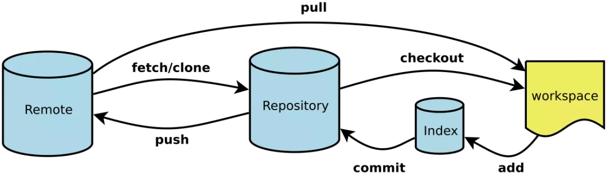

# Git

## 流程



Workspace：工作区

Index/Stage： 暂存区

Repository：仓库

Remote：远程仓库


## 管理

### 创建版本库

​	在一个目录下`git init`，把这个目录变成 git 可以管理的仓库

​	目录中的.git 是Git来跟踪管理版本的

------

### 添加暂存区

​	在该目录下新建文件 readme.txt，使用命令`git add readme.txt` 添加到暂存区

------

### 提交仓库

​	命令`git commit -m '添加了readme文件' `提交文件

------

### 查看状态

​	命令`git status` 查看是否还有文件未提交

​	nothing to commin, working directory clean

------

### 修改文件

​	修改readme.txt文件后，`git status`告诉我们被修改但未提交的内容。

------

### 查看不同

​	`git diff readme.txt`查看readme文件的不同

------

### 历史记录

​	继续修改readme.txt ，并添加提交。

​	`git log` 或 `git log –pretty=oneline`，查看历史记录，后边会跟每次提交的版本号

​	`git reflog` 查看全部记录

------

### 版本回退

​	`git reset --hard 6bcfc1f` 

------

### 撤销修改

​	readme.txt文件里面增加一行 内容为555555555555，未提交之前，我发现添加5555555555555内容有误，需要恢复以前的版本。

​	`git status` 、`git checkout -- readme.txt` 可以丢弃工作区的修改


------

### 删除文件

​	提交了b.txt文件，并提交了b.txt文件。这时在工作区删除了b.txt文件

​	若需要回复b.txt文件，`git checkout -- b.txt`


---

## 仓库操作

### 创建ssh key

```
ssh-keygen -t rsa –C “youremail@example.com”
```

​	登录github，setting 中的 SSH Keys 页面 add ssh keys ：填写任意 titile 、 key文本框粘贴pub的内容、点击addkey


### 添加远程库

​	本地创建了一个git仓库后，又想在github上创建一个git仓库，并且希望两个仓库远程同步。

​	github上 create a new repo 创建一个新仓库。

​	`git remote add origin https://github.com/***/***.git` 添加链接关系

​	`git push -u origin master` 把本地仓库分支master内容推送到元仓库去


​	只要本地做了提交`git commit`，就可以通过`git push origin master` 把本地master分支的最新修改推送到github上了


### 创建并合并分支

​	`git checkout -b dev` 创建并切换至dev分支，相当于`git branch dev,git checkout dev`

​	`git branch` 查看当前的分支，当前分支前有*号

​	在dev分支进行add、commit操作，不会影响 master 分支

​	`git merge dev` 在master分支上合并了dev的内容

​	`git branch -d dev` 合并完之后，可以删除dev分支


### 解决冲突

​	merge conflict in readme.txt

​	<<<HEAD是指主分支修改的内容，>>>>>dev 是指dev上修改的内容

​	将dev上的内容修改成与主分支相同的内容


### 合并历史

​	`git log`


### 分支管理策略

​	通常合并分支时，git一般使用”Fast forward”模式，在这种模式下，删除分支后，会丢掉分支信息，现在我们来使用带参数 –no-ff来禁用”Fast forward”模式

​	创建一个dev分支 `git checkout -b dev`

​	修改readme.txt内容

​	添加到暂存区 `git add readme.txt`    `git commit -m 'test'`

​	切换回主分支(master) `git checkout master`

​	合并dev分支，使用命令 git merge –no-ff -m “注释” dev `git merge --no--ff -m 'test' dev`

​	查看历史记录 `git branch -d dev`


### bug分支

​	比如我在开发中接到一个404 bug时候，我们可以创建一个404分支来修复它，但是，当前的dev分支上的工作还没有提交。并不是我不想提交，而是工作进行到一半时候，我们还无法提交。


​	比如我这个dev要2天完成，但是我issue-404 bug需要5个小时内完成。怎么办呢？还好，Git还提供了一个stash功能，可以把当前工作现场 ”隐藏起来”，等以后恢复现场后继续工作。如下

​	`git stash` 将当前工作现场隐藏起来

​	`git status` 查看状态，没有任何变换

​	`git checkout -b issue-404`创建并切换临时分支404 以解决bug

​	`git add bug.txt & git commit -m 'fix bug'`解决bug并添加提交

​	`git checkout master`切换到主分支

​	`git merge --no--ff -m 'merge bug fix' issue-404` 合并分支issue-404的内容

​	`git branch -d issue-404` 删除无用分支

​	`git checkout dev` 回到dev继续开发

​	`git stash list` 查看之前保存的工作现场

​	`git stash pop` 恢复同时把保存的工作现场删除  或者`git stash apply` 恢复并不删除


---

## 多人协作

​	当你从远程库克隆时候，实际上Git自动把本地的master分支和远程的master分支对应起来了，并且远程库的默认名称是origin。

​	要查看远程库的信息，使用 `git remote`

​	要查看远程库的详细信息，使用 `git remote –v`

### 推送分支

​	推送分支就是把该分支上所有本地提交到远程库中，推送时，要指定本地分支，这样，Git就会把该分支推送到远程库对应的远程分支上：使用命令 `git push origin master`

​	推送到其他分支，比如dev分支上，还是那个命令 `git push origin dev`

​	master分支是主分支，因此要时刻与远程同步。一些修复bug分支不需要推送到远程去，可以先合并到主分支上，然后把主分支master推送到远程去。


### 抓取分支

​	多人协作时，大家都会往master分支上推送各自的修改。现在我们可以模拟另外一个同事，可以在另一台电脑上（注意要把SSH key添加到github上）或者同一台电脑上另外一个目录克隆，新建一个目录名字叫testgit2

​	但是我首先要把dev分支也要推送到远程去，`git push origin dev`

​	接着进入testgit2目录，进行克隆远程的库到本地来

​	现在我们的小伙伴要在dev分支上做开发，就必须把远程的origin的dev分支到本地来，于是可以使用命令创建本地dev分支 `git checkout -b dev origin/dev`

​	现在小伙伴们就可以在dev分支上做开发`git add`   `git commit`  

​	开发完成后，把现在的dev分支推送到远程去`git push origin dev`


​	小伙伴们已经向origin/dev分支上推送了提交，而我在我的目录文件下也对同样的文件同个地方作了修改，也试图推送到远程库时：

​	推送失败，因为我的小伙伴最新提交的和我试图推送的有冲突，解决的办法也很简单，上面已经提示我们，**先用git pull把最新的提交从origin/dev抓下来，然后在本地合并，解决冲突，再推送**。

​	git pull也失败了，原因是没有指定本地dev分支与远程origin/dev分支的链接，根据提示，设置dev和origin/dev的链接：如下

​	`git branch --set-upstream dev origin/dev`

​	`git pull`

​	修改后add、commit后

​	`git push origin dev`


因此：多人协作工作模式一般是这样的：

​	首先，可以试图用git push origin branch-name推送自己的修改.
​	如果推送失败，则因为远程分支比你的本地更新早，需要先用 git pull 试图合并。
​	如果合并有冲突，则需要解决冲突，并在本地提交。再用 git push origin branch-name 推送。    


参考文章: Git使用教程：最详细、最傻瓜、最浅显、真正手把手教！（又一篇万字长文）

https://mp.weixin.qq.com/s?__biz=MzIwNTc4NTEwOQ==&mid=2247487611&idx=2&sn=67022b1b6bf75927bc77b6b09f4369f6&chksm=972ac101a05d4817988b050809674f7965be2fd197019927ea78cf73e8ff5262826bb709c15f&mpshare=1&scene=1&srcid=&sharer_sharetime=1575827298777&sharer_shareid=69c2dc2b0fd2e402d2771218812300dc&key=2c4881e20dc9fe0fdd3dc66efae2c29fb7f73cce2c4a71f9bab65cd7d7118d806e9e726f909354bfc0c5e8f6e337f2cdf47f993983544f21d1f0e32f9bc9e53eb23dcaadcda91f84e426f02eb5275c28&ascene=1&uin=Nzg1Mzk1MTg0&devicetype=Windows+10&version=62080079&lang=zh_CN&exportkey=AY59imMjuDalEq%2B2FAmFklg%3D&pass_ticket=QCK5Q2BnABxVpCO5L0EUmesGL3sGiHOXgOGT1%2B6DCaa6KDpnGSQT19URVzskJdq7


---

## 冲突实战

​	git checkout master

​	git pull https://github.com/unknownue/PU-Flow.git

​	git push -u origin master

### fork 更新

https://blog.csdn.net/ganquanzhong/article/details/103023081


# Git + Typora

## github

​	创建仓库PointCloudDoc


## 初始化文件夹

```
git init
```


## 添加提交

```
git add .
git commit -m "first commit"
```


## 添加仓库关联

```
git remote add origin git@github.com:DuanYaQi/E-NICE.git
```


## push仓库

```bash
git push -u origin master  #-u 设置默认分支为master
```


## 删除某个分支

```bash
git push origin :main
```


## 删除一个文件所有历史记录日志

```shell
git filter-branch --force --index-filter 'git rm --cached --ignore-unmatch T_Temp.md' --prune-empty --tag-name-filter cat -- --all

##############################解释#################################
git filter-branch --index-filter 让每个提交的文件都复制到索引(.git/index)中
然后运行过滤器命令：git rm --cached --ignore-unmatch 文件名 ，让每个提交都删除掉“文件名”文件
然后--prune-empty 把空的提交“修剪”掉
然后--tag-name-filter cat 把每个tag保持原名字，指向修改后的对应提交
最后-- --all 将所有ref（包括branch、tag）都执行上面的重写
##############################解释#################################

    
git push origin --force --all
git push origin --force --tags


# 删除缓存下来的ref和git操作记录
git for-each-ref --format='delete %(refname)' refs/original | git update-ref --stdin
git reflog expire --expire=now --all

#垃圾回收
git gc --prune=now

# 强推
git push --force
```


## 添加key

```bash
ssh-keygen -t rsa -C "837738300@qq.com" 
cat ~/.ssh/id_rsa.pub
```


## upstream/master

```shell
1.本地创建一个本地仓库 

2.关联远程端:
git remote add origin git@github.com:用户名/远程库名.git

3.同步远程仓库到本地
git pull
这个时候会报错
If you wish to set tracking information for this branch you can do so with:
git branch --set-upstream-to=origin/<branch> master
再按提示执行
git branch --set-upstream-to=origin/master master
继续报错
fatal: branch 'master' does not exist


原因:
本地仓没有在master上所以报错了


4.在本地仓切换到master，那么刚刚同步的文件就出来了
git checkout master

这里实际远程端的其他分支也同步了下来的了，但是 git branch 不会展示出来
直接 git checkout 分支名 就可以直接切过去了
```


---

# Error

## 1. refusing to merge unrelated histories

```shell
git pull origin master --allow-unrelated-histories
```


## 2. If you wish to set tracking information for this branch you can do so with:

```shell
git branch --set-upstream-to=origin/master master
```


## 3. fatal: branch 'master' does not exist

```shell
git checkout master
```


## 4. ! [rejected]       master -> master (fetch first/non-fast-forward)

```
git pull --rebase origin master
git push -u origin master
```

https://blog.csdn.net/downanddusk/article/details/88344389


## 5. git Key is already in use

**该key被其他用户使用或被其他仓库使用**

https://blog.csdn.net/m0_38072683/article/details/82939535


## 6. Couldn't find remote ref master

https://www.jianshu.com/p/f08efd596773

1.检查本地GIT的配置

```shell
git config user.name/git config --global user.name
git config user.email/git config --gloabl user.email
```

使用以上命令来检查本地的用户名和邮箱是否填写正确

2.检查远程仓库配置

```shell
git remote -v
```

如果远程仓库信息有误，则删除本地仓库配置，并且设置相关地址

```shell
git remote rm origin
git remote add origin XXXX
```

3.还是不行的话可以找到文件路径下 git 文件所在，打开 config 文件，删除[remote "origin"] 下信息。重复1，2步骤。


## 7. Updates were rejected because the tip of your current branch is behind

```bash
git push -u origin master -f 
```


##  8. socket5 read timeout

```shell
git config --global http.proxy 127.0.0.1:1080
//然后开全局代理push/pull
```


```shell
// 查看当前代理设置
git config --global http.proxy
git config --global https.proxy

// 设置当前代理为 http://127.0.0.1:1080 或 socket5://127.0.0.1:1080
git config --global http.proxy 'http://127.0.0.1:1080'
git config --global https.proxy 'http://127.0.0.1:1080'

git config --global http.proxy 'socks5://127.0.0.1:1080'
git config --global https.proxy 'socks5://127.0.0.1:1080'

// 删除 proxy
git config --global --unset http.proxy
git config --global --unset https.proxy
```


## 9. SSL certificate problem: self signed certificate

```shell
 git config --global http.sslVerify false
```


## 10. OpenSSL SSL_read: Connection was aborted, errno 10053

```
git config --global http.sslVerify false
```


## 11. Failed to connect to github.com port 443: Timed out

```
取消代理 + git push
```

