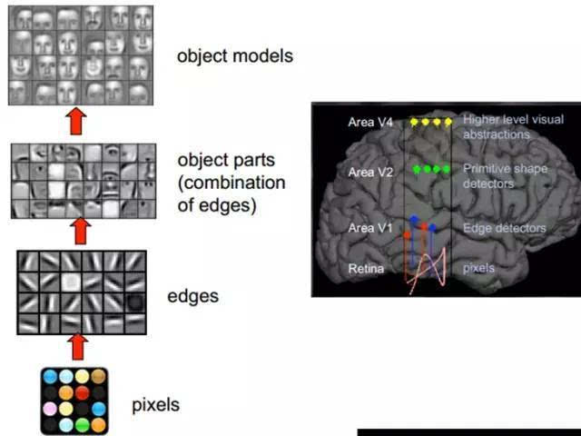

# MY IDEA

可以查看顶会顶刊论文、GitHub、国内外最新专利来产生idea

## 点云

1. DGCNN 和 DeepGCN互相结合

2. 大脑视觉神经研究：在图片分类任务中**训练出来的深度神经网络**模型与**人类视觉神经**的结构相似，并且，

   **DNN**的每一层也与人类大脑某个视觉神经区域某对应，这意味着，通过训练出来的DNN模型来研究人脑视觉神经是可行的。

3. 人类注意力机制的研究，尤其是视觉对与图形

4. 深度学习-----结构靠仿生模拟，权值靠训练演化

5. 其实我们每天看到的图像内部本身就有内在的结构（线条，端点，规则图形），结构本身就有层次（线段组成简单图形，简单图形组成复杂图形），用这些结构去编码表征图像效率最高。我觉得视觉系统也好，deep learning也好，只是把这些结构找出来了而已。

6. 当瞳孔发现了眼前物体的**边缘**，而且这个边缘**指向某个方向**时，这种神经元**细胞**就会**活跃**。眼睛接触到原始信号（瞳孔摄入像素 Pixels），接着做初步处理（大脑皮层某些细胞发现边缘和方向），然后抽象（结合一堆边缘与方向信息，大脑判定，眼前的物体的形状，是圆形的），然后进一步抽象（大脑进一步判定该物体是只气球）。**分层**

7. 特征尤为重要，尤其是结构性特征

8. 针对PointNet空间变换不变性的改进
9. 针对PointNet添加注意力机制的改进
10. 针对PointNet解决无序性的改进
11. 针对PointNet中dropout和batch normalization共同使用的错误修正
12. 生成时只在特征级别学习拟合特征的相似、适应，等学习到与结果相似的特征后，进行上采样超分辨。这样可以加快训练速度。一模一样的点云组，其特征组也一模一样；一模一样的特征组，上采样后的点云一定一样吗？
13. 

---

我想你可能做了虚假的AI，虚假的AI有以下特点：

- 从不自己收集、处理、清洗、标注数据，而是找一个现有的数据集，疯狂 过拟合数据集。
- 科研idea主要来自于各种模块的花式排列组合，包含但不限于：各种 **CNN**，各种 **RNN**，各种 **attention**，各种 **transformer**，各种 **dropout**，各种 **batchNorm**，各种激活函数，各种 **loss function**
- 而不是从实际问题和自然语言的现有挑战出发来思考idea
- 总是指望靠一个算法、一个模型可以解决所有问题

想做好真实AI，必须：

- 不断反馈，分析，改进。
- 面对真实环境中获取数据难，数据标注成本高，数据脏难清洗等问题
- 从实际问题和自然语言的现有挑战出发，设计针对问题最适合合理有效的模型
- 从不指望一个算法和问题可以解决所有问题，所有遇到的问题会做出合理的分析和拆解，针对各个难点设计最优解决算法，各个击破。

---

## SLAM

1. slam与云计算结合起来，后端复杂算法卸载至云端
2. slam与边缘计算
3. 语义slam  深度学习与slam技术相结合
4. 与其他最新单个技术结合。比如建图部分：港中文全新点云上采样方法、国科大共面检测、LatticeNet：使用四面体格的快速点云分割《LatticeNet: Fast Point Cloud Segmentation Using Permutohedral Lattices》作者团队：波恩大学；定位部分：