---

# 范数

范数(norm)是数学中的一种基本概念。在泛函分析中，它**定义在赋范线性空间中**，并满足一定的条件，即①非负性；②齐次性；③三角不等式。它常常被用来度量**某个向量空间**（或**矩阵**）**中的每个向量的长度或大小**。

范数是具有“长度”概念的函数。

距离的定义是一个宽泛的概念，只要满足**非负、自反、三角不等式**就可以称之为距离。范数是一种强化了的距离概念，它在定义上比距离多了一条数乘的运算法则。有时候为了便于理解，我们可以把范数当作距离来理解。

这三个条件可以参考度量空间中的[详述](#metric conditon)

## 向量范数

用来表示向量**大小**，指定义的其在度量空间中的大小，而不是简单的实数大小。

下式的 $X$ 为向量

向量的**0-范数**： ${\left\| X \right\|_0}  =\#\left(i \mid x_{i} \neq 0\right) $，表示非0元素的个数

向量的**1-范数**： ${\left\| X \right\|_1} = \sum\limits_{i = 1}^n {\left| {{x_i}} \right|} $; 各个元素的绝对值之和；也称街区距离（city-block）

向量的**2-范数**：${\left\| X \right\|_2} = {\left( {\sum\limits_{i = 1}^n {{x_i}^2} } \right)^{\frac{1}{2}}} = \sqrt {\sum\limits_{i = 1}^n {{x_i}^2} }$；每个元素的平方和再开平方根；Euclid范数，也称欧几里得范数，欧氏距离

向量的**无穷范数**：${\left\| X \right\|_\infty } = \mathop {\max }\limits_{1 \le i \le n} \left| {{x_i}} \right|$，也称棋盘距离（chessboard），切比雪夫距离

向量的**p-范数**：$ \|X\|_{p}=\sqrt[p]{\sum_{i}\left|x_{i}\right|^{p}} $

**例：向量 $X=[2, 3, -5, -7]$ ，求向量的1-范数，2-范数和无穷范数。**

向量的1-范数：各个元素的绝对值之和 ${\left\| X \right\|_1}=2+3+5+7=17$；

向量的2-范数：每个元素的平方和再开平方根 ${\left\| X \right\|_2} = {\left( {{\rm{2}} \times {\rm{2}} + {\rm{3}} \times {\rm{3}} + {\rm{5}} \times {\rm{5}} + {\rm{7}} \times {\rm{7}}} \right)^{\frac{1}{2}}} = 9.3274$；

 向量的无穷范数：

（1）正无穷范数：向量的所有元素的绝对值中最大的；即X的正无穷范数为：7； 

（2）负无穷范数：向量的所有元素的绝对值中最小的；即X的负无穷范数为：2；

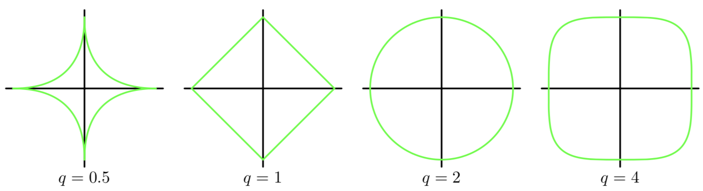

向量的**p-范数**：${\left\| X \right\|_p} = {\left( {\sum\limits_{i = 1}^n {{{\left| {{x_i}} \right|}^p}} } \right)^{\frac{1}{p}}}$，其中正整数 $p≥1$，并且有 $\mathop {\lim }\limits_{p \to \infty } {\left\| X \right\|_p} = \mathop {\max }\limits_{1 \le i \le n} \left| {{x_i}} \right|$

向量元素绝对值的 $p$ 次方和的 $\frac{1}{p}$  次幂。 $p$ 和之前的 $q$ 是一个东西，随着 $p$ 越大，等高线图越接近正方形（正无穷范数）；越小，曲线弯曲越接近原点（负无穷范数）

$p$ 的含义是一般化正则项的幂指数，也就是我们常说的2范数，两者在形式上是完全等同的。结合范数的定义，我们可以解释一般化正则项为一种对待求参数 $w$ 的测度，可以用来限制模型不至于过于复杂

---

## 矩阵范数

设：向量，矩阵，例如矩阵 $A$ 为：

A=[2, 3, -5, -7;

​      4, 6,  8, -4;

​      6, -11, -3, 16];

（1）矩阵的**1-范数**（**列模**）：${\left\| A \right\|_1} = \mathop {\max }\limits_{X \ne 0} \frac{{{{\left\| {AX} \right\|}_1}}}{{{{\left\| X \right\|}_1}}} = \mathop {\max }\limits_{1 \le j \le n} \sum\limits_{i = 1}^n {\left| {{a_{ij}}} \right|}$；矩阵的每一列上的元素绝对值先求和，再从中取个最大的，（列和最大）；即矩阵A的1-范数为：27

（2）矩阵的**2-范数**（**谱模**）：$$ \|A\|_{2}=\max _{X \neq 0} \frac{\|A X\|_{2}}{\|X\|_{2}}=\sqrt{\lambda_{\max }\left(A^{*} A\right)}=\sqrt{\max _{1 \leq i \leq n}\left|\lambda_{i}\right|} $$，其中 $ \lambda_{i} $ 为 $ A^{T} A $ 的特征值；矩阵 $ A^{T} A $ 的最大特征值开平方根。（$A^∗$ 为 $A$ 的共轭转置，实数域等同于 $A^T$）

（3）矩阵的**无穷范数**（**行模**）：$ \|A\|_{\infty}=\max _{X \neq 0} \frac{\|A X\|_{\infty}}{\|X\|_{\infty}}=\max _{1 \leq \mathrm{i} \leq n} \sum_{j=1}^{n}\left|a_{i j}\right| $；矩阵的每一行上的元素绝对值先求和，再从中取个最大的，（行和最大，**行和范数**）

（4）矩阵的**核范数**：$\Vert \mathbf A \Vert_{*} =  \sum\limits_{i=1}^n \lambda_i$ ，若 $A$ 矩阵是方阵，$λ_i$ 称为本征值；若不是方阵，称为奇异值，即奇异值/本征值之和。这个范数可以用来低秩表示（因为最小化核范数，相当于最小化矩阵的秩——低秩）；

 

（5）矩阵的**L0范数**：矩阵的**非0元素的个数**，通常用它来表示稀疏，L0范数越小0元素越多，也就越稀疏。

 

（6）矩阵的**L1范数**：矩阵中的**每个元素绝对值之和**，它是L0范数的最优凸近似，因此它也可以近似表示稀疏；称为系数规则算子（Lasso regularization）

 

（7）矩阵的**F范数/L2范数**：$\Vert \mathbf A \Vert_{F} = \sqrt{ \sum\limits_{i=1}^m \sum\limits_{j=1}^n \vert a_{i,j}\vert^2 }$，**矩阵元素绝对值的平方和再开平方**，它的有点在它是一个凸函数，可以求导求解，易于计算；（Ridge regularization）Frobenius范数（希尔伯特-施密特范数，这个称呼只在希尔伯特空间)

 

（8）矩阵的**L21范数**：矩阵先以每一列为单位，求每一列的F范数（也可认为是向量的2范数），然后再将得到的结果求L1范数（也可认为是向量的1范数），很容易看出它是介于L1和L2之间的一种范数

## L0/L1稀疏化

L0和L1都可以实现稀疏化，不过一般选用L1而不用L0，原因包括：

1）L0范数很难优化求解（NP难）；

2）L1是L0的最优凸近似，比L0更容易优化求解。（这一段解释过于数学化，姑且当做结论记住）

稀疏化的好处是是什么？

1）特征选择

实现特征的自动选择，去除无用特征。稀疏化可以去掉这些无用特征，将特征对应的权重置为零。

2）可解释性（interpretability）

例如判断某种病的患病率时，最初有1000个特征，建模后参数经过稀疏化，最终只有5个特征的参数是非零的，那么就可以说影响患病率的主要就是这5个特征。

## L2避免过拟合

L2避免过拟合的原理是：让L2范数的规则项 $\|W\|_2$ 尽可能小，可以使得 $W$ 每个元素都很小，接近于零，但是与 L1不同的是，不会等于0；这样得到的模型抗干扰能力强，参数很小时，**即使样本数据x发生很大的变化，模型预测值y的变化也会很有限**。

L2范数除了避免过拟合问题，还有一个优点是有助于处理 condition number 不好的情况下，矩阵求解困难的问题。condition number 是对系统 ill-condition 程度的一个衡量标准。假设有方程组 $Ax=b$，需要求解 $x$。如果 $A$ 或者 $b$ 发生轻微改变，就会使得 $x$ 的解发生很大变化，那么这个方程组系统就是ill-condition的，反之就是well-condition的。下图为例说明：

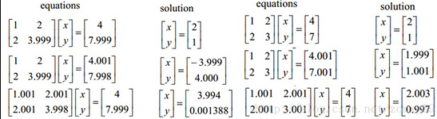

第一行是两个原始的方程序系统；第二行对系统的b做出轻微修改，左侧方程组的解发生较大变化，右侧的变化不明显；第三行对系统的A做出轻微修改，同样左侧系统的解发生较大变化，右侧的变化不明显。这说明左侧的系统是ill-condition的，右侧的是well-condition的。

具体到通过训练数据建立的模型中时，ill-condition可以说就是不稳定的，当输入的样本数据发生变化时，预测结果就会不准确。condition number就是用来对系统的ill-condition程度进行衡量的，condition number值小的就是well-condition，反之为ill-condition。如果一个矩阵的condition number在1附近，那么它就是well-conditioned的，如果远大于1，那么它就是ill-conditioned的，如果一个系统是ill-conditioned的。

## 模型空间限制

使用L1,L2范式建立模型时，损失函数可以写成如下形式：

Lasso: $ \min _{w} \frac{1}{n}\|\mathrm{y}-X \mathrm{w}\|^{2}, \quad $ s.t. $ \|\mathrm{w}\|_{1} \leq C $

Ridge: $ \min _{w} \frac{1}{n}\|\mathrm{y}-X \mathrm{w}\|^{2}, \quad $ s.t. $ \|\mathrm{w}\|_{2} \leq C $

可以说成是将模型空间限制在w的某个范围内，如下图所示，在$（w1,w2）$空间上可以画出目标函数的等高线，约束条件则是平面上半径为 $C$ 的一个 norm ball，等高线与 norm ball 首次相交的地方就是最优解。

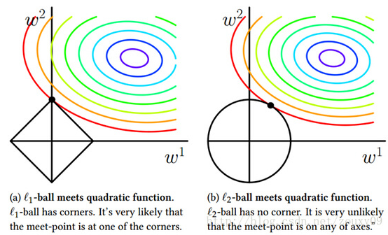

通过对比可以看出，L1-ball 和 L2-ball 的不同在于 L1 在和每个坐标轴相交的地方都有”角“出现，与目标函数相交的地方也是在角的位置。角的位置就容易产生稀疏性，例如图中的交点处 w1=0。L2 就没有这样的性质，因为没有角，相交的位置有稀疏性的概率就非常低，从直观上解释了为什么 L1 能够产生稀疏性而 L2 就不行。

总结一下就是：L1 范式会趋向于产生较少的特征，在特征选择时很有用；L2 会选择更多特征，但对应权值接近零。

## 核范数秩

核范数 $\|W\|_*$ 是指矩阵奇异值的和，Nuclear Norm。约束 Low-Rank（低秩）。

我们先来回忆下线性代数里面"秩"到底是啥？
$$
\begin{equation}
 \left\{\begin{array}{l}x_{1}-x_{2}+x_{3}=5 \\ x_{1}+x_{2}+x_{3}=7 \\ 2 x_{1}-2 x_{2}+2 x_{3}=14\end{array}\right\} 
\end{equation}
$$
对上面的线性方程组，第一个方程和第二个方程有不同的解，而第2个方程和第3个方程的解完全相同。从这个意义上说，第3个方程是"多余"的，因为它没有带来任何的信息量，把它去掉，所得的方程组与原来的方程组同解。**为了从方程组中去掉多余的方程，自然就导出了"矩阵的秩"这一概念**。

还记得我们怎么手工求矩阵的秩吗？为了求矩阵A的秩，我们是通过矩阵**初等变换**把A化为**阶梯型矩阵**，若该阶梯型矩阵有**r个非零行**，那**A的秩rank(A)就等于r**。从物理意义上讲，矩阵的**秩度量**的就是**矩阵的行列之间的相关性**。如果矩阵的各行或列是**线性无关**的，矩阵就是**满秩**的，也就是秩等于行数。回到上面线性方程组来说吧，因为线性方程组可以用矩阵描述嘛。秩就表示了有多少个有用的方程了。上面的方程组有3个方程，实际上只有2个是有用的，一个是多余的，所以对应的矩阵的秩就是2了。

既然秩可以度量相关性，而矩阵的相关性实际上有带有了矩阵的结构信息。如果矩阵之间各行的**相关性很强**，那么就**表示这个矩阵实际可以投影到更低维的线性子空间**，也就是用几个向量就可以完全表达了，它就是**低秩**的。所以我们总结的一点就是：如果矩阵表达的是结构性信息，例如图像、用户-推荐表等等，那么这个矩阵各行之间存在这一定的相关性，那这个矩阵一般就是低秩的。

如果X是一个m行n列的数值矩阵，rank(X)是X的秩，假如rank (X)远小于m和n，则我们称X是低秩矩阵。低秩矩阵每行或每列都可以用其他的行或列线性表出，可见它包含大量的冗余信息。利用这种冗余信息，可以对缺失数据进行恢复，也可以对数据进行特征提取。

好了，低秩有了，那约束低秩只是约束rank(w)呀，和我们这节的核范数有什么关系呢？他们的关系和L0与L1的关系一样。因为rank()是非凸的，在优化问题里面很难求解，那么就需要寻找它的凸近似来近似它了。$\text{rank}(w)$ 的凸近似就是核范数 $||W||_*$。

**1）矩阵填充(Matrix Completion)**

**2）鲁棒PCA**

**3）背景建模**

**4）变换不变低秩纹理（TILT）**

https://www.cnblogs.com/MengYan-LongYou/p/4050862.html

https://charlesliuyx.github.io/2017/10/03/%E3%80%90%E7%9B%B4%E8%A7%82%E8%AF%A6%E8%A7%A3%E3%80%91%E4%BB%80%E4%B9%88%E6%98%AF%E6%AD%A3%E5%88%99%E5%8C%96/#Why-amp-What-%E6%AD%A3%E5%88%99%E5%8C%96

---

# 卷积-矩阵乘法

Pytorch提供的 `nn.Conv2d` 方法，是把卷积操作转化成矩阵乘法，而不是真的通过滑动卷积核来做卷积，下面做具体介绍。

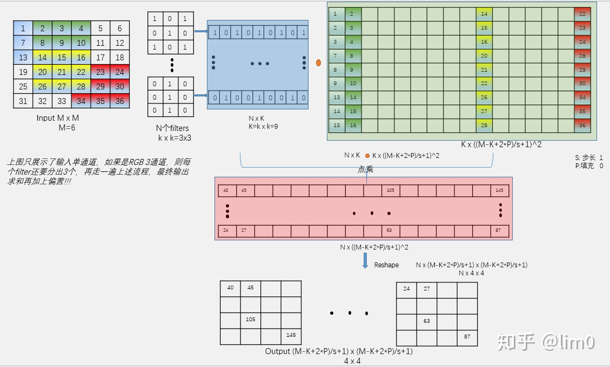

将卷积运算转化为矩阵乘法，从乘法和加法的运算次数上看，两者没什么差别，但是转化成矩阵后，运算时需要的数据被存在**连续的内存**上，这样访问**速度大大提升**（cache），同时，矩阵乘法有很多库提供了高效的实现方法，像BLAS、MKL等，转化成矩阵运算后可以通过这些库进行加速。

缺点呢？这是一种空间换时间的方法，**消耗了更多的内存**——转化的过程中数据被冗余存储。

https://zhuanlan.zhihu.com/p/84050835

https://www.cnblogs.com/marsggbo/p/12074297.html

https://petewarden.com/2015/04/20/why-gemm-is-at-the-heart-of-deep-learning/

https://www.cnblogs.com/shine-lee/p/10775831.html

kernel(3×33×3)与input(4×44×4) 的卷积示意如下：

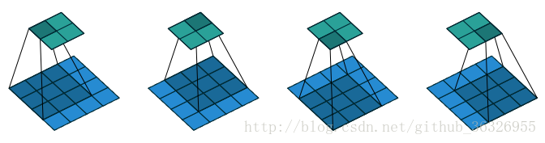

只做了四次操作

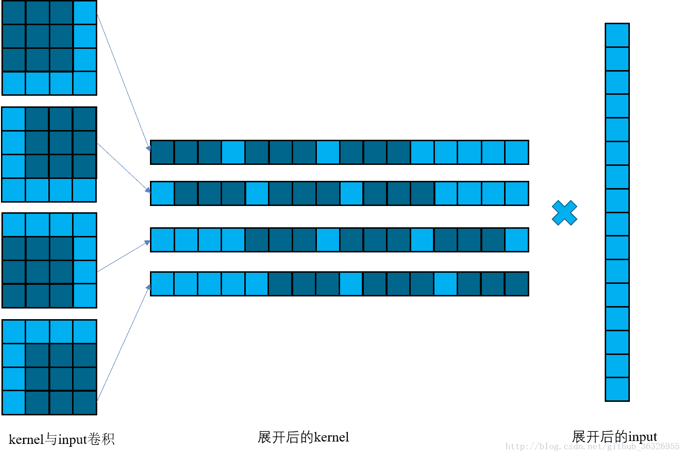

在上面这张图中，阴影表示的是 kernel，按理说我们展开 kernel 应该是9个元素。但是在这里，我们展开kernel 的方式是，**把 kernel 放在 input 上，按照 input 的尺寸展开**。这样以来，空余的部分（就是上图展开后的 kernel 中浅蓝色没有加阴影的部分）就写成 0。0 与任何数乘积为 0。这样每一步的卷积，相当于展开后的 kernel 的对应的一行与展开的 input 的矩阵乘积。

令展开后的 kernel 矩阵为 $C$，那么 $C$ 用数学的表达方式写成：

这样，矩阵卷积可以写成：
$$
\begin{equation}
 (I * K)^{f l a t}=C I^{\text {flat }} 
\end{equation}
$$
上标 flat 表示将矩阵展平为一维向量。那么，对于有填充的卷积，该怎么办呢？事实上，对于有填充的卷积，相当于对 input 进行了扩展，得到了 $\text{input}^{\text{extend}}$，然后我们对 $\text{input}^{\text{extend}}$ 与 $\text{kernel}$ 再次运用上面的原理进行计算。

在上面的这个 $C$ 矩阵中，我们可以做这样的一个分割：

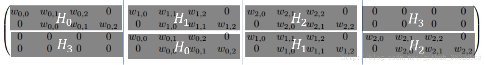

我们看到每一个子块 $H_i$ 都是一个**循环矩阵（circulant matrix）**，而整个矩阵则是这些子块的循环矩阵。因此我们把这样的矩阵叫做**双块循环矩阵（doubly block circulant matrix）**。

离散卷积可以被认为是矩阵的乘法。只是，这个矩阵的元素是有限制的。例如，对于一维卷积而言，矩阵的每一行元素与上一行错位一个位置。这种矩阵叫做托普勒斯矩阵（Toeplitz matrix）。在二维卷积中，对应的则是双块循环矩阵（doubly block circulant matrix）。这些矩阵的一些元素受到相等的约束。

除此之外，我们也看到这些矩阵是很稀疏的（大多数位置是0）。原因是我们的kernel通常要比input小很多。把卷积用矩阵乘法的视角来解读似乎对我们实现卷积没什么帮助，但是对我们理解卷积和设计神经网络却很有意义。

例如，加入有一个神经网络算法运用了矩阵乘法，并且对矩阵的结构没有特别的要求，那么我们也可以用卷积来替代这个矩阵乘法而不需要改动神经网络。

https://blog.csdn.net/github_36326955/article/details/72835148

---

# Domain/Codomain/Range

domain: 定义域  

codomain: 取值空间

range: 值域

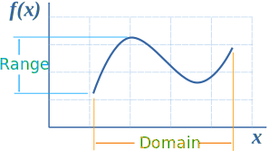

设 $G$ 是从 $X$ 到 $Y$ 的关系，$G$ 的定义域 $D(G)$ 为 $X$，且对**任何** $x∈X$ 都有**惟一**的 $y∈Y$ 满足 $G(x，y)$，则称 $G$ 为从 $X$ 到 $Y$ 的**映射**。

关系 $G$ 常使用另一些记号：$f: X→Y$ 等， $f$ 与 $G$ 的关系是 $y=f(x)(x∈X)$，当且仅当 $G(x，y)$ 成立，可取**变域** $X$ 中的不同元素为值的变元称为自变元或**自变量**，同样可取**变域** $Y$ 中的不同元素为值的变元称为因变元或**因变量**。

始集 $X$ 称为映射 $f$ 的**定义域**，记为 $D(f)$ 或 $dom(f)$；终集 $Y$ 称为映射的**陪域**，记为 $C(f)$ 或 $codom(f)$ ；$Y$ 中与 $X$ 中的元素有关系 $G$ 的元素的组合 $\{y|\exist x(x∈X∧y=f(x)∈Y)\}$称为映射的**值域**，记为 $R(f)$ 或$ran(f)$；

当 $y=f(x)$ 时，$y$ 称为 $x$ 的象，而 $x$ 称为 $y$ 的原象，$y$ 的所有原象所成之集用 $f^{-1}(y)$ 表示；

对于 $A⊆X$，所有 $A$ 中元素的象的集合 ${y|\exist x(x∈A∧y=f(x)∈Y)}$ 或 ${f(x)|x∈A}$ 称为 $A$ 的**象**，记为$f(A)$ ；

对于 $B⊆Y$ ，所有 $B$ 中元素的原象的集合 ${x|x∈X∧∃y(y∈B∧y=f(x))}$ 称为 $B$ 的**原象**，记为 $f^{-1}(B)$。

---

# injective/surjective/bijective

数学上，单射、满射和双射指根据其**定义域**和**陪域**的关联方式所区分的三类函数。

**单射**：指将不同的变量映射到不同的值的函数。

**满射**：指**陪域等于值域**的函数， 即：对陪域中任意元素，都存在至少一个定义域中的元素与之对应。

**双射**（也称一一对应）：既是单射又是满射的函数。直观地说，一个双射函数形成一个对应，并且每一个输入值都有正好一个输出值以及每一个输出值都有正好一个输入值。

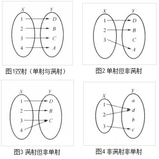

www.mathsisfun.com

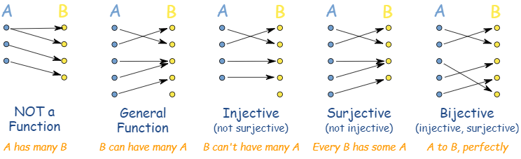

**General Function**：普通的函数 可以多对一，但是不能一对多 

- one-to-many is not OK 
- many-to-one is OK

**Injective**：单射，没有多个输入 A 对同一个输出 B。 

- one-to-many is not OK 
- many-to-one is not OK
- **One-to-One**

**Surjective**：满射，每个输出 B 都至少有一个输出 A 与之匹配 也叫做 ”Onto“

- 陪域等于值域

**Bijective**：双射，同时满足单射及满射的函数

- **one-to-one correspondence**

perfect pairing，双射函数有逆！

# Inverse Function

https://www.mathsisfun.com/sets/function-inverse.html

满足以下性质
$$
\begin{equation}
 f\left(f^{-1}(x)\right)=x 
\end{equation}
$$

$$
\begin{equation}
 f^{-1}(f(x))=x 
\end{equation}
$$

函数不可逆怎么处理，**限制定义域**
$$
x^2 → \left\{x^{2} \mid x \geq 0\right\} 
$$
下边是一个例子

上图函数不可逆

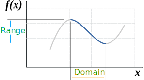

限制定义域

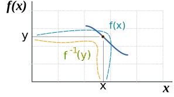

函数可逆

**No Inverse**

凸函数有最小值，可以被优化算法求解

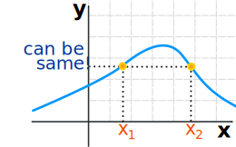

**Inverse**

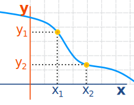

Bijective function

---

# Jacobian

​	现在有一个函数 $f$ ，其输入是一个二维向量 $z$ ，输出是一个二维向量 $x$
$$
\begin{aligned}
z =\left[\begin{array}{l}
z_{1} \\
z_{2}
\end{array}\right] \quad x=\left[\begin{array}{l}
x_{1} \\
x_{2}
\end{array}\right] 
\end{aligned}
$$

$$
x = f(z)
$$

​	函数 $f$ 的雅克比矩阵 $J_f$ 就是把所有输入和输出都做偏微分；其雅克比矩阵 $J_f$ 的逆 $J_{f^{-1}}$ 如下

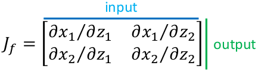
$$
J_{f} =\left[\begin{array}{ll}
\partial x_{1} / \partial z_{1} & \partial x_{1} / \partial z_{2} \\
\partial x_{2} / \partial z_{1} & \partial x_{2} / \partial z_{2}
\end{array}\right]
$$

$$
J_{f^{-1}}=\left[\begin{array}{ll}
\partial z_{1} / \partial x_{1} & \partial z_{1} / \partial x_{2} \\
\partial z_{2} / \partial x_{1} & \partial z_{2} / \partial x_{2}
\end{array}\right]
$$

​	其中 $J_f$ 与 $J_{f^{-1}}$ 相乘结果为单位矩阵 $J_{f} J_{f^{-1}}=I$	

​	假设现有输入输出为
$$
\begin{array}{c}
{\left[\begin{array}{c}
z_{1}+z_{2} \\
2 z_{1}
\end{array}\right]=f\left(\left[\begin{array}{c}
z_{1} \\
z_{2}
\end{array}\right]\right)}
\end{array} \tag{1}
$$
​	其 $J_f$ 为 $J_{f} =\left[\begin{array}{ll}1 & 1 \\
2 & 0
\end{array}\right]$

​	**[Eq. 1](#eq1)** 的逆为
$$
\left[\begin{array}{c}
x_{2} / 2 \\
x_{1}-x_{2} / 2
\end{array}\right]=f^{-1}\left(\left[\begin{array}{c}
x_{1} \\
x_{2}
\end{array}\right]\right)
$$
​	其 $J_{f^{-1}}$ 为 $ J_{f^{-1}}=\left[\begin{array}{ll}0 & 1/2 \\1 & -1/2
\end{array}\right]$
$$
J_{f} J_{f^{-1}}= \left(\begin{array}{lll}1 & 0 \\ 0 & 1 \end{array}\right)
$$
​	如果函数 $f$ 可逆，则其雅克比矩阵 $J_f$ 与其逆函数 $f^{-1}$ 的雅克比矩阵 $J_{f^{-1}}$  互逆即
$$
J_f^{-1} = J_{f^{-1}} \tag{2}
$$

---

# Determinant

​	方阵的行列式是提供有关矩阵信息的 **scalar** 标量。

- 2X2

$$
\begin{array}{c}
A=\left[\begin{array}{ll}
a & b\\
c & d
\end{array}\right] \\
\operatorname{det}(A)=a d-b c
\end{array}
$$

​	2维中A的Determinant意义是面积

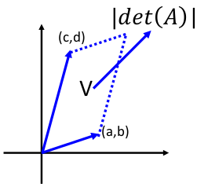

- 3X3

$$
\begin{aligned}
A =&\left[\begin{array}{lll}
a_{1} & a_{2} & a_{3} \\
a_{4} & a_{5} & a_{6} \\
a_{7} & a_{8} & a_{9}
\end{array}\right] \\
\operatorname{det}(A) =& 
a_{1} a_{5} a_{9}+a_{2} a_{6} a_{7}+a_{3} a_{4} a_{8} \\
&-a_{3} a_{5} a_{7}-a_{2} a_{4} a_{9}-a_{1} a_{6} a_{8}
\end{aligned}
$$

​	3维中A的Determinant意义是体积

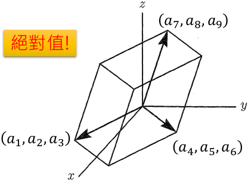

​	根据**[Eq. 2](#eq2)**推断有以下倒数性质：
$$
\color{#FF3030}\begin{array}{l}
\operatorname{det}(\mathrm{A})=1 / \operatorname{det}\left(A^{-1}\right) \\
\operatorname{det}\left(J_{f}\right)=1 / \operatorname{det}\left(J_{f^{-1}}\right)
\end{array} \tag{3}
$$

---

# Change of Variable Theorem

​	假设有分布 $\pi(z)$ ,通过函数 $f$ 生成的 $x$ 也形成了一个分布 $p(x)$

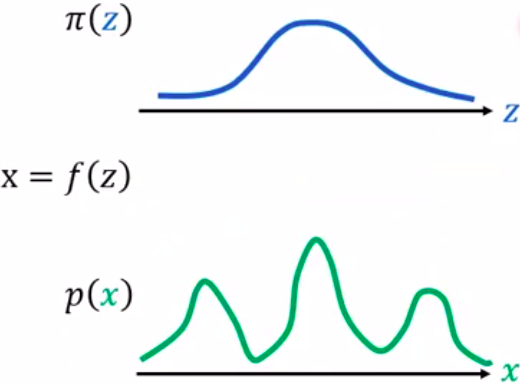

​	Input的z上有$z^{'}$, $x^{'}=f(z^{'})$ , 寻找 $z^{'}，x^{'}$ 的关系，也就是 $\pi(z^{'})$ 和 $p(x^{'})$ 的关系。

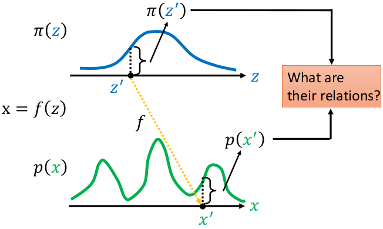

​	假设有均匀分布 $\pi(z)$ ，其中$ z \in (0,1)$ ，有$\int \pi(z) d z=1$

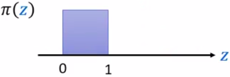

​	假设有函数 $f$ 为 
$$
x=f(z)=2z+1
$$
​	则有均匀分布 $p(x)$ ，其中$ x \in (1,3)$ ，也有有$\int p(x) d x=1$

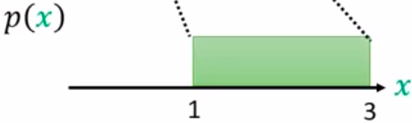

​	底变为原来1的两倍2，则高变为原来1的一半1/2，那么两个分布之间的关系如下式子
$$
p\left(x^{\prime}\right)=\frac{1}{2} \pi\left(z^{\prime}\right)
$$

------

## 1D Example

​	现有不常规的概率分布 $\pi(z)$ 通过函数变换后变成了另一种概率分布 $p(x)$   

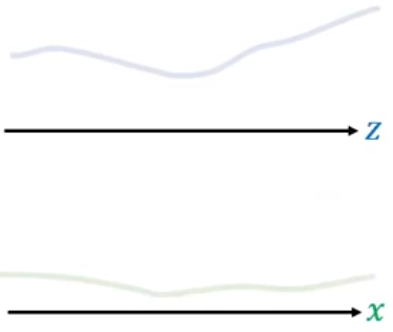

​	通过 $x=f(z)$ ，如何寻找 $z$ 的概率密度/分布 $\pi(z)$ 和 $x$ 的概率密度 $p(x)$ 之间的关系?

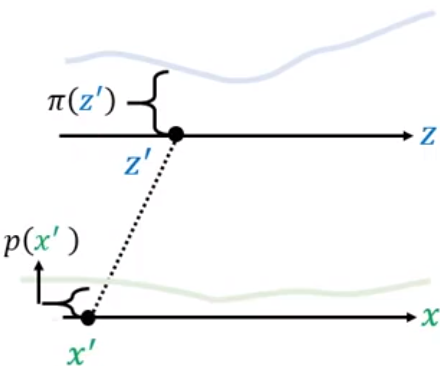

​	现在假设把 $z^{\prime}$ 移动到 $z^{\prime} + \Delta{z}$ ，这一范围内的概率密度被拉宽到 $(x^{\prime},x^{\prime}+\Delta{x})$ 的范围：

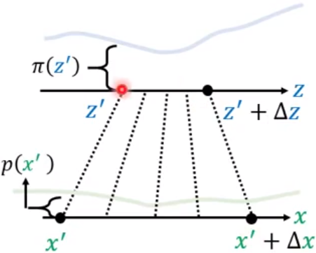

​	假设 $\Delta{z} \rightarrow 0$ ， $(z^{\prime},z^{\prime}+\Delta{z})$ 范围内的概率密度可以近似看成均匀的，假设 $(x^{\prime},x^{\prime}+\Delta{x})$ 范围内的概率密度也是均匀的

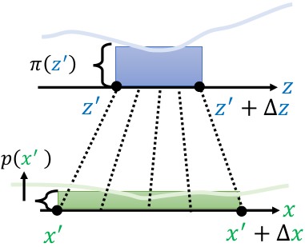

​	也就是蓝色方块面积被拉宽到绿色方块，因此两块面积相同
$$
p\left(x^{\prime}\right) \Delta x=\pi\left(z^{\prime}\right) \Delta z
$$
​	方程两边同时除以 $\Delta{x}$ 得:
$$
p\left(x^{\prime}\right)=\pi\left(z^{\prime}\right) \frac{\Delta z}{\Delta x}
$$
​	$\Delta{z} \rightarrow 0 ,\Delta{x} \rightarrow 0 $进一步可以处理为：
$$
\begin{array}{l}
 \\
p\left(x^{\prime}\right)=\pi\left(z^{\prime}\right)\left|\frac{d z}{d x}\right|
\end{array}
$$
​	即 z 对 x 的微分，如果知道函数 $f$ 的逆，就可以算 z 对 x 的微分。加绝对值的原因如下图:

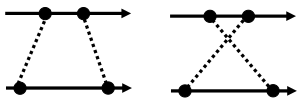

​	

------

## 2D Example

​	现在 $z$ 和 $x$ 都是二维向量，同样的有转换函数 $x = f(z)$ ，如何寻找 $z$ 的概率密度 $\pi(z)$ 和 $x$ 的概率密度 $p(x)$ 之间的关系?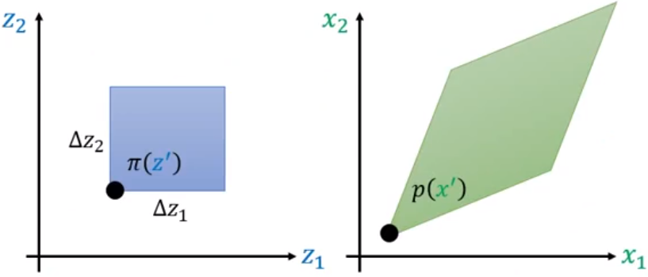

​	假设蓝色正方形的分布为 $\pi(z^{\prime})$ ，宽为 $\Delta{z_1}$ 高为 $\Delta{z_2}$，通过 $f$ 后，蓝色正方形变为绿色的菱形 

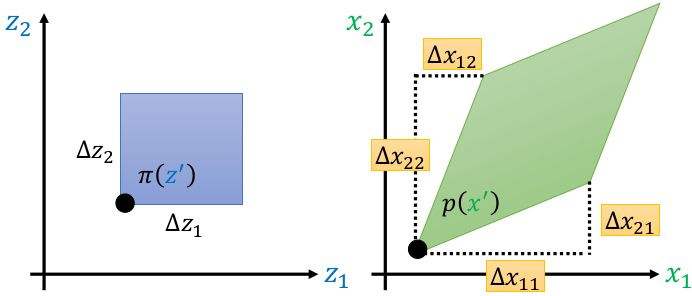

​	上图中 $\color{#FF3030}\Delta{x_{11}}$ 是 $z_1$ 改变时 $x_1$ 的改变量， $\color{#FF3030}\Delta{x_{21}}$ 是 $z_1$ 改变时 $x_2$ 的改变量

​				 $\color{#FF3030}\Delta{x_{12}}$ 是 $z_2$ 改变时 $x_1$ 的改变量， $\color{#FF3030}\Delta{x_{22}}$ 是 $z_2$ 改变时 $x_2$ 的改变量。

​	蓝色方块面积与 $\pi(z^{\prime})$ 相乘=绿色菱形面积与 $p(x^{\prime})$ 相乘，有下式
$$
p\left(x^{\prime}\right)\left|\operatorname{det}\left[\begin{array}{ll}
\Delta x_{11} & \Delta x_{21} \\
\Delta x_{12} & \Delta x_{22}
\end{array}\right]\right|=\pi\left(z^{\prime}\right) \Delta z_{1} \Delta z_{2}
$$
​	移项:
$$
p\left(x^{\prime}\right)\left|\frac{1}{\Delta z_{1} \Delta z_{2}} \operatorname{det}\left[\begin{array}{cc}
\Delta x_{11} & \Delta x_{21} \\
\Delta x_{12} & \Delta x_{22}
\end{array}\right]\right|=\pi\left(z^{\prime}\right)
$$
​	把 $\frac{1}{\Delta z_{1} \Delta z_{2}}$ 放到 Det 里:
$$
p\left(x^{\prime}\right)\left|\operatorname{det}\left[\begin{array}{cc}
\Delta x_{11} / \Delta z_{1} & \Delta x_{21} / \Delta z_{1} \\
\Delta x_{12} / \Delta z_{2} & \Delta x_{22} / \Delta z_{2}
\end{array}\right]\right|=\pi\left(z^{\prime}\right)
$$
​	其中 $\Delta x_{11} / \Delta z_{1}$ 等价于 $\partial x_{1} / \partial z_{1}$ ； $\Delta x_{21} / \Delta z_{1}$ 等价于 $\partial x_{2} / \partial z_{1}$ 。则有:
$$
p\left(x^{\prime}\right)\left|\operatorname{det}\left[\begin{array}{cc}
\partial x_{1} / \partial z_{1} & \partial x_{2} / \partial z_{1} \\
\partial x_{1} / \partial z_{2} & \partial x_{2} / \partial z_{2}
\end{array}\right]\right|=\pi\left(z^{\prime}\right)
$$
​	把内部矩阵转置，不会改变其行列式:
$$
p\left(x^{\prime}\right)\left|\operatorname{det}\left[\begin{array}{cc}
\partial x_{1} / \partial z_{1} & \partial x_{1} / \partial z_{2} \\
\partial x_{2} / \partial z_{1} & \partial x_{2} / \partial z_{2}
\end{array}\right]\right|=\pi\left(z^{\prime}\right)
$$
​	则转置后的内部矩阵为 [$J_{f}$](#jf) :
$$
\color{#FF3030}p\left(x^{\prime}\right)\left|\operatorname{det}\left(J_{f}\right)\right|=\pi\left(z^{\prime}\right)
$$

$$
p\left(x^{\prime}\right)=\pi\left(z^{\prime}\right)\left|\frac{1}{\operatorname{det}\left(J_{f}\right)}\right|\\
$$

​	利用**[Eq. 3](#eq3)**的性质转换:
$$
\color{#FF3030}p\left(x^{\prime}\right)=\pi\left(z^{\prime}\right)\left|\operatorname{det}\left(J_{f^{-1}}\right)\right|
$$
​	其中 z 是输入（潜在向量），x 是输出，x = f(z)

## 生成 Example

给定一个观测数据变量 $x\in X$，一个潜在变量 $z\in Z$ ，服从一个简单先验概率分布 $p_Z$ 以及一个双射 $ f: X \rightarrow Z $（ $g = f^{-1}:Z\rightarrow X$），变量公式的变化定义了一个模型分布在 $X$ 上

双射 $Z = f(X)$，$Z = g(X)$，$f = g^{-1}$
$$
\begin{equation}
 \begin{aligned} p_{X}(x) &=p_{Z}(f(x))\left|\operatorname{det}\left(\frac{\partial f(x)}{\partial x^{T}}\right)\right|  \\ 
 \log \left(p_{X}(x)\right) &=\log \left(p_{Z}(f(x))\right)+\log \left(\left|\operatorname{det}\left(\frac{\partial f(x)}{\partial x^{T}}\right)\right|\right) \end{aligned} 
\end{equation}
$$
$\frac{\delta f(x)}{\delta x^T}$ 是 $f$ 在 $x$ 处的雅可比行列式。

---

# lipschitz 连续条件

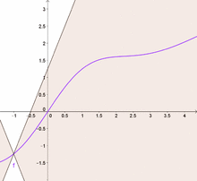

这个圆锥的斜率就是 Lipschitz常数。图中粉色曲线的任意一点的斜率都小于这个常数

1.它其实就是在一个连续函数 $f$ 上面额外施加了一个限制，要求存在一个常数 $K\geq 0$ 使得**定义域内**的任意两个元素 $x_1$ 和 $x_2$ 都满足
$$
|f(x_1) - f(x_2)| \leq K |x_1 - x_2|
$$

此时称函数 $f$ 的 Lipschitz常数为 $K$。

简单理解，比如说 $f$ 的定义域是实数集合，那上面的要求就等价于 $f$ 的**导函数绝对值**不超过$K$ 。再比如说 $\log (x)$ 就不是 Lipschitz 连续，因为它的导函数没有上界。Lipschitz 连续条件**限制**了一个连续函数的**最大局部变动幅度**。
$$
|\frac{f(x_1) - f(x_2)}{x_1 - x_2}| \leq K
$$

2.**存在一个实数 L，使得对于函数 f（x）上的每对点，连接它们的线的斜率的绝对值不大于这个实数 L。最小的L称为该函数的 Lipschitz常数。**

3.函数图像的曲线上任意两点连线的斜率一致有界，就是任意的斜率都小于同一个常数，这个常数就是Lipschitz常数。

从局部看：我们可以取**两个充分接近的点**，如果这个时候**斜率的极限**存在的话，这个斜率的极限就是这个**点的导数**。也就是说函数可导，又是Lipschitz连续，那么导数有界。反过来，如果**可导函数，导数有界，可以推出函数 Lipschitz连续**。

从整体看：Lipschitz连续要求函数在无限的区间上不能有**超过线性的增长**，所以这些和函数在无限区间上不是Lipschitz连续的。

**Lipschitz continuous： 函数被一次函数上下夹逼**

**Lipschitz continuous gradient ：函数被二次函数上下夹逼**

**Lipschitz continuous Hessian ：函数被三次函数上下夹逼**

Lipschitz continuous 用在函数值上是为了不让函数值变化的太快；

用在导函数上，是为了不让导函数变化的太快；

用在Hessian上，是为了让Hessian不变化的太快。

但他们都导致了一个很有意思的结果：这个 Lipschitz continuous 不管用在什么上，都使**的函数被多项式上下夹逼**，一方面便于我们处理，另一方面至少我们能控制一下函数的包络信息。

4.在数学中，特别是实分析，**lipschitz条件，即**利普希茨连续条件（Lipschitz continuity），是一个比**通常连续更强**的**光滑性条件**。直觉上，利普希茨连续函数**限制了函数改变的速度**，符合利普希茨条件的函数的斜率，必小于一个称为利普希茨常数的实数（该常数依函数而定）。

在微分方程，利普希茨连续是**皮卡-林德洛夫定理(Picard-Lindelöf)**中**确保了初值问题存在唯一解的核心条件**。一种特殊的利普希茨连续，称为压缩应用于[巴拿赫不动点定理](https://baike.baidu.com/item/巴拿赫不动点定理/9492042)。

举个例子：$f(x) = |x|，K=1$；符合利普希茨（Lipschitz ）条件。注意 $f(x)$ 在 $x=0$ 处是不可微的，因此符合**Lipschitz 条件的函数未必处处可微**

---

## 局部 Lipschitz 条件成立的充分条件

假设 $f:[a,b] \times D \to {{\rm{R}}^m}$ 在某个区域 $D \subset {{\rm{R}}^n}$ 上是连续的，$\frac{{\partial f}}{{\partial x}}(t,x)$ 存在，并且在 $[a,b] \times D$ 上连续。如果对于一个图集 $W \subset D$，存在常数 $L \ge 0$，使得在 $[a,b] \times W$ 上有
$$
\left\| {\frac{{\partial f}}{{\partial x}}(t,x)} \right\| \le L
$$
则对于所有的 $t \in [a,b],x \in W,y \in W$，有
$$
||f(t,x) - f(t,y)|| \le L||x - y||
$$

给定：两个欧式空间 $(X,d_X)$ 和 $(Y,d_Y)$. $d_X$ 表示集合 $X$ 上的欧式距离，$d_Y$ 同理。有函数 $f:X \to Y$ 

一个函数被称为局部李普希茨连续函数，如果对于 $X$ 中的每一个 $x$，都存在一个 $x$ 的邻域 $U$，使得限制 $U$ 的 $f$ 是李普希茨连续函数。等价地，如果 $X$ 是局部紧度量空间，那么 $f$ 是局部李普希茨的。当且仅当它在 $X$ 的每个紧子集上是李普希茨连续的。在非局部紧的空间中，这是一个必要条件，但不是充分条件。

## bi-Lipschitz

如果存在 $K ≥ 1$，使
$$
\begin{equation}
 \frac{1}{K} d_{X}\left(x_{1}, x_{2}\right) \leq d_{Y}\left(f\left(x_{1}\right), f\left(x_{2}\right)\right) \leq K d_{X}\left(x_{1}, x_{2}\right) \\
 \frac{1}{K}  \leq \frac{d_{Y}\left(f\left(x_{1}\right), f\left(x_{2}\right)\right)}{d_{X}\left(x_{1}, x_{2}\right)} \leq K 
\end{equation}
$$
那么 $f$ 就叫做 **bilipschitz**(也写为bi-Lipschitz)。bilipschitz映射是[单射](#injective)的，实际上是其图像的**同胚**(homeomorphism)映射。bilipschitz函数和[单射](#injective)李普希茨函数是一样的，[单射](#injective)李普希茨函数的反函数也是李普希茨函数。

>两个拓扑空间 ${X,T_X}$和 ${Y,T_Y}$ 之间的函数 $f:X \to Y$ 称为**同胚**，如果它具有下列性质：
>
>- $f$ 是[双射](#injective)（单射和满射）；
>- $f$ 是连续的；
>- 反函数 $f$ 也是连续的（f是开映射）。
>
>满足以上三个性质的函数有时称为**双连续**。

---

## 深度学习中的Lipschitz约束：泛化与生成模型

https://kexue.fm/archives/6051

### 1. L 约束与泛化

#### 1.1. 扰动敏感

记输入为 $x$，输入为 $y$，模型为 $f$，模型参数为 $w$，记为
$$
\begin{equation}y = f_w(x)\end{equation}\tag{1}
$$
很多时候，我们希望得到一个“**稳健**”的模型。

何为稳健？一般来说有两种含义，

一是对于**参数扰动的稳定性**，比如模型变成了 $f_{w+\Delta w}(x)$ 后是否还能达到相近的效果？如果在动力学系统中，还要考虑模型最终是否能**恢复**到 $f_w(x)$；

二是对于**输入扰动的稳定性**，比如输入从 $x$ 变成了 $x+\Delta x$ 后，$f_w(x+\Delta x)$ 是否能给出**相近的预测结果**。

读者或许已经听说过深度学习模型存在“对抗攻击样本”，比如图片只**改变一个像素**就给出完全不一样的分类结果，这就是**模型对输入过于敏感**的案例。

---

#### 1.2. L 约束

所以，大多数时候我们都希望**模型对输入扰动是不敏感的**，这通常能提高模型的**泛化**性能。也就是说，我们希望 $\Vert x_1 - x_2 \Vert$ 很小时
$$
\begin{equation}\Vert f_w(x_1) - f_w(x_2)\Vert\end{equation}\tag{2}
$$
也尽可能地小。当然，“尽可能” 究竟是怎样，谁也说不准。于是 Lipschitz 提出了一个更具体的约束，那就是存在某个常数 $C$（它**只与参数有关**，**与输入无关**），使得下式恒成立
$$
\begin{equation}\Vert f_w(x_1) - f_w(x_2)\Vert\leq C(w)\cdot \Vert x_1 - x_2 \Vert\end{equation}\tag{3}
$$
也就是说，希望整个模型被一个线性函数“控制”住。这便是 L 约束了。

**换言之，在这里我们认为满足 L 约束的模型才是一个好模型**～并且对于具体的模型，我们希望**估算出 $C(w)$ 的表达式**，并且**希望 $C(w)$ 越小越好，越小意味着它对输入扰动越不敏感，泛化性越好。**

---

#### 1.3. 神经网络

在这里我们对具体的神经网络进行分析，以观察神经网络在什么时候会满足 L 约束。

简单起见，我们考虑单层的全连接 $f(Wx+b)$ ，这里的 $f$ 是激活函数，而 $W,b$ 则是参数矩阵/向量，这时候 [Eq. 3](#eq3) 变为
$$
\begin{equation}\Vert f(Wx_1+b) - f(Wx_2+b)\Vert\leq C(W,b)\cdot \Vert x_1 - x_2 \Vert\end{equation}\tag{4}
$$
让充分接近，那么就可以将左边用一阶项近似，得到
$$
\begin{equation}\left\Vert \frac{\partial f}{\partial x}W(x_1 - x_2)\right\Vert\leq C(W,b)\cdot \Vert x_1 - x_2 \Vert\end{equation}\tag{5}
$$
显然，要希望左边不超过右边，$∂f/∂x$ 这一项（每个元素）的绝对值必须不超过某个常数。这就要求我们要使用“导数有上下界”的激活函数，不过我们目前常用的激活函数，比如 sigmoid、tanh、relu 等，都满足这个条件。假定激活函数的梯度已经有界，尤其是我们常用的 relu 激活函数来说这个界还是 1，因此 $∂f/∂x$ 这一项只带来一个常数，我们暂时忽略它，剩下来我们只需要考虑 $\Vert W(x_1 - x_2)\Vert$。

多层的神经网络可以逐步递归分析，从而最终还是单层的神经网络问题，而 CNN、RNN 等结构本质上还是特殊的全连接，所以照样可以用全连接的结果。因此，对于神经网络来说，问题变成了：如果
$$
\begin{equation}\Vert W(x_1 - x_2)\Vert\leq C\Vert x_1 - x_2 \Vert\end{equation}\tag{6}
$$

恒成立，那么的值可以是多少？找出C的表达式后，我们就可以希望尽可能小，从而给参数带来一个正则化项。

> 泰勒一阶近似 $f(x) = f(a) + f^{\prime}(a)(x-a)$

