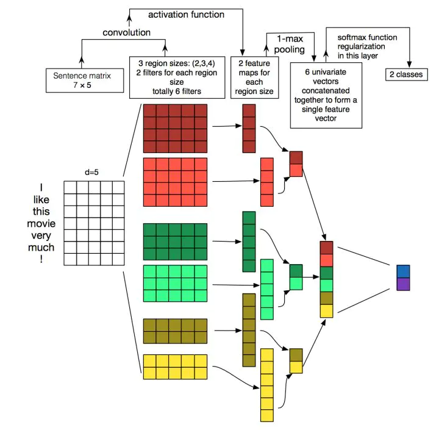
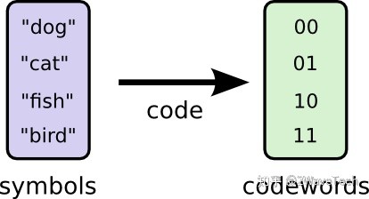
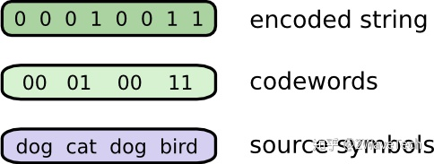
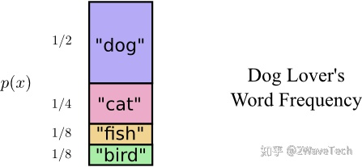
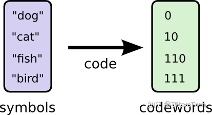
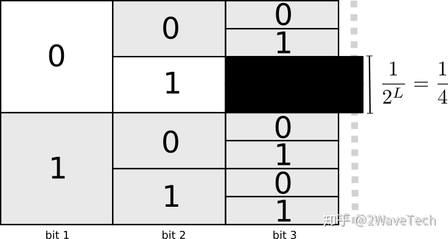
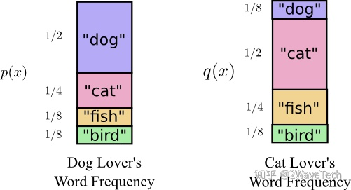
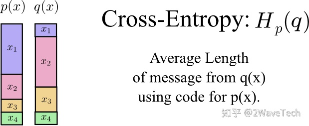
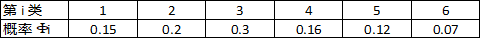

# PytorchAPI

## torch::one:

### Tensor::two:

#### Creation Ops::three:

##### torch.arange()-连续张量

```python
torch.arange(start=0, end, step=1, *, out=None, dtype=None, layout=torch.strided, device=None, requires_grad=False) → Tensor

- start (Number) – 点集的起始值. Default: 0.
- end (Number) – 点集合的结束值
- step (Number) – 每对相邻点之间的间隔. Default: 1.
```

​	返回大小为 $\left \lceil \frac {\text {end}-\text {start}} {\text {step}} \right \rceil$的一维张量，其中end是从间隔开始的值 ` [start，end]` 从开始具有共同step的步骤。

```python
>>> torch.arange(5)
tensor([ 0,  1,  2,  3,  4])
>>> torch.arange(1, 4)
tensor([ 1,  2,  3])
>>> torch.arange(1, 2.5, 0.5)
tensor([ 1.0000,  1.5000,  2.0000])
```


##### torch.eye()-单位矩阵

```
result = torch.eye(n，m=None，out=None)
```

​	生成对角线全1，其余部分全0的二维张量

参数:

- n：行数
- m：列数
- out：输出类型

```python
c = torch.eye（3）
print(c)
print(type(c))

'''
tensor([[1., 0., 0.],
    [0., 1., 0.],
    [0., 0., 1.]])

<class 'torch.Tensor'>
'''
```


##### torch.linspace()-连续张量

```python
torch.linspace(start, end, steps, *, out=None, dtype=None, layout=torch.strided, device=None, requires_grad=False) → Tensor
    
- start (float) – 点集的起始值
- end (float) – 点集合的结束值
- steps (int) – 构造张量的大小
- out (Tensor, optional) – 输出张量
- dtype (torch.dtype, optional) – 返回张量的所需数据类型
- layout (torch.layout, optional) – 返回的Tensor的所需布局. Default: torch.strided.
- requires_grad (bool, optional) – 如果autograd应该在返回的张量上记录操作. Default: False.
- device (torch.device, optional) – 所需的张量返回器. Default: if None, uses the current device for the default tensor type (see torch.set_default_tensor_type()). device will be the CPU for CPU tensor types and the current CUDA device for CUDA tensor types.
```

​	创建尺寸步长的一维张量，其值从开始到结束（包括两端）均等间隔。 即，值是：
$$
\text { (start, start }+\frac{\text { end }-\text { start }}{\text { steps }}, \ldots, \text { start }+(\text { steps }-1) * \frac{\text { end }-\text { start }}{\text { steps }}, \text { end })
$$

```python
>>> torch.linspace(3, 10, steps=5)
tensor([  3.0000,   4.7500,   6.5000,   8.2500,  10.0000])
>>> torch.linspace(-10, 10, steps=5)
tensor([-10.,  -5.,   0.,   5.,  10.])
>>> torch.linspace(start=-10, end=10, steps=5)
tensor([-10.,  -5.,   0.,   5.,  10.])
>>> torch.linspace(start=-10, end=10, steps=1)
tensor([-10.])
```


##### torch.ones()-全1向量

```python
torch.ones(*sizes, out=None) → Tensor
```

​	返回一个全为**1** 的张量，形状由可变参数**`sizes`**定义。

参数:

- sizes (int...) – 整数序列，定义了**输出形状**
- out (Tensor, optional) – 结果张量

```python
>>> torch.ones(2, 3)
 
 1  1  1
 1  1  1
[torch.FloatTensor of size 2x3]
 
>>> torch.ones(5)
 
 1
 1
 1
 1
 1
[torch.FloatTensor of size 5]
```


##### torch.ones_like()-全1向量，size=input.size

```python
torch.ones_like(input, *, dtype=None, layout=None, device=None, requires_grad=False, memory_format=torch.preserve_format) → Tensor
```

​	返回一个填充有标量值1的张量，其大小与输入相同。 


##### torch.randperm()-随机排列

```python
torch.randperm(n, *, out=None, dtype=torch.int64, layout=torch.strided, device=None, requires_grad=False) → LongTensor

- n (int) - 上限（不包括它本身）
```

​	返回从 0 到 n-1 的整数的随机排列。

```python
torch.randperm(4)
'''
tensor([2, 1, 0, 3])
'''
```


##### torch.tensor()-指定张量

```python
torch.tensor(data, *, dtype=None, device=None, requires_grad=False, pin_memory=False) → Tensor

- data (array_like) – 张量的初始数据。 可以是list, tuple, NumPy ndarray, scalar, and其他类型。
```

​	用数据构造张量。

```python
>>> torch.tensor([[0.1, 1.2], [2.2, 3.1], [4.9, 5.2]])
tensor([[ 0.1000,  1.2000],
        [ 2.2000,  3.1000],
        [ 4.9000,  5.2000]])

>>> torch.tensor([0, 1])  # Type inference on data
tensor([ 0,  1])

>>> torch.tensor([[0.11111, 0.222222, 0.3333333]],
                 dtype=torch.float64,
                 device=torch.device('cuda:0'))  # creates a torch.cuda.DoubleTensor
tensor([[ 0.1111,  0.2222,  0.3333]], dtype=torch.float64, device='cuda:0')

>>> torch.tensor(3.14159)  # Create a scalar (zero-dimensional tensor)
tensor(3.1416)
```


##### torch.zeros-全0向量

```python
torch.zeros(*size, *, out=None, dtype=None, layout=torch.strided, device=None, requires_grad=False) → Tensor

size (int...) – 定义输出张量形状的整数序列. Can be a variable number of arguments or a collection like a list or tuple.
```

​	返回一个由标量值0填充的张量，其形状由变量参数size定义。

```python
>>> torch.zeros(2, 3)
tensor([[ 0.,  0.,  0.],
        [ 0.,  0.,  0.]])

>>> torch.zeros(5)
tensor([ 0.,  0.,  0.,  0.,  0.])
```


##### torch.zeros_like()-全0向量，size=input.size

```python
torch.zeros_like(input, *, dtype=None, layout=None, device=None, requires_grad=False, memory_format=torch.preserve_format) → Tensor
```

​	返回一个填充有标量值0的张量，其大小与输入相同。 


---

#### Indexing, Slicing, Joining, Mutating Ops::three:

##### torch.index_select()-选择指定索引张量

​	第一个参数是索引的对象，第二个参数0表示按行索引，1表示按列进行索引，第三个参数是一个tensor，就是索引的序号

```python
a = torch.linspace(1, 12, steps=12).view(3, 4)
print(a)

b = torch.index_select(a, 0, torch.tensor([0, 2]))
print(b)
print(a.index_select(0, torch.tensor([0, 2])))

c = torch.index_select(a, 1, torch.tensor([1, 3]))
print(c)

''' output
tensor([[ 1.,  2.,  3.,  4.],
        [ 5.,  6.,  7.,  8.],
        [ 9., 10., 11., 12.]])
tensor([[ 1.,  2.,  3.,  4.],
        [ 9., 10., 11., 12.]])
tensor([[ 1.,  2.,  3.,  4.],
        [ 9., 10., 11., 12.]])
tensor([[ 2.,  4.],
        [ 6.,  8.],
        [10., 12.]])
'''


indexs = torch.LongTensor(1,2,3,4,5,6,7,8)
return features.index_select(0, indexs)
```


##### torch.squeeze()-对维度进行压缩

```python
torch.squeeze(input, dim=None, *, out=None) → Tensor

'''
input (Tensor) – 输入张量
dim (int, optional) – 如果给出，则仅在该维度上压缩输入
'''
```

​     第一个参数是索引的对象，第二返回一个张量，其中输入中所有大小为 1 的维度都已删除。不为1的维度没有影响。
​	例如，如果输入的形状为：（$ A \times 1 \times B \times C \times 1 \times D$），则张量将为以下形状： $ A×B×C×D$。
​	如果指定了 `dim`，则仅在给定维度上执行挤压操作。 如果输入的形状为：$（A×1×B）$，则  `squeeze（input，0)`保持张量不变，但 `squeeze（input，1）`会将张量压缩为形状$（A  \times B）$。

==常用于降成1维进行索引操作==


##### torch.where()-根据判断条件批量更新值

```python
torch.where(condition, x, y) → Tensor

- condition (BoolTensor) - 为True（非零）时，产生x，否则为y
- x (Tensor or Scalar) - 在condition为True选择的值
- y (Tensor or Scalar) - 在condition为False选择的值
```

​	根据条件返回从x或y中选择的元素的张量。取决于condition

$$
\text { out }_{\mathrm{i}}=\left\{\begin{array}{ll}
\mathrm{x}_{\mathrm{i}} & \text { if condition }_{\mathrm{i}} \\
\mathrm{y}_{\mathrm{i}} & \text { otherwise }
\end{array}\right.
$$
==x，y的size应该与input的torch一致==

```python
>>> x = torch.randn(3, 2)
>>> y = torch.ones(3, 2)
>>> x
tensor([[-0.4620,  0.3139],
        [ 0.3898, -0.7197],
        [ 0.0478, -0.1657]])
>>> torch.where(x > 0, x, y)
tensor([[ 1.0000,  0.3139],
        [ 0.3898,  1.0000],
        [ 0.0478,  1.0000]])
>>> x = torch.randn(2, 2, dtype=torch.double)
>>> x
tensor([[ 1.0779,  0.0383],
        [-0.8785, -1.1089]], dtype=torch.float64)
>>> torch.where(x > 0, x, 0.)
tensor([[1.0779, 0.0383],
        [0.0000, 0.0000]], dtype=torch.float64)
```


----

### Math operations::two:

#### Pointwise Ops::three:

##### torch.clamp()-限制范围

```python
torch.clamp(input, min, max, *, out=None) → Tensor

- input (Tensor) - 输入张量。
- min (Number) - 要限制的范围的下限
- max (Number) - 要限制的范围的上限
```

​	将输入中的所有元素限制在[min，max]范围内，并返回结果张量

$$
\mathrm{y}_{\mathrm{i}}=\left\{\begin{array}{ll}
\min & \text { if } \mathrm{x}_{\mathrm{i}}<\mathrm{min} \\
\mathrm{x}_{\mathrm{i}} & \text { if } \min \leq \mathrm{x}_{\mathrm{i}} \leq \max \\
\max & \text { if } \mathrm{x}_{\mathrm{i}}>\max
\end{array}\right.
$$


##### torch.sigmoid()-sigmoid激活函数

```python
torch.sigmoid(input, *, out=None) → Tensor
```

​	返回`input`元素的sigmoid的新张量。
$$
\text { out }_{\mathrm{i}}=\frac{1}{1+\mathrm{e}^{-\text {input }_{1}}}
$$
​    也可见torch.nn


#### BLAS and LAPACK Operations::three:

##### torch.mm()-矩阵乘法

```python
torch.mm(input, mat2, *, out=None) → Tensor

- input 输入（张量）- 要相乘的第一个矩阵
- mat2（张量）- 要相乘的第二个矩阵
```

​	对矩阵 `input` 和 `mat2` 执行矩阵乘法。
​    如果输入是（`n * m`）张量，则mat2是（`m * p`）张量，out将是（`n * p`）张量。


---

#### Reduction Ops::three:

##### torch.sum()-求和

```
torch.sum(input, list: dim, bool: keepdim=False, dtype=None) → Tensor
```

​	返回给定维度中张量的每一行的总和。如果是尺寸列表，请缩小所有尺寸。`input` `dim` `dim`

参数:

- input（Tensor）–输入张量。
- dim（int或元组）–要减小的维度。
- keepdim（bool）–输出张量是否以dim保留。

```python
>>> a = torch.ones((2, 3))
>>> print(a):
tensor([[1, 1, 1],
 		[1, 1, 1]])

>>> a1 =  torch.sum(a)
>>> a2 =  torch.sum(a, dim=0)
>>> a3 =  torch.sum(a, dim=1)

>>> print(a)
>>> print(a1)
>>> print(a2)

tensor(6.)
tensor([2., 2., 2.])
tensor([3., 3.])

# 如果加上keepdim=True, 则会保持dim的维度不被squeeze
>>> a1 =  torch.sum(a, dim=(0, 1), keepdim=True)
>>> a2 =  torch.sum(a, dim=(0, ), keepdim=True)
>>> a3 =  torch.sum(a, dim=(1, ), keepdim=True)

tensor([[6.]])
tensor([[2., 2., 2.]])
tensor([[3., 3.]])
```


#### Other Ops::three:

##### torch.diag()-对角2d张量

```python
torch.diag(input, diagonal=0, *, out=None) → Tensor

- input (Tensor) – –输入张量.
- diagonal (int, optional) – 要考虑的对角线
```

- If `input` is a vector (1-D tensor), 然后返回一个二维方形张量，其中`input`的元素为对角线。

- If `input` is a matrix (2-D tensor), 然后返回一维张量，其元素为`input`的对角线 .

  参数自变量`diagonal`控制要考虑的对角线：

- If `diagonal` = 0, it is the main diagonal.主对角线。

- If `diagonal` > 0, it is above the main diagonal.高于对角线diagonal的斜边元素

- If `diagonal` < 0, it is below the main diagonal.低于对角线diagonal的斜边元素


```python
>>> a = torch.randn(3)
>>> a
tensor([ 0.5950,-0.0872, 2.3298])
>>> torch.diag(a)
tensor([[ 0.5950, 0.0000, 0.0000],
        [ 0.0000,-0.0872, 0.0000],
        [ 0.0000, 0.0000, 2.3298]])
>>> torch.diag(a, 1)
tensor([[ 0.0000, 0.5950, 0.0000, 0.0000],
        [ 0.0000, 0.0000,-0.0872, 0.0000],
        [ 0.0000, 0.0000, 0.0000, 2.3298],
        [ 0.0000, 0.0000, 0.0000, 0.0000]])

>>> torch.diag(a, -2)
tensor([[ 0.0000,  0.0000, 0.0000, 0.0000, 0.0000]
        [ 0.5950,  0.0000, 0.0000, 0.0000, 0.0000],
        [ 0.5950,  0.0000, 0.0000, 0.0000, 0.0000],
        [ 0.0000, -0.0872, 0.0000, 0.0000, 0.0000],
        [ 0.0000,  0.0000, 2.3298, 0.0000, 0.0000]])
```


---

### Random sampling::two:

#### torch.rand()-随机均匀分布

```
torch.rand(*sizes, out=None) → Tensor
```

返回一个张量，包含了从区间[0, 1)的均匀分布中抽取的一组随机数。张量的形状由参数sizes定义。

**参数:**

- sizes (int...) - 整数序列，定义了输出张量的形状
- out (Tensor, optinal) - 结果张量

```python
torch.rand(2, 3)
0.0836 0.6151 0.6958
0.6998 0.2560 0.0139
[torch.FloatTensor of size 2x3]
```


#### torch.randn()-随机标准正态分布

```
torch.randn(*sizes, out=None) → Tensor
```

返回一个张量，包含了从标准正态分布（均值为0，方差为1，即高斯白噪声）中抽取的一组随机数。张量的形状由参数sizes定义。

**参数:**

- sizes (int...) - 整数序列，定义了输出张量的形状
- out (Tensor, optinal) - 结果张量

```python
torch.randn(2, 3)
0.5419 0.1594 -0.0413
-2.7937 0.9534 0.4561
[torch.FloatTensor of size 2x3]
```


#### torch.manual_seed()-固定种子

```python
torch.manual_seed(seed) → torch._C.Generator

- seed (int) – 所需的种子. 值必须在包含 [-0x8000_0000_0000_0000, 0xffff_ffff_ffff_ffff] 范围内. 使用公式 0xffff_ffff_ffff_ffff + seed 将负输入重新映射为正值
```

​    设置用于生成随机数的种子。 返回torch.Generator对象。设定后，`rand()、randn()`等其他函数生成固定


#### torch.normal()-随机正态分布

```python
torch.normal(mean, std, *, generator=None, out=None) → Tensor

- mean（张量）- 每个元素的张量平均值
- std（张量）- 每个元素的标准差张量
```

​	返回服从单独的正态分布的随机数张量，其正态分布和标准差均已给出。

​	`mean`是具有每个输出元素的正态分布平均值的张量.

​    `std`是具有每个输出元素的正态分布的标准偏差的张量。

​	`mean`和`std`的形状不需要匹配，但是每个张量的元素的总数必须相同。


---

## torch.nn::one:

### Convolution Layers::two:

#### nn.Conv1d()-1维卷积

```python
class torch.nn.Conv1d(in_channels, out_channels, kernel_size, stride=1, padding=0, dilation=1, groups=1, bias=True)

- in_channels(int) - 输入信号的通道。
- out_channels(int) - 卷积产生的通道。有多少个out_channels，就需要多少个1维卷积
- kernel_size(int or tuple) - 卷积核的尺寸，卷积核的大小为(k,)，第二个维度是由in_channels来决定的，所以实际上卷积大小为kernel_size*in_channels
- stride(int or tuple, optional) - 卷积步长
- padding (int or tuple, optional)- 输入的每一条边补充0的层数
- dilation(int or tuple, optional) - 卷积核元素之间的间距
- groups(int, optional) - 从输入通道到输出通道的阻塞连接数
- bias(bool, optional) - 如果bias=True，添加偏置
```


```python
conv1 = nn.Conv1d(in_channels=256，out_channels=100,kernel_size=2)
input = torch.randn(32,35,256)

# batch_size  text_len        embedding_size -> 
# batch_size  embedding_size  text_len
input = input.permute(0,2,1)

out = conv1(input)
print(out.size())
```

​	这里32为batch_size，35为句子最大长度，256为词向量

​	再输入一维卷积的时候，需要将`32*35*256`变换为`32*256*35`，因为一维卷积是在**最后维度** 对应的特征size 上扫的，最后out的大小即为：`32*100*（35-2+1）=32*100*34` 。

​	如果`kernel_size=1`，out大小为`32*100*（35-1+1）=32*100*35`


​	图片来源：Keras之文本分类实现

​	下图中输入的词向量维度为5，输入大小为`7*5`，一维卷积和的大小为2、3、4，每个都有两个，总共6个特征。

​	对于`k=4`，见图中红色的大矩阵，卷积核大小为`4*5`，步长为1。这里是针对输入从上到下扫一遍，输出的向量大小为`((7-4)/1+1)*1=4*1`，最后经过一个卷积核大小为4的`max_pooling`，变成1个值。最后获得6个值，进行拼接，在经过一个全连接层，输出2个类别的概率。



---

#### nn.Conv2d()-2维卷积

```python
class torch.nn.Conv2d(in_channels, out_channels, kernel_size, stride=1, padding=0, dilation=1, groups=1, bias=True)

- in_channels(int) - 输入数据的通道数，例RGB图片通道数为3；
- out_channels(int) - 输出数据的通道数，这个根据模型调整；
- kernel_size(int or tuple) - 卷积核大小；kennel_size=2,意味着卷积大小(2,2),即正方形卷积; kennel_size=（2,3），意味着卷积在第一维度大小为2，在第二维度大小为3,即非正方形卷积；
- stride(int or tuple, optional) - 步长，默认为1，与kennel_size类似，stride=2,意味在所有维度步长上下左右扫描为2， stride=（2,3），意味着在第一维度步长为2，意味着在第二维度步长为3；
- padding (int or tuple, optional)- 输入的每一条边补充0的层数
- dilation(int or tuple, optional) - 卷积核元素之间的间距
- groups(int, optional) - 从输入通道到输出通道的阻塞连接数
- bias(bool, optional) - 如果bias=True，添加偏置
```


```python
import torch
import torch.nn as nn


m = nn.Conv2d(16, 33, (3, 2), (2,1))  # in_channel, out_channel ,kennel_size,stride
print(m)

x = torch.randn(10, 16, 30, 32) # batch, channel , height , width  10组数据，通道数为16，高度为30，宽为32
print(x.shape)
y = m(x)
print(y.shape)


'''
Conv2d(16, 33, kernel_size=(3, 2), stride=(2, 1))
torch.Size([10, 16, 30, 32])
torch.Size([10, 33, 14, 31])
'''

'''
h = (h - kennel_size + 2*padding) / stride + 1
w = (w - kennel_size + 2*padding) / stride + 1
x = ([10,16,30,32]),其中h=30, w=32,对于卷积核长分别是 h=3，w=:2 ；对于步长分别是h=2，w=1；padding默认0；
h = (30 - 3 + 2*0)/ 2 +1 = 27/2 +1 = 13+1 =14
w = (32 - 2 + 2*0)/ 1 +1 = 30/1 +1 = 30+1 =31
batch = 10, out_channel = 33
'''
```


##### CNN

```ruby
class CNN(nn.Module):
    def __init__(self):
        nn.Model.__init__(self)
 
        self.conv1 = nn.Conv2d(1, 6, 5)  # 输入通道数为1，输出通道数为6
        self.conv2 = nn.Conv2d(6, 16, 5)  # 输入通道数为6，输出通道数为16
        self.fc1 = nn.Linear(5 * 5 * 16, 120)
        self.fc2 = nn.Linear(120, 84)
        self.fc3 = nn.Linear(84, 10)

    def forward(self,x):
        # 输入x -> conv1 -> relu -> 2x2窗口的最大池化
        x = self.conv1(x)
        x = F.relu(x)
        x = F.max_pool2d(x, 2)
        # 输入x -> conv2 -> relu -> 2x2窗口的最大池化
        x = self.conv2(x)
        x = F.relu(x)
        x = F.max_pool2d(x, 2)
        # view函数将张量x变形成一维向量形式，总特征数不变，为全连接层做准备
        x = x.view(x.size()[0], -1)
        x = F.relu(self.fc1(x))
        x = F.relu(self.fc2(x))
        x = self.fc3(x)
        return x
```

​	假设现有大小为32 x 32的图片样本，输入样本的channels为1，该图片可能属于10个类中的某一类。

​    网络整体结构：[conv + relu + pooling] * 2 + FC * 3
​	原始输入样本的大小：`32 x 32 x 1`

**第一次卷积**：使用6个大小为`5 x 5`的卷积核，故卷积核的规模为`(5 x 5) x 6`；卷积操作的`stride`参数默认值为`1 x 1`，32 - 5 + 1 = 28，并且使用ReLU对第一次卷积后的结果进行非线性处理，输出大小为`28 x 28 x 6`；

**第一次卷积后池化**：`kernel_size`为`2 x 2`，输出大小变为`14 x 14 x 6`；

**第二次卷积**：使用16个卷积核，故卷积核的规模为`(5 x 5 x 6) x 16`；使用ReLU对第二次卷积后的结果进行非线性处理，14 - 5 + 1 = 10，故输出大小为`10 x 10 x 16`；

**第二次卷积后池化**：`kernel_size`同样为`2 x 2`，输出大小变为`5 x 5 x 16`；

**第一次全连接**：将上一步得到的结果铺平成一维向量形式，5 x 5 x 16 = 400，即输入大小为`400 x 1`，W大小为`120 x 400`，输出大小为`120 x 1`；

**第二次全连接**，W大小为`84 x 120`，输入大小为`120 x 1`，输出大小为`84 x 1`；

**第三次全连接**：W大小为`10 x 84`，输入大小为`84 x 1`，输出大小为`10 x 1`，即分别预测为10类的概率值。


**Note:** 在PyTorch中，池化操作默认的stride大小与卷积核的大小一致；如果池化核的大小为一个方阵，则仅需要指明一个数，即kernel_size参数为常数n，表示池化核大小为n x n。


---

### Linear Layers::two:

#### nn.Linear()-线性转换

```python
class torch.nn.Linear(in_features: int, out_features: int, bias: bool = True)

- in_features - 每个输入样本的大小
- out_features - 每个输出样本的大小
- bias - 如果设置为False，则该层将不会学习附加偏差。 默认值：True
```

​	对传入数据应用线性变换：$y = xA^T+ b$

```python
import torch

x = torch.randn(128, 20)  # 输入的维度是（128，20）
m = torch.nn.Linear(20, 30)  # 20,30是指维度
output = m(x)
print('m.weight.shape:\n ', m.weight.shape)
print('m.bias.shape:\n', m.bias.shape)
print('output.shape:\n', output.shape)

# ans = torch.mm(input,torch.t(m.weight))+m.bias 等价于下面的
ans = torch.mm(x, m.weight.t()) + m.bias   
print('ans.shape:\n', ans.shape)

print(torch.equal(ans, output))

'''
m.weight.shape:
  torch.Size([30, 20])
m.bias.shape:
 torch.Size([30])
output.shape:
 torch.Size([128, 30])
ans.shape:
 torch.Size([128, 30])
True
'''
```


---

### Non-linear Activations (weighted sum, nonlinearity)::two:

#### nn.relu()-relu激活函数

```python
class torch.nn.functional.ReLU(inplace: bool = False)
```

$$
\operatorname{ReLU}(\mathrm{x})=(\mathrm{x})^{+}=\max (0, \mathrm{x})
$$


#### nn.sigmoid()-sigmoid激活函数

```python
class torch.nn.Sigmoid

'''
输入：（N，*），其中*表示任意数量的附加尺寸
'''
```


---

### Pooling layers::two:

#### nn.maxpool2d()-2维最大池化

```python
class torch.nn.functional.max_pool2d(*args, **kwargs)
```

​	在由多个输入平面组成的输入信号上应用2D最大合并。

  ```python
x = F.max_pool2d(x, 2)   #应用2*2卷积核 对x进行池化操作
  ```


---

## torch.nn.functional::one:

```python
relu()-relu激活函数
maxpool2d()-2维最大池化
Linear()-线性转换
```


## torch.utils.data::one:

### Memory Pinning::two: - 内存固定

#### DataLoader-导入数据集

```python
class torch.utils.data.DataLoader(dataset: torch.utils.data.dataset.Dataset[T_co], 
                                  batch_size: Optional[int] = 1, 
                                  shuffle: bool = False, sampler: Optional[torch.utils.data.sampler.Sampler[int]] = None, 
                                  batch_sampler: Optional[torch.utils.data.sampler.Sampler[Sequence[int]]] = None, 
                                  num_workers: int = 0, 
                                  collate_fn: Callable[List[T], Any] = None, 
                                  pin_memory: bool = False, 
                                  drop_last: bool = False, 
                                  timeout: float = 0, 
                                  worker_init_fn: Callable[int, None] = None, 
                                  multiprocessing_context=None, 
                                  generator=None, *, 
                                  prefetch_factor: int = 2, 
                                  persistent_workers: bool = False)

- dataset (Dataset) – 从中加载数据的数据集。
- batch_size (int, optional) – 每次要加载多少样本 (default: 1).
- shuffle (bool, optional) – 设置为True以使数据在每个epoch都重新刷新 (default: False).
- sampler (Sampler or Iterable, optional) – 定义从数据集中抽取样本的策略. 可以实现__len__进行迭代。 如果指定，则shuffle必须为false。
- batch_sampler (Sampler or Iterable, optional) – 类似于sampler，但一次返回一个batch的索引. 与batch_size，shuffle，sampler和drop_last互斥.

- num_workers (int, optional) – 多少个子进程用于数据加载. 0 意味着将在主进程中加载数据. (default: 0)
- collate_fn (callable, optional) – 合并样本列表以形成的小batch的Tensor(s). 在使用map-style数据集中的批量加载时使用.
- pin_memory (bool, optional) – If True, 数据加载器将张量复制到CUDA固定的内存中，然后返回它们. 如果您的数据元素是自定义类型，或者您的collate_fn返回的是一个自定义类型的批处理，请参见下面的示例.

- drop_last (bool, optional) – 如果无法将数据集大小整除，则设置为True以删除最后一个不完整的batch。如果为False并且数据集的大小不能被batch大小整除，则最后一batch将变小。（default:False）

- worker_init_fn (callable, optional) – If not None，则在seeding之后和数据加载之前，将在每个工作程序子进程上以工作程序ID [0，num_workers-1] 作为输入来调用此方法。(default: None)

- prefetch_factor (int, optional, keyword-only arg) – 每个worker预先加载的样品数量. 2 意味着将在所有worker中预先提取2 * num_workers个样本. (default: 2)

- persistent_workers (bool, optional) – If True, 数据集使用一次后，数据加载器将不会关闭工作进程. 这样可以使worker数据集实例保持活动状态. (default: False)

```

​     `DataLoader` 组合数据集和采样器，并在给定的数据集上提供iterable。

​	 `DataLoader`支持具有单进程或多进程加载的map-style和iterable-style的数据集， 自定义加载顺序以及可选的自动批处理（整理）和内存固定。


#### TensorDataset-张量数据集

```python
class torch.utils.data.TensorDataset(*tensors: torch.Tensor)

- *tensors (Tensor) - 具有与第一维相同大小的张量。
```

​	数据集包装张量。每个样本将通过沿第一维索引张量来检索。


#### random_split-随机分片

```python
torch.utils.data.random_split(dataset: torch.utils.data.dataset.Dataset[T], 
                              lengths: Sequence[int], 
                              generator: Optional[torch._C.Generator] = <torch._C.Generator object>) → List[torch.utils.data.dataset.Subset[T]]

- dataset (Dataset) - 要拆分的数据集
- lengths (sequence) - 产生的分割长度
- generator (Generator) - 用于随机排列的生成器
```

​	将数据集随机拆分为给定长度的不重叠的新数据集。  


---

## 补充


### log_loss()-交叉熵

#### 1. 最佳编码及编码成本（或代价）

​	话说 Bob 非常喜欢动物，他也经常和外地的朋友谈论动物。 假设他只说四个字：“狗”，“猫”，“鱼”和“鸟”，为了降低与朋友之间的通信费用（注：英文的每个字由多个字母构成，每个字母需要用一个字节即8比特来表示），他把这四个动物名编成二进制代码如下：



​	因为一共有4种动物，所以每一种动物用2位二进制的代码（即2比特）就完全表达了 $2^2 = 4$。每一个代码称为一个码字（codeword），它和一个动物名一一对应。这样每当他要告诉远方的朋友他要谈哪个动物时，他就只发送对应的码字。由于有一一对应的关系，所以在接收端，他的朋友知道如何解码，即把码字还原成动物名。显然，平均每个码字长为2比特。



​	如果 Bob 非常喜欢“狗”，因而也谈论得多一些，其次他喜欢“猫”，再其次是”鱼“和”鸟“，也就是说，我们知道他每次和朋友交流时提到这四种动物名的频率是不一样的，频率越高的字出现的概率越大，如下图所示。$p(x)$ 就是动物名 $x$ 在谈话中出现的概率。



​	那么，我们是否可以利用这个信息来进一步压缩平均每个码字所需要的比特数呢？比如下面这个编码方案：



​	对于出现频率大的动物名，我们用尽量少的比特数来表示它，但必须保证不出现模棱两可的情况，即码字和动物名必须保持一一对应。我们发送的代码和码字如下：


​	那么这个编码方案的平均每个码字的长度是多少呢？应该等于每个码字出现的概率乘上该码字的长度，再把所有的码字的这个乘积加起来，即计算它们的加权和。比如上例：

​	平均码字长 =  $\frac{1}{2} \times 1+\frac{1}{4} \times 2+\frac{1}{8} \times 3+\frac{1}{8} \times 3=1.75$ （比特）


​	这比第一个方案的平均码字长（ 2 比特 ）更短。

​	注意，制作出并非唯一可解码的编码方案是很有可能的。 例如，假设0和01都是码字，那么我们就不清楚编码字符串0100111的第一个码字是什么，因为可能是0，也可能是01。 我们想要的属性是，任何码字都不应该是另一个码字的前缀。 这称为前缀属性，遵守该属性的编码称为前缀编码。


---

#### 2. 熵

​	考虑前缀属性的一种有用方法是，每个代码字都需要牺牲可能的码字空间。 如果我们使用码字01，则会失去使用其前缀的任何其它码字的能力。 比如我们无法再使用010或011010110，因为会有二义性。那么，当我们确定下来一个码字，我们会丢失多少码字空间呢？

​	以下图为例。01是我们选定的一个码字，以它为前缀的码字空间占整个码字空间的 $\frac{1}{4}$ ，这就是我们损失的空间，是我们选择2比特（01）作为码字的成本。其它码字只能用3比特或更多比特的编码了（如果需要编码的词多于4)。总的来说，如果我们选择长度为 $L$ 的码字，那么我们需要付出的代价就是 $\frac{1}{2^L}$  。




​	假设我们愿意为长度为 $l$ 的代码付出的代价是 $cost$ ，那么，$cost=\frac{1}{2^L}$ 。换算一下，长度 $L$ 与付出的代价的关系是 $L=\log _{2}\left(\frac{1}{{cost}}\right)$ 。

​	那么我们愿意或者说应该如何为不同长度的代码分配成本预算从而获得最短平均编码呢？有一种特别自然的方法可以做到这一点：根据事件的普遍程度来分配我们的预算。所以，如果一个事件发生了50%的时间，我们应该花费50%的预算为它买一个简短的代码。但是，如果一个事件只发生1%的时间，我们只花1%的预算，因为我们不太在乎代码是否长。

​	所以，为一个代码 $x$ 分配的成本预算 $cost$ 与该代码出现的概率 $p(x)$ 成正比。我们就让 $cost$ 等于这个概率 $p(x)$ 好了。这样，只要知道每个码字出现的概率而无需知道具体的编码方案，我们就可以计算编码的平均长度是：
$$
L(x)=\log _{2} \frac{1}{p(x)}
$$
​	可以证明，这样的编码方法不仅是自然的，而且是最佳的。

​	这样，当每个码字 $x$ 出现的概率是 $p(x)$ ，那么最短的平均码字的长度是：
$$
\begin{array}{l}
H(p) &=\sum_{x} p(x) \times L(x) \\
&=\sum_{x} p(x) \times \log _{2}\left(\frac{1}{p(x)}\right) \\
&=-\sum_{x} p(x) \times \log _{2} p(x)
\end{array}
$$

​	$H(p)$ 就是熵。

​	在信息论里，$-\log _{2} p(x)$ 被信息论的创始人香农定义为事件 $x$ 的自信息，即一个概率为 $p(x)$ 的事件 $x$ 具有的信息量，单位是比特。熵就是所有事件的自信息的加权和，即这些事件的自信息的平均值。

​	熵也反应了这些事件的不确定度。熵越大，事件越不确定。如果一个事件的发生概率为1，那么它的熵为0，即它是确定性的事件。如果我们确定会发生什么，就完全不必发送消息了！结果越不确定，熵越大，平均而言，当我发现发生了什么时，我获得的信息就越多。

​	如果有两件事各以50％的概率发生，那么只需发送1比特的消息就够了。 但是，如果有64种不同的事情以相同的概率发生，那么我们将不得不发送6比特的消息(2的6次方等于64)。 概率越集中，我就越能用巧妙的代码编写出平均长度很短的消息。可能性越分散，我的信息就必须越长。

​	再举个例子。在决策树分类算法里，我们需要计算叶子节点的impurity（非纯洁度）。我们可以用熵来计算非纯洁度，而且比使用基尼指数计算更容易理解：一个叶子越纯，里面的分类越少，确定性越大，它的熵越小。如果一个叶子里的观察值都属于同一类，即它是完全纯的，那么这是一个确定性事件，它的概率等于1，所以它的熵为0。不纯的叶子的熵大于0。


---

#### 3. 交叉熵

​	Alice 不是爱狗而是个爱猫的人。她和某君说相同的词，只是词的频率不同。Bob 一直在谈论狗，而 Alice 一直在谈论猫。



​	最初，Alice 使用 Bob 的代码发送消息。 不幸的是，她的信息比需要的更长。 Bob 的代码针对其概率分布进行了优化。Alice 的概率分布不同，因此代码不理想。当 Bob 使用自己的代码时，一个码字的平均长度为1.75位，而当 Alice 使用其代码时，则为2.25位。 如果两者不太相似，那就更糟了！

​	该长度（把来自一个分布 q 的消息使用另一个分布 p 的最佳代码传达的平均消息长度）称为交叉熵。 形式上，我们可以将交叉熵定义为：
$$
H_{p}(q)=\sum_{x} q(x) \log _{2}\left(\frac{1}{p(x)}\right)=-\sum_{x} q(x) \log _{2} p(x)
$$


​	注意，交叉熵不是对称的。

​	那么，为什么要关心交叉熵呢？ 这是因为，交叉熵为我们提供了一种表达两种概率分布的差异的方法。 q 和 p 的分布越不相同， p 相对于 q 的交叉熵将越大于 p 的熵。


---

#### 4. KL散度

​	真正有趣的是熵和交叉熵之间的差。 这个差可以告诉我们，由于我们使用了针对另一个分布而优化的代码使得我们的消息变长了多少。 如果两个分布相同，则该差异将为零。 差增加，则消息的长度也增加。

​	我们称这种差异为 Kullback-Leibler 散度，或简称为 KL 散度。$p$ 相对 $q$ 的KL散度可定义为：

$$
D_{q}(p)=H_{q}(p)-H(p)
$$
​	KL 散度的真正妙处在于它就像两个分布之间的距离，即 KL 散度可以衡量它们有多不同！


---

#### 5. 用交叉熵作为损失函数

​	交叉熵常用来作为分类器的损失函数。不过，其它类型的模型也可能用它做损失函数，比如生成式模型。

​	我们有数据集 $D=\left(x_{1}, y_{1}\right),\left(x_{2}, y_{2}\right), \ldots,\left(x_{N}, y_{N}\right)$，其中， $x=\left\{x_{i}\right\}_{i=1}^{N} \in X$ 是特征值或输入变量； $y=\left\{y_{i}\right\}_{i=1}^{N} \in Y$ 是观察值，也是我们期待的模型的输出，最简单的情况是它只有两个离散值的取值，比如 $y_{i} \in\{"yes","no"\}$ ，或者 $y_{i} \in\{"positive","negative" \}$，或者 $y_{i} \in\{-1,+1\}$ 。能根据新的 $x$ 对 $y$ 做出预测的模型就是我们常用的二元分类器（Binary Classifier）。

​	我刻意没有选用 $y_{i} \in\{0,1\}$ 作为例子，是为了避免有人认为我们观察到的数据 $y$ 就是概率向量，因而可以直接套用 $y$ 和模型的输出 $\hat{y}$ 之间的交叉熵作为损失函数。实际上，我们可以使用交叉熵作为分类器的损失函数的根本原因是我们使用了最大似然法，即我们通过在数据集上施用最大似然法则从而得到了与交叉熵一致的目标函数（或者损失函数）。我们观察原始数据时是看不到概率的，即使 $y_{i} \in\{0,1\}$  ，它的取值 0 或 1 只是客观上的观察值而已，其概率意义是我们后来人为地加给它的。

##### 5.1. 似然函数

​	假设离散随机变量 $Y$ 具有概率质量函数 $p$ ，即 $Y$ 的某个具体取值 $p$ 的概率是
$$
P\left(Y=y_{i}\right)=p\left(y_{i}\right)
$$
​	如果 $p$ 由分布参数向量 $\theta$ 所决定，那么，在我们得到（或者说观察到） $Y$ 的一些具体取值的集合 $y \in Y$ 后，在这些观察值上的似然函数就是：
$$
\mathcal{L}(\theta \mid y)=p_{\theta}(y)=P_{\theta}(Y=y)
$$
​	首先， $\mathcal{L}(\theta \mid y)$ 是 $y$ 的似然函数，当我们固定 $y$ 的时候，它是 $\theta$ 的函数，即自变量是 $\theta$ 。不同的 $\theta$ 对应的 $p_{\theta}$ 也不同，从而 $p_{\theta}(y)$ 在 $y$ 不变时也不同。

​	最大似然法就是通过最大化 $\mathcal{L}(\theta \mid y)$  获得 $\theta$ ，或者说寻找使一组固定的观察值 $y$ 最可能出现的，亦即使$P_{\theta}(Y=y)$ 最大的那个参数 $\theta$ 。

> 寻找一种分布$\theta$，在这个分布下，y事件发生的概率 $p_\theta(y)$ 最大

> 似然与概率 数值相同，但是意义不同。二者刚好相反。 

​	不过要注意，从模型的角度来看，找到 $\theta$ 不是最终目的，找 $\theta$ 的过程（即模型的训练）更重要。模型以找到 $\theta$ 为目标，不断去拟合数据点，使得它的输出离数据的观察值越来越近，直至近到我们满意为止，这时，模型就算训练好了。然后，这个模型针对任何一个新的输入值，就会产生符合训练数据集的分布的一个输出，此输出值即模型产生的预测值。


如果 $Y$ 是连续随机变量，那么它的一组取值的集合（即观察值）$y$  的似然函数是：

$$
\mathcal{L}(\theta \mid y)=f_{\theta}(y)=p(Y=y \mid \theta)
$$
此处， $f_{\theta}$ 是 $Y$ 的概率密度函数（PDF）。其它含义与随机变量是离散时的相同。

##### 5.2. 二元分类器的损失函数

​	对于二元分类（binary classification），观察值 $y$ 的取值是二选一。无论实际观察值是什么，我们都用 ${0,1}$ 代替 $y$ 。显然， $y$  符合 Bernoulli 分布，而 Bernoulli 分布只有一个参数，即：
$$
P_{\theta}(y=1)=\theta
$$
且
$$
P_{\theta}(y=0)=1-\theta
$$
​	合并上面两式，用一个式子表示 $p_\theta(y)$ :
$$
p_{\theta}(y)=\theta^{y}(1-\theta)^{(1-y)}
$$
​	我们的数据集是 $D=\left(x_{1}, y_{1}\right),\left(x_{2}, y_{2}\right), \ldots,\left(x_{N}, y_{N}\right)$ 。假设这些观察到的数据点都是 $i,i,d.$ 的，那么它们被观察到的对数似然等于
$$
\begin{array}{l}
l(\theta) &=\log \prod_{i=1}^{N} p_{\theta}\left(y_{i}\right)  \\
&=\log \prod_{i=1}^{N} \theta^{y_{i}}(1-\theta)^{\left(1-y_{i}\right)} \\
& =\sum_{i=1}^{N}\left[y_{i} \log \theta+\left(1-y_{i}\right) \log (1-\theta)\right]
\end{array}
$$
​	似然函数 $l(\theta)$ 就是我们的目标函数。如果在它前面加上负号，它就转变成损失函数。观察上式并对比交叉熵公式就可看出，这个损失函数就是 $y_i$ 与 $\theta$ 的交叉熵 $H_y(\theta)$ 。

​	上面这个交叉熵公式也称为binary cross-entropy，即二元交叉熵。从 $l(\theta)$ 的公式可以看到，它是所有数据点的交叉熵之和，亦即每个数据点的交叉熵是可以独立计算的。这一点很重要。

​	必须注意，只有当观察值  $\left\{y_{i}\right\}_{i=1}^{N}$ 的取值是1或0的时候我们才能获得交叉熵形式的损失函数。当然，我们完全可以为 $y_{i} \in\{0,1\}$ 赋以概率意义，这样就可以理解交叉熵损失的含义。

​	例如，我们对数据 $y$ 进行one-hot编码，假设两个观察到的数据点是：


​	一个以交叉熵为损失函数的例子是在 MNIST 数据集上的变分自编码器 VAE 。如果手写体数字图像的每个像素取值只为 0 或 1，那么每个像素的分布就是 Bernoulli 分布，整个模型的输出就符合多变量 Bernoulli 分布。因此，解码器的损失函数可以使用输入图像 $x$（此时也我们期待的输出，相当于标签）与解码器的实际输出 $y$ 之间的交叉熵：
$$
\begin{array}{l}
f(z)& =-\log p(x \mid z) \\
& =-\sum_{i=1}^{D}\left[x_{i} \log y_{i}+\left(1-x_{i}\right) \log \left(1-y_{i}\right)\right]
\end{array}
$$
​	此处， $y_i$ 是输出像素 $i$ 等于 1 时的概率，是输出数据（即模型的预测）的分布参数，相当于上面的 $\theta$ 。$D$ 是一个数据点的维度。MNIST的 $D$ 等于 28x28=784。


##### 5.3. 多元分类器的损失函数

​	如果我们观察到的数据有 $K(K>2)$ 个分类呢？这时，我们假设
$$
y \in\{1,2, \ldots, K\}
$$
​	即相当于给每一类一个 $1-K$ 的编号。我们观察到的 $y$ 的分布是 multinomial distribution （多元分布），每个类对应的分布参数是：
$$
\phi_{1}, \phi_{2}, \ldots, \phi_{K}
$$
​	满足$P(y=i)=\phi_{i},$ 且 $\sum_{i=1}^{K} \phi_{i}=1$



​	如同在Bernoulli分布那样，为了用一个公式表达任意观察值 $y$ 的 $p_\phi(y)$ ，我们先定义 Indicator 函数 $I$ （翻译”指示函数“）：
$$
\begin{array}{l}
p\left(y_{i}\right) &=\left(\phi_{1}\right)^{I\left(y_{i}-1\right)}\left(\phi_{2}\right)^{I\left(y_{i}=2\right)} \ldots\left(\phi_{K}\right)^{I\left(y_{i}=K\right)} \\
&=\prod_{k=1}^{K}\left(\phi_{k}\right)^{I\left(y_{i}=k\right)}
\end{array}
$$
​	则 $y_i$ 的对数似然等于
$$
l(\phi)=\log p\left(y_{i}\right)=\sum_{k=1}^{K} I\left(y_{i}=k\right) \log \phi_{k}
$$
​	其中，


---

# TorchkerasAPI

## model.summary()


## model.compile()


---

# Python

## shape()

```python
torch.tensor  图片的计算格式是（C,H,W）或者（batch,C,H,W）

torch.shape 和 torch.size() 输出结果相同。
```


## list() & range()

```python
# 生成从1到 1000的连续队列
nlist = list(range(1000))
```


## next()

```python
next(iterable[, default])

- iterable - 可迭代对象
- default - 可选，用于设置在没有下一个元素时返回该默认值，如果不设置，又没有下一个元素则会触发 StopIteration 异常。
```

​	返回迭代器的下一个项目。要和生成迭代器的iter() 函数一起使用。

```python
# 首先获得Iterator对象:
it = iter([1, 2, 3, 4, 5])
# 循环:
while True:
    try:
        # 获得下一个值:
        x = next(it)
        print(x)
    except StopIteration:
        # 遇到StopIteration就退出循环
        break
        
'''
1
2
3
4
5
'''
```


# Numpy

## random

#### shuffle

```python
np.random.shuffle(list)
# 随机打乱一个列表list
```


