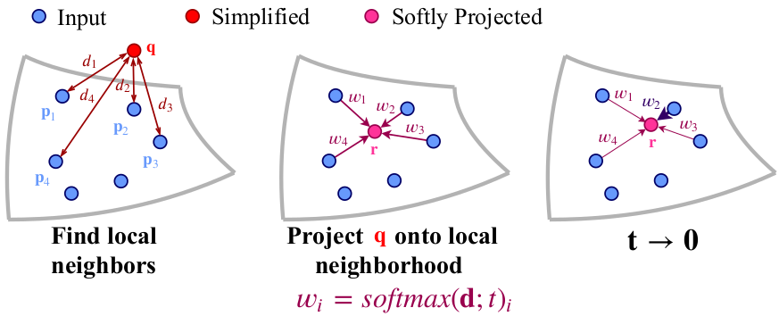
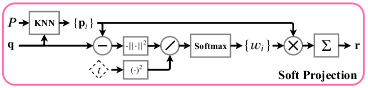

**Fig 2. Illustration of the sampling approximation.** 采样近似演示图。我们为点云提出了一种可学习的采样方法，该方法对最近邻选择采用了可微分的松弛。 查询点 $q$（红色）从输入点云（蓝色）投影到其局部邻域上。 邻居的加权平均值形成一个 softly投影点 $r$（洋红色）。在训练期间，近似最近邻采样来优化权重（在此示例中为 $p_2$），在 inference 推理时发生的。

## 3. Method

**Fig 3. Training of the proposed sampling method.** 在完整的输入点云 $P$ 上训练任务网络，并在我们的采样网络 SampleNet 的训练过程中保持固定。用神经网络将 $P$ 简化为一个较小的集合 $Q$。然后，将 $Q$ 软投影到 $P$ 上以获得 $R$，并将 $R$ 送到到任务网络。在表示损失的情况下，对 **SampleNet** 进行了训练，以从 $P$ 中采样最适合当前任务的点。

​	图3概述了我们的采样方法SampleNet。首先，在 n 个点的完整点云上预先训练任务网络并冻结。 然后，SampleNet获取一个完整的输入P，并通过神经网络将其简化为较小集合$Q$ ，其具有 $m$ 个点[6]。 通过最近邻选择的可微松弛，将 $Q$ 软投影到 $P$上。 最后，SampleNet的输出 $R$ 将输入到任务当中。SampleNet经过三个损失条件的训练:

$$
\begin{aligned}
\mathcal{L}_{\text {total}}^{s a m p}=\mathcal{L}_{\text {task}}(R) &+\alpha \mathcal{L}_{\text {simplify}}(Q, P) \\
&+\lambda \mathcal{L}_{\text {project}}
\end{aligned}
$$
​	第一项 $\mathcal{L}_{\text {task}}(R)$ 优化近似采样集 $R$。 它旨在通过采样点云来保留任务性能。

​	$\mathcal{L}_{\text {simplify}}(Q, P)$ 鼓励简化集合接近输入。 也就是说，$Q$ 中的每个点都应该在 $P$ 中有一个闭合点，反之亦然。

​	最后一项， $\mathcal{L}_{\text {project}}$ 用于通过软投影操作来近似来自输入点云的点采样。

​	我们的方法建立在Dovrat等人提出的抽样方法的基础上并加以扩展[6]。 为了清楚起见，我们在第3.1节中简要回顾了它们的方法。 然后，我们在3.2节中描述我们的扩展。

---

### 3.1. Simplify

​	给定 $n$ 个 3D 坐标 $P \in \mathbb{R}^{n \times 3}$ 的点云，目标是找到 $m$ 个点 $R^* \in \mathbb{R}^{m \times 3}$的子集，以便将采样点云 $R^*$ 最佳化为任务 $T$。将 $T$ 的目标函数表示为 $F$，$R^∗$由下式给出：
$$
R^{*}=\underset{R}{\operatorname{argmin}} \mathcal{F}(T(R)), \quad R \subseteq P, \quad|R|=m \leq n
$$
​	由于采样操作的不可微性，该优化问题提出了挑战。Dovrat[6]提出了一个简化网络，该网络从 $P$ 生成 $Q$ ，其中 $Q$ 对于任务 $T$ 是最佳的，并且其点与 $P$ 的点接近。为了鼓励第二性质，利用了简化损失。将平均最近邻损失记为:

$$
\mathcal{L}_{a}(X, Y)=\frac{1}{|X|} \sum_{\mathbf{x} \in X} \min _{\mathbf{y} \in Y}\|\mathbf{x}-\mathbf{y}\|_{2}^{2}
$$
​	最大最近邻损失为:
$$
\mathcal{L}_{m}(X, Y)=\max _{\mathbf{x} \in X} \min _{\mathbf{y} \in Y}\|\mathbf{x}-\mathbf{y}\|_{2}^{2}
$$
​	简化损失为:
$$
\begin{array}{r}
\mathcal{L}_{\text {simplify}}(Q, P)=\mathcal{L}_{a}(Q, P)+\beta \mathcal{L}_{m}(Q, P) \\
+(\gamma+\delta|Q|) \mathcal{L}_{a}(P, Q)
\end{array}
$$
​	为了优化任务的点集 $Q$，将任务损失添加到优化目标中。简化网络的总损失为：
$$
\mathcal{L}_{s}(Q, P)=\mathcal{L}_{\text {task}}(Q)+\alpha \mathcal{L}_{\text {simplify}}(Q, P)
$$
​	针对特定样本大小 $m$ 训练了上述简化网络。Dovrat等[6]也提出了一个渐进式采样网络。该网络根据简化点对任务的重要性排序，并可以输出任何样本大小。它输出n个点，并对其输出的嵌套子集进行简化损失训练:
$$
\mathcal{L}_{\text {prog}}(Q, P)=\sum_{c \in C_{s}} \mathcal{L}_{s}\left(Q_{c}, P\right)\tag{7}
$$
​	其中 $C_s$ 是控制大小。	

---

### 3.2. Project

**Figure 4. The soft projection operation.** 该运算以点云 $P$ 和简化点云 $Q$ 作为输入。每个点 $\mathbf{q}∈Q$ 投影到 $P$ 中的k个最近邻上，表示为 $\left\{\mathbf{p}_{i}\right\}$ 。 $\left\{w_{i}\right\}$ 由 $\left\{\mathbf{p}_{i}\right\}$ 与 $\mathbf{q}$ 的距离和温度系数 $t$ 计算得出，并用 $\left\{w_{i}\right\}$ 对 $\left\{\mathbf{p}_{i}\right\}$ 进行加权，进一步在软投影点集合 $R$ 中获得点 $\mathbf{r}$ 。

​	代替优化任务的简化点云，我们添加了 soft projection 操作, 如**Fig 4.**所示。将每个点 $\mathbf{q}∈Q$ 软投影到其邻域（由其在完整点云 $P$ 中的 $k$ 个最近邻定义），以获得投影点 $\mathbf{r}∈R$。点 $\mathbf{r}$ 是原始点形式 $P$ 的加权平均值:
$$
\mathbf{r}=\sum_{i \in \mathcal{N}_{P}(\mathbf{q})} w_{i} \mathbf{p}_{i}\tag{8}
$$
​	其中 $\mathcal{N}_{P}(\mathbf{q})$ 包含 $P$ 中 $q$ 的 $k$ 个最近邻的索引。权重 $\left\{w_{i}\right\}$ 根据 $\mathbf{q}$ 与邻居之间的距离确定，并以可学习的温度系数 $t$ 进行缩放:
$$
w_{i}=\frac{e^{-d_{i}^{2} / t^{2}}}{\sum_{j \in \mathcal{N}_{P}(\mathbf{q})} e^{-d_{j}^{2} / t^{2}}}\tag{9}
$$
​	距离由 $d_{i}=\left\|\mathbf{q}-\mathbf{p}_{i}\right\|_{2}$ 给出 。

​	邻域大小 $k = |\mathcal{N}_{P}(\mathbf{q})|$ 在选择采样点方面发挥作用。 通过距离项，网络可以调整简化点的位置，使其接近其局部区域中的其他输入点。 虽然较小的邻域会减弱探索的效果，但选择过大的邻域可能会导致失去局部 context。

​	权重 $\text{{w_i}}$ 可以看作是点 $\left\{\mathbf{p}_{i}\right\}$ 上的概率分布函数，其中 $\mathbf{r}$ 是期望值。温度系数控制该分布的形状。 当 $t \rightarrow 0$ 时，分布收敛到位于最邻近点的Kronecker delta函数。

​	鉴于这些观察，我们希望点 $\mathbf{r}$ 近似于 $P$ 中局部邻域的最近邻采样。为了实现这一点，我们增加了投影损失，计算公式为：
$$
\mathcal{L}_{\text {project}}=t^{2}
$$
​	该 loss 促进了小的温度值。
​	在我们的抽样方法中，任务网络被输入了投影点集 $R$ 而不是简化集 $Q$。由于 $R$ 中的每个点都估计了从 $P$ 中选择的点，因此我们的网络经过训练，可以对输入点云进行采样而不是对其进行简化。  

​	我们的采样方法可以轻松扩展到渐进采样设置（**Equation 7**）。 在这种情况下，损失函数采用以下形式：
$$
\begin{aligned}
\mathcal{L}_{\text {total}}^{\text {prog}}=\sum_{c \in C_{s}}\left(\mathcal{L}_{\text {task}}\left(R_{c}\right)\right.&\left.+\alpha \mathcal{L}_{\text {simplify}}\left(Q_{c}, P\right)\right) \\
&+\lambda \mathcal{L}_{\text {project}}
\end{aligned}
$$
​	其中 $R_c$ 是通过对 $Q_c$ 进行软投影操作而获得的点集（**Equation 8**）。	

​	在推断时，我们用采样替换软投影，以获得采样点云 $R^∗$。 像分类问题一样，对于每个点 $r^∗∈R^∗$，我们选择投影权重最高的点  $\mathbf{p}_{i}$ ：

$$
\mathbf{r}^{*}=\mathbf{p}_{i^{*}}, \quad i^{*}=\underset{i \in \mathcal{N}_{P}(\mathbf{q})}{\operatorname{argmax}} w_{i}
$$
​	与Dovrat类似，如果多于一个点 $r^∗$ 对应相同的点 $\mathbf{p}_{i^*}$，我们采用唯一的采样点集，使用 FPS 最多完成 $m$ 个点，并评估性能。	

#### Soft projection as an idempotent operation

​	严格来说，软投影运算（**Equation 8**）不是幂等的[37]，因此不构成数学投影。 但是，当 **Equation 9** 中的温度系数变为零时，将获得幂等采样操作（**Equation 12**）。 此外，最近邻选择可以看作是Bregman散度下的投影变化[4]。 推导在补充中给出。

---