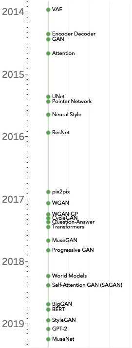

# wechat & zhihu

## PointCloud & GenModel

- [ ] 搞懂PointNet++，这篇文章就够了！https://zhuanlan.zhihu.com/p/266324173
- [ ] PCL(Point Cloud Library)学习指南&资料推荐（2020版） https://zhuanlan.zhihu.com/p/268524083
- [ ] 点云距离度量：完全解析EMD距离(Earth Mover's Distance)
- [ ] PU-Net：一种实现点云扩充的上采样网络 https://mp.weixin.qq.com/s/vKbM5O1DZHwCS-_Zvv8Tew
- [ ] PU-GAN：点云上采样对抗网络 https://mp.weixin.qq.com/s/3vxqckr6x5zCkYHMakfn3g
- [ ] Flow三部曲: NICE, Real NVP, Glow https://zhuanlan.zhihu.com/p/142567194

## Pytorch

- [ ] 使用PyTorch时，最常见的4个错误https://zhuanlan.zhihu.com/p/302578892
- [ ] 使用PyTorch Lightning自动训练你的深度神经网络https://mp.weixin.qq.com/s/LVQW0jm8CNEJSCZwzpeYKQ
- [ ] PyTorch Lightning 1.0 正式发布！从0到1，有这9大特点 https://mp.weixin.qq.com/s/_o8wpTlbycnMIjoHJ2omQQ
- [ ] 13个算法工程师必须掌握的PyTorch Tricks https://zhuanlan.zhihu.com/p/76459295
- [ ] 9个技巧让你的PyTorch模型训练变得飞快！ https://mp.weixin.qq.com/s/MMMMISXdgXqsS9AQ1fsh5A
- [ ] PyTorch 的 Autograd详解https://mp.weixin.qq.com/s/sZrmk18SXortVLX8dwiksQ
- [ ] PyTorch 单机多卡操作总结：分布式DataParallel，混合精度，Horovod) https://zhuanlan.zhihu.com/p/158375055
- [ ] 

## update

- 实验室一块GPU都没有怎么做深度学习？ https://www.zhihu.com/question/299434830
- 在CV/NLP/DL领域中，有哪些修改一行代码或者几行代码提升性能的算法？ https://www.zhihu.com/question/427088601

https://cloud.videojj.com/

https://www.easyaiforum.cn/

https://matpool.com/edu

https://mistgpu.com/

https://gpu.shareaiot.net/createWallet/gpu

**钱包地址： Ad5Jh72di4DYPG1nLxX4QVbMcj3XsdRvm9**

**私钥L4t8RgBYcB6TizdJrwjNnWMjL6pmrZZxyPzhMEZJTCAUPwN3Mrki**

## DL tricks

- [ ] 节省大量时间的 Deep Learning 效率神器 https://mp.weixin.qq.com/s/MWUQNqdzPxv8C5o85fO-rg
- [ ] 跑得比TensorBoard快多了，极简可视化工具Aim发布 | Reddit高热https://mp.weixin.qq.com/s/AG-jNCNa7-_tH_gk2UiMBQ
- [ ] 如何将深度学习研究论文实现为代码的几个要点 https://mp.weixin.qq.com/s/v63ZoG2jcyPOUF4zybhCyA
- [ ] 我们真的需要模型压缩吗？ https://mp.weixin.qq.com/s/X955K7d-wLaAc2LLunFs7w
- [ ] 涨点神器！南航提出AFF：注意力特征融合 https://zhuanlan.zhihu.com/p/265807713
- [ ] 神经网络模型遇到瓶颈？这些Tricks让你相见恨晚！ https://mp.weixin.qq.com/s/WfXtddCfLfhHl4eug_9hww
- [ ] 6 篇 TPAMI 如何做到？北大施柏鑫：计算机视觉论文投稿到接收，不可不知的关键环节 https://bbs.cvmart.net/topics/2108
- [ ] 论如何写好一篇学术论文 https://mooc.yanxishe.com/course/778

## DL learning

- [ ] FCN\Mask R-CNN\R-CNN\CNN\RNN\fast RCNN\Faster-RCNN\VoxelNet\ResNet
- [ ] 
- [ ] 看了这7篇论文，你会完全掌握卷积神经网络！ https://mp.weixin.qq.com/s/A76ZUC2FJmXFuyZcmCth3w
- [ ] 你好AI丨理解卷积神经网络中的自注意力机制 https://mp.weixin.qq.com/s/RO2DQwZiPAtUrCsqfD6n5A
- [ ] 30分钟吃掉Git和GitHub常用操作 https://mp.weixin.qq.com/s/mi6QHytTXoN7payD3qQOWw
- [ ] 生成模型综述——深度学习第二十章（一） https://zhuanlan.zhihu.com/p/50278440
- [ ] 四万字全面详解 | 深度学习中的注意力机制（上）https://mp.weixin.qq.com/s/GSe5gobptLUWZykR73Ibtw
- [ ] 谷歌联手DeepMind提出Performer：用新方式重新思考注意力机制 https://zhuanlan.zhihu.com/p/268795896
- [ ] 从源码学习Transformer！ https://mp.weixin.qq.com/s/nxSR8-N3ossrZNRLHJrTdg
- [ ] 用Transformer完全替代CNN https://zhuanlan.zhihu.com/p/266311690
- [ ] 计算机视觉"新"范式: Transformer https://mp.weixin.qq.com/s/hR8YrcHzNpTvjJY2EjdBHA
- [ ] 梯度下降的可视化解释(Adam，AdaGrad，Momentum，RMSProp) https://zhuanlan.zhihu.com/p/147275344
- [x] 可视化技术让你秒懂梯度、偏导数、法向量https://www.cnblogs.com/shine-lee/p/11715033.html
- [ ] 22张深度学习精炼图笔记总结 https://zhuanlan.zhihu.com/p/152362317
- [ ] 神经网络与深度学习 https://nndl.github.io/
- [ ] 图卷积网络原来是这么回事（一）——拉普拉斯矩阵初探 https://zhuanlan.zhihu.com/p/290755442

## Phd

- [ ] 5.21 CS专业讲座 Tod https://www.cctalk.com/v/15900558554960?
- [ ] github 隐藏特效 https://github.com/mkazhdan/PoissonRecon

## Movie

- [ ] 天注定
- [x] 鸡毛飞上天