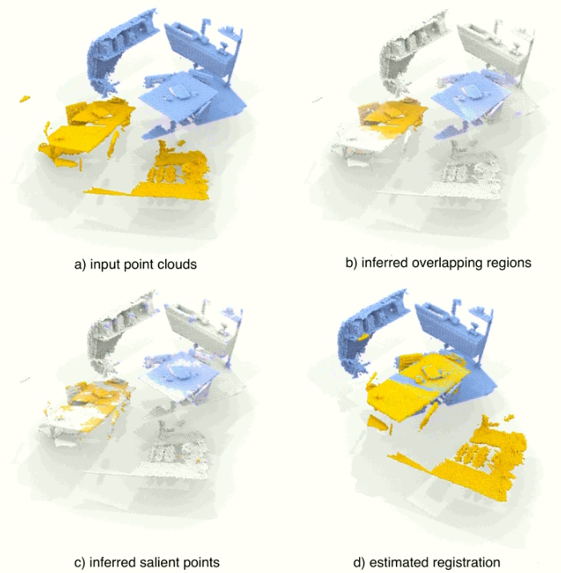

# Word

**轻量级，计算效率高(computationally-efficient)、内存占用少(memory-efficient)**

# Picture

## Unsupervised Detection of Distinctive Regions on 3D Shapes

## PREDATOR : Registration of 3D Point Clouds with Low Overlap

