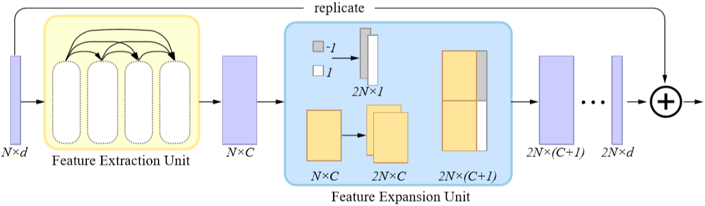
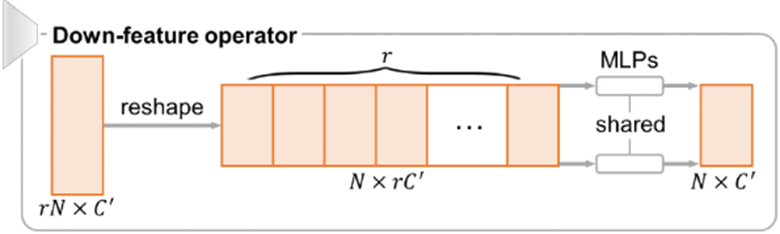

# 点云上采样/生成

## Tips

​	梯度消失解决：使用BatchNorm，将激活函数换为ReLu，使用Xaiver初始化等

​	注意一些小模块的问题，然后提出自己的改进，比如P_diffusionPC中related work 第二段提到CD loss存在的问题

## PointCloud Upsampling

上采样的三个关键点：

1. 要处理点云**无序、无拓扑**的结构
2. 生成的点应该具备**特征信息**，应**描述**潜在目标对象的基础**几何形状**，这意味着它们应大致位于目标对象表面上。（不应在内部）
3. 生成的点**不应杂乱无章**，生成的输出点集在目标对象表面上应该更加**均匀**。

### CVPR2018_PU-Net

​	The key idea is to learn multi-level features per point and expand the point set via **a multi branch convolution unit** implicitly in feature space.  核心思想是学习每个点的多层次特征，然后利用隐含在特征空间中的不同卷积分支进行扩充， 

​	 The expanded feature is then split to a multitude of features, which are then reconstructed to an upsampled point set. 扩展的特征会分解为多个特征，然后将其重构为上采样点集。

流程**patch** extraction --> point feature embedding  --> feature expansion --> coordinate reconstruction

首先，从给定的一组先验3D模型中提取具有不同尺度和分布的**点块**

​	然后，点特征集成组件通过**分层特征学习**和**多级特征聚合**将原始3D坐标映射到特征空间。

​	之后，我们使用特征扩展组件**扩展特征的数量**

​	并通过坐标重建组件中的一系列全连接层重建输出点云的3D坐标。

**1. patch extraction**

​	随机选择这些物体表面上的 $M$ 个点。从每个选定的点开始，我们在物体上生成一个曲面块，该块上的任何点与曲面上的选定点的距离都 **小于** 给定的测地线**距离**（$d$）。 然后，我们使用 Poisson 盘采样在每个块上随机生成 $N$ 个点，作为块上的参考 G.T. 分布。 在我们的上采样任务中，局部和全局上下文都有助于平稳而均匀的输出。 因此，我们用不同的大小设置 $d$ ，以便我们可以以**不同的尺度和密度**提取先前物体上的点块。

**2. point feature embedding**

​	为了从块中学习**局部和全局**几何背景，我们考虑以下两种特征学习策略，它们的优势是相辅相成的：

- Hierarchical feature learning 层次特征学习

​	**渐进地捕获越来越多的层次结构特征已被证明是提取局部和全局特征的有效策略**。 因此，采用PointNet++ [30]中提出的分层特征学习机制。 

​	具体在每个级别使用相对较小的分组半径，因为生成新点通常比[30]中的高级识别任务涉及更多的局部上下文。

- Multi-level feature aggregation 多级特征聚合

​	直接组合不同级别的特征，并让网络了解每个级别的重要性

​	由于在每个 patch 上设置的输入点在层次特征提取中逐步进行了二次采样，因此我们首先通过PointNet++中的插值方法从下采样后的点特征中恢复所有原始点的特征，从而将每个级别的点特征连接起来。

**3. feature expansion**

​	我们扩展了特征空间中的特征数量，这相当于扩展点的数量，因为点和特征是可以互换的。

​	假设 $f$ 维数是 $N×\hat{C}$，$N$ 是输入点的数目，$\hat{C}$ 是级联集成特征的特征维数。特征扩展操作将输出维数为 $rN×\hat{C}_2$ 的特征 $f'$，其中 $r$ 是上采样率，$\hat{C}_2$ 是新的特征维数。
$$
f^{\prime}=\mathcal{R S}\left(\left[\mathcal{C}_{1}^{2}\left(\mathcal{C}_{1}^{1}(f)\right), \ldots, \mathcal{C}_{r}^{2}\left(\mathcal{C}_{r}^{1}(f)\right)\right]\right)
$$
​	其中 $\mathcal{C}_{i}^{1}(\cdot)$ 和 $\mathcal{C}_{i}^{2}(\cdot)$ 是两组分开的 $1\times1$ 卷积。$\mathcal{R S}(\cdot)$ 是Reshape的操作，将张量尺寸由 $N\times r\hat{C}_2$ 转换为 $rN\times \hat{C}_2$。

​	从每个集合中的第一卷积  $\mathcal{C}_{i}^{1}(\cdot)$ 生成的 $r$ 个特征集合具有高相关性，这将导致最终重建的3D点彼此过于接近。因此，我们进一步为每个特征集添加另一个卷积 $\mathcal{C}_{i}^{2}(\cdot)$ (具有单独的权重)。

**4. coordinate reconstruction**

​	全连接 将特征回归成坐标

**5. 损失函数：**

Reconstruction loss ：将点放置在的物体下表面上，使预测点云与参考G.T.点云相似

Replusion loss ：为了更均匀地分布生成的点，避免生成的点倾向于位于原始点附近。

---

### arXiv2018_Data-driven Upsampling of Point Clouds

---

### CVPR2019_3PU

Patch-based progressive 3D point set upsampling

1次16x上采样 分为4次2x上采样  `2*2*2*2`

**1. 多步基于patch的感受野**

目的：**理想的网络，需要自适应的调整感受野从而在不同尺度中把握对应的细节信息进一步学习几何特征** 

问题：不规则，没有拓扑结构，点云集上应用多范围感受野不现实。邻居信息必须通过KNN算法，每层每点都这样计算一遍代价太大

解决方法：patch的size应自适应于感受野的范围。通常来讲感受野范围由KNN大小来定。所以，如果邻域大小被固定，随着点集越来越密集，感受野就会变窄，当感受野相对比较窄时，网络就不用处理所有的点。网络递归地上采样点集，并同时减少空间跨度。

**2. 多步端到端训练**

目的： 空间尺度不断减小，由全局逐渐聚焦局部；加快网络训练

解决方法：在 $U_{\hat{L}}$ 的第一阶段，我们固定单元 $U_1$ 到 $U_{\hat{L}-1}$ 的网络参数，并开始训练 $U_{\hat{L}}$。在第二阶段，我们释放固定的单元并同时训练所有单元，即 $U_1$ 到 $U_{\hat{L}}$ 。这种训练方法可以避免新单元出现梯度扰乱而影响到先前单元的稳定性。由于第一个单元没有前置训练，因此 $U_1$ 只需要训练一次，总共需要 $2^L-1$ 次训练。由于感受野内的点数固定，因此随着级数的增加宏观角度来看所处理的空间尺度也在收窄，聚焦的尺度也从全局逐渐转变为细节的特征学习。

**3. Upsampling network unit 上采样网络单元** 

- **通过层内密集连接进行特征提取**

通过第一层mlp提取特征$C'$，然后通过**knn对特征进行分组**，分组后再次经过第二层MLP提取特征$G$，然后残差连接加上输入$G+C'$

**残差连接**是利用跨网络不同层提取的特征的强大工具

然后再次通过第三层mlp，再次残差连接 $G+G+C'$

最大池化保证序列不变性，降维，在加上最开始的输入坐标 $G+G+C'+d$

通过过渡层压缩为 $C’$ ,输入到下一层重复提取特征

一个白色的为一个denseblock，在denseblock之间使用了残差连接

- **通过代码分配特征扩展**

为每个重复的特征分配一个值-1和1的一维代码**，**以将它们转换到不同的位置  **产生位置扰动**（类似FoldingNet）

接下来，使用一组MLP将特征 $2N×（C +  1）$压缩为 $2N×d$ 的残差特征，我们将其添加到**初始输入坐标**以生成输出点。

- **通过双边特征插值进行层间残差连接**

引入了**层间残差连接**以增强**上采样单元之间的通信**，这充当了使用不同感受野范围提取的特征的桥梁

注意是**特征**之间的连接，在**特征提取模块之后**，**特征扩展模块之前**，由于**维度不一致**，需要先进行**插值**

**4. loss function** 

​	改进的CD Chamfer distance

------

### ICCV2019_PU-GAN

A Point Cloud Upsampling Adversarial Network

流程与PU-Net相似 

​	总体分为生成器和鉴别器

**1. 生成器**

**特征提取模块 ** 从输入点云 $\mathcal{P}$ 中提取特征 使用**3PU**中的方法

**特征扩展模块 ** 将特征 $F$ 通过Up模块变为 $F_{up}$ ，通过up-down-up单元增强特征变换， $F_{up}$ 用来产生更多样的点分布。

**点集生成模块** 从 $F_{up}$ 回归成坐标，然后再进行FPS下采样，保留需要的点数。

**2. 鉴别器** 

​	首先提取**全局特征**，然后将**局部特征**与全局特征**联结**起来；特征串联后，通过**自注意力机制**单元增强特征学习/增强特征集成/之前后续特征提取能力；再次通过mlp+maxpooling 获取**全局特征**。然后将特征通过全连接层**回归**成置信度值。判断生成器输出的真假

**3. 模块**

- 生成器-特征扩展-up-down-up单元

​    复制点特征，每个MLP单独处理每个点 $\mathbf{F}_1$。先通过up上采样至 $\mathbf{F}_{\mathrm{{up}}^{\prime}}$ 然后通过down下采样到 $\mathbf{F}_2$，计算**up前的特征**和**down后的特征**之间的**差异** $\Delta = F_1-F_2$ ，然后将差异也上采样为 $\Delta_{\mathrm{up}}$，将两个上采样的特征和差异相加  $F_{up} =\Delta_{\mathrm{up}} + \mathbf{F}_{\mathrm{{up}}^{\prime}}$

​	Such a strategy not only **<u>avoids tedious multi-step training</u>** 避免繁琐的多步训练, but also **<u>facilitates the production of fine-grained features</u>** 有助于生成细粒度的特征.

- 生成器-特征扩展-up单元

​	上采样率为$r$，我们应该**增强重复特征之间的差异**，等效于把新的点push到远离输入点的地方。我们复制 $r$ 次输入特征图 （N个特征向量， $C'$个通道）。采用FoldingNet中2D网格机制来**为每个特征图副本生成唯一的2D向量**，并将该向量追加到同一特征图副本中的每个点特征向量；此外，使用自我注意单元，然后使用一组MLP来生成输出上采样的特征。

- 生成器-特征扩展-down单元

​	为了对扩展的特征进行降采样，我们对特征进行“reshape”，然后使用一组MLP对原始功能进行“退化”。

- 鉴别器-self-attention单元

​    为了在级联之后引入**远程上下文**依赖以增强特征集成，我们在生成器中采用了**自注意力单元**。 具体来说，我们通过两个独立的MLP 将**输入特征转换**为 G 和 H ，然后通过G 和 H 生成注意力权重W
$$
\begin{equation*}{\mathbf {W}} = f_{{\mathrm {softmax}}} (\mathbf{G}^{T}{\mathbf {H}}), \tag{1}\end{equation*}
$$
​	其中 $f_{softmax}$ 表示 softmax 函数。之后，我们获得加权特征$ \mathbf {W} ^ {T}K$ ，其中 K 是通过另一个MLP从输入中提取的特征集合。 最后，我们生成输出特征，即输入特征和加权特征的总和。

**4. loss function**

Adversarial loss 对抗损失，训练生成器和辨别器网络

Uniform loss 评估分布均匀性

​	imbalance loss 失衡损失 均匀局部分布

​	clutter loss 杂波损失	非局部均一 鼓励点覆盖

Reconstruction loss Earth Mover’s distance (EMD)

Compound loss

---

### arXiv2019_PU-GCN

Point Cloud Upsampling using Graph Convolutional Networks

参考意义不大

### ECCV2020_PUGeo-Net

A Geometry-centric Network for 3D Point Cloud Upsampling

GCNs are considered a tool to process non-Euclidean data. 

GCN被认为是处理非欧几里得数据的工具。

可以很全面的考虑到局部数据

Neither PU-Net nor MPU considers the spatial correlation among the generated points.

不论是PU-Net还是MPU都不考虑**生成的点之间的空间相关性**。

**首先将3D表面 $S$ 参数化为2D域，然后在参数域中进行采样，最后将2D样本映射到3D表面**。

**局部表面理论**

**Fig. 2** 表面参数化和局部形状近似。通过可微映射 $\boldsymbol{\Phi}: \mathbb{R}^{2} \rightarrow \mathbb{R}^{3}$ 将 $\mathbf{x_i}$ 的局部邻域参数化为2D矩形域 。雅可比矩阵 $\mathbf{J}_{\Phi}(0,0)$ 提供 $\mathbf{x_i}$ 的最佳线性逼近 $\boldsymbol{\Phi}$，它将 $(u,v)$ 映射到 $\mathbf{x_i}$ 的切平面上的点 $\hat{\mathbf{x}}$。此外，使用 $\mathbf{x_i}$ 的主曲率，我们可以以二阶精度重建 $\mathbf{x_i}$ 的局部几何形状。

如图3.a所示，给定输入稀疏3D点云，PUGeo-Net进行如下操作：首先在2D参数域中生成新样本$\left\{\left(u_{i}^{r}, v_{i}^{r}\right)\right\}_{r=1}^{R}$ 。 然后计算法线 $\mathbf{n}_{i}=\mathbf{T}_{i} \cdot(0,0,1)^{\top}$。 之后，它将每个生成的2D样本 $\left(u_{i}, v_{i}\right)$ 通过 $\widehat{\mathbf{x}}_{i}^{r}=\mathbf{T}_{i} \cdot\left(u_{i}^{r}, v_{i}^{r}, 0\right)^{\top}+\mathbf{x}_{i}$ 映射到 $\mathbf{x_i}$ 的切平面。 最后，通过计算沿法线方向的位移 $\delta_{i}^{r}$，将 $\widehat{\mathbf{x}}_{i}^{r}$ 投影到弯曲的3D表面。

**Fig. 3(a)**  PUGeo-Net的阶段：学习局部参数化，点扩展，顶点坐标和法线修正。

**Fig. 3(b)** 显示了PUGeo-Net的端到端网络结构。输出以红色显示。

**1. Hierarchical Feature Learning and Recalibration** 

令 $\mathbf{c}_{i}^{l} \in \mathbb{R}^{F_{l} \times 1}$ 成为第 $l$ 层上的点 $\mathbf{x}_i$ 的提取特征 $(l=1, \cdots, L)$，其中 $F_l$ 是特征长度。我们首先串联所有 $L$ 层的特征，即 $\widehat{\mathbf{c}}_{i}=\operatorname{Concat}\left(\mathbf{c}_{i}^{1}, \cdots, \mathbf{c}_{i}^{L}\right) \in \mathbb{R}^{F}$，其中 $F=\sum_{l=1}^{L} F_{l}$ 并且 $Concat(·)$ 代表串联算子。将直接串联特征传递给一个小的MLP $hr(·)$ ，以获得对数 $\mathbf{a}_{i}=\left(a_{i}^{1}, a_{i}^{2}, \ldots, a_{i}^{L}\right)$，即
$$
\mathbf{a}_i = h_r(\hat{\mathbf{c}_i}) \tag{1}
$$
​	将其进一步馈送到softmax层以产生重校准权重 $\mathbf{w}_{i}=\left(w_{i}^{1}, w_{i}^{2}, \ldots, w_{i}^{L}\right)$
$$
w_{i}^{l}=e^{a_{i}^{l}} / \sum_{k=1}^{L} e^{a_{i}^{k}}
$$
​	最后，将经过校正的多尺度特征表示为加权级联：
$$
\mathbf{c}_{i}=\operatorname{Concat}\left(w_{i}^{1} \cdot \mathbf{c}_{i}^{1}, w_{i}^{2} \cdot \mathbf{c}_{i}^{2}, \cdots, \hat{a}_{i}^{L} \cdot \mathbf{c}_{i}^{L}\right) \tag{3}
$$

### 

**Fig. 3(c)**   特征重校准

**2. Parameterization-based Point Expansion**

2.1. Adaptive sampling in the 2D parametric domain 二维参数域中自适应采样

​	对于每个点 $\mathbf{x}_i$ ，将MLP $f_1(·)$ 应用于其局部表面特征 $\mathbf{c}_i$，以重构 $R$ 个采样点的二维坐标$\left(u_{i}^{r}, v_{i}^{r}\right)$

2.2. Prediction of the linear transformation 线性变换预测

​	根据局部表面特征 $\mathbf{c}_i$ 预测线性变换矩阵 $\mathbf{T}_{i} \in \mathbb{R}^{3 \times 3}$，将 $\mathbf{T}_{i}$ 乘以先前学习的2D样本 $\left\{\left(u_{i}^{r}, v_{i}^{r}\right)\right\}_{r=1}^{R}$可将点提升到 $\mathbf{x}_i$ 的切平面

2.3. Prediction of the coarse normal 粗法线预测

​	首先估计一个粗法线，即每个输入点的切平面的法线  $\mathbf{n}_{i} \in \mathbb{R}^{3 \times 1}$，该值由输入点上的所有点共享。 具体来说，我们将线性变换矩阵 $\mathbf{T}_{i}$ 与垂直于2D参数域的预定法线$(0,0,1)$相乘

**Fig. 3(d)**   点扩展

**3. Updating Samples via Local Shape Approximation 通过局部形状近似更新样本**

​	由于样本 $\widehat{\mathcal{X}}_{R}=\left\{\widehat{\mathbf{x}}_{i}^{r}\right\}_{i, r=1}^{M, R}$ 在切平面上，因此我们需要将它们扭曲到曲面上并更新其法线。

**4. Joint Loss Optimization** 

### arXiv2020_Deep Magnification-Arbitrary Upsampling over 3D Point Clouds

​	我们介绍了MAPU-Net，这是一种用于放大任意点云上采样的新颖的端到端学习框架。 作为基于线性逼近对上采样问题进行明确表述的神经网络，MAPUNet是可解释且紧凑的。 它在灵活性方面与深度学习同行不同：一旦MAPU-Net的单个网络能够以任意因子生成密集点云，就可以对其进行训练。 对合成数据的定量评估表明，MAPU-Net比最先进的方法更准确，并且可以产生更丰富，更有意义的几何细节。 我们还展示了MAPU-Net在嘈杂数据和真实数据上的有效性和优势。 将来，我们将扩展MAPU-Net，以同时提高点云的几何分辨率和相关属性（例如颜色）。 此外，我们将研究MAPU-Net在点云压缩中的潜力，这对于有效的存储和传输是非常需要的。

### arXiv2020_SPU-Net 

Self-Supervised Point Cloud Upsampling by Coarse-to-Fine Reconstruction with Self-Projection Optimization

### arXiv2021_Meta-PU

An Arbitrary-Scale Upsampling Network for Point Cloud

### VISIGRAPP2021_Point Cloud Upsampling and Normal Estimation using Deep Learning for Robust Surface Reconstruction

---

## PointCloud Completion

### CVPR2020_SA-Net

Point Cloud Completion by Skip-attention Network with Hierarchical Folding

---

## PointCloud Generation

### CVPR2018_FoldingNet

> folding : 将复制codeword的连接称为低维**网格点**，然后将**point-wise MLP** 每个点都经过MLP称为**folding**操作。 

Encoder 基于graph 最近邻 maxpooling 组合局部形状信息特征

Decoder 基于folding  学习一种"力"将2D网格折叠扭曲成3D点云形状   比基于折叠的反卷积效果好

两个连续的folding操作：第一个将2D网格折叠到3D空间，第二个在3D空间内部折叠

AE架构具有interpretable可解释性

---

### Atlas-Net

### CVPR2021_Diffusion Probabilistic Models for 3D Point Cloud Generation

In flow-based models, the constraint of invertibility might limit the expressive power of the model, and the training and inference are slow especially when the flow is continuous. 

**在基于流的模型中，可逆性的约束可能会限制模型的表达能力，并且训练和推理很慢，尤其是在连续的流中**。

粒子从有意义的形状分布 收到 heat bath的影响后，逐步**扩散**为散乱分布，散乱分布也可以看作是噪声分布。

初始分布→噪声分布

为了建模用于点生成，现在考虑**反向扩散**过程，即扩散的逆过程，

噪声分布→初始分布

为了让其有生成能力，设定shape latent，遵循先验分布，并通过流模型参数化增强其表征能力。

点云的生成分为两大流派，**第一种是生成问题转换为矩阵问题**，比较注重各种距离loss。**第二种是将点云视为来自点分布的样本**，即基于似然的点云建模与生成。

由于点云上的点是从分配中独立采样的，因此，**整个点云的概率仅是每个点的概率的乘积**

---

## PointCloud Consolidation

---

### ECCV2018_EC-Net

An Edge-aware Point set Consolidation Network

**Fig. 2: The pipeline of EC-Net.**  对于输入**patch**中的每个点，我们首先使用PointNet++将其局部几何编码为特征向量 $f$（大小：$N×D$），然后使用特征扩展机制将 $f$ 扩展为 $f'$（大小：$rN×D_2$）。然后，我们对**残差点坐标**以及**距扩展特征的点到边距离**（$d$）进行回归，并通过将原始点坐标添加到残差来形成输出点坐标。最后，网络识别边缘上的点并产生输出点。该网络使用边缘感知的联合损失功能进行了训练，右侧四个黄色框。

​	基于 edge-aware 技术，具有边缘感知能力

​	制定回归分量 从上采样的特征中同时恢复 **点坐标** 和 **点到边的距离**

​	边感知 联合损失函数 最小化输入点到3D曲面和边的距离

​	可以关注检测到**尖锐边缘**并实现更准确的3D重建，它可以识别边缘点并沿着边缘（以及整个表面）生成更多点，从而有助于保留清晰特征的3D重建。

​	受PointNet的启发，我们通过将3D点的**坐标转换为深层特征**并通过**特征扩展**产生更多点来直接处理3D点。

​	

​	提取**patch** 以使同patch中的点在基本表面上大致接近

​	将一个点视为node 通过knn构造加权图，边权重为欧氏距离

​	随机选择m=100个点作为patch的质心；从每个选定的点开始，使用Dijkstra算法根据图中的最短路径距离找到2048个最近的点。随机在其中选择1024个点

**Feature embedding and expansion.** 

​	使用pointnet++提取1024个（即1patch）的特征N，保留一半的特征为 $f$ 之后使用PU-NET中的特征扩展模块进行参数扩展。

**Edge distance regression.** 

​	每个扩展特征（等价于一个 **点**）回归一个点到边的距离，以进行**边缘点识别**。 回归距离是与该patch相关联的所有**带注释边缘段**中从输出点到最近的**带注释边缘段**的最短估计距离。

​	通过一个全连接的层从扩展特征 $f’$ 提取距离特征 $f_{dist}$，然后通过另一个全连接的层从 $f_{dist}$ **回归**成点到边缘的距离 $d$。 我们分两步进行操作，这样我们就可以将 $f_{dist}$ 也输入坐标回归组件。

**Coordinate regression.** 

扩展特征 $f’$ 与距离特征 $f_{dist}$ （来自上一个组件）连接起来输入全连接层来回归成点坐标

**Edge points identification.** 

将 $d_i$ 表示为输出点 $x_i$ 的点到边的回归距离，接下来我们找到一个输出点的子集，即边缘附近的边缘点（用阈值 $\Delta_d$ 表示为 $S_{\Delta_d}$）：$\mathcal{S}_{\Delta_{d}}=\left\{x_{i}\right\}_{d_{i}<\Delta_{d}}$。 请注意，此组件在训练和推理阶段均执行。

– In the edge distance regression component, we first use one fully-connected layer with width 64 to regress fdist from f0. Then, we use another fully-connected layer with width 1 to regress the point-to-edge distance d. 在边缘距离回归组件中，我们首先使用一层宽度为64的全连接的层**使 $f_{dist}$ 从 $f'$ 回归**。 然后，我们使用另一个宽度为1的全连接的层来回归点到边的距离 $d$ 。

4个loss 

**Surface loss** 促使输出点位于下层曲面附近

**Edge loss** 促使输出点具有边缘感知，即位于边缘附近

**Repulsion loss** 鼓励输出点在基础表面上更均匀地分布

**Edge distance regression loss **指导网络将点到边缘距离 $d$ 回归为 $rN$ 个输出点

用来满足： （i）靠近底层的对象表面，（ii）边缘感知（位于靠近带注释的边缘）（iii）更均匀地分布在对象表面上。

**End-to-end training**

---

## PointCloud Learning Representations

### ICLR-W2018_Latent_3d_points

Learning representations and generative models for 3D point clouds. 

latent_3d_points阅读

