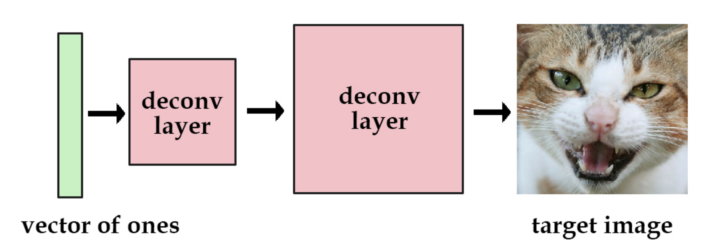
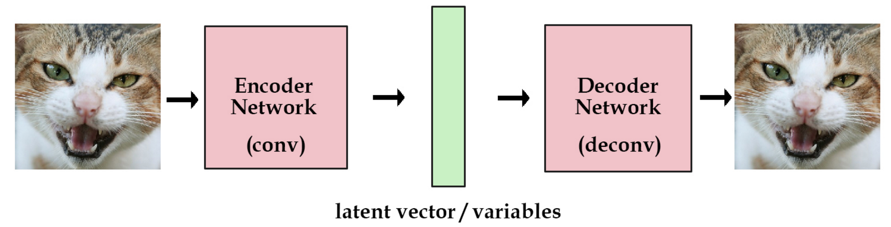
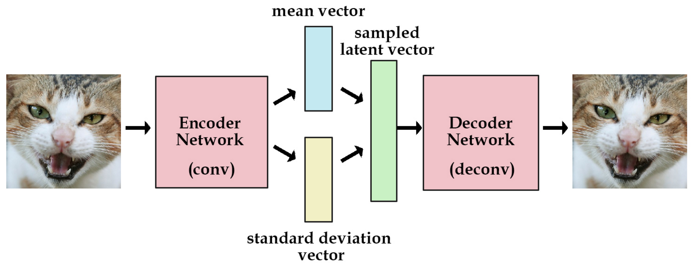
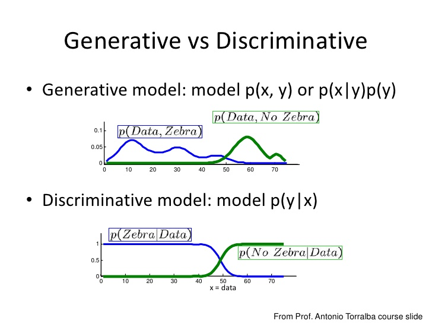
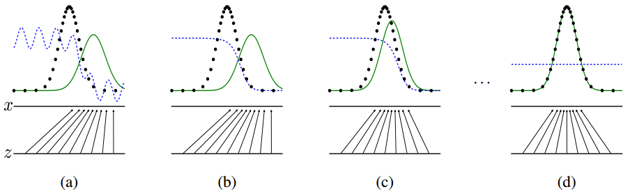
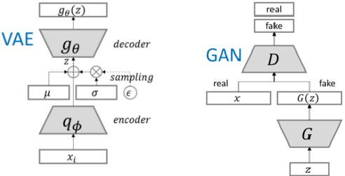
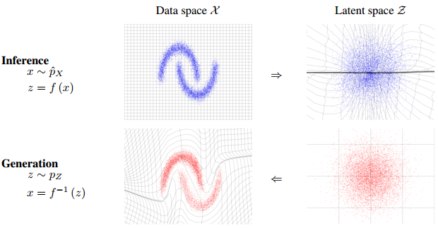

# 生成模型概述

## 历史主流两类生成模型

​	训练”稳定”、样本”多样性”、”清晰度“高的模型是GAN的3大指标。

---

### VAE

https://www.cnblogs.com/huangshiyu13/p/6209016.html

​	VAE（Variational Autoencoders Explained）变分自动编码器。

​	一个描述神经网络的常见方法是近似一些我们想建模的函数。然而神经网络也可以被看做是携带信息的数据结构。

​	假如我们有一个带有解卷积层的网络，我们设置输入为值全为1的向量，输出为一张图像。然后，我们可以训练这个网络去减小重构图像和原始图像的平均平方误差。那么训练完后，这个图像的信息就被保留在了网络的参数中。

​	现在，我们尝试使用更多的图片。这次我们用one-hot向量（多分类标签）而不是全1向量。我们用[1, 0, 0, 0]代表猫，用[0, 1, 0, 0]代表狗。虽然这要没什么问题，但是我们最多只能储存4张图片。当然，我们也可以增加向量的长度和网络的参数，那么我们可以获得更多的图片。

​	但是，这样的向量很稀疏。为了解决这个问题，我们想使用实数值向量而不是0，1向量。我们可认为这种实数值向量是原图片的一种编码，这也就引出了编码/解码的概念。举个例子，[3.3, 4.5, 2.1, 9.8]代表猫，[3.4, 2.1, 6.7, 4.2] 代表狗。这个已知的初始向量可以作为我们的潜在变量。

​	如果像我上面一样，随机初始化一些向量去代表图片的编码，这不是一个很好的办法，我们更希望计算机能帮我们自动编码。在autoencoder模型中，我们加入一个编码器，它能帮我们把图片编码成向量。然后解码器能够把这些向量恢复成图片。 

​	我们现在获得了一个有点实际用处的网络了。而且我们现在能训练任意多的图片了。如果我们把这些图片的编码向量存下来，那以后我们就能通过这些编码向量来重构我们的图像。我们称之为**标准自编码器**。

​	但是，我们想建一个产生式模型，而不是一个只是储存图片的网络。现在我们还不能产生任何未知的东西，因为我们不能随意产生**合理的潜在变量**。因为**合理的潜在变量都是编码器从原始图片中产生的**。

​	这里有个简单的解决办法。我们可以对编码器添加约束，就是强迫它**产生服从单位高斯分布的潜在变量**。正是这种约束，把VAE和标准自编码器给区分开来了。

​	现在产生新的图片也变得容易：我们只要从单位高斯分布中进行采样，然后把它传给解码器就可以了。

​	事实上，我们还需要在重构图片的**精确度**和单位高斯分布的**拟合度**上进行权衡。

​	我们可以让网络自己去决定这种权衡。对于我们的损失函数，我们可以把这两方面进行**加和**。一方面，是图片的重构误差，我们可以用**平均平方误差**来度量，另一方面。我们可以用**KL散度**（[KL散度介绍](http://www.cnblogs.com/huangshiyu13/p/6898212.html)）来度量我们潜在变量的分布和单位高斯分布的差异。
$$
\begin{array}{l}
Generation_{loss} &=& mean (square(Generated_{image} - Real_{image})) \\ 
Latent_{loss} &=& KL-Divergence(Latent_{variable}, Unit_{gaussian}) \\
Loss &=& Generation_{loss} + Latent_{loss}
\end{array}
$$

​	为了优化KL散度，我们需要应用一个简单的参数重构技巧：不像标准自编码器那样产生实数值向量，VAE的编码器会产生两个向量:一个是均值向量，一个是标准差向量。

​	我们可以这样来计算KL散度：
$$
\begin{array}{l}
Latent_{loss} = 0.5 * tf.reduce_{sum}(tf.square(Z_{mean}) &+& tf.square(Z_{stddev})\\ &-& tf.log(tf.square(Z_{stddev})) - 1,1)
\end{array}
$$
​	其中 $Z_{mean}$ 和 $Z_{stddev}$ 是由编码网络生成的两个向量。

​	当我们计算解码器的loss时，我们就可以从标准差向量中采样，然后加到我们的均值向量上，就得到了编码去需要的潜在变量。
$$
\text { Samples }=tf. \text {random}_{\text {normal}} \left([\text{batchsize},n_{z}],0,1,\text{dtype=tf.float32}\right)\\
\text { Sampled_Z }=Z_{mean }+\left(Z_{stddev }{*} \text { samples }\right)\\
$$
​	VAE除了能让我们能够自己产生随机的潜在变量，这种约束也能提高网络的产生图片的能力。 

​	为了更加形象，我们可以认为潜在变量是一种数据的转换。

 	我们假设我们有一堆实数在区间[0, 10]上，每个实数对应一个物体名字。比如，5.43对应着苹果，5.44对应着香蕉。当有个人给你个5.43，你就知道这是代表着苹果。我们能用这种方法够编码无穷多的物体，因为[0, 10]之间的实数有无穷多个。

​	但是，如果某人给你一个实数的时候其实是加了高斯噪声的呢？比如你接受到了5.43，原始的数值可能是 [4.4 ~ 6.4]之间的任意一个数，真实值可能是5.44(香蕉)。如果给的方差越大，那么这个平均值向量所携带的可用信息就越少。

​	现在，我们可以把这种逻辑用在编码器和解码器上。编码越有效，那么标准差向量就越能趋近于标准高斯分布的单位标准差。这种约束迫使编码器更加高效，并能够产生信息丰富的潜在变量。这也提高了产生图片的性能。而且我们的潜变量不仅可以随机产生，也能从未经过训练的图片输入编码器后产生。

​	这里有一些使用VAE好处，就是我们可以通过编码解码的步骤，直接比较重建图片和原始图片的差异，但是GAN做不到。VAE的一个劣势就是没有使用对抗网络，所以会更趋向于产生模糊的图片。

---

### GAN

​	如果我们有一堆图像，我们如何生成更多类似的图像？最近的一种方法，即[生成对抗网络](http://arxiv.org/abs/1406.2661)，试图通过同时训练鉴别器来挑战图像生成器来改进它，从而训练图像生成器。

​		伪造者被称为生成网络，是使用转置卷积（transpose convolutions）的一种特殊的卷积网络，有时也称为反卷积网络（deconvolutional network）。这个生成网络吸收了大约100个噪声参数（有时称为*代码*），并相应地输出图像。

**Fig. 1 DCGAN**

​	Radford等人的[DCGAN网络](https://github.com/Newmu/dcgan_code)就是其中一种。（如上所示）。该网络采用从[均匀分布中](https://en.wikipedia.org/wiki/Uniform_distribution_(continuous))提取的100个随机数作为输入（我们将其称为 *code-代码* 或 *latent variables-潜变量*，左侧红色），然后输出图像（在这种情况下`64x64x3`，右侧绿色）。随着 *code* 的增量更改，[生成的图像](https://github.com/Newmu/dcgan_code#walking-from-one-point-to-another-in-bedroom-latent-space)也会更改-这表明该模型已学习了描述世界外观的功能，而不仅仅是记住一些示例。

​	网络（黄色）由标准的[卷积神经网络](http://cs231n.github.io/convolutional-networks/)组件组成，例如[反卷积层](http://datascience.stackexchange.com/questions/6107/what-are-deconvolutional-layers)（[卷积层的](http://datascience.stackexchange.com/questions/6107/what-are-deconvolutional-layers)反向），[全连接层](http://cs231n.github.io/convolutional-networks/#fc)等：

​	DCGAN使用随机权重进行初始化，因此插入网络中的随机代码将生成完全随机的图像。但是，正如您可能想象的那样，网络具有数百万个我们可以调整的参数，目标是找到这些参数的设置，使从随机代码生成的样本看起来像训练数据。或者换一种说法，我们希望模型分布与图像空间中的真实数据分布相匹配。

​	假设我们使用一个新初始化的网络来生成200张图像，每次以不同的随机 *code* 开头。问题是：我们应该如何调整网络的参数，以鼓励它在将来产生更可信的样本？注意，我们不是在一个简单的监督设置中，并且对于我们生成的200张图像没有任何明确的*期望目标*。我们只希望它们看起来真实。解决此问题的一种聪明方法是遵循[对抗性生成网络（GAN）](http://arxiv.org/abs/1406.2661)方法。这里我们介绍第二个*鉴别器* 网络（通常是标准的卷积神经网络），试图对输入图像是真实的还是生成的进行分类。例如，我们可以将200个生成的图像和200个真实的图像馈送到鉴别器中，并将其训练为标准分类器以区分这两个来源。但是除此之外，这就是窍门，**我们还可以[反向传播](http://neuralnetworksanddeeplearning.com/chap2.html)通过鉴别器和生成器两者来找到我们应该如何更改生成器的参数**，以使其鉴别器的200个样本稍微混乱一些。因此，这两个网络陷入了一场战斗：鉴别器试图将真实图像与伪图像区分开，生成器试图创建使鉴别器认为它们是真实的图像。最后，生成器网络输出的图像与鉴别器的真实图像没有区别。

​	还有一些其他匹配这些分布的方法，我们将在下面简要讨论。但是在到达下面之前，有两个动画显示了生成模型的样本，以使您对训练过程具有视觉感觉。在这两种情况下，来自发生器的样本开始时都是嘈杂且混乱的，随着时间的流逝，收敛到具有更合理的图像统计数据：

​	

​	

​	数学上，我们考虑一个示例数据集 $x_{1}, \ldots, x_{n}$ 作为真实数据分布的样本 $p（x）$。在下面的示例图像中，蓝色区域显示了部分图像空间，该区域很可能（超过某个阈值）包含真实图像，而黑点表示我们的数据点（每个都是我们数据集中的一张图像）。现在，我们的模型还描述了一个分布 $\hat{p}_{\theta}(x)$ （绿色）通过从单位高斯分布（红色）中获取点并通过（确定性）神经网络（我们的生成模型（黄色））进行映射来隐式定义。我们的网络是具有参数 $\theta$ 的函数，然后调整这些参数将调整生成的图像分布。然后我们的目标是找到参数 $\theta$ 产生与真实数据分布非常匹配的分布（例如，由于[KL散度](https://en.wikipedia.org/wiki/Kullback–Leibler_divergence)损失较小）。因此，您可以想象绿色分布从随机开始，然后训练过程迭代地更改参数 $\theta$ 拉伸和挤压它以更好地匹配蓝色分布。

​	**生成模型**通过训练大量数据, 学习自身模型, 最后通过自身模型产生逼近真实分布的**模拟分布**. 用这个宝贵的”分布”生成新的数据. 

​	因此, **判别模型**的目标是得到关于 **y** 的分布 **P(y|X)**, 而**生成模型**的侧重是得到关于**X**分布 **P(y, X) 或 P(x|y)P(y)**. 

​	即, **判别模型**的目标是给定一张图片, 请告诉我这是”长颈鹿”还是”斑马”, 而, **生成模型**的目标是告诉你词语: “长颈鹿”, 请生成一张画有”长颈鹿”的图片吧~ 下面这张图片来自[slideshare](http://www.slideshare.net/shaochuan/spatially-coherent-latent-topic-model-for-concurrent-object) 可以说明问题:

​	所以, 生成模型可以从大量数据中生成你从未见过的, 但是符合条件的样本.

​	难怪, 我们可以调教神经网络, 让他的画风和梵高一样. 最后输入一张图片, 它会输出模拟梵高画风的这张图片的油画.

​	**言归正传, 为啥对抗网络在生成模型中受到追捧 ? 生成对抗网络最近为啥这么火 , 到底好在哪里?** 

​	那就必须谈到**生成对抗网络**和一般**生成模型**的区别了.

​	一般的生成模型, 必须先初始化一个**“假设分布”，**即**后验分布**， 通过各种抽样方法抽样这个**后验分布**，就能知道这个分布与**真实分布**之间究竟有多大**差异**。这里的**差异**就要通过构造**损失函数(loss function)**来估算。知道了这个**差异**后，就能不断调优一开始的**“假设分布”，**不断逼近真实分布。[**限制玻尔兹曼机(RBM)**](http://deeplearning.net/tutorial/rbm.html)就是这种生成模型的一种.

​	正如”[对抗样本与生成式对抗网络](http://blog.csdn.net/luoyun614/article/details/52202348)“一文所说的: 传统神经网络需要一个人类科学家精心打造的**损失函数**。但是，对于生成模型这样复杂的过程来说，构建一个好的**损失函数**绝非易事。这就是对抗网络的闪光之处。对抗网络可以学习自己的**损失函数**——自己那套复杂的对错规则——无须精心设计和建构一个**损失函数:**

​	生成对抗网络同时训练两个模型, 叫做**生成器(**Generator 图中蓝色框**)**和**判断器(**Discriminator 图中红色框**)**. 生成器竭尽全力模仿真实分布生成数据; 判断器竭尽全力区分出**真实样本**和生成器生成的**模仿样本.** 直到判断器无法区分出真实样本和模仿样本为止.通过这种方式, **损失函数被蕴含在判断器中了.** 我们不再需要思考损失函数应该如何设定, 只要关注判断器输出损失就可以了.

​	上图是生成对抗网络的训练过程, 可以看到生成器和判别器的各自表现. 其中, 黑色虚线的分布是**真实分布**, 绿色线的是**生成器的分布**, 蓝色虚线是判别器的**判定分布.** 两条水平线代表了两个分布的样本空间的映射.

​	(a)图中**真实分布**和**生成器的分布**比较接近, 但是判定器很容易区分出二者生成的样本. (b)图中判定器又经过训练加强判断, 注意**判定分布.** (c)图是生成器调整分布, 更好地欺骗判定器. (d)图是不断优化, 直到**生成器**非常逼近**真实分布,** 而且**判定器**无法区分**.**

---

### VAE、GAN总结

​	VAE用[KL-divergence](https://en.wikipedia.org/wiki/Kullback–Leibler_divergence)和encoder-decoder的方式逼近真实分布. 但这些年GAN因其”端到端”灵活性和隐式的目标函数得到广泛青睐

​	VAE训练完全依靠一个假设的loss函数和KL-divergence逼近真实分布:
$$
L_{\theta, \phi}^{V A E}=-\mathbb{E}_{q_{\phi}\left(z \mid x_{i}\right)}\left[\log \left(p\left(x_{i} \mid g_{\theta}(z)\right)\right)\right]+K L\left(q_{\phi}\left(z \mid x_{i}\right) \| p(z)\right)
$$
​	GAN则**没有假设单个loss函数**, 而是让**判别器D**和**生成器G**之间进行一种零和博弈, 一方面, **生成器G**要以生成假样本为目的(loss评估), 欺骗**判别器D**误认为是真实样本:
$$
L_{G}^{G A N}=E[\log (D(G(z)))]
$$
​	另一方面, **判别器D**要以区分真实样本**x**和假样本**G(z)**为最终目的(loss评估):
$$
L_{D}^{G A N}=E[\log (D(x))]+E[\log (1-D(G(z)))]
$$
​	一般, **判别器D在GAN训练中是比生成器G更强的网络, 毕竟, 网络G要从D的判别过程中学到”以假乱真”的方法**. 所以, 很大程度上, G是跟着D学习的.

---

## 新主流生成模型

​	**GAN**简单粗暴，用两个深度网络（**判别器D和生成器G**）交替学习使得**生成器G**可以**模拟现实**生成样本，但是缺陷也是明显的：GAN**不能直接了当地给出一个样本的隐分布的表征**（你可以生成一个明星，但是你无法马上生成一个“微笑的”或“年轻的”明星），即，你很难用隐变量随意操纵生成的样本，你只知道生成的是任意样本（除非你重新设计GAN，像我们以前谈到的[cGAN](http://nooverfit.com/wp/独家｜gan大盘点，聊聊这些年的生成对抗网络-lsgan-wgan-cgan-info/)或者[FaderNetworks](http://nooverfit.com/wp/渐变神经网络-通过指定特定属性，操纵生成图片，/)等等）

​	**VAE**思路就完全不同，它继承了古老的**贝叶斯理论**，相信一切的创造可以用**抽样后验概率**来缔造。你想创造新样本？好的，但是**真实分布空间X** 太复杂了，我们先臆想一个**后验空间Z吧：**

​	只要**X空间**和**Z空间**是可以相互映射转换，从一个简单**Z空间**中抽样**随机变量z**，就能从**z**生成在**X空间**中的**真实样本x** 。注意：VAE不仅是**encoder**和**decoder**的简单组合，最终的样本表征不是用深度网络层直接拿出一层**隐层**，而是用**随机变量z**去抽样，使**随机变量z的空间分布**模拟这个**隐层分布。这样，VAE的encoder隐层就赋予了Z空间分布的表征意义。**但是VAE的表征意义仅仅是针对单个样本的，z没有包含高层语义（比如我要控制生成“微笑的”明星），另外VAE模型本身也难以优化。

​	

​	基于**流的生成模型两大卖点**是：**隐变量z的丰富语义能力，**以及容易进行**计算并行（parallel）。**

​	**flow-based**生成模型与传统的后验模型（如VAE）相似，**以隐空间Z的隐变量z抽样为模型核心，以容易计算的log-likelihood损失函数为指导**。与VAE不同的是，最终隐变量z的抽样方式更巧妙，flow-based模型通过一系列**可逆函数 f 对隐变量z进行多次转换：**
$$
\mathbf{x} \stackrel{\mathbf{f}_{1}}{\longleftrightarrow} \mathbf{h}_{1} \stackrel{\mathbf{f}_{2}}{\longleftrightarrow} \mathbf{h}_{2} \cdots \stackrel{\mathbf{f}_{K}}{\longleftrightarrow} \mathbf{z}
$$
​	这里的 $f_1，f_2，f_K$ 就是可逆函数，$h_1，h_2，z$ 都是隐变量，**隐变量就像在管道流中“流动”一样**，下面是来自论文[Improving Variational Inference with Inverse Autoregressive Flow](https://arxiv.org/abs/1606.04934)的类似结构：

越是后几层导出的隐变量z，越是**有较高级的语义属性 。**为什么？

​	从信息论角度认为，可以理解每个**可逆转换函数f** 蕴含映射**X空间 <–> Z空间** 的信息，函数 f 越多，**拥有的空间转换能力越强**，最终可以导致：**如果隐变量z蕴含较高语义的布局样式等信息，可逆函数 f 也能成功还原出图像**（不仅是像素级别的还原）。

​	另外， 可逆的转换函数 f 之所以可逆，空间转换依靠了求解[**雅可比（jacobian）行列式**](https://baike.baidu.com/item/雅可比行列式)：

---

### Glow: Generative Flow with Invertible 1x1 Convolutions

​	文章的工作其实是对输入的复杂的高维数据进行一个非线性变换，同时这个变换是可逆的．通过这个变换将输入的高维数据映射到潜在空间，产生独立的潜在变量（反之亦然）．

​	

